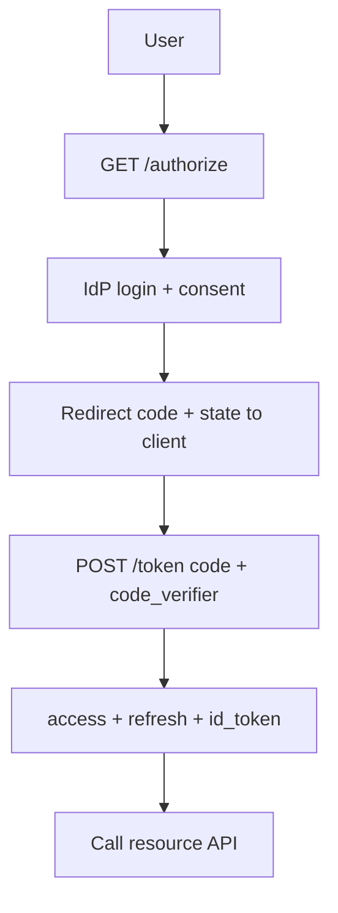
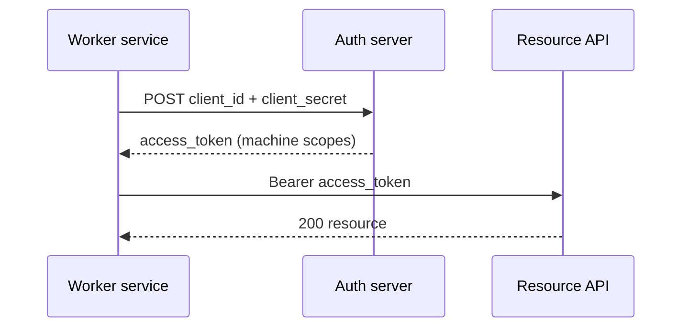
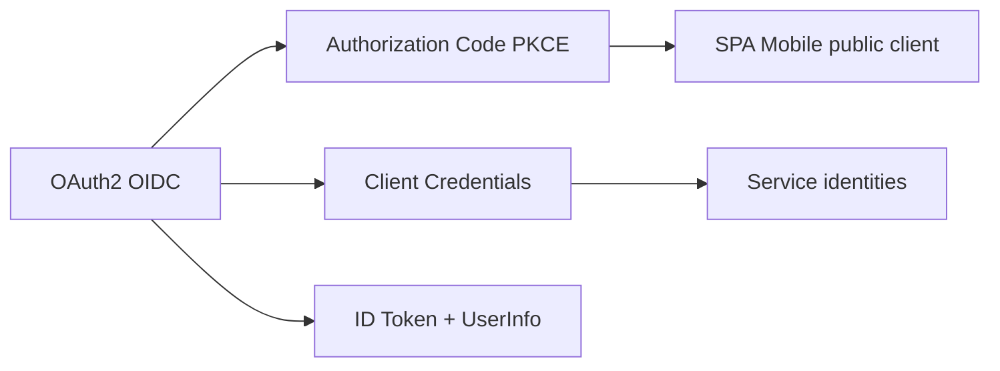
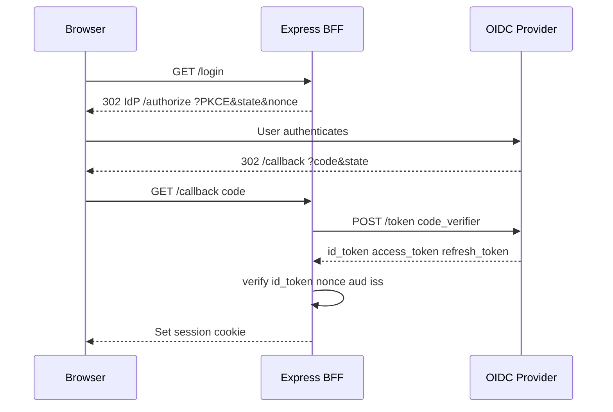

# OAuth2 and OIDC Application Flows

## Overview

**OAuth 2.0** delegates **authorization**—granting limited access to resources—via standardized flows between **client**, **authorization server**, and **resource server**. **OpenID Connect (OIDC)** layers **authentication** on OAuth 2.0, adding an **ID token** (JWT) with identity claims and a UserInfo endpoint.

Backend applications implement:

- **Authorization Code + PKCE** — SPAs and mobile (no client secret in browser)
- **Client Credentials** — service-to-service machine identity
- **OIDC login** — redirect to IdP, callback with code, exchange for tokens

Express apps act as **OAuth client** (login with Google), **authorization server** (your product issues tokens), or **resource server** (validates tokens)—often all three in different services. Protocol formalities and threat depth → [[18-Security/README|Security]]; this note owns **integration shapes**.

## Learning Objectives

- Implement Authorization Code + PKCE for public clients
- Exchange authorization codes at token endpoint with client authentication (confidential clients)
- Validate OIDC ID tokens (`nonce`, `aud`, `iss`) after login callback
- Use Client Credentials grant for backend-to-backend calls with scoped tokens
- Map OAuth scopes to API authorization policies

## Prerequisites

- [[07-Backend/04-Authentication/JWT Access Tokens and Claims|JWT Access Tokens and Claims]]
- [[07-Backend/04-Authentication/Refresh Token Rotation|Refresh Token Rotation]]
- [[07-Backend/05-Authorization-and-Tenancy/Least Privilege for Service Identities|Least Privilege for Service Identities]]

## Difficulty

`advanced`

## Estimated Time

- Reading: 2.5 hours
- Exercises: 4 hours
- Mini project: 8 hours

## History

OAuth 1.0a was complex; OAuth 2.0 (2012) simplified flows but initially encouraged implicit flow for SPAs—later deemed unsafe. **PKCE** (RFC 7636) fixed public client interception. **OIDC** (2014) standardized login on OAuth. Today OAuth 2.1 consolidates BCP: PKCE required, implicit deprecated, refresh rotation recommended.

## Problem It Solves

| Failure mode | Roll-your-own SSO | OAuth2/OIDC |
| --- | --- | --- |
| Password reuse | Users trust your store | Delegate to IdP |
| Inconsistent token format | Custom blobs | JWT + standard claims |
| Scope sprawl | All-or-nothing API keys | Scoped grants |
| Mobile/SPA secret leak | Embedded client secret | PKCE without secret |
| Federation | N× integrations | Standard discovery (.well-known) |

## Internal Implementation

### Authorization Code + PKCE (SPA/mobile)



**PKCE**: client generates `code_verifier`, sends `code_challenge` on authorize; proves possession at token exchange.

### Client Credentials (service)



## Mermaid Diagrams

### Structure



### Sequence / Lifecycle — OIDC login callback



## Examples

### Minimal Example — PKCE generation

```typescript
import { randomBytes, createHash } from "node:crypto";

function pkcePair() {
  const verifier = randomBytes(32).toString("base64url");
  const challenge = createHash("sha256").update(verifier).digest("base64url");
  return { verifier, challenge, method: "S256" as const };
}
```

### Production-Shaped Example — Express OIDC callback (BFF)

```typescript
import express, { Request, Response } from "express";
import jwt from "jsonwebtoken";
import jwksRsa from "jwks-rsa";
import session from "express-session";
import { randomBytes, createHash } from "node:crypto";

const ISSUER = "https://accounts.example.com";
const CLIENT_ID = process.env.OIDC_CLIENT_ID!;
const CLIENT_SECRET = process.env.OIDC_CLIENT_SECRET!;
const REDIRECT_URI = "https://app.example.com/auth/callback";

const jwks = jwksRsa({ jwksUri: `${ISSUER}/.well-known/jwks.json` });

const app = express();
app.use(session({ secret: process.env.SESSION_SECRET!, resave: false, saveUninitialized: false }));

app.get("/auth/login", (req, res) => {
  const state = randomBytes(16).toString("hex");
  const nonce = randomBytes(16).toString("hex");
  const { verifier, challenge } = pkcePair();
  req.session.oauth = { state, nonce, verifier };

  const params = new URLSearchParams({
    response_type: "code",
    client_id: CLIENT_ID,
    redirect_uri: REDIRECT_URI,
    scope: "openid profile email offline_access",
    state,
    nonce,
    code_challenge: challenge,
    code_challenge_method: "S256",
  });
  res.redirect(`${ISSUER}/oauth2/authorize?${params}`);
});

app.get("/auth/callback", async (req: Request, res: Response) => {
  const { code, state } = req.query;
  const ctx = req.session.oauth;
  if (!ctx || state !== ctx.state || typeof code !== "string") {
    return res.status(400).send("Invalid state");
  }

  const tokenRes = await fetch(`${ISSUER}/oauth2/token`, {
    method: "POST",
    headers: { "content-type": "application/x-www-form-urlencoded" },
    body: new URLSearchParams({
      grant_type: "authorization_code",
      code,
      redirect_uri: REDIRECT_URI,
      client_id: CLIENT_ID,
      client_secret: CLIENT_SECRET,
      code_verifier: ctx.verifier,
    }),
  });

  if (!tokenRes.ok) return res.status(502).send("Token exchange failed");
  const tokens = await tokenRes.json() as { id_token: string; access_token: string };

  // Verify ID token
  const decoded = jwt.decode(tokens.id_token, { complete: true });
  if (!decoded || typeof decoded === "string") return res.status(401).end();

  const key = await jwks.getSigningKey(decoded.header.kid);
  jwt.verify(tokens.id_token, key.getPublicKey(), {
    algorithms: ["RS256"],
    audience: CLIENT_ID,
    issuer: ISSUER,
    nonce: ctx.nonce,
  });

  req.session.user = { sub: (jwt.decode(tokens.id_token) as any).sub };
  delete req.session.oauth;
  res.redirect("/dashboard");
});

function pkcePair() {
  const verifier = randomBytes(32).toString("base64url");
  const challenge = createHash("sha256").update(verifier).digest("base64url");
  return { verifier, challenge };
}

app.listen(3000);
```

Client Credentials example for workers:

```typescript
async function fetchServiceToken(): Promise<string> {
  const res = await fetch("https://auth.example.com/oauth2/token", {
    method: "POST",
    headers: { "content-type": "application/x-www-form-urlencoded" },
    body: new URLSearchParams({
      grant_type: "client_credentials",
      client_id: process.env.WORKER_CLIENT_ID!,
      client_secret: process.env.WORKER_CLIENT_SECRET!,
      scope: "reports:generate",
    }),
  });
  const json = await res.json() as { access_token: string };
  return json.access_token;
}
```

## Trade-offs

| Dimension | Upside | Downside | When it matters |
| --- | --- | --- | --- |
| OIDC federated login | No password storage | IdP outage blocks login | B2B SSO |
| PKCE | Safe public clients | Extra round trips | SPA/mobile |
| Client credentials | Simple M2M | Secret rotation burden | Internal jobs |
| Scopes | Least privilege | Scope design hard | Public API |
| BFF pattern | Cookies hidden from SPA | More server code | Security-sensitive SPAs |

### When to Use

- "Login with Google/Azure/Okta" product requirements
- Issuing third-party API access to your platform
- Service accounts calling internal APIs

### When Not to Use

- First-party only email/password with no federation—simpler local auth may suffice
- Implicit flow (deprecated)—never for new apps

## Exercises

1. Draw sequence for Authorization Code + PKCE; label where client secret is absent.
2. List ID token claims you validate vs access token claims for API calls.
3. Implement state parameter validation preventing CSRF on OAuth callback.
4. Map scopes `invoices:read` and `invoices:write` to Express route guards.
5. Compare BFF session cookie vs returning tokens to SPA directly.

## Mini Project

Add "Login with OIDC" to Authentication Server using Authorization Code + PKCE and BFF session cookie.

## Portfolio Project

OAuth integration guide: supported grants, scope catalog, client registration policy, token lifetimes.

## Interview Questions

1. Why is Authorization Code + PKCE preferred over Implicit flow?
2. Purpose of `state` and `nonce` parameters?
3. When do you use Client Credentials vs Authorization Code?
4. Difference between OAuth scopes and OIDC claims?
5. Where does refresh token rotation fit in OIDC login?

### Stretch / Staff-Level

1. Design multi-tenant SaaS as OAuth authorization server for customer third-party apps.
2. Token exchange vs on-behalf-of flows for microservice chains.

## Common Mistakes

- Accepting tokens without `aud`/`iss` validation
- Storing client secret in SPA bundle
- Using access token as session without expiry discipline
- Skipping PKCE for "native" apps
- Confusing authentication (ID token) with API authorization (access token scopes)

## Best Practices

- Use OIDC discovery (`/.well-known/openid-configuration`)
- BFF holds tokens; browser gets HttpOnly session
- Register exact redirect URI allowlists
- Separate scopes per resource server audience
- Log token exchange failures without logging secrets

## Summary

OAuth2 and OIDC standardize how clients obtain scoped access and verify user identity: Authorization Code + PKCE for public clients, Client Credentials for services, ID token validation for login. Express backends implement callbacks, token exchange, and session establishment while resource APIs validate access tokens—keeping protocol complexity in auth servers and scopes aligned with authorization policy.

## Further Reading

- OpenID Connect Core 1.0
- RFC 7636 — PKCE
- OAuth 2.1 draft consolidated BCP

## Related Notes

- [[07-Backend/04-Authentication/JWT Access Tokens and Claims|JWT Access Tokens and Claims]]
- [[07-Backend/04-Authentication/Refresh Token Rotation|Refresh Token Rotation]]
- [[07-Backend/05-Authorization-and-Tenancy/Least Privilege for Service Identities|Least Privilege for Service Identities]]
- [[07-Backend/04-Authentication/Authentication Server Threat Model|Authentication Server Threat Model]]
- [[18-Security/README|Security]]

## Progress Checklist

- [ ] Explained from first principles
- [ ] Drew at least one Mermaid diagram
- [ ] Implemented a minimal version
- [ ] Documented trade-offs and non-goals
- [ ] Completed exercises
- [ ] Practiced interview questions aloud
- [ ] Linked prerequisites and dependents
