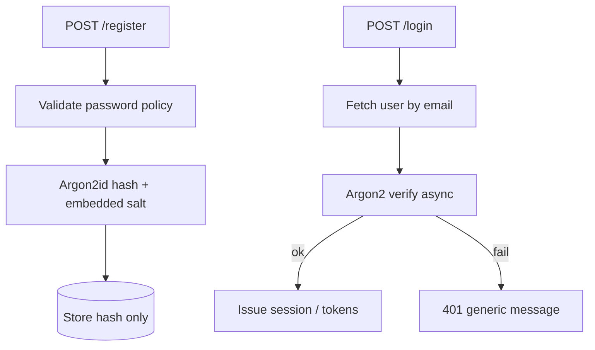
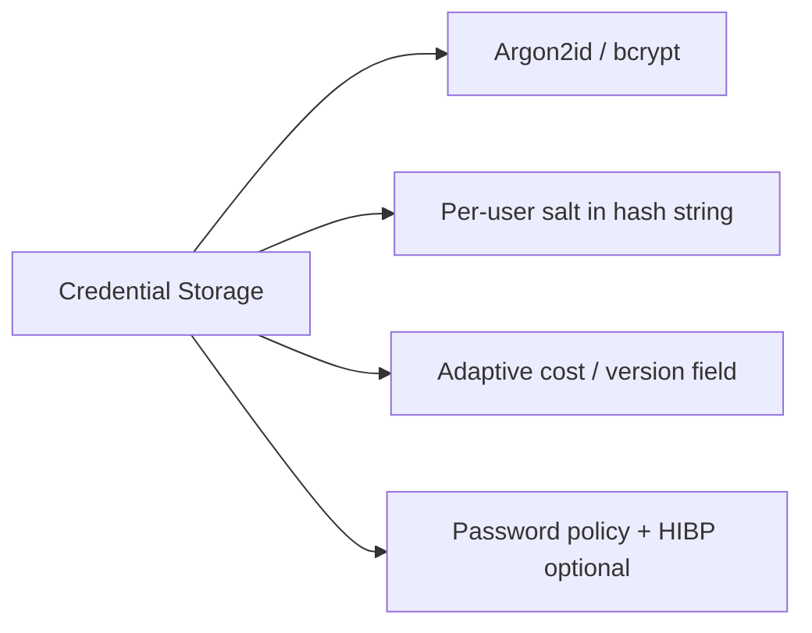
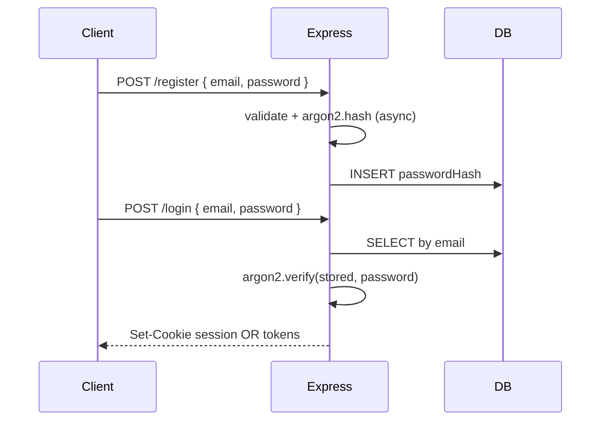

# Password Hashing and Credential Storage

## Overview

**Password hashing** transforms a user password into a one-way **password hash** stored in your database. On login, you hash the submitted password with the same algorithm and parameters, then compare using a **constant-time** equality check. Never store plaintext passwords, reversible encryption, or unsalted MD5/SHA1.

Application services use **Argon2id** (preferred) or **bcrypt** via vetted libraries, with per-user **salt** and tunable **work factors**. Express login handlers offload verification to async APIs so the event loop stays healthy ([[06-NodeJS/02-Event-Loop-and-libuv/Thread Pool and Blocking Work|Thread Pool and Blocking Work]]). Deep cryptanalysis and threat modeling live in [[18-Security/README|Security]]; this note owns **integration patterns** and operational policy.

## Learning Objectives

- Store password hashes only—never plaintext or decryptable secrets
- Choose Argon2id or bcrypt with appropriate cost parameters and upgrade path
- Verify passwords with constant-time comparison after async hash
- Implement registration, login, and password-change flows that re-hash
- Handle breach response: force reset, check against known-password lists

## Prerequisites

- [[07-Backend/04-Authentication/Sessions Cookies and CSRF Boundaries|Sessions Cookies and CSRF Boundaries]]
- [[07-Backend/08-Data-Access-and-Persistence-Patterns/Repository and Unit of Work|Repository and Unit of Work]]
- [[06-NodeJS/06-Concurrency-and-Scaling/worker_threads Model|worker_threads Model]] (for CPU-heavy hash offload at scale)

## Difficulty

`intermediate`

## Estimated Time

- Reading: 1.5 hours
- Exercises: 2.5 hours
- Mini project: 4 hours

## History

LinkedIn (2012) and many breaches exposed MD5/SHA1 password "hashing." **bcrypt** (1999) introduced adaptive cost. **PBKDF2** became NIST-friendly. Password Hashing Competition (2015) selected **Argon2**. Modern apps also check **HIBP** k-anonymity APIs for breached passwords at registration.

## Problem It Solves

| Failure mode | Plaintext / weak hash | Proper password hashing |
| --- | --- | --- |
| DB leak | Immediate account takeover | Attacker must crack hashes offline |
| Rainbow tables | Precomputed hits | Unique salt per user |
| Fast GPU crack | Billions SHA256/s | Memory-hard Argon2 slows attacks |
| Timing leak | Early-exit comparison | Constant-time verify |
| Same password users | Identical hashes | Per-user salt |

## Internal Implementation



Store: `id`, `email`, `passwordHash`, `hashVersion`, `updatedAt`. On login failure, use **same error message** for unknown email and bad password (timing care still needed).

## Mermaid Diagrams

### Structure



### Sequence / Lifecycle



## Examples

### Minimal Example

```typescript
import argon2 from "argon2";

const passwordHash = await argon2.hash("correct horse battery staple", {
  type: argon2.argon2id,
  memoryCost: 19456,
  timeCost: 2,
});

const ok = await argon2.verify(passwordHash, "correct horse battery staple");
// ok === true
```

### Production-Shaped Example

```typescript
import express, { Request, Response, NextFunction } from "express";
import argon2 from "argon2";
import { z } from "zod";

const HASH_VERSION = 1;
const ARGON2_OPTS = {
  type: argon2.argon2id,
  memoryCost: 19456,
  timeCost: 2,
} as const;

interface UserRow {
  id: string;
  email: string;
  passwordHash: string;
  hashVersion: number;
}

const users = new Map<string, UserRow>(); // replace with repository

const registerBody = z.object({
  email: z.string().email(),
  password: z.string().min(12).max(128),
});

const loginBody = registerBody;

async function hashPassword(plaintext: string): Promise<string> {
  return argon2.hash(plaintext, ARGON2_OPTS);
}

async function verifyPassword(hash: string, plaintext: string): Promise<boolean> {
  try {
    return await argon2.verify(hash, plaintext);
  } catch {
    return false;
  }
}

async function upgradeHashIfNeeded(user: UserRow, plaintext: string): Promise<void> {
  if (user.hashVersion >= HASH_VERSION) return;
  user.passwordHash = await hashPassword(plaintext);
  user.hashVersion = HASH_VERSION;
}

const app = express();
app.use(express.json({ limit: "16kb" }));

app.post("/v1/auth/register", async (req, res, next) => {
  try {
    const body = registerBody.parse(req.body);
    if ([...users.values()].some((u) => u.email === body.email)) {
      return res.status(409).type("application/problem+json").json({
        type: "https://api.example.com/problems/conflict",
        title: "Email already registered",
        status: 409,
      });
    }
    const passwordHash = await hashPassword(body.password);
    const id = `usr_${users.size + 1}`;
    users.set(id, { id, email: body.email, passwordHash, hashVersion: HASH_VERSION });
    res.status(201).json({ id, email: body.email });
  } catch (err) {
    next(err);
  }
});

app.post("/v1/auth/login", async (req, res, next) => {
  try {
    const body = loginBody.parse(req.body);
    const user = [...users.values()].find((u) => u.email === body.email);
    const valid = user ? await verifyPassword(user.passwordHash, body.password) : false;

    if (!user || !valid) {
      // uniform timing: still run dummy verify when user missing
      if (!user) await argon2.hash(body.password, ARGON2_OPTS).catch(() => {});
      return res.status(401).type("application/problem+json").json({
        type: "https://api.example.com/problems/invalid-credentials",
        title: "Invalid email or password",
        status: 401,
      });
    }

    await upgradeHashIfNeeded(user, body.password);
    // issue session — Sessions note
    res.json({ userId: user.id });
  } catch (err) {
    next(err);
  }
});

app.listen(3000);
```

Run bcrypt/argon2 off hot path at high QPS via worker pool if p99 login latency spikes.

## Trade-offs

| Dimension | Upside | Downside | When it matters |
| --- | --- | --- | --- |
| Argon2id | Memory-hard; PHC winner | Params tuning needed | New systems |
| bcrypt | Battle-tested; wide support | 72-byte input limit | Legacy interop |
| High cost factor | Slower offline crack | Login CPU/latency | Security-sensitive |
| Password policy | Blocks trivial passwords | UX friction | Consumer apps |
| HIBP check | Stops breached passwords | External API dependency | Registration |

### When to Use

- Any email/password authentication you operate
- Password change and reset flows storing new hash

### When Not to Use

- Delegating auth entirely to OIDC provider—no local password ([[07-Backend/04-Authentication/OAuth2 and OIDC Application Flows|OAuth2 and OIDC Application Flows]])
- Storing API keys like passwords without pepper/HSM policy—prefer scoped tokens

## Exercises

1. Benchmark argon2 `timeCost` 2 vs 3 on your hardware; pick production values with p99 login budget.
2. Implement password change requiring current password and invalidating sessions.
3. Add `hashVersion` migration that re-hashes on successful login only.
4. Explain why MD5(password) is insufficient even with salt.
5. Design reset flow with single-use token hashed in DB (not password, but same storage discipline).

## Mini Project

Implement register/login in Authentication Server with Argon2id, repository adapter, and tests using fake user store.

## Portfolio Project

Credential policy doc: algorithms, rotation, breach response, banned password list integration.

## Interview Questions

1. Why salt per user? Is a global application pepper the same thing?
2. Argon2id vs bcrypt—when would you pick each?
3. How do you prevent user enumeration via login timing?
4. Should you hash passwords on the client before sending? Why or why not?
5. What do you store in DB after OAuth-only users—password hash at all?

### Stretch / Staff-Level

1. Design hash upgrade for 10M users when doubling Argon2 cost—online vs offline rehash.
2. Compare passkeys/WebAuthn vs password hashing operational burden.

## Common Mistakes

- SHA256(password) once—too fast for GPUs
- Same salt for all users
- Logging registration bodies with password field
- Sync bcrypt in tight loop blocking event loop
- Different error messages for "no user" vs "bad password" plus short-circuit timing

## Best Practices

- Use established libraries (argon2, bcryptjs with awareness of native bcrypt)
- Embed algorithm/version in hash string or separate column
- Rate-limit login ([[07-Backend/06-Reliability-and-Abuse-Resistance/Rate Limiting and Quotas|Rate Limiting and Quotas]])
- Never email plaintext passwords; use time-limited reset tokens
- Hand crypto depth questions to Security track reading list

## Summary

Credential storage for password-based auth means slow, salted, adaptive hashing—Argon2id or bcrypt—with async verification in Express handlers, uniform login failure responses, versioned hash parameters upgraded on successful login, and zero plaintext retention. Pair verified credentials with session or token issuance; delegate password complexity to OIDC when possible.

## Further Reading

- OWASP Password Storage Cheat Sheet
- RFC 9106 — Argon2 Memory-Hard Function
- [[18-Security/README|Security]] track

## Related Notes

- [[07-Backend/04-Authentication/Sessions Cookies and CSRF Boundaries|Sessions Cookies and CSRF Boundaries]]
- [[07-Backend/04-Authentication/JWT Access Tokens and Claims|JWT Access Tokens and Claims]]
- [[07-Backend/04-Authentication/Authentication Server Threat Model|Authentication Server Threat Model]]
- [[07-Backend/06-Reliability-and-Abuse-Resistance/Rate Limiting and Quotas|Rate Limiting and Quotas]]
- [[06-NodeJS/02-Event-Loop-and-libuv/Thread Pool and Blocking Work|Thread Pool and Blocking Work]]

## Progress Checklist

- [ ] Explained from first principles
- [ ] Drew at least one Mermaid diagram
- [ ] Implemented a minimal version
- [ ] Documented trade-offs and non-goals
- [ ] Completed exercises
- [ ] Practiced interview questions aloud
- [ ] Linked prerequisites and dependents
