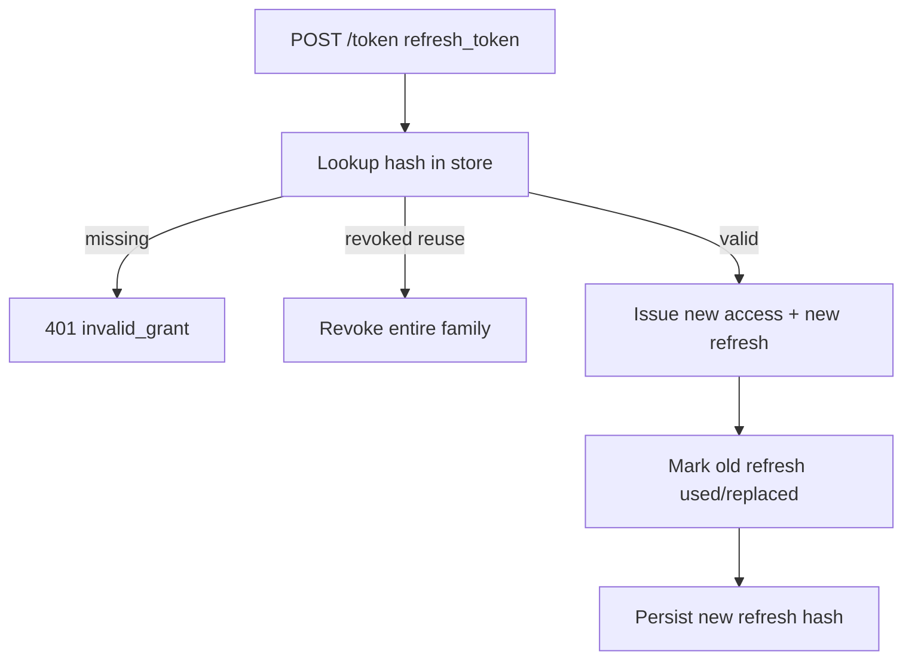
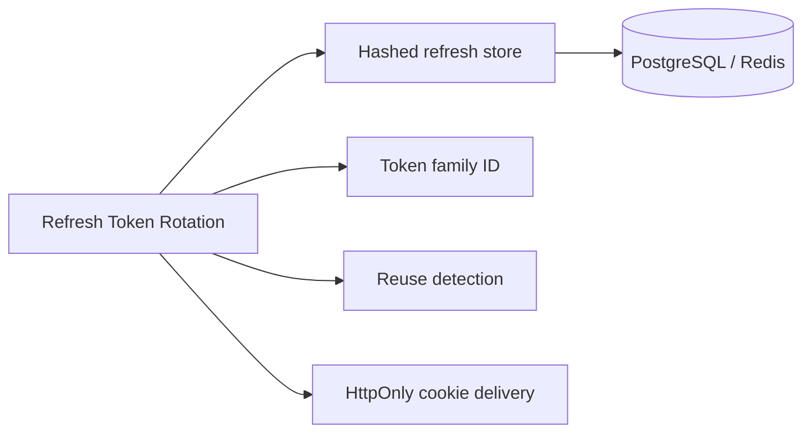
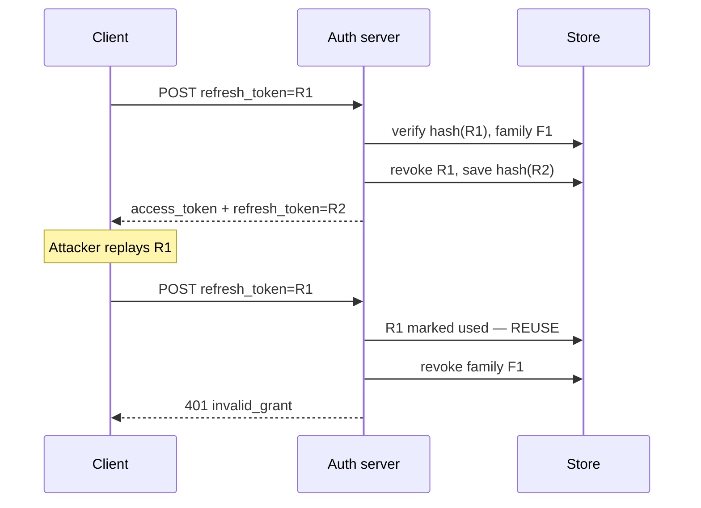

# Refresh Token Rotation

## Overview

**Refresh tokens** are long-lived credentials used only at the **token endpoint** to obtain new **access tokens** without re-prompting the user. **Refresh token rotation** issues a **new refresh token** on every refresh and invalidates the previous one. If an old refresh token is presented twice (**reuse**), the server treats it as theft: revoke the entire token family and force re-authentication.

Express auth servers store refresh tokens **hashed** (like passwords), bind them to client/device metadata, and expose `POST /oauth/token` with `grant_type=refresh_token`. Browser clients often store refresh tokens in **HttpOnly Secure cookies** on the auth domain; mobile uses secure storage. This note covers application flow—not OAuth formal protocol every edge case ([[07-Backend/04-Authentication/OAuth2 and OIDC Application Flows|OAuth2 and OIDC Application Flows]]).

## Learning Objectives

- Implement refresh token issuance, rotation, and hashed storage
- Detect refresh token reuse and invalidate token families
- Separate refresh endpoint security (rate limit, mTLS optional) from resource API
- Bind refresh tokens to client ID, device, or session family ID
- Coordinate access TTL, refresh TTL, and absolute session lifetime

## Prerequisites

- [[07-Backend/04-Authentication/JWT Access Tokens and Claims|JWT Access Tokens and Claims]]
- [[07-Backend/04-Authentication/Password Hashing and Credential Storage|Password Hashing and Credential Storage]]
- [[07-Backend/06-Reliability-and-Abuse-Resistance/Rate Limiting and Quotas|Rate Limiting and Quotas]]

## Difficulty

`advanced`

## Estimated Time

- Reading: 2 hours
- Exercises: 3 hours
- Mini project: 6 hours

## History

OAuth 2.0 originally allowed long-lived refresh tokens without rotation—leaked refresh meant persistent access. **OAuth 2.1** draft and BCP recommend rotation + reuse detection. Auth0, Okta, and Google document **refresh token families** after widespread SPA leaks. PKCE ([[07-Backend/04-Authentication/OAuth2 and OIDC Application Flows|OAuth2 and OIDC Application Flows]]) reduced authorization code interception; rotation addresses refresh theft.

## Problem It Solves

| Failure mode | Static refresh token | Rotation + reuse detection |
| --- | --- | --- |
| Leaked refresh from device | Attacker access until manual revoke | Next rotation detects reuse; family revoked |
| DB leak of refresh tokens | Plaintext tokens work | Hashed tokens like passwords |
| Stolen access JWT | Valid until exp (15m) | Short access + refresh renew |
| Logout everywhere | Access still valid briefly | Revoke refresh family server-side |

## Internal Implementation



Token **family ID** links rotations from one login session; reuse of any ancestor triggers family kill.

## Mermaid Diagrams

### Structure



### Sequence / Lifecycle



## Examples

### Minimal Example

```typescript
import { createHash, randomBytes } from "node:crypto";

function hashToken(token: string): string {
  return createHash("sha256").update(token).digest("base64url");
}

function mintRefreshToken(): string {
  return randomBytes(32).toString("base64url");
}

const raw = mintRefreshToken();
const stored = hashToken(raw); // persist stored only
```

### Production-Shaped Example

```typescript
import express, { Request, Response } from "express";
import jwt from "jsonwebtoken";
import { createHash, randomBytes, timingSafeEqual } from "node:crypto";

interface RefreshRecord {
  familyId: string;
  userId: string;
  hash: string;
  replacedBy?: string;
  revokedAt?: Date;
  expiresAt: Date;
}

const refreshStore = new Map<string, RefreshRecord>(); // key: hash

const ACCESS_TTL_SEC = 15 * 60;
const REFRESH_TTL_MS = 30 * 24 * 60 * 60 * 1000;

function hashToken(t: string) {
  return createHash("sha256").update(t).digest("base64url");
}

function signAccess(userId: string) {
  return jwt.sign({ sub: userId }, process.env.JWT_PRIVATE_KEY!, {
    algorithm: "RS256",
    expiresIn: ACCESS_TTL_SEC,
    issuer: "https://auth.example.com",
    audience: "https://api.example.com",
  });
}

function saveRefresh(userId: string, familyId: string, raw: string) {
  const hash = hashToken(raw);
  refreshStore.set(hash, {
    familyId,
    userId,
    hash,
    expiresAt: new Date(Date.now() + REFRESH_TTL_MS),
  });
  return raw;
}

function revokeFamily(familyId: string) {
  for (const rec of refreshStore.values()) {
    if (rec.familyId === familyId) rec.revokedAt = new Date();
  }
}

const app = express();
app.use(express.urlencoded({ extended: false }));

app.post("/oauth/token", (req: Request, res: Response) => {
  if (req.body.grant_type !== "refresh_token") {
    return res.status(400).json({ error: "unsupported_grant_type" });
  }

  const presented = String(req.body.refresh_token ?? "");
  const presentedHash = hashToken(presented);
  const record = refreshStore.get(presentedHash);

  if (!record || record.revokedAt || record.expiresAt < new Date()) {
    return res.status(401).json({ error: "invalid_grant" });
  }

  if (record.replacedBy) {
    // reuse detected — possible theft
    revokeFamily(record.familyId);
    return res.status(401).json({ error: "invalid_grant", reason: "reuse_detected" });
  }

  const newRaw = randomBytes(32).toString("base64url");
  record.replacedBy = hashToken(newRaw);
  saveRefresh(record.userId, record.familyId, newRaw);

  const access_token = signAccess(record.userId);

  res.cookie("refresh_token", newRaw, {
    httpOnly: true,
    secure: true,
    sameSite: "strict",
    path: "/oauth/token",
    maxAge: REFRESH_TTL_MS,
  });

  res.json({
    access_token,
    token_type: "Bearer",
    expires_in: ACCESS_TTL_SEC,
    refresh_token: newRaw, // omit if cookie-only delivery
  });
});

// Initial login creates family
app.post("/v1/auth/login", (_req, res) => {
  const userId = "usr_42";
  const familyId = randomBytes(16).toString("hex");
  const refresh = saveRefresh(userId, familyId, randomBytes(32).toString("base64url"));
  res.json({
    access_token: signAccess(userId),
    refresh_token: refresh,
    expires_in: ACCESS_TTL_SEC,
  });
});

app.listen(3000);
```

## Trade-offs

| Dimension | Upside | Downside | When it matters |
| --- | --- | --- | --- |
| Rotation | Limits refresh theft window | More DB writes | Public clients |
| Reuse detection | Catches copied tokens | False positives if race retry | Mobile offline sync |
| Cookie-only refresh | JS cannot read | Cross-origin complexity | SPA + auth subdomain |
| Long refresh TTL | Better UX | Larger theft impact if no rotation | Consumer apps |
| Absolute session max | Forces re-login | UX interruption | Banking |

### When to Use

- SPAs and mobile with JWT access tokens
- Any system where access TTL is short and refresh is long

### When Not to Use

- Pure server-side session cookies with server TTL—refresh adds little
- Machine-to-machine client credentials without user context

## Exercises

1. Simulate parallel double-refresh with same token; assert family revocation.
2. Add absolute 90-day session cap regardless of refresh activity.
3. Design idempotent refresh for mobile retry on network timeout without false reuse.
4. Compare storing refresh in Redis vs PostgreSQL with indexing on hash.
5. Wire rate limit 10/min per user on `/oauth/token`.

## Mini Project

Complete refresh rotation in Authentication Server with reuse detection tests and cookie + JSON response modes.

## Portfolio Project

Token lifecycle diagram in Backend Service Toolkit ADR: access TTL, refresh rotation, logout, password-change invalidation.

## Interview Questions

1. Why hash refresh tokens at rest?
2. What happens on refresh token reuse—why revoke the whole family?
3. Where should refresh tokens live for SPAs vs mobile?
4. Difference between refresh rotation and access token rotation?
5. How does logout work with refresh tokens in DB?

### Stretch / Staff-Level

1. Design refresh for offline-first mobile with queued requests during token expiry.
2. Compare refresh token rotation vs push-based session revocation (SSE/WebSocket).

## Common Mistakes

- Storing refresh tokens plaintext
- No reuse detection—stolen refresh works forever
- Returning refresh in JSON to XSS-exposed SPA while also using localStorage access
- Same refresh token for all devices—one leak kills ambiguously
- Ignoring race on concurrent refresh from tabs

## Best Practices

- One family per login/device fingerprint policy
- Invalidate all families on password change
- Separate auth server from resource API
- Rate-limit token endpoint aggressively
- Document client retry behavior on `invalid_grant`

## Summary

Refresh token rotation limits damage from stolen long-lived credentials by issuing a new refresh on each use, hashing stored tokens, and revoking entire families on reuse detection. Express auth servers implement the token endpoint with strict transport security, short access JWTs, and coordinated logout that deletes refresh state—not just client-side token deletion.

## Further Reading

- OAuth 2.0 Security BCP (RFC 6819, updates in OAuth 2.1 drafts)
- [[07-Backend/04-Authentication/OAuth2 and OIDC Application Flows|OAuth2 and OIDC Application Flows]]
- [[07-Backend/04-Authentication/Authentication Server Threat Model|Authentication Server Threat Model]]

## Related Notes

- [[07-Backend/04-Authentication/JWT Access Tokens and Claims|JWT Access Tokens and Claims]]
- [[07-Backend/04-Authentication/OAuth2 and OIDC Application Flows|OAuth2 and OIDC Application Flows]]
- [[07-Backend/04-Authentication/Sessions Cookies and CSRF Boundaries|Sessions Cookies and CSRF Boundaries]]
- [[07-Backend/04-Authentication/Password Hashing and Credential Storage|Password Hashing and Credential Storage]]
- [[07-Backend/06-Reliability-and-Abuse-Resistance/Rate Limiting and Quotas|Rate Limiting and Quotas]]

## Progress Checklist

- [ ] Explained from first principles
- [ ] Drew at least one Mermaid diagram
- [ ] Implemented a minimal version
- [ ] Documented trade-offs and non-goals
- [ ] Completed exercises
- [ ] Practiced interview questions aloud
- [ ] Linked prerequisites and dependents
