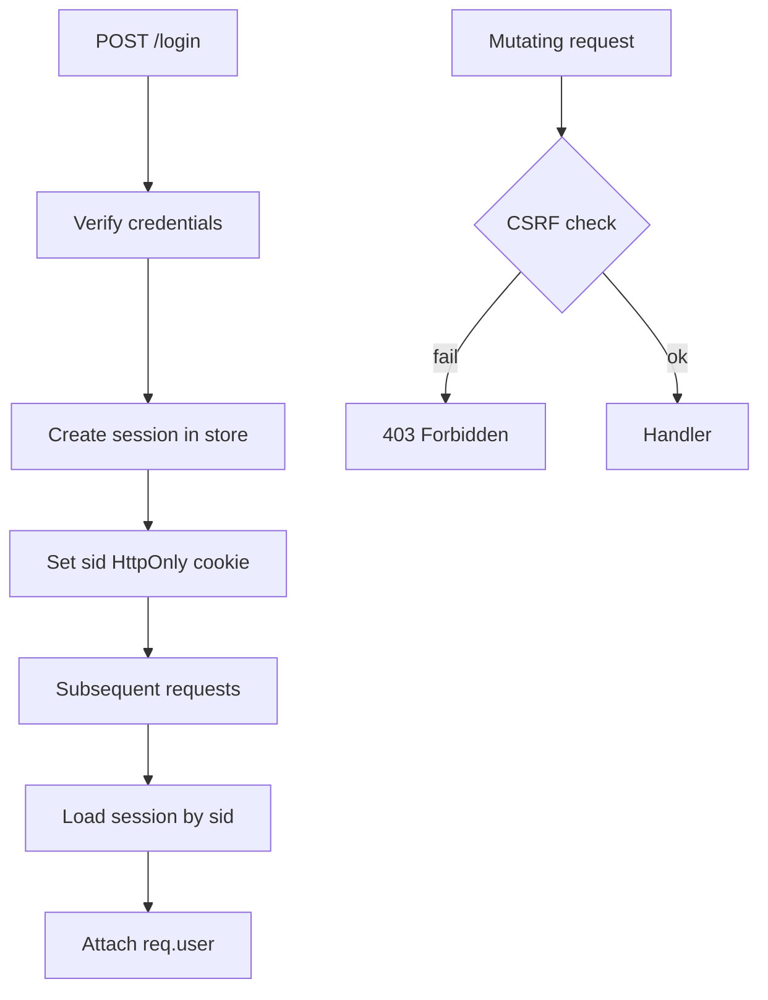
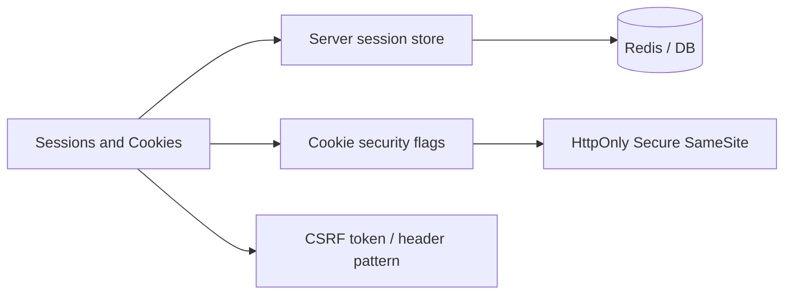
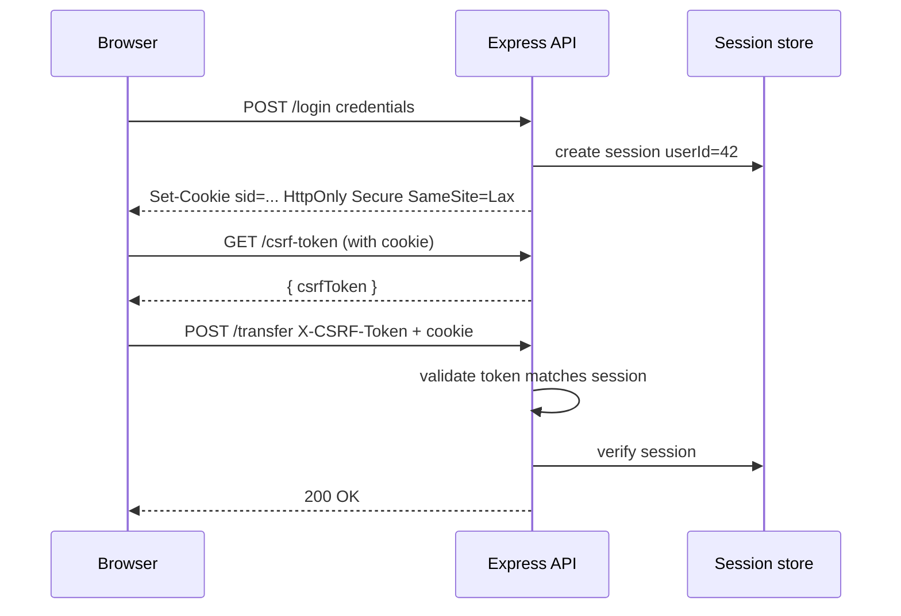

# Sessions Cookies and CSRF Boundaries

## Overview

**Server-side sessions** bind a browser client to authenticated state via an opaque **session ID** stored in an **HttpOnly cookie**. The server looks up session data (user ID, roles, expiry) in a store (memory, Redis, database). **CSRF (Cross-Site Request Forgery)** exploits the browser's automatic cookie attachment: a malicious site triggers a mutating request to your API with the victim's cookie. **CSRF boundaries** define when cookie-based auth is safe (SameSite, double-submit, custom headers) vs when you require token-based auth (SPAs with third-party APIs, mobile).

This note covers **application patterns** in Express—session middleware, cookie flags, CSRF tokens—not low-level crypto (see [[18-Security/README|Security]] track).

## Learning Objectives

- Configure secure session cookies (`HttpOnly`, `Secure`, `SameSite`, `Path`, `Domain`)
- Implement server-side session stores with TTL and rotation on privilege change
- Apply CSRF defenses for cookie-authenticated mutating routes
- Distinguish session auth from Bearer JWT for SPAs and mobile clients
- Invalidate sessions on logout, password change, and suspected compromise

## Prerequisites

- [[07-Backend/02-Frameworks-and-Middleware/Middleware Pipeline and Error Middleware|Middleware Pipeline and Error Middleware]]
- [[07-Backend/06-Reliability-and-Abuse-Resistance/CORS Security Headers and Browser Boundaries|CORS Security Headers and Browser Boundaries]]
- [[01-Computer-Science/06-Networking-Fundamentals/HTTP as an Application Protocol|HTTP as an Application Protocol]]

## Difficulty

`intermediate`

## Estimated Time

- Reading: 2 hours
- Exercises: 3 hours
- Mini project: 5 hours

## History

Classic web apps used server sessions before JWTs became fashionable. **REST purists** argued session state violated statelessness—product reality favors sessions for **browser-first** apps with instant server-side revocation. **SameSite cookies** (Chrome 2016+, default Lax/Strict era) reduced CSRF prevalence; **Lax-by-default** in modern browsers helps but does not replace defenses for all flows (cross-site POST, embedded contexts).

## Problem It Solves

| Failure mode | Insecure cookies | Session + CSRF boundaries |
| --- | --- | --- |
| XSS steals token | JS-readable session JWT in localStorage | HttpOnly cookie; short-lived access elsewhere |
| CSRF transfer | Attacker POST /transfer | SameSite + CSRF token / custom header |
| Session fixation | Attacker sets victim session ID | Regenerate ID on login |
| Stolen cookie reuse | Valid until expiry | Server-side revoke + rotation |
| Cross-subdomain leak | Cookie on `.example.com` | Narrow Domain + Path |

## Internal Implementation



Session ID must be **cryptographically random** (128+ bits)—generation details in Security track; here we treat `sid` as opaque.

## Mermaid Diagrams

### Structure



### Sequence / Lifecycle — login and CSRF-protected POST



## Examples

### Minimal Example

```typescript
import express from "express";
import session from "express-session";

const app = express();
app.use(express.json());

app.use(session({
  name: "sid",
  secret: process.env.SESSION_SECRET!,
  resave: false,
  saveUninitialized: false,
  cookie: {
    httpOnly: true,
    secure: process.env.NODE_ENV === "production",
    sameSite: "lax",
    maxAge: 8 * 60 * 60 * 1000,
  },
}));

app.post("/login", (req, res) => {
  // verify password — see Password Hashing note
  req.session.userId = "usr_42";
  req.session.regenerate((err) => {
    if (err) return res.status(500).end();
    res.json({ ok: true });
  });
});

app.listen(3000);
```

### Production-Shaped Example

```typescript
import express, { Request, Response, NextFunction } from "express";
import session from "express-session";
import RedisStore from "connect-redis";
import { createClient } from "redis";
import { randomBytes, timingSafeEqual } from "node:crypto";

const redis = createClient({ url: process.env.REDIS_URL });
await redis.connect();

declare module "express-session" {
  interface SessionData {
    userId: string;
    csrfSecret: string;
  }
}

const app = express();
app.use(express.json());

app.use(session({
  store: new RedisStore({ client: redis, prefix: "sess:" }),
  name: "__Host-sid", // __Host- prefix requires Secure, Path=/, no Domain
  secret: process.env.SESSION_SECRET!,
  resave: false,
  saveUninitialized: false,
  cookie: {
    httpOnly: true,
    secure: true,
    sameSite: "lax",
    maxAge: 8 * 60 * 60 * 1000,
    path: "/",
  },
}));

function requireAuth(req: Request, res: Response, next: NextFunction) {
  if (!req.session.userId) {
    return res.status(401).type("application/problem+json").json({
      type: "https://api.example.com/problems/unauthenticated",
      title: "Authentication required",
      status: 401,
    });
  }
  next();
}

function issueCsrfToken(req: Request): string {
  if (!req.session.csrfSecret) {
    req.session.csrfSecret = randomBytes(32).toString("base64url");
  }
  return req.session.csrfSecret;
}

function csrfProtection(req: Request, res: Response, next: NextFunction) {
  const token = req.header("x-csrf-token");
  const expected = req.session.csrfSecret;
  if (!token || !expected) {
    return res.status(403).type("application/problem+json").json({
      type: "https://api.example.com/problems/csrf",
      title: "CSRF validation failed",
      status: 403,
    });
  }
  const a = Buffer.from(token);
  const b = Buffer.from(expected);
  if (a.length !== b.length || !timingSafeEqual(a, b)) {
    return res.status(403).type("application/problem+json").json({
      type: "https://api.example.com/problems/csrf",
      title: "CSRF validation failed",
      status: 403,
    });
  }
  next();
}

app.get("/v1/auth/csrf", requireAuth, (req, res) => {
  res.json({ csrfToken: issueCsrfToken(req) });
});

app.post("/v1/orders", requireAuth, csrfProtection, (req, res) => {
  res.status(201).json({ id: "ord_1", userId: req.session.userId });
});

app.post("/v1/logout", requireAuth, (req, res) => {
  req.session.destroy(() => {
    res.clearCookie("__Host-sid", { path: "/" });
    res.status(204).end();
  });
});

app.listen(3000);
```

SPAs on separate origins often use **Bearer JWT** instead of cookies to avoid CSRF complexity—see [[07-Backend/04-Authentication/JWT Access Tokens and Claims|JWT Access Tokens and Claims]].

## Trade-offs

| Dimension | Upside | Downside | When it matters |
| --- | --- | --- | --- |
| Server sessions | Instant revoke; smaller client trust | Store dependency; sticky sessions | Admin consoles, classic web |
| SameSite=Lax | Blocks many CSRF vectors | Breaks some OAuth/deep-link flows | Default browser apps |
| SameSite=Strict | Stronger isolation | Cross-site navigation loses session | High-security apps |
| CSRF token | Works with Lax cookies | SPA must fetch token first | Cookie + mutating API |
| JWT in header | No CSRF on API | XSS steals token if in JS storage | Mobile, third-party SPA |

### When to Use

- Browser applications on same site or BFF pattern
- Need immediate session invalidation (logout everywhere, admin disable user)
- Server-rendered forms with traditional POST

### When Not to Use

- Pure mobile API with no cookies—use Bearer tokens
- Cross-origin SPA without BFF—prefer JWT + short TTL + refresh rotation
- Replacing authorization—session only proves identity

## Exercises

1. List cookie flags for production vs local dev; explain `__Host-` prefix requirements.
2. Implement session regeneration on login; verify old session ID invalid.
3. Trace CSRF attack on `POST /transfer` without protection; document blocked flow with SameSite=Lax.
4. Compare double-submit cookie vs synchronizer token stored server-side.
5. Design logout-all-devices with Redis session store key pattern.

## Mini Project

Add cookie session auth + CSRF to [[07-Backend/projects/Authentication Server/README|Authentication Server]] for browser login; keep JWT path for API clients.

## Portfolio Project

Document **Auth Mode Matrix** in Backend Service Toolkit: browser (cookie+CSRF) vs SPA (BFF) vs mobile (Bearer).

## Interview Questions

1. Why are HttpOnly cookies recommended against XSS credential theft?
2. How does SameSite=Lax differ from Strict for CSRF?
3. When is CSRF irrelevant for an API?
4. Session fixation—how do you prevent it on login?
5. Cookie sessions vs JWT access tokens—trade-offs for revocation?

### Stretch / Staff-Level

1. Design BFF pattern for cross-origin React app with secure cookies and no CSRF gaps.
2. How do partitioned cookies (CHIPS) affect third-party embed scenarios?

## Common Mistakes

- `saveUninitialized: true` leaking empty sessions
- Session secret in repo; no rotation plan
- CSRF protection on GET routes (breaks caching unnecessarily)
- `SameSite=None` without `Secure`
- Storing large objects in session cookie (signed cookie sessions) — size limits

## Best Practices

- Regenerate session ID on login and privilege elevation
- Destroy session server-side on logout; clear cookie client-side
- Use Redis/database store for horizontal scale
- Apply CSRF only to cookie-auth mutating methods (POST/PUT/PATCH/DELETE)
- Pair with [[07-Backend/04-Authentication/Password Hashing and Credential Storage|Password Hashing and Credential Storage]]

## Summary

Server-side sessions with HttpOnly, Secure, SameSite cookies fit browser-first apps where the server must revoke access immediately. CSRF boundaries—SameSite defaults plus synchronizer tokens or custom headers on mutating routes—prevent cross-origin abuse of automatic cookie submission. Choose cookies vs Bearer JWT based on client shape, origin layout, and revocation requirements.

## Further Reading

- [[07-Backend/04-Authentication/JWT Access Tokens and Claims|JWT Access Tokens and Claims]]
- OWASP Session Management Cheat Sheet
- OWASP CSRF Prevention Cheat Sheet

## Related Notes

- [[07-Backend/04-Authentication/Password Hashing and Credential Storage|Password Hashing and Credential Storage]]
- [[07-Backend/04-Authentication/JWT Access Tokens and Claims|JWT Access Tokens and Claims]]
- [[07-Backend/06-Reliability-and-Abuse-Resistance/CORS Security Headers and Browser Boundaries|CORS Security Headers and Browser Boundaries]]
- [[07-Backend/04-Authentication/Authentication Server Threat Model|Authentication Server Threat Model]]
- [[18-Security/README|Security]] — deep crypto and threat curriculum

## Progress Checklist

- [ ] Explained from first principles
- [ ] Drew at least one Mermaid diagram
- [ ] Implemented a minimal version
- [ ] Documented trade-offs and non-goals
- [ ] Completed exercises
- [ ] Practiced interview questions aloud
- [ ] Linked prerequisites and dependents
