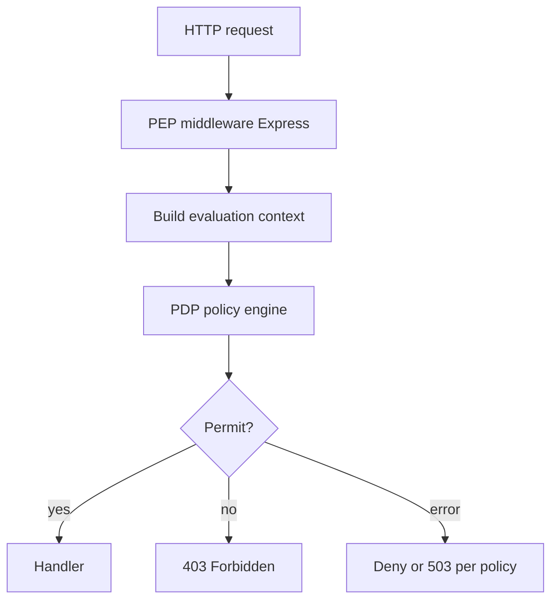
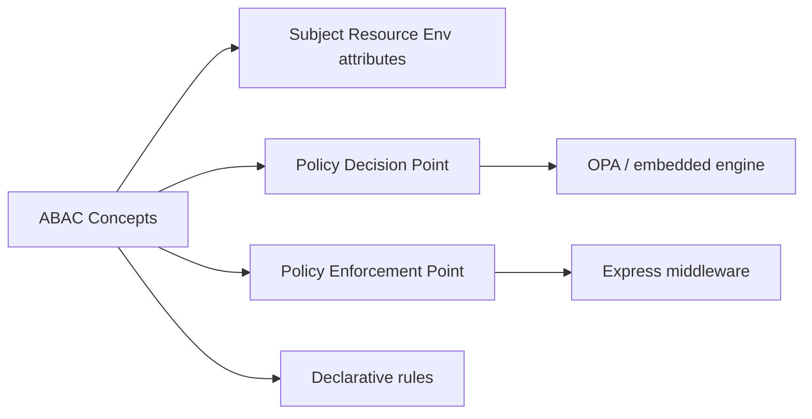
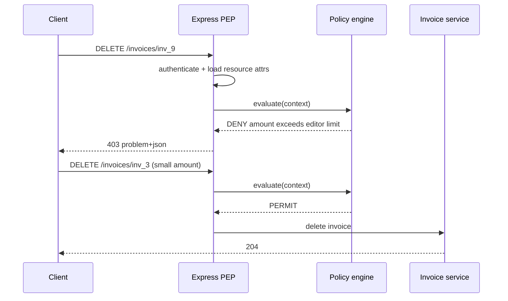

# ABAC and Policy Decision Points Concepts

## Overview

**Attribute-Based Access Control (ABAC)** decides access from **attributes** of the subject, resource, action, and environment—e.g., "user department = resource department AND clearance >= confidential AND time is business hours." A **Policy Decision Point (PDP)** evaluates policies and returns Permit/Deny/NotApplicable; a **Policy Enforcement Point (PEP)** in your Express app calls the PDP (or embedded engine) before executing handlers.

Backend services use ABAC patterns when RBAC alone produces role explosion or policies need **context** (amount thresholds, data classification, IP geography). Full enterprise policy languages (XACML, OPA/Rego) live at scale in [[09-System-Design/README|System Design]] and [[18-Security/README|Security]]; this note teaches **application integration**—what to pass to the PDP and how to enforce decisions without putting policy in every handler.

## Learning Objectives

- Contrast RBAC, ABAC, and ownership checks with decision examples
- Identify PEP vs PDP responsibilities in Express middleware
- Model subject/resource/environment attributes for policy evaluation
- Integrate embedded policy engine or external OPA sidecar conceptually
- Fail closed when PDP unavailable for high-risk actions

## Prerequisites

- [[07-Backend/05-Authorization-and-Tenancy/RBAC and Permission Modeling|RBAC and Permission Modeling]]
- [[07-Backend/05-Authorization-and-Tenancy/Resource Ownership Checks|Resource Ownership Checks]]
- [[07-Backend/02-Frameworks-and-Middleware/Request Context and Async Local Storage|Request Context and Async Local Storage]]

## Difficulty

`advanced`

## Estimated Time

- Reading: 2 hours
- Exercises: 3 hours
- Mini project: 6 hours

## History

ABAC formalized in NIST SP 800-162. Cloud providers adopted attribute policies (IAM condition keys). **Open Policy Agent (OPA)** popularized decoupled PDP with Rego policies and sidecar deployment. Product APIs often start RBAC-only; ABAC appears for **export controls**, **field-level redaction**, and **approval workflows** tied to transaction attributes.

## Problem It Solves

| Scenario | RBAC alone | ABAC |
| --- | --- | --- |
| Edit invoice > $100k | Custom code in handler | Policy on `resource.amount` |
| EU data residency | Hard-coded region checks | `resource.region` + `subject.location` |
| Contractor time window | Manual if statements | `environment.hour` attribute |
| Dynamic classification | Role per label | `resource.classification` attribute |
| Partner partial access | Many custom roles | Policy on `subject.partnerId` |

## Internal Implementation



**Evaluation context** (input JSON to PDP):

```json
{
  "subject": { "id": "usr_1", "roles": ["editor"], "department": "finance" },
  "resource": { "type": "invoice", "id": "inv_9", "amountCents": 250000, "ownerId": "usr_2" },
  "action": "delete",
  "environment": { "ip": "203.0.113.1", "time": "2026-07-22T14:00:00Z" }
}
```

## Mermaid Diagrams

### Structure



### Sequence / Lifecycle



## Examples

### Minimal Example — inline policy function (embedded PDP)

```typescript
interface PolicyContext {
  subject: { roles: string[]; department: string };
  resource: { amountCents: number; ownerId: string };
  action: "read" | "write" | "delete";
}

function embeddedPdp(ctx: PolicyContext): boolean {
  if (ctx.action === "delete" && ctx.resource.amountCents > 100_000_00) {
    return ctx.subject.roles.includes("finance_admin");
  }
  if (ctx.action === "write") {
    return ctx.subject.roles.includes("editor") || ctx.subject.roles.includes("admin");
  }
  return ctx.subject.roles.includes("viewer");
}
```

### Production-Shaped Example — PEP middleware + OPA fetch

```typescript
import express, { Request, Response, NextFunction } from "express";

interface PolicyInput {
  input: {
    subject: Record<string, unknown>;
    resource: Record<string, unknown>;
    action: string;
    environment: Record<string, unknown>;
  };
}

async function queryOpa(input: PolicyInput): Promise<boolean> {
  const res = await fetch("http://localhost:8181/v1/data/authz/allow", {
    method: "POST",
    headers: { "content-type": "application/json" },
    body: JSON.stringify(input),
  });
  if (!res.ok) throw new Error("PDP unavailable");
  const json = await res.json() as { result: boolean };
  return json.result === true;
}

export function enforcePolicy(action: string, loadResource: (req: Request) => Promise<Record<string, unknown>>) {
  return async (req: Request, res: Response, next: NextFunction) => {
    try {
      const resource = await loadResource(req);
      const allowed = await queryOpa({
        input: {
          subject: {
            id: req.auth!.sub,
            roles: req.auth!.roles,
            tenantId: req.auth!.tenantId,
          },
          resource,
          action,
          environment: {
            ip: req.ip,
            time: new Date().toISOString(),
            traceId: req.header("x-request-id"),
          },
        },
      });

      if (!allowed) {
        return res.status(403).type("application/problem+json").json({
          type: "https://api.example.com/problems/forbidden",
          title: "Policy denied this action",
          status: 403,
        });
      }
      next();
    } catch (err) {
      // fail closed for high-risk deletes
      return res.status(503).type("application/problem+json").json({
        type: "https://api.example.com/problems/policy-unavailable",
        title: "Authorization service unavailable",
        status: 503,
      });
    }
  };
}

const app = express();

app.delete(
  "/v1/invoices/:id",
  authenticateStub,
  enforcePolicy("delete", async (req) => {
    const inv = await getInvoice(req.params.id);
    return { type: "invoice", id: inv.id, amountCents: inv.amountCents, ownerId: inv.ownerId };
  }),
  async (req, res) => {
    await deleteInvoice(req.params.id);
    res.status(204).end();
  },
);

function authenticateStub(req: Request, _res: Response, next: NextFunction) {
  req.auth = { sub: "usr_1", tenantId: "ten_1", roles: ["editor"] };
  next();
}

async function getInvoice(id: string) {
  return { id, amountCents: 50_000, ownerId: "usr_1" };
}
async function deleteInvoice(_id: string) {}

app.listen(3000);
```

Example Rego policy (external PDP, illustrative):

```rego
package authz

default allow = false

allow {
  input.action == "delete"
  input.resource.amountCents <= 100000
  input.subject.roles[_] == "editor"
}

allow {
  input.action == "delete"
  input.resource.amountCents > 100000
  input.subject.roles[_] == "finance_admin"
}
```

## Trade-offs

| Dimension | Upside | Downside | When it matters |
| --- | --- | --- | --- |
| Embedded policies | No network hop | Policy scattered in code | Small apps |
| OPA sidecar | Central policies; audit | Latency; ops complexity | Platform teams |
| Rich attributes | Fine-grained control | Attribute plumbing cost | Regulated data |
| Fail closed | Safer | Availability coupling | Financial deletes |
| Policy tests | Rego unit tests | Learning curve | Compliance |

### When to Use

- Policies depend on resource data, not just role
- Compliance requires auditable declarative rules
- Same policies enforced across multiple services

### When Not to Use

- Simple CRUD with owner + admin—RBAC + ownership suffices
- Latency-sensitive path where PDP RTT unacceptable without cache

## Exercises

1. Write three policies better as ABAC than RBAC; justify attributes needed.
2. Define fail-open vs fail-closed for read vs delete when OPA is down.
3. List attributes for `subject`, `resource`, `environment` on `POST /exports`.
4. Convert embedded `if` policy to Rego rules with tests.
5. Diagram PEP at API gateway vs PEP in Express service—double evaluation risks?

## Mini Project

Add OPA (or embedded policy module) to invoice delete route with amount threshold policy and denial tests.

## Portfolio Project

Policy architecture doc: when RBAC ends, ABAC begins, OPA deployment model, attribute catalog.

## Interview Questions

1. PEP vs PDP—responsibilities in Express app?
2. ABAC vs RBAC example where RBAC needs 50 roles?
3. What inputs must PEP gather before calling PDP?
4. Fail closed vs fail open when policy engine times out?
5. How does ABAC interact with multi-tenant isolation?

### Stretch / Staff-Level

1. Policy distribution and versioning across 200 microservices without thundering herd on OPA.
2. Field-level ABAC (column masking) vs row-level—where does PEP run?

## Common Mistakes

- Calling it ABAC but hard-coding same logic in handlers (no PDP)
- Missing resource attributes (stale amount in policy decision)
- Fail open on PDP outage for destructive actions
- No policy unit tests—regressions ship silently
- Duplicating RBAC in Rego and Express middleware inconsistently

## Best Practices

- Start RBAC; introduce ABAC for exceptional rules with clear attributes
- Version policies; deploy with canary
- Log PDP decision id, policy version, deny reason code (not full PII)
- Cache permit decisions briefly only when inputs stable
- Keep ownership check explicit even when ABAC covers it—defense in depth

## Summary

ABAC evaluates access from subject, resource, action, and environment attributes through a Policy Decision Point, enforced by a Policy Enforcement Point in Express middleware. Embed simple policies in code or delegate to OPA for declarative rules; gather rich context, fail closed on high-risk denials when PDP is unavailable, and use ABAC where RBAC role explosion would hide business rules in handler spaghetti.

## Further Reading

- NIST SP 800-162 — ABAC Guide
- Open Policy Agent documentation
- [[07-Backend/05-Authorization-and-Tenancy/RBAC and Permission Modeling|RBAC and Permission Modeling]]

## Related Notes

- [[07-Backend/05-Authorization-and-Tenancy/RBAC and Permission Modeling|RBAC and Permission Modeling]]
- [[07-Backend/05-Authorization-and-Tenancy/Resource Ownership Checks|Resource Ownership Checks]]
- [[07-Backend/05-Authorization-and-Tenancy/Multi-Tenant Isolation at the App Boundary|Multi-Tenant Isolation at the App Boundary]]
- [[09-System-Design/README|System Design]]
- [[18-Security/README|Security]]

## Progress Checklist

- [ ] Explained from first principles
- [ ] Drew at least one Mermaid diagram
- [ ] Implemented a minimal version
- [ ] Documented trade-offs and non-goals
- [ ] Completed exercises
- [ ] Practiced interview questions aloud
- [ ] Linked prerequisites and dependents
