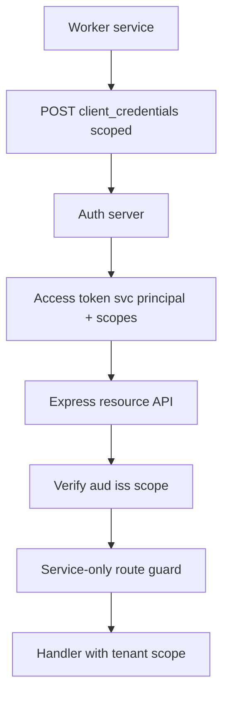
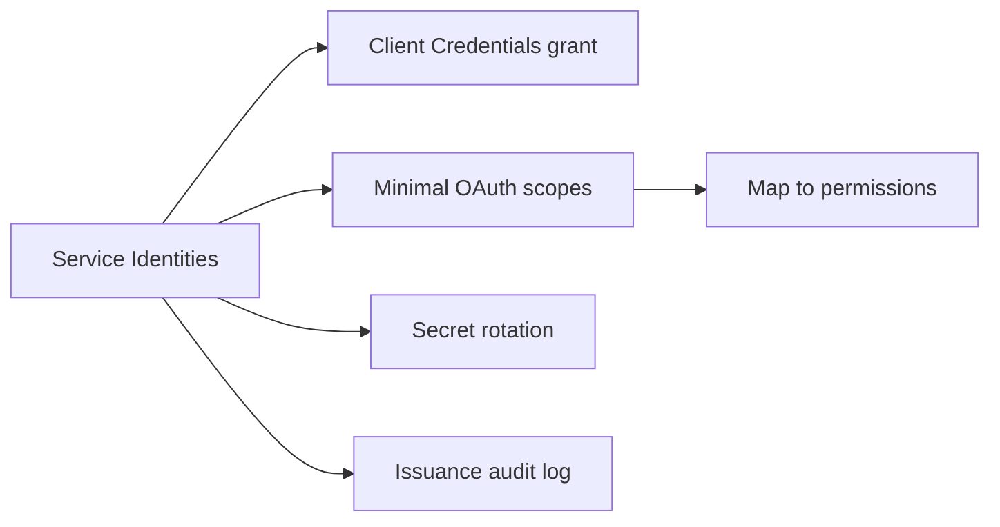
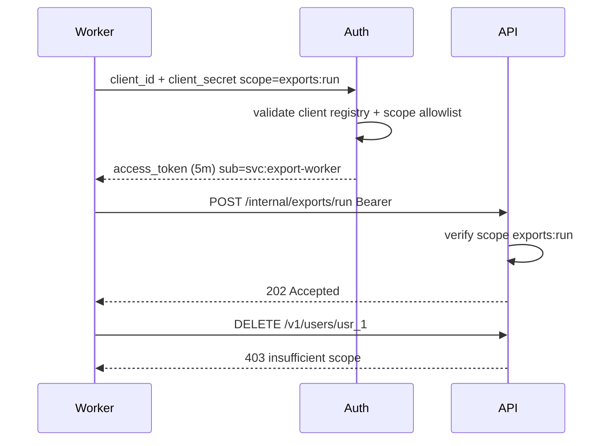

# Least Privilege for Service Identities

## Overview

**Service identities** are non-human principals—workers, cron jobs, ETL pipelines, partner integrations—that authenticate with **client credentials**, **API keys**, or **mTLS certificates** instead of user passwords. **Least privilege** grants each identity only the scopes, permissions, and network paths required for its single job—never a copy of admin user tokens "because it was easier."

Express APIs validate service tokens like user JWTs but map to a separate **service principal** namespace: `svc:report-worker` with `reports:generate` only, not `users:manage_roles`. Rotate secrets, audit token issuance, and scope by tenant when workers are multi-tenant. Federation at scale → [[09-System-Design/README|System Design]]; credential storage crypto → [[18-Security/README|Security]].

## Learning Objectives

- Distinguish user access tokens from service (machine) tokens
- Issue Client Credentials tokens with minimal OAuth scopes
- Enforce service-only routes separate from user session routes
- Rotate client secrets and API keys with zero-downtime patterns
- Audit and alert on service identity privilege changes

## Prerequisites

- [[07-Backend/04-Authentication/OAuth2 and OIDC Application Flows|OAuth2 and OIDC Application Flows]]
- [[07-Backend/05-Authorization-and-Tenancy/RBAC and Permission Modeling|RBAC and Permission Modeling]]
- [[07-Backend/05-Authorization-and-Tenancy/Multi-Tenant Isolation at the App Boundary|Multi-Tenant Isolation at the App Boundary]]

## Difficulty

`advanced`

## Estimated Time

- Reading: 1.5 hours
- Exercises: 2.5 hours
- Mini project: 5 hours

## History

Datacenter scripts used shared admin passwords. Cloud IAM moved to per-service identities (AWS IAM roles, GCP SAs). OAuth **client_credentials** standardized M2M token exchange. Breaches often involve **over-privileged service accounts** (CI token with production admin) or long-lived API keys in repos—least privilege and rotation contain blast radius.

## Problem It Solves

| Failure mode | Shared admin API key | Least-privilege service identity |
| --- | --- | --- |
| Leaked CI secret | Full production access | Scoped to deploy artifact only |
| Worker compromise | Attacker gets user admin JWT | Worker has `jobs:process` only |
| No attribution | "Something called API" | `client_id` in audit logs |
| Tenant cross-run | Worker sees all tenants | Token bound to `tenant_id` |
| Key never rotated | Years-old secret in env | Dual secret + scheduled rotation |

## Internal Implementation



Separate **principal types** in authorization:

| Principal | Example `sub` | Typical scopes |
| --- | --- | --- |
| User | `usr_42` | `invoices:read` + ownership |
| Service | `svc:worker-7` | `jobs:process`, `webhooks:deliver` |

## Mermaid Diagrams

### Structure



### Sequence / Lifecycle



## Examples

### Minimal Example

```typescript
const SERVICE_SCOPES: Record<string, string[]> = {
  "svc:report-worker": ["reports:generate"],
  "svc:webhook-dispatcher": ["webhooks:deliver"],
};

function serviceHasScope(clientId: string, scope: string): boolean {
  return SERVICE_SCOPES[clientId]?.includes(scope) ?? false;
}
```

### Production-Shaped Example

```typescript
import express, { Request, Response, NextFunction } from "express";
import jwt from "jsonwebtoken";

interface ServiceClaims {
  sub: string; // svc:export-worker
  iss: string;
  aud: string;
  scope: string;
  tenant_id?: string;
  typ: "service";
}

declare global {
  namespace Express {
    interface Request {
      service?: ServiceClaims;
    }
  }
}

const ISSUER = "https://auth.example.com";
const AUDIENCE = "https://api.example.com";

function authenticateService(requiredScope: string) {
  return (req: Request, res: Response, next: NextFunction) => {
    const header = req.header("authorization");
    const match = header?.match(/^Bearer (.+)$/i);
    if (!match) {
      return res.status(401).type("application/problem+json").json({
        type: "https://api.example.com/problems/unauthenticated",
        title: "Missing service token",
        status: 401,
      });
    }

    try {
      const claims = jwt.verify(match[1], process.env.JWT_PUBLIC_KEY!, {
        algorithms: ["RS256"],
        issuer: ISSUER,
        audience: AUDIENCE,
      }) as ServiceClaims;

      if (claims.typ !== "service") {
        return res.status(403).type("application/problem+json").json({
          type: "https://api.example.com/problems/forbidden",
          title: "User tokens not allowed on internal routes",
          status: 403,
        });
      }

      const scopes = new Set(claims.scope.split(" "));
      if (!scopes.has(requiredScope)) {
        return res.status(403).type("application/problem+json").json({
          type: "https://api.example.com/problems/forbidden",
          title: "Insufficient service scope",
          status: 403,
        });
      }

      req.service = claims;
      next();
    } catch {
      return res.status(401).type("application/problem+json").json({
        type: "https://api.example.com/problems/invalid-token",
        title: "Invalid service token",
        status: 401,
      });
    }
  };
}

const app = express();

// Internal route — not exposed via public gateway
app.post(
  "/internal/exports/run",
  authenticateService("exports:run"),
  (req, res) => {
    const tenantId = req.service!.tenant_id;
    if (!tenantId) {
      return res.status(400).type("application/problem+json").json({
        type: "https://api.example.com/problems/validation-error",
        title: "Service token missing tenant_id",
        status: 400,
      });
    }
    enqueueExportJob({ tenantId, requestedBy: req.service!.sub });
    res.status(202).json({ status: "queued" });
  },
);

function enqueueExportJob(_job: { tenantId: string; requestedBy: string }) {}

// Client registration side (auth server) — scope allowlist per client_id
const CLIENT_ALLOWLIST: Record<string, string[]> = {
  "export-worker": ["exports:run"],
};

app.listen(3000);
```

Rotation pattern: register **two active secrets** per client; auth accepts either during overlap window; retire old after deploy completes.

## Trade-offs

| Dimension | Upside | Downside | When it matters |
| --- | --- | --- | --- |
| Narrow scopes | Blast radius small | More clients to manage | CI/CD, workers |
| Short M2M token TTL | Limited theft window | Token fetch overhead | High security |
| mTLS + JWT | Strong binding | Cert ops complexity | Zero-trust internal |
| API keys | Simple | Often over-scoped, no expiry | Legacy—migrate off |
| Per-tenant service tokens | Isolation | Proliferation of clients | Regulated multi-tenant |

### When to Use

- Background workers calling internal APIs
- Partner integrations with fixed capabilities
- CI/CD deploy hooks and automation

### When Not to Use

- Human user actions—use user OAuth flows with PKCE
- Giving service identity admin scopes "temporarily"—create break-glass procedure instead

## Exercises

1. List scopes for five services in a URL shortener system; no scope may include `*`.
2. Design dual-secret rotation timeline for `export-worker` client.
3. Write middleware rejecting user JWT on `/internal/*` routes.
4. Map CI pipeline stages to distinct client_ids—why not one mega key?
5. Audit log fields for each `client_credentials` token issuance.

## Mini Project

Register two OAuth clients in Authentication Server (worker + webhook dispatcher); enforce scope on internal Express routes.

## Portfolio Project

Service identity registry doc: client_id catalog, scopes, owners, rotation schedule, break-glass policy.

## Interview Questions

1. Client Credentials vs user Authorization Code—when each?
2. How do you prevent a worker token from calling user admin APIs?
3. Why bind service token to tenant_id for multi-tenant workers?
4. API key vs OAuth M2M—migration trade-offs?
5. What is break-glass access and how is it audited differently?

### Stretch / Staff-Level

1. SPIFFE/SPIRE workloads vs OAuth client_credentials in Kubernetes.
2. Just-in-time elevation for service accounts during incidents—design without standing admin.

## Common Mistakes

- Reusing user JWT for cron jobs
- One global `INTERNAL_API_KEY` in all services
- Service tokens without `aud` validation
- Client secret committed to git—no rotation
- Internal routes exposed on public load balancer without network policy

## Best Practices

- Unique client_id per deployment/workload type
- Scope allowlist enforced at token issuance, not only resource API
- Network segmentation: internal routes on private listener
- Automate secret rotation; alert on clients using deprecated secret
- Log `sub`, `client_id`, scope, tenant on every M2M call

## Summary

Least privilege for service identities means each machine principal gets minimal OAuth scopes, short-lived tokens, tenant binding where applicable, and separation from user auth paths—enforced in Express with service token type checks and scope middleware. Register clients explicitly, rotate secrets safely, never reuse admin credentials in workers, and audit issuance like human role changes.

## Further Reading

- [[07-Backend/04-Authentication/OAuth2 and OIDC Application Flows|OAuth2 and OIDC Application Flows]]
- OAuth 2.0 Client Credentials (RFC 6749)
- [[07-Backend/05-Authorization-and-Tenancy/RBAC and Permission Modeling|RBAC and Permission Modeling]]

## Related Notes

- [[07-Backend/04-Authentication/OAuth2 and OIDC Application Flows|OAuth2 and OIDC Application Flows]]
- [[07-Backend/04-Authentication/JWT Access Tokens and Claims|JWT Access Tokens and Claims]]
- [[07-Backend/05-Authorization-and-Tenancy/RBAC and Permission Modeling|RBAC and Permission Modeling]]
- [[07-Backend/05-Authorization-and-Tenancy/Multi-Tenant Isolation at the App Boundary|Multi-Tenant Isolation at the App Boundary]]
- [[07-Backend/10-Production-Services/Configuration Feature Flags and Secrets for Services|Configuration Feature Flags and Secrets for Services]]

## Progress Checklist

- [ ] Explained from first principles
- [ ] Drew at least one Mermaid diagram
- [ ] Implemented a minimal version
- [ ] Documented trade-offs and non-goals
- [ ] Completed exercises
- [ ] Practiced interview questions aloud
- [ ] Linked prerequisites and dependents
