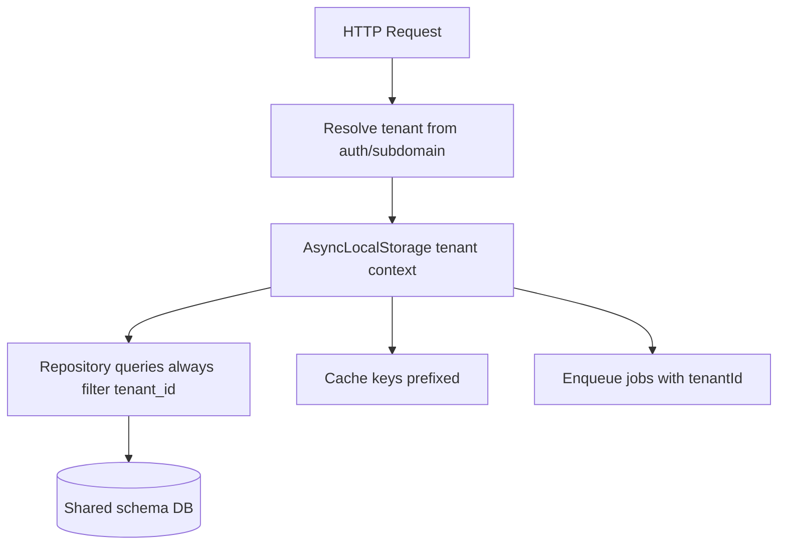
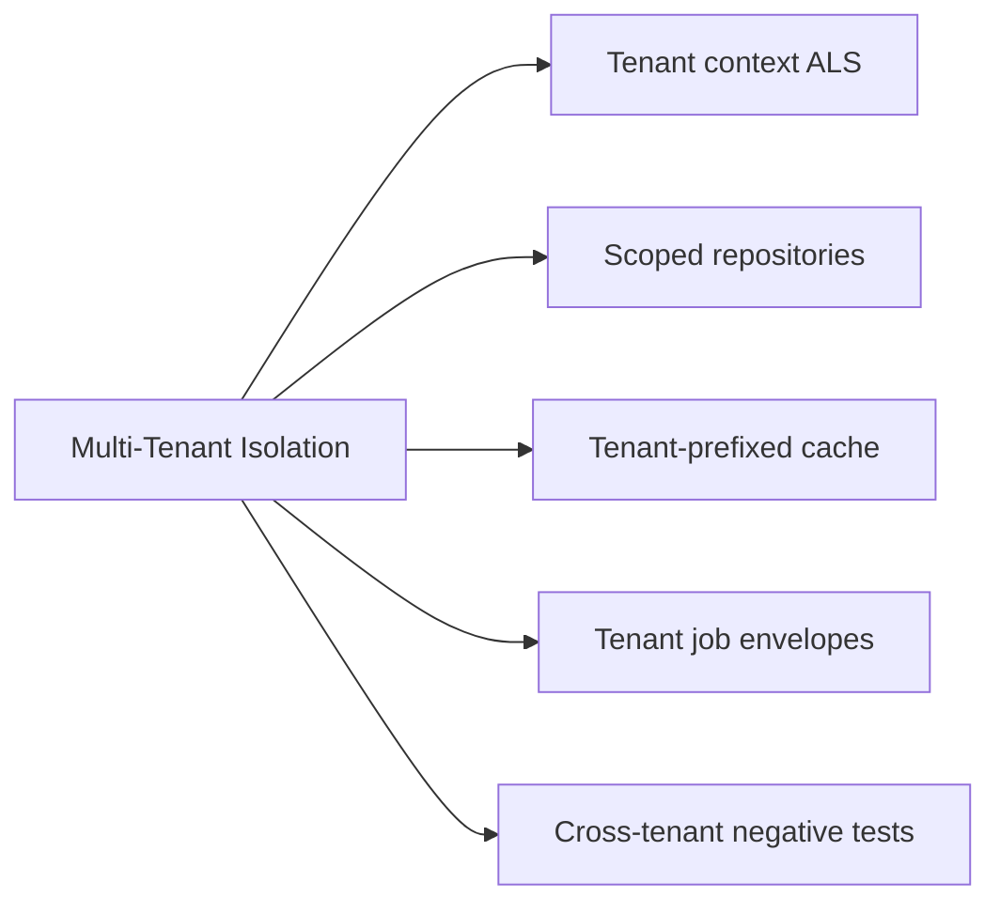
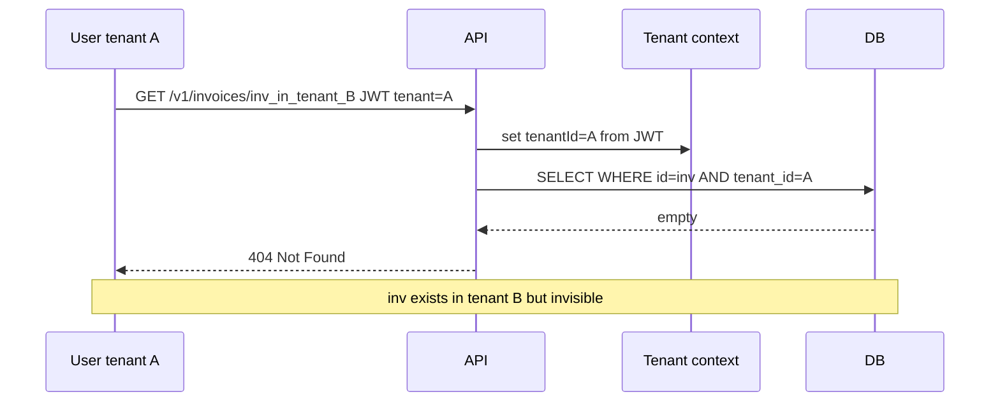

# Multi-Tenant Isolation at the App Boundary

## Overview

**Multi-tenant isolation** ensures each customer's data (tenant) is inaccessible to other tenants—even when sharing the same database, cache, and Express process. The **app boundary** is where tenant context is established from authenticated identity (`tenant_id` claim, subdomain, or API key metadata) and **propagated** to every query, cache key, job payload, and log field.

Failure modes are catastrophic: cross-tenant data leaks, one tenant's export containing another's rows, support tools without tenant guard. Database RLS and network segmentation are deeper layers ([[08-Databases/README|Databases]], [[09-System-Design/README|System Design]]); this note owns **application discipline**: never trust client-supplied `tenantId`, always scope repositories, test tenant boundaries in CI.

## Learning Objectives

- Extract tenant context from JWT, session, or host header with validation
- Propagate tenant ID through AsyncLocalStorage request context to repositories
- Scope cache keys, queues, and background jobs by tenant
- Recognize shared-schema vs database-per-tenant trade-offs at app layer
- Write cross-tenant negative tests as first-class CI citizens

## Prerequisites

- [[07-Backend/05-Authorization-and-Tenancy/Resource Ownership Checks|Resource Ownership Checks]]
- [[07-Backend/04-Authentication/JWT Access Tokens and Claims|JWT Access Tokens and Claims]]
- [[07-Backend/02-Frameworks-and-Middleware/Request Context and Async Local Storage|Request Context and Async Local Storage]]

## Difficulty

`advanced`

## Estimated Time

- Reading: 2 hours
- Exercises: 3 hours
- Mini project: 6 hours

## History

Early SaaS used separate deployments per customer (true isolation, high ops cost). Shared-schema multi-tenancy won for margins; bugs like missing `tenant_id` filters caused headline breaches. **Row-Level Security (RLS)** in Postgres added DB-enforced backup; app boundary remains primary for ORMs and caches. JWT `tenant_id` claims and subdomain routing (`acme.app.com`) standardize context resolution.

## Problem It Solves

| Failure mode | No tenant discipline | App-boundary isolation |
| --- | --- | --- |
| Cross-tenant read | `SELECT * FROM invoices WHERE id = $1` | `AND tenant_id = $ctx` |
| Cache poison | Key `invoice:inv_1` shared | Key `ten:acme:invoice:inv_1` |
| Background job leak | Worker processes wrong tenant batch | Job carries tenantId; worker validates |
| Support tool blast | Admin query all rows | Impersonation with tenant scope + audit |
| Client spoof | Body `{ tenantId: "victim" }` | Tenant from auth token only |

## Internal Implementation



**Tenant resolution sources** (priority order typical):

1. Signed claim in access token (`tenant_id`) — preferred for APIs
2. Session record bound at login after membership verification
3. Subdomain → tenant lookup (validate user belongs to tenant)
4. Never: query param or body field alone

## Mermaid Diagrams

### Structure



### Sequence / Lifecycle



## Examples

### Minimal Example

```typescript
function cacheKey(tenantId: string, resource: string, id: string) {
  return `ten:${tenantId}:${resource}:${id}`;
}
```

### Production-Shaped Example

```typescript
import express, { Request, Response, NextFunction } from "express";
import { AsyncLocalStorage } from "node:async_hooks";

interface TenantContext {
  tenantId: string;
  userId: string;
}

const tenantAls = new AsyncLocalStorage<TenantContext>();

export function getTenantContext(): TenantContext {
  const ctx = tenantAls.getStore();
  if (!ctx) throw new Error("tenant context missing — programming error");
  return ctx;
}

declare global {
  namespace Express {
    interface Request {
      auth?: { sub: string; tenant_id: string; roles: string[] };
    }
  }
}

function authenticate(req: Request, _res: Response, next: NextFunction) {
  // JWT verified upstream — tenant_id from signed claim ONLY
  req.auth = { sub: "usr_1", tenant_id: "ten_acme", roles: ["editor"] };
  next();
}

function bindTenantContext(req: Request, res: Response, next: NextFunction) {
  if (!req.auth?.tenant_id) {
    return res.status(401).type("application/problem+json").json({
      type: "https://api.example.com/problems/unauthenticated",
      title: "Missing tenant context",
      status: 401,
    });
  }
  tenantAls.run({ tenantId: req.auth.tenant_id, userId: req.auth.sub }, next);
}

// Repository — tenant_id mandatory on every query
const invoiceRepo = {
  async findById(id: string): Promise<Invoice | null> {
    const { tenantId } = getTenantContext();
    const row = await db.get(id);
    if (!row || row.tenantId !== tenantId) return null;
    return row;
  },
  async list(): Promise<Invoice[]> {
    const { tenantId } = getTenantContext();
    return db.list().filter((r) => r.tenantId === tenantId);
  },
};

interface Invoice { id: string; tenantId: string; ownerId: string; }

const db = {
  rows: [
    { id: "inv_1", tenantId: "ten_acme", ownerId: "usr_1" },
    { id: "inv_2", tenantId: "ten_other", ownerId: "usr_9" },
  ],
  async get(id: string) { return this.rows.find((r) => r.id === id) ?? null; },
  list() { return this.rows; },
};

const app = express();
app.use(express.json());
app.use(authenticate);
app.use(bindTenantContext);

app.get("/v1/invoices/:id", async (req, res) => {
  const invoice = await invoiceRepo.findById(req.params.id);
  if (!invoice) {
    return res.status(404).type("application/problem+json").json({
      type: "https://api.example.com/problems/not-found",
      title: "Not found",
      status: 404,
    });
  }
  res.json(invoice);
});

// Anti-pattern blocked: never accept tenantId from client to switch context
app.post("/v1/admin/switch-tenant", (_req, res) => {
  res.status(403).json({ title: "Use proper impersonation flow with audit", status: 403 });
});

app.listen(3000);
```

Subdomain resolution pattern (sketch):

```typescript
async function resolveTenantFromHost(host: string, userId: string): Promise<string> {
  const slug = host.split(".")[0]; // acme.app.example.com
  const tenant = await tenantRepo.findBySlug(slug);
  if (!tenant) throw notFound();
  const member = await membershipRepo.exists(userId, tenant.id);
  if (!member) throw forbidden();
  return tenant.id;
}
```

## Trade-offs

| Dimension | Upside | Downside | When it matters |
| --- | --- | --- | --- |
| Shared schema + tenant_id | Cost efficient | One bug leaks all | Most SaaS |
| DB per tenant | Strong isolation | Ops scale pain | Regulated few customers |
| RLS at DB | Defense in depth | ORM/raw SQL complexity | Postgres shops |
| Tenant in JWT | Fast | User multi-tenant membership切换 | B2B users in many orgs |
| Subdomain routing | UX clarity | TLS cert wildcard management | Branded tenants |

### When to Use

- Any B2B SaaS with shared infrastructure
- APIs where JWT or session carries org/tenant membership
- Background workers processing per-tenant workloads

### When Not to Use

- True single-tenant dedicated deploy per customer—tenant id may still exist for code uniformity
- Replacing DB RLS when compliance mandates DB-layer enforcement—use both

## Exercises

1. Write test attempting access to resource UUID valid in another tenant—expect 404.
2. Audit ten repository methods; flag any missing `tenantId` filter.
3. Design impersonation flow for support with audit log and time limit.
4. User belongs to tenants A and B—how does token carry active tenant? Switch endpoint?
5. Cache invalidation: flush one tenant without affecting others.

## Mini Project

Add tenant context ALS to Backend Service Toolkit repositories; cross-tenant integration test suite green.

## Portfolio Project

Tenancy ADR: resolution source, schema strategy, RLS yes/no, cache key standard, job envelope format.

## Interview Questions

1. Where must tenant_id come from—can client send it in body?
2. Shared schema vs silo DB—isolation trade-offs?
3. How AsyncLocalStorage helps tenant propagation in Express?
4. Cross-tenant leak in cache—example key fix?
5. Difference between tenant isolation and user ownership within tenant?

### Stretch / Staff-Level

1. Noisy neighbor: one tenant's load affecting others—app vs platform controls.
2. Sharding by tenant_id when single Postgres saturates—app boundary changes?

## Common Mistakes

- `tenantId` from query string for "convenience"
- Global singleton repository without request context
- Integration tests always use default tenant only
- Logs without tenantId field—cannot trace leak
- Admin endpoints querying without mandatory tenant filter

## Best Practices

- Lint or code-review checklist: every SQL includes tenant scope
- `getTenantContext()` throws if missing—fail fast in dev
- Prefix all cache keys and object storage paths with tenant
- Cross-tenant tests in CI on every PR touching repositories
- Pair with [[07-Backend/05-Authorization-and-Tenancy/Resource Ownership Checks|Resource Ownership Checks]] within tenant

## Summary

Multi-tenant isolation at the app boundary establishes tenant context from trusted auth claims, propagates it through request context to repositories caches and jobs, and rejects client attempts to override tenant. Scope every data access by tenant_id, test cross-tenant access as denial, and treat missing filters as severity-1 bugs—not optional hardening.

## Further Reading

- [[08-Databases/README|Databases]] — RLS and tenancy at engine layer
- [[09-System-Design/README|System Design]] — silo vs pool models
- OWASP multi-tenancy cheat sheet

## Related Notes

- [[07-Backend/05-Authorization-and-Tenancy/Resource Ownership Checks|Resource Ownership Checks]]
- [[07-Backend/05-Authorization-and-Tenancy/RBAC and Permission Modeling|RBAC and Permission Modeling]]
- [[07-Backend/02-Frameworks-and-Middleware/Request Context and Async Local Storage|Request Context and Async Local Storage]]
- [[07-Backend/04-Authentication/JWT Access Tokens and Claims|JWT Access Tokens and Claims]]
- [[07-Backend/05-Authorization-and-Tenancy/Least Privilege for Service Identities|Least Privilege for Service Identities]]

## Progress Checklist

- [ ] Explained from first principles
- [ ] Drew at least one Mermaid diagram
- [ ] Implemented a minimal version
- [ ] Documented trade-offs and non-goals
- [ ] Completed exercises
- [ ] Practiced interview questions aloud
- [ ] Linked prerequisites and dependents
