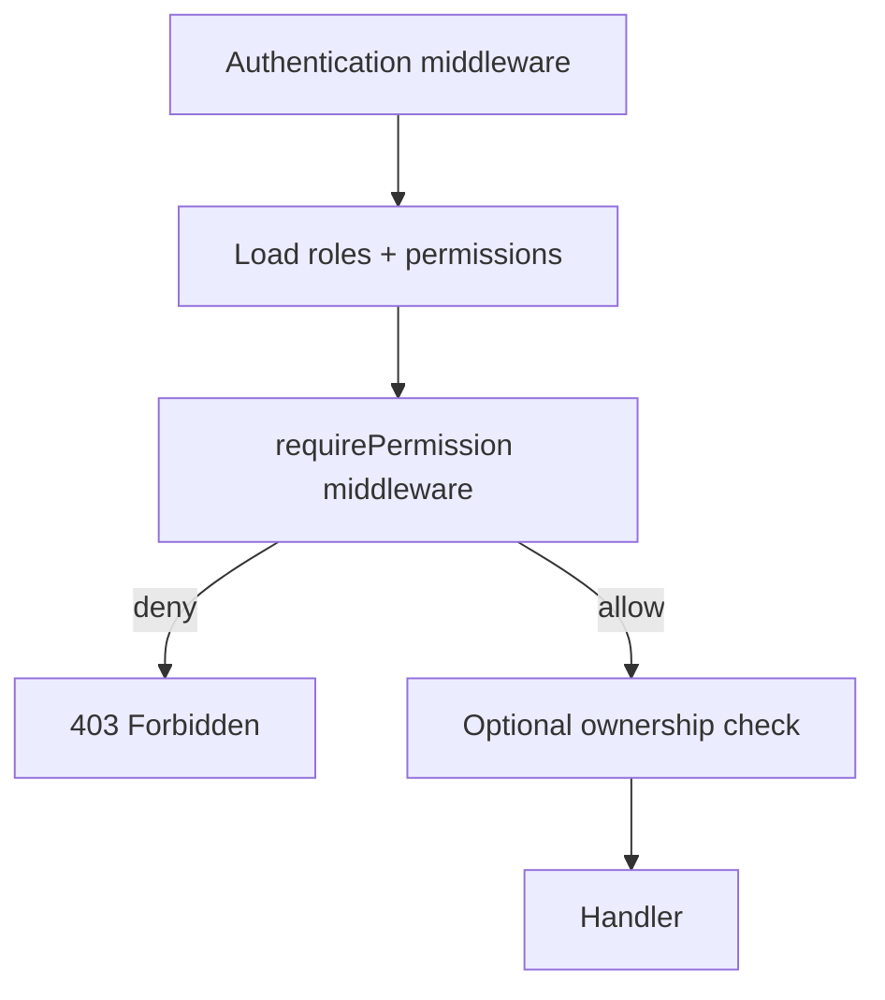
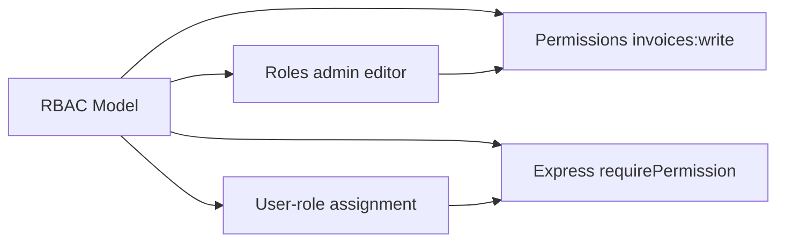
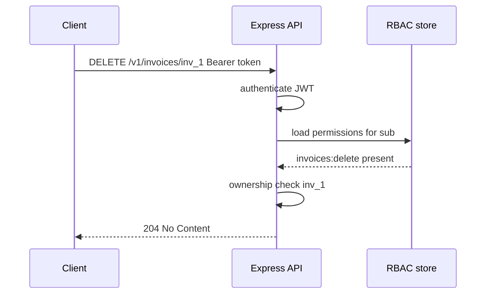

# RBAC and Permission Modeling

## Overview

**Role-Based Access Control (RBAC)** grants permissions to **roles** (admin, editor, viewer), assigns roles to **subjects** (users, service accounts), and checks whether a subject's roles include the permission required for an action (`invoices:delete`, `users:invite`). In Express APIs, RBAC lives in **authorization middleware** after authentication attaches identity (`req.auth`, `req.user`).

RBAC trades fine-grained expressiveness for **operational clarity**: roles map to job functions, audit logs read naturally ("admin deleted invoice"), and support teams reason about access packages. It complements **resource ownership** checks ([[07-Backend/05-Authorization-and-Tenancy/Resource Ownership Checks|Resource Ownership Checks]])—RBAC answers "can this role do X in general?" while ownership answers "on *this* row?"

## Learning Objectives

- Model roles, permissions, and role-permission mappings in code and storage
- Implement Express middleware `requirePermission('invoices:write')`
- Avoid role explosion with permission indirection and role hierarchies
- Decide what belongs in JWT claims vs DB-loaded permissions at request time
- Audit role changes as security-sensitive operations

## Prerequisites

- [[07-Backend/04-Authentication/JWT Access Tokens and Claims|JWT Access Tokens and Claims]]
- [[07-Backend/02-Frameworks-and-Middleware/Middleware Pipeline and Error Middleware|Middleware Pipeline and Error Middleware]]
- [[07-Backend/08-Data-Access-and-Persistence-Patterns/Repository and Unit of Work|Repository and Unit of Work]]

## Difficulty

`intermediate`

## Estimated Time

- Reading: 1.5 hours
- Exercises: 2.5 hours
- Mini project: 5 hours

## History

RBAC formalized in NIST RBAC model (1990s–2000s). SaaS products often ship **default roles** plus custom roles (enterprise tier). OAuth **scopes** overlap with permissions—`invoices:read` scope may map 1:1 to permission string. Confusion between **authentication roles** in JWT and **authorization** updated in DB causes stale access until token expiry.

## Problem It Solves

| Failure mode | Ad-hoc isAdmin flags | RBAC permission model |
| --- | --- | --- |
| Boolean sprawl | `if (user.isAdmin \|\| user.isBilling)` | Named permissions |
| Inconsistent checks | Some routes forget guard | Central middleware |
| Audit ambiguity | "User had admin somehow" | Role assignment records |
| Over-privilege | Everyone gets admin in dev | Least-privilege role sets |
| API/partner scopes | Custom logic per client | Scope ↔ permission map |

## Internal Implementation



Permission naming convention: `resource:action` (`invoices:read`, `users:manage_roles`). Use consistent verbs: `read`, `write`, `delete`, `manage`.

## Mermaid Diagrams

### Structure



### Sequence / Lifecycle



## Examples

### Minimal Example

```typescript
const ROLE_PERMISSIONS: Record<string, string[]> = {
  viewer: ["invoices:read"],
  editor: ["invoices:read", "invoices:write"],
  admin: ["invoices:read", "invoices:write", "invoices:delete", "users:manage_roles"],
};

function hasPermission(roles: string[], permission: string): boolean {
  return roles.some((role) => ROLE_PERMISSIONS[role]?.includes(permission));
}
```

### Production-Shaped Example

```typescript
import express, { Request, Response, NextFunction } from "express";

interface AuthContext {
  sub: string;
  tenantId: string;
  roles: string[];
}

declare global {
  namespace Express {
    interface Request {
      auth?: AuthContext;
    }
  }
}

// Loaded from DB in real apps; cache with TTL per tenant+user
async function resolvePermissions(tenantId: string, userId: string): Promise<Set<string>> {
  const roles = await fetchUserRoles(tenantId, userId);
  const perms = new Set<string>();
  for (const role of roles) {
    for (const p of ROLE_PERMISSIONS[role] ?? []) perms.add(p);
  }
  return perms;
}

const ROLE_PERMISSIONS: Record<string, string[]> = {
  viewer: ["invoices:read"],
  editor: ["invoices:read", "invoices:write"],
  admin: ["invoices:read", "invoices:write", "invoices:delete"],
};

export function requirePermission(...required: string[]) {
  return async (req: Request, res: Response, next: NextFunction) => {
    if (!req.auth) {
      return res.status(401).type("application/problem+json").json({
        type: "https://api.example.com/problems/unauthenticated",
        title: "Authentication required",
        status: 401,
      });
    }
    const perms = await resolvePermissions(req.auth.tenantId, req.auth.sub);
    const ok = required.every((p) => perms.has(p));
    if (!ok) {
      return res.status(403).type("application/problem+json").json({
        type: "https://api.example.com/problems/forbidden",
        title: "Insufficient permissions",
        status: 403,
        detail: `Requires: ${required.join(", ")}`,
      });
    }
    next();
  };
}

const app = express();

app.delete(
  "/v1/invoices/:id",
  authenticateStub,
  requirePermission("invoices:delete"),
  async (req, res) => {
    // plus ownership — see Resource Ownership note
    res.status(204).end();
  },
);

function authenticateStub(req: Request, _res: Response, next: NextFunction) {
  req.auth = { sub: "usr_1", tenantId: "ten_1", roles: ["editor"] };
  next();
}

async function fetchUserRoles(_tenantId: string, _userId: string): Promise<string[]> {
  return ["editor"];
}

app.listen(3000);
```

## Trade-offs

| Dimension | Upside | Downside | When it matters |
| --- | --- | --- | --- |
| Static role matrix | Simple to test | Inflexible for enterprise custom roles | Early SaaS |
| DB-driven permissions | Dynamic admin UI | DB hit each request (cache) | Mature SaaS |
| Roles in JWT | Fast authorize | Stale until refresh | Read-heavy APIs |
| Fine permissions | Least privilege | Proliferation of strings | Compliance |
| Role hierarchy | admin ⊃ editor | Inheritance bugs | Large orgs |

### When to Use

- Team/org products with recognizable job functions
- Admin consoles with role assignment UI
- Mapping OAuth scopes to internal permissions

### When Not to Use

- Attribute-heavy policies ("only if amount < 10k and region=EU") → [[07-Backend/05-Authorization-and-Tenancy/ABAC and Policy Decision Points Concepts|ABAC]]
- Single-user consumer apps with only ownership—RBAC may be overkill

## Exercises

1. Design permission set for URL shortener: owner, team admin, anonymous.
2. Add role hierarchy: `admin` inherits `editor` inherits `viewer` without duplicating permission lists.
3. Implement cache invalidation when admin changes user roles mid-session.
4. Map OAuth scope `invoices:read` to RBAC check in middleware—single function or two layers?
5. Write test matrix: user with `invoices:write` but not owner deleting another user's invoice—expect 403 from which layer?

## Mini Project

Add RBAC to Authentication Server: seed roles, admin API to assign roles, middleware on protected routes.

## Portfolio Project

RBAC catalog in Backend Service Toolkit: default roles, permission glossary, JWT vs DB resolution policy.

## Interview Questions

1. RBAC vs ABAC—when does RBAC break down?
2. Where should permission checks live—middleware, service layer, or both?
3. Stale roles in JWT—mitigations?
4. Difference between 401 and 403 in permission denial after authentication?
5. How do OAuth scopes relate to RBAC permissions?

### Stretch / Staff-Level

1. Design custom roles per tenant (enterprise) without combinatorial explosion.
2. ReBAC (relationship-based) vs RBAC for Google Docs-style sharing.

## Common Mistakes

- Checking roles in handlers (`if (role === 'admin')`) instead of permissions
- Same 403 message for unauthenticated vs forbidden confuses clients
- Granting `admin` in JWT without server-side role assignment audit
- No tenant scoping on role lookups ([[07-Backend/05-Authorization-and-Tenancy/Multi-Tenant Isolation at the App Boundary|Multi-Tenant Isolation]])
- Confusing authentication (who) with authorization (what they may do)

## Best Practices

- Permission strings stable across API versions
- Deny by default; explicit grants only
- Log 403 with subject, permission, resource id (not PII dump)
- Admin role assignment requires elevated permission + audit
- Combine RBAC with ownership checks on mutating resource routes

## Summary

RBAC models authorization as roles carrying permissions, assigned to authenticated subjects and enforced in Express middleware after identity is known. Name permissions consistently, load from DB or cache when JWT claims are insufficient, combine with resource ownership for row-level control, and treat role administration as a high-risk surface with audit trails.

## Further Reading

- NIST RBAC model documentation
- [[07-Backend/05-Authorization-and-Tenancy/Resource Ownership Checks|Resource Ownership Checks]]
- [[07-Backend/05-Authorization-and-Tenancy/ABAC and Policy Decision Points Concepts|ABAC and Policy Decision Points Concepts]]

## Related Notes

- [[07-Backend/04-Authentication/JWT Access Tokens and Claims|JWT Access Tokens and Claims]]
- [[07-Backend/05-Authorization-and-Tenancy/Resource Ownership Checks|Resource Ownership Checks]]
- [[07-Backend/05-Authorization-and-Tenancy/Multi-Tenant Isolation at the App Boundary|Multi-Tenant Isolation at the App Boundary]]
- [[07-Backend/05-Authorization-and-Tenancy/ABAC and Policy Decision Points Concepts|ABAC and Policy Decision Points Concepts]]
- [[07-Backend/04-Authentication/OAuth2 and OIDC Application Flows|OAuth2 and OIDC Application Flows]]

## Progress Checklist

- [ ] Explained from first principles
- [ ] Drew at least one Mermaid diagram
- [ ] Implemented a minimal version
- [ ] Documented trade-offs and non-goals
- [ ] Completed exercises
- [ ] Practiced interview questions aloud
- [ ] Linked prerequisites and dependents
