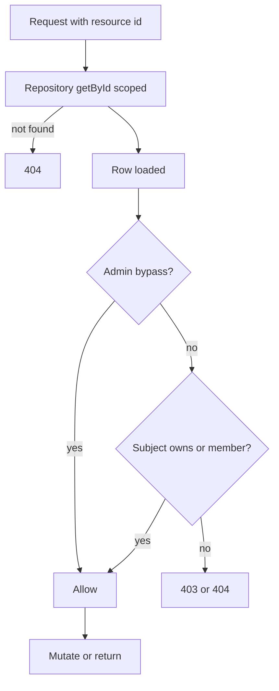
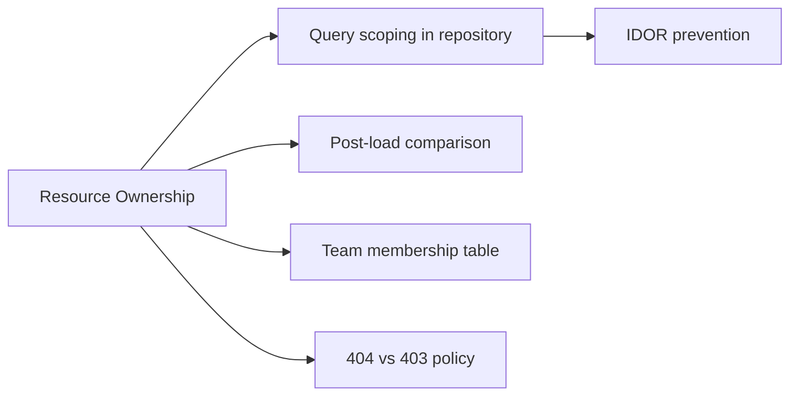
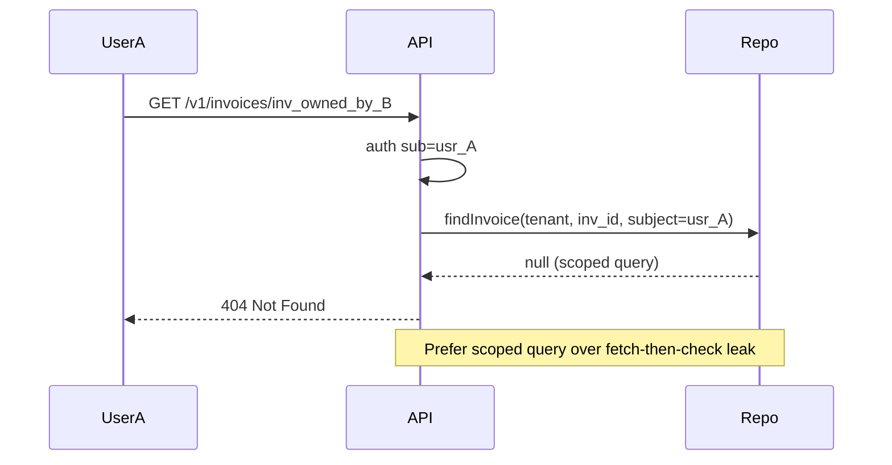

# Resource Ownership Checks

## Overview

A **resource ownership check** verifies the authenticated subject may access **this specific instance**—invoice `inv_42` owned by `usr_9`—not merely that they hold a global permission like `invoices:read`. Failure to enforce ownership causes **IDOR (Insecure Direct Object Reference)**: attacker changes `:id` in URL and reads or mutates another user's data.

In Express services, ownership checks belong in the **service layer** (after loading the resource) or in repository queries that **always filter by owner/tenant**—never only in client UI. Combine with RBAC: global permission may allow admins to bypass ownership; editors may read only owned rows. Return **404** or **403** consistently per product policy ([[07-Backend/01-HTTP-APIs-and-Contracts/Status Codes as Product Policy|Status Codes as Product Policy]]).

## Learning Objectives

- Implement ownership checks after fetch and via scoped repository queries
- Choose 404 vs 403 when hiding resource existence from unauthorized callers
- Model shared resources, team ownership, and delegated access
- Prevent IDOR in list endpoints (filter in query, not in memory)
- Test ownership with cross-user integration cases

## Prerequisites

- [[07-Backend/05-Authorization-and-Tenancy/RBAC and Permission Modeling|RBAC and Permission Modeling]]
- [[07-Backend/08-Data-Access-and-Persistence-Patterns/Repository and Unit of Work|Repository and Unit of Work]]
- [[07-Backend/04-Authentication/JWT Access Tokens and Claims|JWT Access Tokens and Claims]]

## Difficulty

`intermediate`

## Estimated Time

- Reading: 1.5 hours
- Exercises: 2.5 hours
- Mini project: 4 hours

## History

IDOR remains in OWASP Top 10 class issues because developers trust "secret" UUIDs. UUIDs are not authorization. Multi-tenant SaaS leaks often trace to missing `tenant_id` in WHERE clauses. **Object-level authorization** frameworks (Google Zanzibar/ReBAC) scale sharing graphs; product APIs still need explicit ownership or membership checks at the app boundary.

## Problem It Solves

| Failure mode | Global RBAC only | Ownership enforcement |
| --- | --- | --- |
| IDOR on GET /invoices/:id | Any `invoices:read` sees all | Row filtered by owner/tenant |
| List leakage | Returns all rows, filter client-side | Query `WHERE owner_id = $sub` |
| Admin bypass bugs | Admin flag skips all checks | Explicit admin override path |
| Cross-tenant access | Same UUID in two tenants | Tenant + owner composite scope |
| Shared docs | Binary owner model fails | Membership table check |

## Internal Implementation

Two complementary patterns:

1. **Query scoping** (preferred for lists): repository never returns unscoped rows.
2. **Post-load check** (single resource): compare `resource.ownerId` to `req.auth.sub` or membership.



## Mermaid Diagrams

### Structure



### Sequence / Lifecycle



## Examples

### Minimal Example

```typescript
function assertOwner(resource: { ownerId: string }, subjectId: string) {
  if (resource.ownerId !== subjectId) {
    throw forbidden("not_owner");
  }
}
```

### Production-Shaped Example

```typescript
import express, { Request, Response, NextFunction } from "express";

interface Invoice {
  id: string;
  tenantId: string;
  ownerId: string;
  amountCents: number;
}

interface AuthContext {
  sub: string;
  tenantId: string;
  roles: string[];
}

declare global {
  namespace Express {
    interface Request {
      auth?: AuthContext;
    }
  }
}

class NotFoundError extends Error {
  status = 404;
}
class ForbiddenError extends Error {
  status = 403;
}

// Repository: ALWAYS include tenant + subject scope for non-admin reads
async function findInvoiceForSubject(
  tenantId: string,
  invoiceId: string,
  subjectId: string,
  isAdmin: boolean,
): Promise<Invoice | null> {
  const row = await dbInvoices.get(invoiceId);
  if (!row || row.tenantId !== tenantId) return null;
  if (!isAdmin && row.ownerId !== subjectId) return null; // 404 policy hides existence
  return row;
}

async function listInvoicesForSubject(tenantId: string, subjectId: string, isAdmin: boolean) {
  const all = await dbInvoices.listByTenant(tenantId);
  return isAdmin ? all : all.filter((i) => i.ownerId === subjectId);
}

const dbInvoices = {
  store: new Map<string, Invoice>([
    ["inv_1", { id: "inv_1", tenantId: "ten_1", ownerId: "usr_a", amountCents: 100 }],
    ["inv_2", { id: "inv_2", tenantId: "ten_1", ownerId: "usr_b", amountCents: 200 }],
  ]),
  async get(id: string) { return this.store.get(id) ?? null; },
  async listByTenant(tenantId: string) {
    return [...this.store.values()].filter((i) => i.tenantId === tenantId);
  },
};

function isAdmin(roles: string[]) {
  return roles.includes("admin");
}

const app = express();

app.get("/v1/invoices", authenticate, async (req, res, next) => {
  try {
    const items = await listInvoicesForSubject(
      req.auth!.tenantId,
      req.auth!.sub,
      isAdmin(req.auth!.roles),
    );
    res.json({ items });
  } catch (err) {
    next(err);
  }
});

app.get("/v1/invoices/:id", authenticate, async (req, res, next) => {
  try {
    const invoice = await findInvoiceForSubject(
      req.auth!.tenantId,
      req.params.id,
      req.auth!.sub,
      isAdmin(req.auth!.roles),
    );
    if (!invoice) {
      return res.status(404).type("application/problem+json").json({
        type: "https://api.example.com/problems/not-found",
        title: "Invoice not found",
        status: 404,
      });
    }
    res.json(invoice);
  } catch (err) {
    next(err);
  }
});

app.delete("/v1/invoices/:id", authenticate, requirePermission("invoices:delete"), async (req, res, next) => {
  try {
    const invoice = await findInvoiceForSubject(
      req.auth!.tenantId,
      req.params.id,
      req.auth!.sub,
      isAdmin(req.auth!.roles),
    );
    if (!invoice) throw new NotFoundError();
    // editors with delete perm still cannot delete others' invoices unless admin
    if (!isAdmin(req.auth!.roles) && invoice.ownerId !== req.auth!.sub) {
      throw new ForbiddenError();
    }
    await dbInvoices.store.delete(invoice.id);
    res.status(204).end();
  } catch (err) {
    next(err);
  }
});

function authenticate(req: Request, _res: Response, next: NextFunction) {
  req.auth = { sub: "usr_a", tenantId: "ten_1", roles: ["editor"] };
  next();
}

function requirePermission(_perm: string) {
  return (_req: Request, _res: Response, next: NextFunction) => next();
}

app.listen(3000);
```

## Trade-offs

| Dimension | Upside | Downside | When it matters |
| --- | --- | --- | --- |
| 404 for non-owner | Hides existence | Harder debugging for legitimate shares | Consumer privacy |
| 403 for non-owner | Clear denial | Confirms resource exists | Collaboration apps |
| Query scoping | No leak path | Complex queries for shared resources | List endpoints |
| Post-load check | Simple | Fetch before deny leaks side channels | Low sensitivity |
| Admin bypass | Support operations | Misconfigured admin role catastrophic | Ops tooling |

### When to Use

- Every route parameterized by resource ID
- All list/search endpoints returning tenant data
- Mutations after RBAC permission passes

### When Not to Use

- Public resources (published blog posts)—use visibility flag not owner check
- Replacing tenant isolation—ownership is within tenant ([[07-Backend/05-Authorization-and-Tenancy/Multi-Tenant Isolation at the App Boundary|Multi-Tenant Isolation]])

## Exercises

1. Write integration test: user A cannot GET user B invoice; assert 404 vs 403 per your policy.
2. Fix vulnerable handler that loads by id only then checks owner— refactor to scoped query.
3. Model team shared folder: `membership` table check vs ownerId only.
4. When would admin read cross-owner without impersonation audit?
5. GraphQL nested resolvers—where ownership checks duplicate REST lessons?

## Mini Project

Add ownership + admin bypass to URL Shortener API links; tests for IDOR regression.

## Portfolio Project

Object-level authorization section in Backend Service Toolkit: 404 policy, repository scoping templates, IDOR test checklist.

## Interview Questions

1. IDOR—explain with URL example and fix.
2. 404 vs 403 for unauthorized access to existing resource?
3. Why must list endpoints scope in SQL/query not filter in Node?
4. Relationship between tenant isolation and ownership checks?
5. Can UUID v4 primary keys replace authorization?

### Stretch / Staff-Level

1. Design Google Docs-style sharing on top of ownership + ReBAC membership.
2. Side-channel risks: timing difference exists vs not exists on scoped query.

## Common Mistakes

- Checking ownership only on DELETE not GET
- `findById(id)` without tenantId in WHERE
- Returning different error shapes for IDOR vs genuine missing id
- Trusting client-supplied `ownerId` in POST body
- Admin `role` skipping audit when viewing cross-user data

## Best Practices

- Repository methods accept `AuthContext` or scope parameters—no unscoped `get(id)`
- Document 404 vs 403 policy in API guide
- Integration tests with two users in same tenant
- Log cross-owner denied attempts at warn level (possible attack)
- Layer RBAC then ownership then ABAC for high-risk resources

## Summary

Resource ownership checks enforce object-level authorization: subjects access only rows they own, belong to, or hold admin override for—implemented via scoped repository queries and explicit comparisons after load. Prevent IDOR on every `:id` route and list endpoint, align 404/403 policy with product privacy goals, and never treat opaque IDs as proof of access.

## Further Reading

- OWASP IDOR prevention
- [[07-Backend/05-Authorization-and-Tenancy/Multi-Tenant Isolation at the App Boundary|Multi-Tenant Isolation at the App Boundary]]
- [[07-Backend/05-Authorization-and-Tenancy/RBAC and Permission Modeling|RBAC and Permission Modeling]]

## Related Notes

- [[07-Backend/05-Authorization-and-Tenancy/RBAC and Permission Modeling|RBAC and Permission Modeling]]
- [[07-Backend/05-Authorization-and-Tenancy/Multi-Tenant Isolation at the App Boundary|Multi-Tenant Isolation at the App Boundary]]
- [[07-Backend/05-Authorization-and-Tenancy/ABAC and Policy Decision Points Concepts|ABAC and Policy Decision Points Concepts]]
- [[07-Backend/08-Data-Access-and-Persistence-Patterns/Repository and Unit of Work|Repository and Unit of Work]]
- [[07-Backend/01-HTTP-APIs-and-Contracts/Status Codes as Product Policy|Status Codes as Product Policy]]

## Progress Checklist

- [ ] Explained from first principles
- [ ] Drew at least one Mermaid diagram
- [ ] Implemented a minimal version
- [ ] Documented trade-offs and non-goals
- [ ] Completed exercises
- [ ] Practiced interview questions aloud
- [ ] Linked prerequisites and dependents
