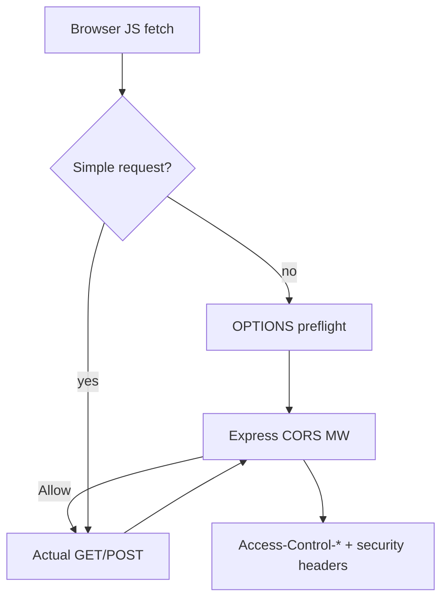
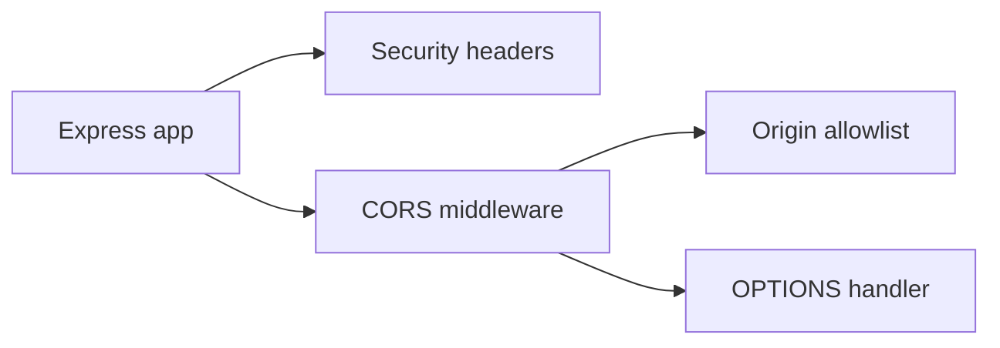
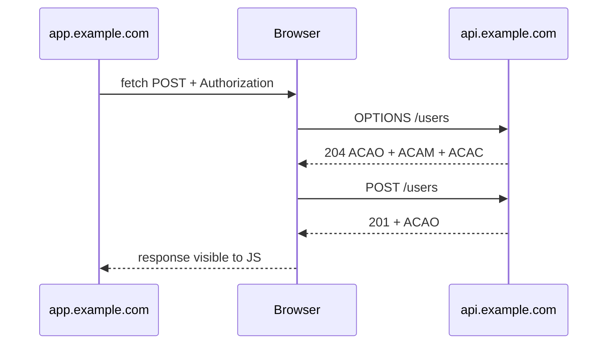

# CORS Security Headers and Browser Boundaries

## Overview

Browsers enforce a **same-origin policy** for JavaScript—cross-origin API calls require **CORS** (Cross-Origin Resource Sharing) response headers from the server. Backend APIs also emit **security headers** (Content-Security-Policy, Strict-Transport-Security, X-Content-Type-Options, Frame-Options) shaping how browsers handle responses. These are **browser boundaries**, not authentication—CORS does not stop curl or server-side attackers. Express middleware configures allowed origins, methods, credentials, and preflight caching. Deep threat modeling continues in [[18-Security/README|Security]].

## Learning Objectives

- Explain preflight OPTIONS vs simple requests and when each fires
- Configure `Access-Control-Allow-*` for credentialed SPA + API setups
- Set Helmet-style security headers appropriate for JSON APIs vs HTML
- Avoid wildcard origins with credentials and overly permissive `Access-Control-Allow-Headers`
- Relate CORS to CSRF strategy ([[07-Backend/04-Authentication/Sessions Cookies and CSRF Boundaries|Sessions Cookies and CSRF Boundaries]])

## Prerequisites

- [[07-Backend/04-Authentication/Sessions Cookies and CSRF Boundaries|Sessions Cookies and CSRF Boundaries]]
- [[07-Backend/02-Frameworks-and-Middleware/Middleware Pipeline and Error Middleware|Middleware Pipeline and Error Middleware]]

## Difficulty

`intermediate`

## Estimated Time

- Reading: 1.5 hours
- Exercises: 2 hours
- Mini project: 3 hours

## History

CORS replaced dangerous `document.domain` hacks. Preflight (2009 W3C work) blocks “non-simple” cross-origin writes until server opts in. Security headers evolved post-XSS era; OWASP Secure Headers Project catalogs best practice.

## Problem It Solves

- **Broken SPAs** calling API from different subdomain without headers
- **Credential leakage** via misconfigured `Allow-Origin: *` with cookies
- **Clickjacking** and MIME sniffing on hybrid HTML/API hosts
- **False security**—developers treating CORS as auth

## Internal Implementation



Simple request constraints: method GET/HEAD/POST, limited headers, safelisted content-types.

## Mermaid Diagrams

### Structure



### Sequence / Lifecycle



## Examples

### Minimal Example

```typescript
import express from 'express';
import cors from 'cors';

const app = express();

app.use(cors({
  origin: 'https://app.example.com',
  methods: ['GET', 'POST', 'PUT', 'DELETE'],
  allowedHeaders: ['Content-Type', 'Authorization'],
  credentials: true,
  maxAge: 600,
}));
```

### Production-Shaped Example

```typescript
import express from 'express';
import helmet from 'helmet';

const allowedOrigins = new Set([
  'https://app.example.com',
  'https://staging.example.com',
]);

function corsMiddleware(req: express.Request, res: express.Response, next: express.NextFunction) {
  const origin = req.header('Origin');
  if (origin && allowedOrigins.has(origin)) {
    res.setHeader('Access-Control-Allow-Origin', origin);
    res.setHeader('Vary', 'Origin');
    res.setHeader('Access-Control-Allow-Credentials', 'true');
  }
  res.setHeader('Access-Control-Allow-Methods', 'GET,POST,PUT,PATCH,DELETE,OPTIONS');
  res.setHeader('Access-Control-Allow-Headers', 'Content-Type, Authorization, Idempotency-Key');
  res.setHeader('Access-Control-Max-Age', '600');

  if (req.method === 'OPTIONS') {
    res.status(204).end();
    return;
  }
  next();
}

const app = express();
app.use(helmet({
  contentSecurityPolicy: false, // JSON API — CSP on static host instead
  crossOriginResourcePolicy: { policy: 'cross-origin' },
  hsts: { maxAge: 31_536_000, includeSubDomains: true },
}));
app.use(corsMiddleware);

app.get('/health/live', (_req, res) => res.json({ status: 'ok' }));
```

Separate **BFF** vs public API origins. Never reflect arbitrary `Origin` without allowlist—that enables credentialed data theft. For cookie sessions, pair with SameSite and CSRF tokens.

API-only services: HSTS at reverse proxy ([[07-Backend/10-Production-Services/Reverse Proxy Expectations and Trusted Headers|Reverse Proxy Expectations and Trusted Headers]]).

## Trade-offs

| Dimension | Upside | Downside | When it matters |
| --- | --- | --- | --- |
| Strict allowlist | Strong boundary | Dev friction | Production |
| `*` origin | Easy local dev | No credentials | Public read-only JSON |
| Long preflight cache | Fewer OPTIONS | Slow policy rollout | High-traffic SPAs |
| Helmet defaults | Baseline safety | Breaks inline admin UIs | Mixed HTML/API |

### When to Use

- Any browser-facing JSON API on different origin than SPA
- All production responses (security headers)

### When Not to Use

- Server-to-server only APIs (CORS irrelevant—but headers still help if mis-exposed)
- Replacing authZ checks—“allowed by CORS” ≠ “allowed to access data”

## Exercises

1. Reproduce preflight failure missing `Authorization` in Allow-Headers; fix middleware.
2. Demonstrate credentialed request failing with `Allow-Origin: *`.
3. Audit Helmet defaults; list which apply to pure JSON API.

## Mini Project

CORS + security header policy documented in [[07-Backend/projects/Authentication Server/README|Authentication Server]].

## Portfolio Project

Browser boundary checklist in [[07-Backend/projects/Backend Service Toolkit/README|Backend Service Toolkit]].

## Interview Questions

1. Does CORS protect your API from Postman?
2. Why is `Vary: Origin` important with credentialed CORS?
3. Simple vs preflighted request—examples?
4. Where should HSTS be set—API or CDN?

### Stretch / Staff-Level

1. Design multi-tenant SaaS with per-tenant custom domains and dynamic CORS allowlist.

## Common Mistakes

- Reflecting any Origin header
- Wildcard + credentials
- Forgetting OPTIONS on nested routers
- CORS on error responses omitted by error middleware
- Treating CORS as CSRF defense

## Best Practices

- Maintain explicit origin allowlist per environment
- Apply CORS before auth for OPTIONS
- Include security headers on 4xx/5xx ([[07-Backend/03-Validation-Errors-and-Versioning/Problem Details and Error Envelopes|Problem Details and Error Envelopes]])
- Document required headers for API clients
- Test from real browser, not only curl

## Summary

CORS and security headers define **what browser JavaScript may do** with API responses—they do not authenticate callers. Configure allowlists, handle OPTIONS, set Helmet headers appropriately, and integrate with session/CSRF policy for credentialed SPAs.

## Further Reading

- [[18-Security/README|Security]]
- [MDN CORS](https://developer.mozilla.org/en-US/docs/Web/HTTP/CORS)
- [OWASP Secure Headers](https://owasp.org/www-project-secure-headers/)

## Related Notes

- [[07-Backend/04-Authentication/Sessions Cookies and CSRF Boundaries|Sessions Cookies and CSRF Boundaries]]
- [[07-Backend/10-Production-Services/Reverse Proxy Expectations and Trusted Headers|Reverse Proxy Expectations and Trusted Headers]]
- [[07-Backend/10-Production-Services/Security Review Checklist for APIs|Security Review Checklist for APIs]]
- [[18-Security/README|Security]]

## Progress Checklist

- [ ] Explained from first principles
- [ ] Drew at least one Mermaid diagram
- [ ] Implemented a minimal version
- [ ] Documented trade-offs and non-goals
- [ ] Completed exercises
- [ ] Practiced interview questions aloud
- [ ] Linked prerequisites and dependents
