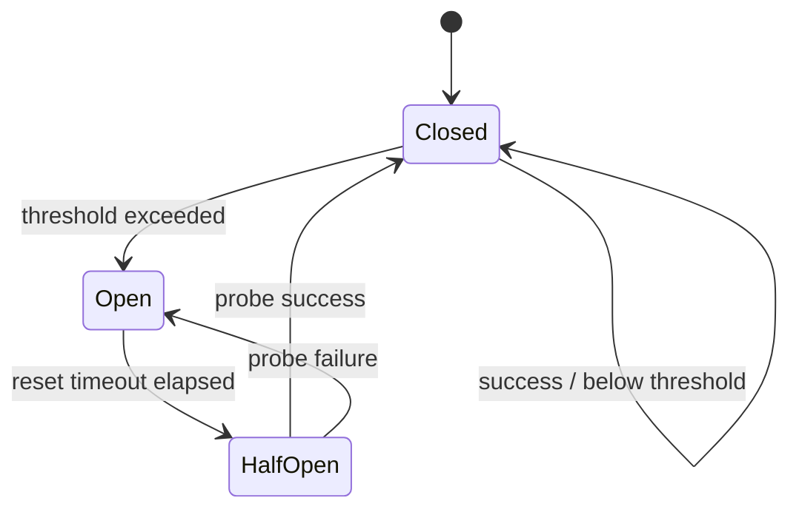
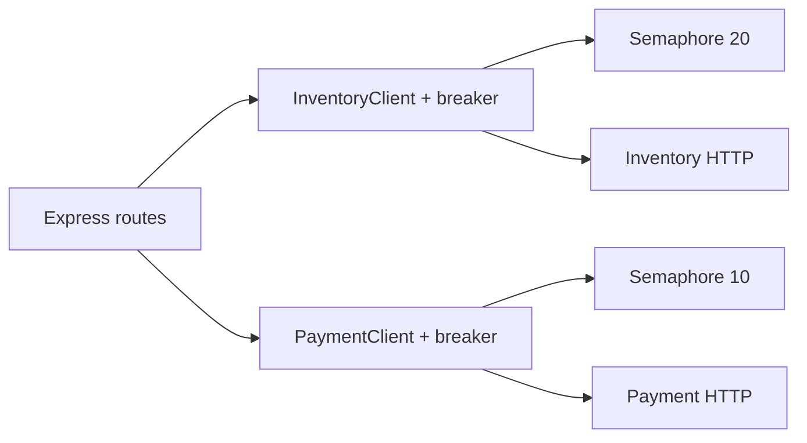
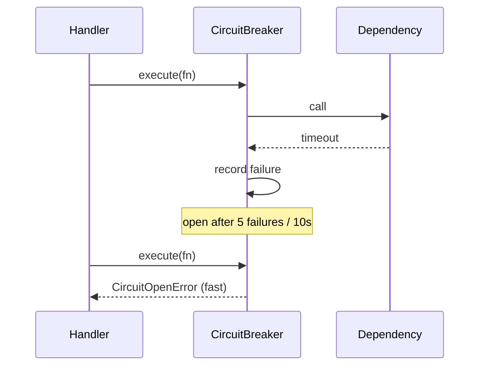

# Circuit Breakers and Bulkheads

## Overview

A **circuit breaker** stops calling a failing dependency after error rate or latency exceeds thresholds—**open** circuit fails fast instead of piling timeouts. After a cooling period it **half-opens** to probe recovery. **Bulkheads** isolate resource pools (connection limits, semaphores, separate thread/worker pools) so one slow dependency cannot exhaust capacity for the entire service. Together they implement **failure containment** at the application layer—distinct from multi-region design in [[09-System-Design/07-Multi-Region-and-Geo/Multi-Region Active-Passive Active-Active Patterns|Multi-Region Active-Passive Active-Active Patterns]].

## Learning Objectives

- Implement a three-state circuit breaker (closed, open, half-open) with sliding windows
- Choose metrics: error ratio, consecutive failures, slow call rate
- Apply bulkheads via semaphores and separate HTTP agents per dependency
- Expose breaker state in metrics and health/readiness decisions
- Integrate breakers with retries without fighting each other

## Prerequisites

- [[07-Backend/06-Reliability-and-Abuse-Resistance/Retries Jitter and Idempotent Handlers|Retries Jitter and Idempotent Handlers]]
- [[07-Backend/06-Reliability-and-Abuse-Resistance/Timeouts Cancellation and Deadlines|Timeouts Cancellation and Deadlines]]
- [[07-Backend/02-Frameworks-and-Middleware/Dependency Injection for Services|Dependency Injection for Services]]

## Difficulty

`advanced`

## Estimated Time

- Reading: 2.5 hours
- Exercises: 4 hours
- Mini project: 6 hours

## History

Michael Nygard's *Release It!* (2007) named circuit breakers after electrical analogs. Netflix Hystrix popularized JVM bulkheads; Node services adapted lighter in-process implementations (opossum, cockatiel) as microservices grew.

## Problem It Solves

- **Cascading failure** when dependency latency consumes all event loop time
- **Retry amplification** into recovering services
- **Pool exhaustion**—one bad DB query pattern blocks all routes
- **Slow burn** outages where partial errors hide until total collapse

## Internal Implementation



Bulkhead: limit **concurrent in-flight** calls per dependency name; queue or reject excess immediately.

## Mermaid Diagrams

### Structure



### Sequence / Lifecycle



## Examples

### Minimal Example

```typescript
type State = 'closed' | 'open' | 'half_open';

export class CircuitBreaker {
  private state: State = 'closed';
  private failures = 0;
  private openedAt = 0;

  constructor(
    private readonly failureThreshold: number,
    private readonly resetMs: number,
  ) {}

  async execute<T>(fn: () => Promise<T>): Promise<T> {
    if (this.state === 'open') {
      if (Date.now() - this.openedAt >= this.resetMs) {
        this.state = 'half_open';
      } else {
        throw new Error('circuit_open');
      }
    }
    try {
      const result = await fn();
      this.onSuccess();
      return result;
    } catch (err) {
      this.onFailure();
      throw err;
    }
  }

  private onSuccess(): void {
    this.failures = 0;
    this.state = 'closed';
  }

  private onFailure(): void {
    this.failures++;
    if (this.failures >= this.failureThreshold) {
      this.state = 'open';
      this.openedAt = Date.now();
    }
  }
}
```

### Production-Shaped Example

```typescript
import express from 'express';

class Semaphore {
  private active = 0;
  private queue: Array<() => void> = [];

  constructor(private readonly max: number) {}

  async acquire(): Promise<() => void> {
    if (this.active < this.max) {
      this.active++;
      return () => this.release();
    }
    await new Promise<void>((resolve) => this.queue.push(resolve));
    this.active++;
    return () => this.release();
  }

  private release(): void {
    this.active--;
    const next = this.queue.shift();
    if (next) next();
  }
}

const inventoryBreaker = new CircuitBreaker(5, 30_000);
const inventoryBulkhead = new Semaphore(25);

async function callInventory(path: string): Promise<unknown> {
  const release = await inventoryBulkhead.acquire();
  try {
    return await inventoryBreaker.execute(async () => {
      const res = await fetch(`https://inventory.internal${path}`, {
        signal: AbortSignal.timeout(3_000),
      });
      if (!res.ok) throw Object.assign(new Error('inventory_error'), { status: res.status });
      return res.json();
    });
  } finally {
    release();
  }
}

const app = express();

app.get('/products/:id', async (req, res, next) => {
  try {
    const product = await callInventory(`/products/${req.params.id}`);
    res.json(product);
  } catch (err) {
    if (err instanceof Error && err.message === 'circuit_open') {
      res.status(503).type('application/problem+json').json({
        type: 'https://api.example.com/problems/dependency-unavailable',
        title: 'Inventory temporarily unavailable',
        status: 503,
      });
      return;
    }
    next(err);
  }
});
```

Export `circuit_state{dependency="inventory"}` gauge; flip readiness only if **critical** dependency breaker open ([[07-Backend/10-Production-Services/Health Dependencies and Readiness Semantics|Health Dependencies and Readiness Semantics]]).

Do **not** retry when circuit is open—fail fast to caller.

## Trade-offs

| Dimension | Upside | Downside | When it matters |
| --- | --- | --- | --- |
| Aggressive thresholds | Fast protection | False opens on noise | Flaky third parties |
| Lenient thresholds | Fewer degraded responses | Late containment | Internal stable deps |
| Per-route bulkheads | Fine isolation | Many knobs | Large monoliths |
| Shared pool | Simple | Cross-dependency interference | Small services |

### When to Use

- Every critical outbound dependency with shared failure modes
- Routes mixing fast reads and slow external aggregations
- Protecting connection pools during dependency brownouts

### When Not to Use

- As substitute for fixing root cause
- On idempotent background jobs with unbounded retry queues (use rate limits instead)
- When half-open probes need auth that differs from normal traffic—design probes carefully

## Exercises

1. Chaos-test: force 100% 503 from mock; measure time to open and recovery probe behavior.
2. Implement sliding-window failure rate instead of consecutive counter.
3. Demonstrate bulkhead: 30 slow calls block only inventory routes, not health check.

## Mini Project

Add breaker + bulkhead layer to [[07-Backend/projects/API Contract and Reliability Harness/README|API Contract and Reliability Harness]].

## Portfolio Project

Resilience module in [[07-Backend/projects/Backend Service Toolkit/README|Backend Service Toolkit]].

## Interview Questions

1. Closed vs half-open vs open—what triggers each transition?
2. How do circuit breakers interact with retries?
3. Bulkhead vs rate limit—what problem does each solve?
4. Should readiness fail when a non-critical dependency breaker opens?

### Stretch / Staff-Level

1. Compare in-process breakers vs service mesh outlier detection ([[16-DevOps/README|DevOps]] sidecar).

## Common Mistakes

- Opening circuit on 404 business errors
- Retrying through open circuit
- No half-open probe limit (single success closes too eagerly)
- One global semaphore for all dependencies
- Hiding breaker state from operators

## Best Practices

- Name breakers per dependency + operation
- Log state transitions with counters
- Return 503 with clear problem type—not 500
- Tune with production error budgets ([[07-Backend/09-API-Observability-and-Testing/RED Metrics and SLIs for APIs|RED Metrics and SLIs for APIs]])
- Document degraded mode behavior for product

## Summary

Circuit breakers **fail fast** when dependencies are unhealthy; bulkheads **cap concurrency** so failures stay local. Implement state machines with half-open probes, pair with timeouts, disable retries when open, and expose state for ops and readiness policy.

## Further Reading

- Michael Nygard, *Release It!* — Stability patterns
- [[09-System-Design/09-Failure-Modes-at-Product-Scale/Cascading Multi-Service Failure|Cascading Multi-Service Failure]] — cascading failure at scale

## Related Notes

- [[07-Backend/06-Reliability-and-Abuse-Resistance/Retries Jitter and Idempotent Handlers|Retries Jitter and Idempotent Handlers]]
- [[07-Backend/06-Reliability-and-Abuse-Resistance/Rate Limiting and Quotas|Rate Limiting and Quotas]]
- [[07-Backend/09-API-Observability-and-Testing/Chaos and Failure Injection at the Service Edge|Chaos and Failure Injection at the Service Edge]]
- [[07-Backend/10-Production-Services/Health Dependencies and Readiness Semantics|Health Dependencies and Readiness Semantics]]
- [[09-System-Design/README|System Design]]

## Progress Checklist

- [ ] Explained from first principles
- [ ] Drew at least one Mermaid diagram
- [ ] Implemented a minimal version
- [ ] Documented trade-offs and non-goals
- [ ] Completed exercises
- [ ] Practiced interview questions aloud
- [ ] Linked prerequisites and dependents
