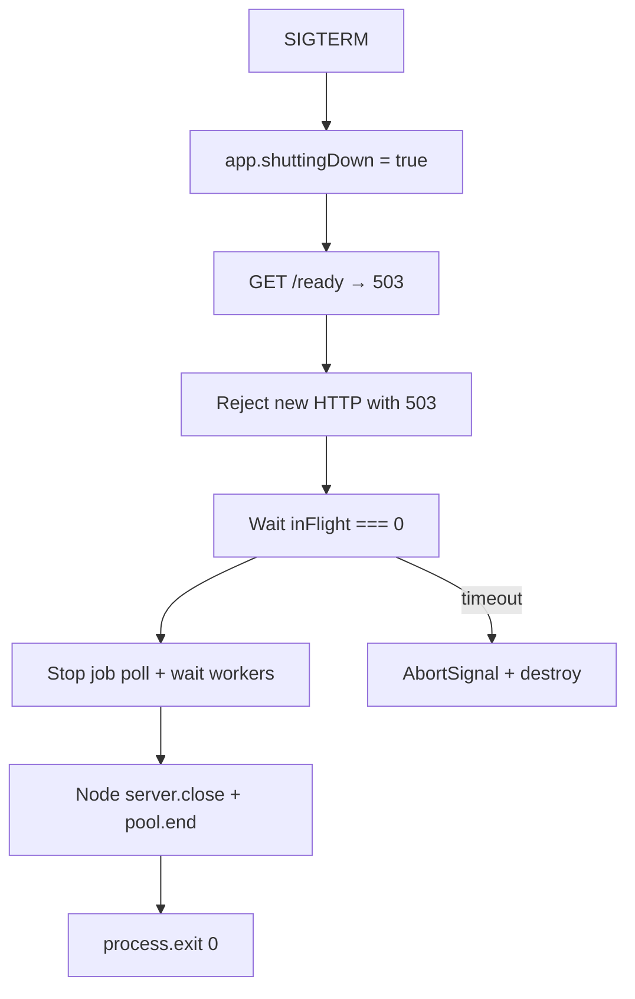
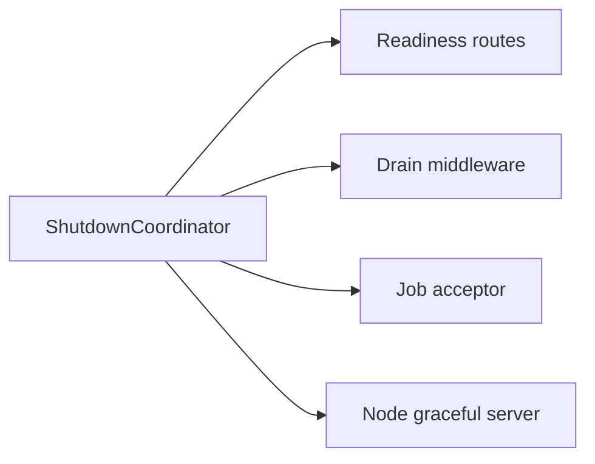
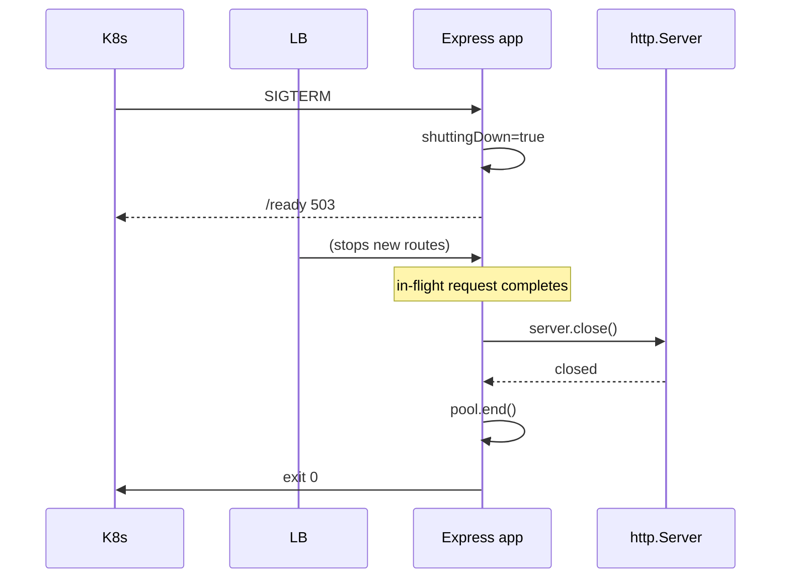

# Graceful Request Drain Above Process Shutdown

## Overview

**Node** owns SIGTERM, `server.close()`, and connection tracking ([[06-NodeJS/10-Production-Node/Graceful Shutdown and Drain|Graceful Shutdown and Drain]]). The **backend product layer** owns what happens *above* that: flip **readiness** so load balancers stop sending traffic, reject **new HTTP work** with 503, finish **in-flight Express requests**, drain **background job acceptors**, and coordinate **dependency-heavy handlers** (long transactions, SSE). This note bridges Express application semantics to orchestrator rolling deploys in [[16-DevOps/README|DevOps]] and LB health/drain contracts in [[09-System-Design/02-Load-Balancing-and-Edge-Entry/Health Checks Drain and Connection Management|Health Checks Drain and Connection Management]].

## Learning Objectives

- Implement application-level `shuttingDown` gate in Express middleware
- Order shutdown: readiness fail → stop new jobs → drain HTTP → close pools
- Return 503 with `Connection: close` during drain window
- Track in-flight request count and align with Node grace period
- Test deploy behavior with integration tests and synthetic LB

## Prerequisites

- [[06-NodeJS/10-Production-Node/Graceful Shutdown and Drain|Graceful Shutdown and Drain]]
- [[07-Backend/02-Frameworks-and-Middleware/Express Application and Router Internals|Express Application and Router Internals]]
- [[07-Backend/10-Production-Services/Health Dependencies and Readiness Semantics|Health Dependencies and Readiness Semantics]]

## Difficulty

`advanced`

## Estimated Time

- Reading: 2 hours
- Exercises: 3 hours
- Mini project: 6 hours ([[06-NodeJS/projects/Graceful Shutdown Harness/README|Graceful Shutdown Harness]])

## History

Zero-downtime deploys required splitting **liveness** (process up) from **readiness** (accept traffic). Express apps often only called `process.exit` on SIGTERM—missing product-level drain until Kubernetes `preStop` hooks forced the issue.

## Problem It Solves

- **502 during deploy** when LB still routes to draining pod
- **Half-written business transactions** aborted mid-handler
- **Job double-processing** when worker stops between ack and finish
- **Race** between new requests and `server.close()`

## Internal Implementation



Backend layer increments `inFlight` on request entry, decrements on `finish`/`close`.

## Mermaid Diagrams

### Structure



### Sequence / Lifecycle



## Examples

### Minimal Example

```typescript
import express from 'express';

let shuttingDown = false;
let inFlight = 0;

const app = express();

app.use((req, res, next) => {
  if (shuttingDown) {
    res.status(503).set('Connection', 'close').json({ error: 'shutting_down' });
    return;
  }
  inFlight++;
  res.on('finish', () => { inFlight--; });
  res.on('close', () => { inFlight--; });
  next();
});

app.get('/ready', (_req, res) => {
  if (shuttingDown) {
    res.status(503).json({ ready: false });
    return;
  }
  res.json({ ready: true });
});
```

### Production-Shaped Example

```typescript
import express from 'express';
import http from 'node:http';

export function createAppWithDrain() {
  const state = { shuttingDown: false, inFlight: 0 };
  const app = express();

  app.use((req, res, next) => {
    if (state.shuttingDown) {
      res.status(503).set('Connection', 'close').type('application/problem+json').json({
        type: 'https://api.example.com/problems/shutting-down',
        title: 'Service draining',
        status: 503,
      });
      return;
    }
    state.inFlight++;
    let counted = true;
    const dec = () => {
      if (counted) {
        counted = false;
        state.inFlight--;
      }
    };
    res.on('finish', dec);
    res.on('close', dec);
    next();
  });

  app.get('/health/live', (_req, res) => res.json({ live: true }));
  app.get('/health/ready', (_req, res) => {
    if (state.shuttingDown) {
      res.status(503).json({ ready: false, reason: 'draining' });
      return;
    }
    res.json({ ready: true });
  });

  const server = http.createServer(app);

  async function shutdown(opts: { graceMs: number }): Promise<void> {
    if (state.shuttingDown) return;
    state.shuttingDown = true;

    const deadline = Date.now() + opts.graceMs;
    while (state.inFlight > 0 && Date.now() < deadline) {
      await new Promise((r) => setTimeout(r, 100));
    }

    await new Promise<void>((resolve) => server.close(() => resolve()));
    // await jobWorker.stop(); await dbPool.end();
  }

  process.once('SIGTERM', () => {
    void shutdown({ graceMs: 25_000 }).then(() => process.exit(0));
  });

  return { app, server, shutdown, state };
}
```

Abort long handlers via request-scoped `AbortSignal` linked to shutdown ([[07-Backend/06-Reliability-and-Abuse-Resistance/Timeouts Cancellation and Deadlines|Timeouts Cancellation and Deadlines]]). SSE/WebSocket need explicit subscriber drain.

## Trade-offs

| Dimension | Upside | Downside | When it matters |
| --- | --- | --- | --- |
| Long grace | Fewer user errors | Slow deploys | p99 handler latency |
| Short grace | Fast rollouts | Truncated work | Idempotent reads |
| 503 on new requests | Clear signal | Clients must retry | Public APIs |
| Silent queue during drain | Smooth UX | Hidden backlog | Internal queues |

### When to Use

- All production HTTP services behind LB/orchestrator
- Services with job workers in same process
- Handlers exceeding a few seconds

### When Not to Use

- Stateless CLI tools—Node immediate exit suffices
- When platform `terminationGracePeriodSeconds` cannot be increased to match p99 work

## Exercises

1. SIGTERM during 8s handler with 10s grace—verify 200 completion and zero new 200s after flag.
2. Integration test: `/ready` 503 before last in-flight completes.
3. Compare drain with and without `Connection: close` on 503.

## Mini Project

Layer Express drain on [[06-NodeJS/projects/Graceful Shutdown Harness/README|Graceful Shutdown Harness]].

## Portfolio Project

Shutdown contract ADR in [[07-Backend/projects/Backend Service Toolkit/README|Backend Service Toolkit]].

## Interview Questions

1. What runs first—readiness 503 or `server.close()`?
2. How do you drain in-flight work if handler ignores AbortSignal?
3. Difference between Node drain and backend product drain?
4. How should clients behave on 503 during deploy?

### Stretch / Staff-Level

1. Design drain for canary deploy where old and new versions share LB pool briefly.

## Common Mistakes

- Only closing server without readiness flip (LB still sends traffic)
- Double-decrement in-flight on `finish` + custom middleware
- Draining HTTP but leaving job poller active
- Grace shorter than LB deregistration delay + p99 request
- Returning 500 instead of 503 during intentional drain

## Best Practices

- Single shutdown coordinator ([[06-NodeJS/10-Production-Node/Graceful Shutdown and Drain|Graceful Shutdown and Drain]])
- Document client retry policy for 503 + shutting-down problem type
- Metrics: `in_flight_requests`, `drain_duration_ms`
- Integration test SIGTERM path in CI
- Align with [[07-Backend/07-Caching-Jobs-and-Messaging/Background Jobs and Workers|Background Jobs and Workers]] stop semantics

## Summary

Backend **graceful drain** stops new product work, completes in-flight HTTP handlers, then delegates to Node **`server.close()`** and resource teardown. Flip readiness first, gate Express middleware, track in-flight count, respect platform grace, and test deploy paths—this is the product layer above the Node host shutdown contract.

## Further Reading

- [[06-NodeJS/10-Production-Node/Graceful Shutdown and Drain|Graceful Shutdown and Drain]]
- [[16-DevOps/README|DevOps]] — rolling updates and preStop hooks

## Related Notes

- [[07-Backend/10-Production-Services/Health Dependencies and Readiness Semantics|Health Dependencies and Readiness Semantics]]
- [[07-Backend/10-Production-Services/Deployment Topologies for Single Services|Deployment Topologies for Single Services]]
- [[07-Backend/06-Reliability-and-Abuse-Resistance/Timeouts Cancellation and Deadlines|Timeouts Cancellation and Deadlines]]
- [[06-NodeJS/10-Production-Node/Graceful Shutdown and Drain|Graceful Shutdown and Drain]]
- [[16-DevOps/README|DevOps]]

## Progress Checklist

- [ ] Explained from first principles
- [ ] Drew at least one Mermaid diagram
- [ ] Implemented a minimal version
- [ ] Documented trade-offs and non-goals
- [ ] Completed exercises
- [ ] Practiced interview questions aloud
- [ ] Linked prerequisites and dependents
