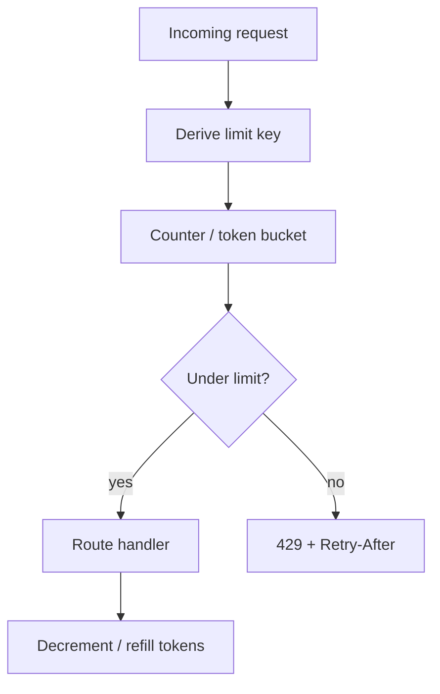
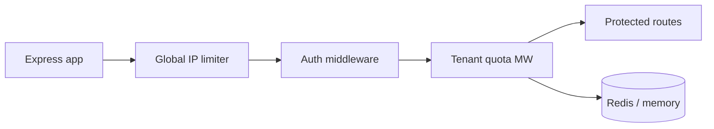
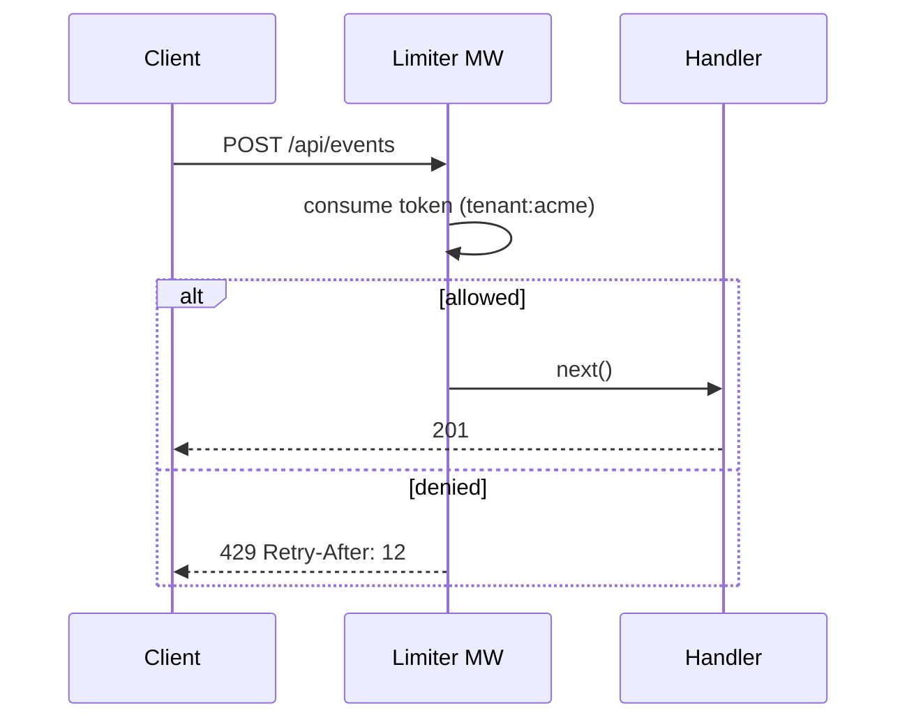

# Rate Limiting and Quotas

## Overview

**Rate limiting** caps how many requests a client, user, tenant, or IP may execute in a time window—protecting capacity and cost. **Quotas** are longer-horizon budgets (daily API calls, storage units, export rows) often tied to billing tiers. Express middleware applies limits **before** expensive handler work. Responses use **429 Too Many Requests** with **Retry-After** and optional **RateLimit-\*** headers (draft RFC 9110 patterns). Distributed limits require shared state—application pattern here; Redis engine details live in [[08-Databases/README|Databases]].

## Learning Objectives

- Implement token bucket and fixed/sliding window limiters in middleware
- Key limits by IP, API key, user ID, and tenant with different policies
- Return 429 with Retry-After and structured problem details
- Distinguish burst limits from sustained quotas and concurrency caps
- Design fail-open vs fail-closed when limiter store is unavailable

## Prerequisites

- [[07-Backend/05-Authorization-and-Tenancy/Multi-Tenant Isolation at the App Boundary|Multi-Tenant Isolation at the App Boundary]]
- [[07-Backend/02-Frameworks-and-Middleware/Middleware Pipeline and Error Middleware|Middleware Pipeline and Error Middleware]]
- [[07-Backend/01-HTTP-APIs-and-Contracts/Status Codes as Product Policy|Status Codes as Product Policy]]

## Difficulty

`intermediate`

## Estimated Time

- Reading: 2 hours
- Exercises: 3 hours
- Mini project: 4 hours

## History

Early APIs used crude per-IP counters in nginx. Twitter/Facebook API tiers popularized **quota + rate limit** documentation. Token bucket (teletraffic theory) became standard for allowing controlled bursts.

## Problem It Solves

- **Credential stuffing** and scraping abuse
- **Noisy neighbor** tenants exhausting shared DB
- **Cost runaway** on metered third-party APIs
- **Accidental loops** in client integrations

## Internal Implementation



Token bucket: tokens refill at rate `r`, bucket capacity `B`—allows bursts up to B while averaging r/sec.

## Mermaid Diagrams

### Structure



### Sequence / Lifecycle



## Examples

### Minimal Example

```typescript
import express, { type RequestHandler } from 'express';

interface Bucket {
  tokens: number;
  lastRefill: number;
}

const buckets = new Map<string, Bucket>();

function tokenBucketLimiter(opts: {
  capacity: number;
  refillPerSec: number;
  keyFn: (req: express.Request) => string;
}): RequestHandler {
  return (req, res, next) => {
    const key = opts.keyFn(req);
    const now = Date.now();
    let bucket = buckets.get(key);
    if (!bucket) {
      bucket = { tokens: opts.capacity, lastRefill: now };
      buckets.set(key, bucket);
    }
    const elapsed = (now - bucket.lastRefill) / 1000;
    bucket.tokens = Math.min(opts.capacity, bucket.tokens + elapsed * opts.refillPerSec);
    bucket.lastRefill = now;

    if (bucket.tokens < 1) {
      const retrySec = Math.ceil((1 - bucket.tokens) / opts.refillPerSec);
      res.set('Retry-After', String(retrySec));
      res.status(429).json({ error: 'rate_limit_exceeded' });
      return;
    }
    bucket.tokens -= 1;
    next();
  };
}

const app = express();
app.use(tokenBucketLimiter({
  capacity: 20,
  refillPerSec: 5,
  keyFn: (req) => req.ip ?? 'unknown',
}));
```

### Production-Shaped Example

```typescript
import express from 'express';

interface QuotaPolicy {
  burst: number;
  sustainedPerMinute: number;
  dailyCap?: number;
}

const tenantPolicies: Record<string, QuotaPolicy> = {
  free: { burst: 10, sustainedPerMinute: 60, dailyCap: 5_000 },
  pro: { burst: 100, sustainedPerMinute: 1_000, dailyCap: 500_000 },
};

app.use(async (req, res, next) => {
  const tenantId = req.header('X-Tenant-Id') ?? 'anonymous';
  const tier = req.header('X-Tenant-Tier') ?? 'free';
  const policy = tenantPolicies[tier] ?? tenantPolicies.free;

  const allowed = await distributedLimiter.check({
    keys: [`rl:${tenantId}:minute`, `rl:${tenantId}:day`],
    limits: [policy.sustainedPerMinute, policy.dailyCap ?? Number.MAX_SAFE_INTEGER],
    windowSec: [60, 86_400],
  });

  if (!allowed.ok) {
    res.set('Retry-After', String(allowed.retryAfterSec));
    res.status(429).type('application/problem+json').json({
      type: 'https://api.example.com/problems/rate-limited',
      title: 'Rate limit exceeded',
      status: 429,
      tenant: tenantId,
      limit: allowed.limitName,
    });
    return;
  }
  res.set('RateLimit-Limit', String(policy.sustainedPerMinute));
  res.set('RateLimit-Remaining', String(allowed.remaining));
  next();
});

// Stub — production uses Redis INCR + EXPIRE or sliding window Lua
const distributedLimiter = {
  async check(_opts: unknown): Promise<{ ok: boolean; retryAfterSec: number; remaining: number; limitName: string }> {
    return { ok: true, retryAfterSec: 0, remaining: 59, limitName: 'minute' };
  },
};
```

Place expensive routes behind stricter limits; exempt health checks ([[07-Backend/10-Production-Services/Health Dependencies and Readiness Semantics|Health Dependencies and Readiness Semantics]]). Coordinate with [[07-Backend/06-Reliability-and-Abuse-Resistance/Circuit Breakers and Bulkheads|Circuit Breakers and Bulkheads]]—limits protect your service; breakers protect from dependencies.

## Trade-offs

| Dimension | Upside | Downside | When it matters |
| --- | --- | --- | --- |
| In-memory limiter | Fast, simple | Wrong per instance behind LB | Dev / single instance |
| Redis-backed | Accurate global | Dependency + latency | Production clusters |
| Fail-open on store down | Availability | Abuse window | Internal APIs |
| Fail-closed | Safety | Outage amplification | Public paid APIs |

### When to Use

- All public and partner APIs
- Auth endpoints (login, token refresh)
- Expensive operations (exports, search)

### When Not to Use

- As only defense against DDoS—edge/WAF in [[16-DevOps/README|DevOps]] / [[18-Security/README|Security]]
- Uniform limits ignoring tenant tier without product reason

## Exercises

1. Implement sliding window with circular buffer; compare burst behavior to token bucket.
2. Load-test 4 Node instances with in-memory vs Redis limiter; measure over-admission.
3. Design quota headers documented in OpenAPI for tier `pro`.

## Mini Project

Token-bucket middleware in [[07-Backend/projects/Backend Service Toolkit/README|Backend Service Toolkit]] code labs.

## Portfolio Project

Rate limit + quota policy in [[07-Backend/projects/Authentication Server/README|Authentication Server]].

## Interview Questions

1. Token bucket vs leaky bucket vs fixed window?
2. How do you rate limit behind NAT (many users, one IP)?
3. 429 vs 503 when overloaded—product difference?
4. Fail-open or fail-closed when Redis is down?

### Stretch / Staff-Level

1. Design global rate limits across regions without central Redis becoming SPOF.

## Common Mistakes

- Limiting after auth DB lookup (attackers still hammer DB)
- No Retry-After header
- Same limit for read and write endpoints
- Forgetting to rate limit webhooks and admin routes
- Per-instance limits with 10 replicas → 10× effective quota

## Best Practices

- Apply limits early in middleware pipeline
- Key by authenticated principal when available
- Log `limit_key`, `policy`, `remaining` at debug
- Document limits in developer portal
- Separate burst from daily quota in metrics

## Summary

Rate limits and quotas are **capacity and abuse contracts** at the HTTP edge. Implement token bucket or window counters in Express middleware, key by tenant/user, return **429** with **Retry-After**, use distributed store in production, and choose fail-open/closed explicitly.

## Further Reading

- [[08-Databases/README|Databases]] — Redis counter patterns
- [IETF RateLimit header fields draft](https://datatracker.ietf.org/doc/html/draft-ietf-httpapi-ratelimit-headers)

## Related Notes

- [[07-Backend/06-Reliability-and-Abuse-Resistance/Circuit Breakers and Bulkheads|Circuit Breakers and Bulkheads]]
- [[07-Backend/06-Reliability-and-Abuse-Resistance/CORS Security Headers and Browser Boundaries|CORS Security Headers and Browser Boundaries]]
- [[07-Backend/05-Authorization-and-Tenancy/Multi-Tenant Isolation at the App Boundary|Multi-Tenant Isolation at the App Boundary]]
- [[18-Security/README|Security]]
- [[08-Databases/README|Databases]]

## Progress Checklist

- [ ] Explained from first principles
- [ ] Drew at least one Mermaid diagram
- [ ] Implemented a minimal version
- [ ] Documented trade-offs and non-goals
- [ ] Completed exercises
- [ ] Practiced interview questions aloud
- [ ] Linked prerequisites and dependents
