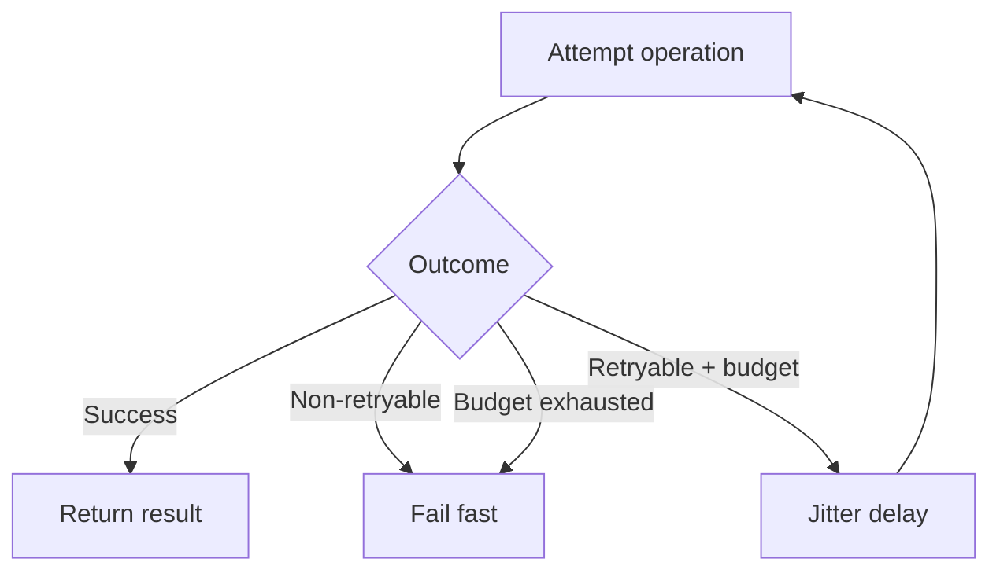
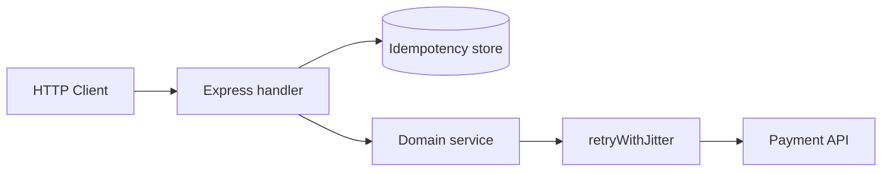
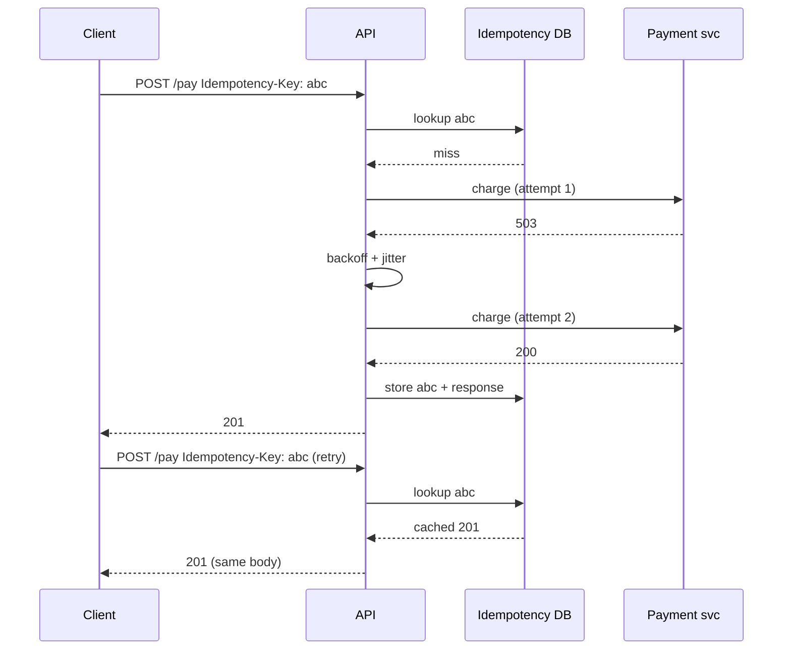

# Retries Jitter and Idempotent Handlers

## Overview

**Retries** re-execute failed operations when failure might be transient—network blips, 503 responses, connection resets. Ungoverned retries **amplify outages** (retry storms). **Jitter** randomizes delay between attempts so many clients do not retry in sync. **Idempotent handlers** guarantee that repeating the same logical request produces the same outcome—essential for POST payments, order creation, and webhook delivery. Backend services must classify errors (retryable vs not), cap attempts, respect deadlines, and store idempotency keys at the application boundary.

## Learning Objectives

- Classify HTTP and application errors into retryable vs terminal buckets
- Implement exponential backoff with full jitter and max attempt budgets
- Design idempotent POST handlers with key storage and response replay
- Prevent retry loops across synchronous client, middleware, and async workers
- Coordinate with [[07-Backend/06-Reliability-and-Abuse-Resistance/Circuit Breakers and Bulkheads|Circuit Breakers and Bulkheads]]

## Prerequisites

- [[07-Backend/06-Reliability-and-Abuse-Resistance/Timeouts Cancellation and Deadlines|Timeouts Cancellation and Deadlines]]
- [[07-Backend/01-HTTP-APIs-and-Contracts/Idempotency Keys and Safe Retries|Idempotency Keys and Safe Retries]]
- [[07-Backend/03-Validation-Errors-and-Versioning/Problem Details and Error Envelopes|Problem Details and Error Envelopes]]

## Difficulty

`intermediate`

## Estimated Time

- Reading: 2 hours
- Exercises: 3 hours
- Mini project: 5 hours

## History

Telecom systems used exponential backoff for link recovery. AWS popularized **full jitter** (2015 architecture blog). Stripe and payment APIs codified **Idempotency-Key** headers. HTTP idempotency of methods (GET/PUT/DELETE) is necessary but insufficient for application semantics.

## Problem It Solves

- **Thundering herd** after brief dependency recovery
- **Double charges** when clients retry POST without idempotency
- **Infinite retry** on 400-class logic errors
- **Latency piles** when retries ignore parent deadline

## Internal Implementation



Retryable typically: 408, 429 (with Retry-After), 502, 503, 504, connection errors. Not retryable: 400, 401, 403, 404, 409 (unless conflict resolution defined), most 422.

Idempotency store: `(key, route, body_hash) → { status, response_body, created_at }` with TTL.

## Mermaid Diagrams

### Structure



### Sequence / Lifecycle



## Examples

### Minimal Example

```typescript
function sleep(ms: number): Promise<void> {
  return new Promise((r) => setTimeout(r, ms));
}

function fullJitterDelay(attempt: number, baseMs: number, capMs: number): number {
  const exp = Math.min(capMs, baseMs * 2 ** attempt);
  return Math.floor(Math.random() * exp);
}

export async function retryWithJitter<T>(
  fn: () => Promise<T>,
  opts: { maxAttempts: number; baseMs: number; capMs: number; isRetryable: (err: unknown) => boolean },
): Promise<T> {
  let lastErr: unknown;
  for (let attempt = 0; attempt < opts.maxAttempts; attempt++) {
    try {
      return await fn();
    } catch (err) {
      lastErr = err;
      if (!opts.isRetryable(err) || attempt === opts.maxAttempts - 1) throw err;
      await sleep(fullJitterDelay(attempt, opts.baseMs, opts.capMs));
    }
  }
  throw lastErr;
}
```

### Production-Shaped Example

```typescript
import express, { type Request, type Response, type NextFunction } from 'express';
import crypto from 'node:crypto';

interface IdempotencyRecord {
  statusCode: number;
  body: unknown;
  requestHash: string;
}

const idempotencyStore = new Map<string, IdempotencyRecord>();

function hashBody(body: unknown): string {
  return crypto.createHash('sha256').update(JSON.stringify(body)).digest('hex');
}

async function idempotencyMiddleware(req: Request, res: Response, next: NextFunction) {
  const key = req.header('Idempotency-Key');
  if (!key || req.method !== 'POST') return next();

  const composite = `${req.path}:${key}`;
  const existing = idempotencyStore.get(composite);
  const bodyHash = hashBody(req.body);

  if (existing) {
    if (existing.requestHash !== bodyHash) {
      res.status(422).json({ error: 'idempotency_key_reused_with_different_body' });
      return;
    }
    res.status(existing.statusCode).json(existing.body);
    return;
  }

  const originalJson = res.json.bind(res);
  res.json = (body: unknown) => {
    idempotencyStore.set(composite, {
      statusCode: res.statusCode || 200,
      body,
      requestHash: bodyHash,
    });
    return originalJson(body);
  };
  next();
}

const app = express();
app.use(express.json());
app.use(idempotencyMiddleware);

app.post('/transfers', async (req, res, next) => {
  try {
    const result = await retryWithJitter(
      () => chargeExternal(req.body),
      {
        maxAttempts: 3,
        baseMs: 200,
        capMs: 5_000,
        isRetryable: (err) => isRetryableHttpError(err),
      },
    );
    res.status(201).json(result);
  } catch (err) {
    next(err);
  }
});

function isRetryableHttpError(err: unknown): boolean {
  const status = (err as { status?: number }).status;
  return status === 408 || status === 429 || status === 502 || status === 503 || status === 504;
}
```

Production stores use Redis or Postgres with TTL; workers use [[07-Backend/07-Caching-Jobs-and-Messaging/Transactional Outbox and Inbox Patterns|Transactional Outbox and Inbox Patterns]] for at-least-once delivery with idempotent consumers.

## Trade-offs

| Dimension | Upside | Downside | When it matters |
| --- | --- | --- | --- |
| More retries | Higher success on blips | Amplifies overload | Dependency at capacity |
| Idempotency store | Safe client retries | Storage + conflict rules | Payments, inventory |
| Sync retries in handler | Simple | Blocks request thread | Short downstream calls only |
| Async retry queue | Decouples latency | Complexity | Webhooks, email |

### When to Use

- Outbound calls to unreliable third parties
- Client-facing POST with network failure risk
- Message consumers with at-least-once delivery

### When Not to Use

- Non-idempotent side effects without key storage
- When circuit is open ([[07-Backend/06-Reliability-and-Abuse-Resistance/Circuit Breakers and Bulkheads|Circuit Breakers and Bulkheads]])
- Errors that will never succeed on repeat (validation)

## Exercises

1. Simulate 503 from mock dependency; plot retry timing with and without jitter.
2. Implement idempotency middleware with body-hash mismatch → 422.
3. Write test proving third identical POST returns cached response without double side effect.

## Mini Project

Extend [[07-Backend/projects/URL Shortener API/README|URL Shortener API]] with idempotent create and outbound retry helper.

## Portfolio Project

Reliability utilities in [[07-Backend/projects/Backend Service Toolkit/README|Backend Service Toolkit]].

## Interview Questions

1. Why is PUT idempotent at HTTP level but POST might not be at application level?
2. What is full jitter vs equal jitter?
3. Should you retry 429? What about Retry-After?
4. How do idempotency keys interact with partial failures (charged but DB write failed)?

### Stretch / Staff-Level

1. Design idempotency across multi-step sagas with outbox and inbox deduplication.

## Common Mistakes

- Retrying 500 without distinguishing app bug vs overload
- No max attempts or deadline coupling
- Idempotency key scoped globally instead of per-route/user
- Retrying in both client SDK and server middleware
- Storing idempotency forever without TTL

## Best Practices

- Document retry policy in OpenAPI ([[07-Backend/01-HTTP-APIs-and-Contracts/OpenAPI as Executable Contract|OpenAPI as Executable Contract]])
- Use `Idempotency-Key` header convention
- Fail open on idempotency store outage only if business allows—usually fail closed
- Log `attempt`, `delay_ms`, `retry_reason`
- Pair with [[07-Backend/06-Reliability-and-Abuse-Resistance/Rate Limiting and Quotas|Rate Limiting and Quotas]] on ingress

## Summary

Retries recover from **transient** failures; jitter prevents synchronized load spikes. Application **idempotency** makes retries safe for non-idempotent HTTP methods. Classify errors, cap attempts, respect deadlines, persist idempotency keys, and never retry through an open circuit.

## Further Reading

- [[07-Backend/01-HTTP-APIs-and-Contracts/Idempotency Keys and Safe Retries|Idempotency Keys and Safe Retries]]
- [AWS Exponential Backoff And Jitter](https://aws.amazon.com/blogs/architecture/exponential-backoff-and-jitter/)

## Related Notes

- [[07-Backend/06-Reliability-and-Abuse-Resistance/Timeouts Cancellation and Deadlines|Timeouts Cancellation and Deadlines]]
- [[07-Backend/06-Reliability-and-Abuse-Resistance/Circuit Breakers and Bulkheads|Circuit Breakers and Bulkheads]]
- [[07-Backend/07-Caching-Jobs-and-Messaging/Transactional Outbox and Inbox Patterns|Transactional Outbox and Inbox Patterns]]
- [[07-Backend/07-Caching-Jobs-and-Messaging/Message Queue Client Patterns|Message Queue Client Patterns]]
- [[09-System-Design/README|System Design]]

## Progress Checklist

- [ ] Explained from first principles
- [ ] Drew at least one Mermaid diagram
- [ ] Implemented a minimal version
- [ ] Documented trade-offs and non-goals
- [ ] Completed exercises
- [ ] Practiced interview questions aloud
- [ ] Linked prerequisites and dependents
