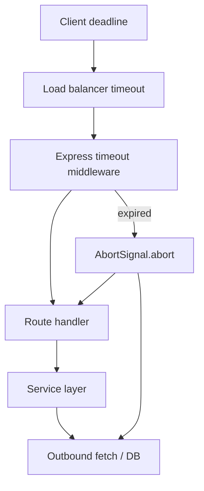
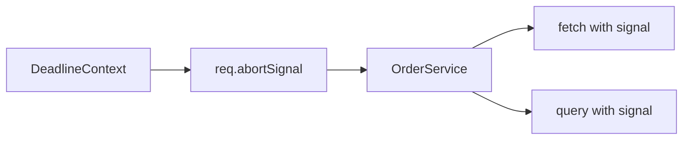
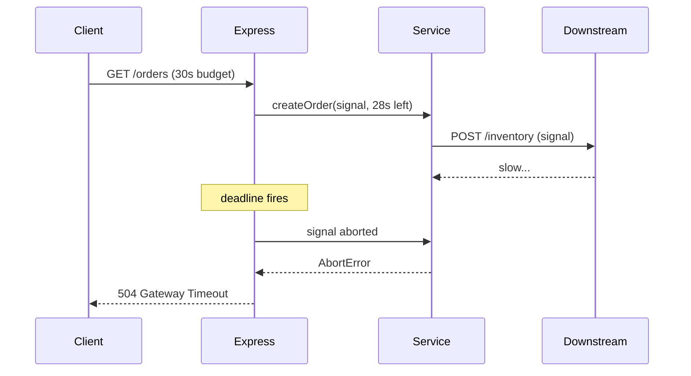

# Timeouts Cancellation and Deadlines

## Overview

**Timeouts** bound how long a backend service waits for work to complete—outbound HTTP calls, database queries, file I/O, or the entire request handler. **Cancellation** propagates an **AbortSignal** so in-flight work stops when a parent deadline expires. **Deadlines** are absolute cutoffs (wall-clock) shared across a call chain: if the client gave you 2 seconds, every downstream hop must respect the remaining budget. Without explicit timeouts, slow dependencies hold sockets, thread pool slots, and memory until the client disconnects—often silently.

## Learning Objectives

- Set server-side request timeouts distinct from client and load-balancer timeouts
- Propagate `AbortSignal` from Express middleware through service and outbound fetch
- Map timeout failures to product status codes (504 vs 503 vs 408)
- Compose nested deadlines without double-counting or orphan work
- Instrument timeout events for SLO and dependency attribution

## Prerequisites

- [[07-Backend/02-Frameworks-and-Middleware/Middleware Pipeline and Error Middleware|Middleware Pipeline and Error Middleware]]
- [[06-NodeJS/07-Timers-Events-and-IPC/AbortSignal Propagation Across Node APIs|AbortSignal Propagation Across Node APIs]]
- [[07-Backend/01-HTTP-APIs-and-Contracts/Status Codes as Product Policy|Status Codes as Product Policy]]

## Difficulty

`intermediate`

## Estimated Time

- Reading: 2 hours
- Exercises: 3 hours
- Mini project: 4 hours ([[07-Backend/projects/API Contract and Reliability Harness/README|API Contract and Reliability Harness]])

## History

Early CGI scripts relied on web server `TimeOut` directives. Microservices popularized **deadline propagation** (gRPC `context`, HTTP `Timeout`/`X-Request-Deadline` headers). Node's unified **AbortSignal** (WHATWG) replaced ad-hoc `clearTimeout` + boolean flags across fetch, streams, and many drivers.

## Problem It Solves

- **Hung handlers** tying up connection pools during dependency stalls
- **Retry storms** when upstream times out but downstream keeps working
- **Resource leaks** from orphaned promises after client disconnect
- **Ambiguous errors**—504 from LB vs 500 from app vs silent hang

## Internal Implementation



Timeout layers must nest: **inner** timeouts ≤ **remaining parent budget**. Use `AbortSignal.timeout(ms)` or link child signals to parent via `AbortSignal.any([parent, local])`.

Express does not cancel handlers automatically—middleware must call `next(err)` and pass `signal` to async work.

## Mermaid Diagrams

### Structure



### Sequence / Lifecycle



## Examples

### Minimal Example

```typescript
import express from 'express';

const app = express();

app.get('/slow', async (req, res) => {
  const ac = AbortSignal.timeout(5_000);
  try {
    const data = await fetch('https://api.example.com/data', { signal: ac });
    res.json(await data.json());
  } catch (err) {
    if (ac.aborted) {
      res.status(504).json({ error: 'upstream_timeout' });
      return;
    }
    throw err;
  }
});
```

### Production-Shaped Example

```typescript
import express, { type RequestHandler } from 'express';
import { AsyncLocalStorage } from 'node:async_hooks';

interface DeadlineStore {
  signal: AbortSignal;
  deadlineMs: number;
}

const deadlineAls = new AsyncLocalStorage<DeadlineStore>();

export function deadlineMiddleware(budgetMs: number): RequestHandler {
  return (req, res, next) => {
    const started = Date.now();
    const controller = new AbortController();
    const timer = setTimeout(() => {
      controller.abort(new Error('request_deadline_exceeded'));
    }, budgetMs);

    res.on('close', () => {
      if (!res.writableFinished) controller.abort(new Error('client_disconnected'));
    });

    const store: DeadlineStore = {
      signal: controller.signal,
      deadlineMs: started + budgetMs,
    };

    deadlineAls.run(store, () => {
      clearTimeout(timer);
      res.on('finish', () => clearTimeout(timer));
      next();
    });
  };
}

export function remainingMs(): number {
  const store = deadlineAls.getStore();
  if (!store) return 30_000;
  return Math.max(0, store.deadlineMs - Date.now());
}

export async function fetchWithBudget(url: string, init: RequestInit = {}): Promise<Response> {
  const store = deadlineAls.getStore();
  const ms = remainingMs();
  const local = AbortSignal.timeout(ms);
  const signal = store
    ? AbortSignal.any([store.signal, local])
    : local;
  return fetch(url, { ...init, signal });
}

const app = express();
app.use(deadlineMiddleware(25_000));

app.get('/orders/:id', async (req, res, next) => {
  try {
    const order = await fetchWithBudget(`https://inventory.internal/orders/${req.params.id}`);
    res.json(await order.json());
  } catch (err) {
    if (err instanceof Error && err.name === 'AbortError') {
      res.status(504).type('application/problem+json').json({
        type: 'https://api.example.com/problems/timeout',
        title: 'Gateway Timeout',
        status: 504,
      });
      return;
    }
    next(err);
  }
});
```

Wire DB drivers that accept `signal` (node-pg 8.3+, Prisma `$queryRaw` with middleware). Log `timeout_layer`, `remaining_ms`, and `dependency` on abort.

## Trade-offs

| Dimension | Upside | Downside | When it matters |
| --- | --- | --- | --- |
| Tight timeouts | Fast failure, protects pools | False 504s on cold starts | High-traffic APIs |
| Loose timeouts | Fewer user-visible errors | Cascading queue buildup | Batch / internal APIs |
| Client disconnect abort | Saves CPU | Hard to distinguish cancel vs timeout | Long polling, uploads |
| Per-hop timeouts | Local tuning | Budget math complexity | Deep call graphs |

### When to Use

- Every outbound dependency call from request path
- Long-running handlers (reports, aggregations)
- Worker jobs with platform max runtime

### When Not to Use

- Idempotent background reconciliation with no caller waiting—use job-level timeout instead
- As sole backpressure mechanism—pair with [[07-Backend/06-Reliability-and-Abuse-Resistance/Rate Limiting and Quotas|Rate Limiting and Quotas]]

## Exercises

1. Implement middleware that aborts when `res.on('close')` fires before `finish`; count wasted DB queries with and without signal propagation.
2. Nest three simulated hops each with 10s local timeout but 15s total budget; prove inner calls use `remainingMs()`.
3. Chart timeout rate by dependency using structured logs; propose SLO adjustment.

## Mini Project

Add deadline propagation and timeout metrics to [[07-Backend/projects/API Contract and Reliability Harness/README|API Contract and Reliability Harness]].

## Portfolio Project

Deadline utilities module in [[07-Backend/projects/Backend Service Toolkit/README|Backend Service Toolkit]].

## Interview Questions

1. Who should own the outermost request timeout—client, load balancer, or app?
2. What happens to an in-flight DB query when Express returns 504 without cancellation?
3. How does `AbortSignal.any` differ from chaining timeouts manually?
4. When is 408 Request Timeout appropriate vs 504?

### Stretch / Staff-Level

1. Design deadline propagation across async message handlers where no HTTP request exists.

## Common Mistakes

- Setting app timeout longer than load balancer idle timeout
- Ignoring client disconnect (`req.aborted` / `res.close`)
- Using `setTimeout` without clearing on success
- Returning 500 for all abort errors
- Not passing signal to connection pool checkout

## Best Practices

- Document timeout hierarchy in runbook: client < LB < app < dependency
- Use problem+json for timeout responses ([[07-Backend/03-Validation-Errors-and-Versioning/Problem Details and Error Envelopes|Problem Details and Error Envelopes]])
- Emit RED metrics for timeout outcomes ([[07-Backend/09-API-Observability-and-Testing/RED Metrics and SLIs for APIs|RED Metrics and SLIs for APIs]])
- Test slow dependencies in integration suite
- Align with [[06-NodeJS/07-Timers-Events-and-IPC/AbortSignal Propagation Across Node APIs|AbortSignal Propagation Across Node APIs]]

## Summary

Timeouts and deadlines are **resource contracts**: they prevent one slow dependency from consuming the whole service. Express requires explicit middleware and **AbortSignal** propagation through services and outbound calls. Nest budgets, abort on client disconnect, map aborts to **504/408** product policy, and instrument by dependency for operability.

## Further Reading

- [WHATWG AbortSignal](https://dom.spec.whatwg.org/#interface-abortsignal)
- [[06-NodeJS/07-Timers-Events-and-IPC/AbortSignal Propagation Across Node APIs|AbortSignal Propagation Across Node APIs]]

## Related Notes

- [[07-Backend/06-Reliability-and-Abuse-Resistance/Retries Jitter and Idempotent Handlers|Retries Jitter and Idempotent Handlers]]
- [[07-Backend/06-Reliability-and-Abuse-Resistance/Circuit Breakers and Bulkheads|Circuit Breakers and Bulkheads]]
- [[07-Backend/06-Reliability-and-Abuse-Resistance/Graceful Request Drain Above Process Shutdown|Graceful Request Drain Above Process Shutdown]]
- [[06-NodeJS/05-Networking/Keep-Alive Timeouts and Connection Limits|Keep-Alive Timeouts and Connection Limits]]
- [[09-System-Design/README|System Design]]

## Progress Checklist

- [ ] Explained from first principles
- [ ] Drew at least one Mermaid diagram
- [ ] Implemented a minimal version
- [ ] Documented trade-offs and non-goals
- [ ] Completed exercises
- [ ] Practiced interview questions aloud
- [ ] Linked prerequisites and dependents
