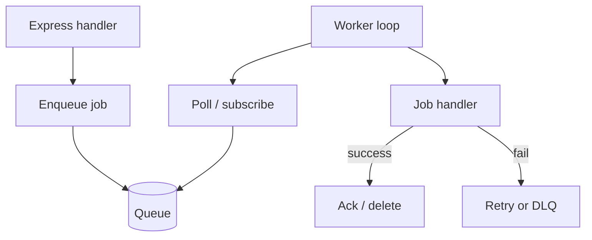
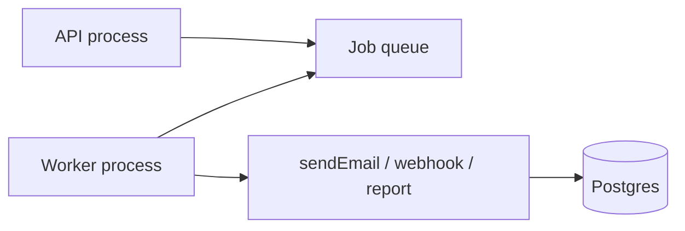
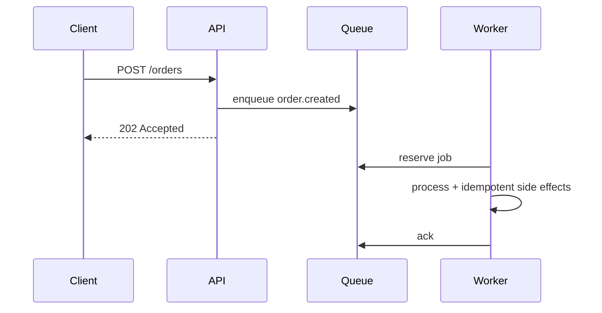

# Background Jobs and Workers

## Overview

**Background jobs** defer work off the HTTP critical path: emails, webhooks, report generation, image processing. A **worker** polls or subscribes to a queue, executes handlers with retries and concurrency limits, and acknowledges completion. Express **enqueues**; separate process or same-process loop **consumes**. Broker internals (Kafka partitions, Redis streams persistence) → [[08-Databases/README|Databases]] / [[09-System-Design/README|System Design]]; this note covers **application job design**.

## Learning Objectives

- Enqueue jobs from Express handlers with typed payloads and dedupe keys
- Implement worker with concurrency, retry, and poison-message handling
- Propagate trace/correlation ID from HTTP to job ([[07-Backend/09-API-Observability-and-Testing/Structured Logs with Request Correlation|Structured Logs with Request Correlation]])
- Stop workers gracefully on shutdown ([[07-Backend/06-Reliability-and-Abuse-Resistance/Graceful Request Drain Above Process Shutdown|Graceful Request Drain Above Process Shutdown]])
- Choose in-process vs external queue trade-offs

## Prerequisites

- [[07-Backend/02-Frameworks-and-Middleware/Request Context and Async Local Storage|Request Context and Async Local Storage]]
- [[06-NodeJS/10-Production-Node/Graceful Shutdown and Drain|Graceful Shutdown and Drain]]
- [[07-Backend/06-Reliability-and-Abuse-Resistance/Retries Jitter and Idempotent Handlers|Retries Jitter and Idempotent Handlers]]

## Difficulty

`intermediate`

## Estimated Time

- Reading: 2.5 hours
- Exercises: 4 hours
- Mini project: 8 hours ([[07-Backend/projects/Job Worker and Outbox Lab/README|Job Worker and Outbox Lab]])

## History

Cron → Sidekiq/Celery → Redis/RabbitMQ workers → Kafka stream processors. Node ecosystem: Bull, BullMQ, pg-boss for Postgres-as-queue.

## Problem It Solves

- **HTTP timeout** on long work
- **Spiky load** smoothing via queue backlog
- **Retry** without blocking user response
- **Scheduled** and delayed execution

## Internal Implementation



At-least-once delivery → handlers must be **idempotent** ([[07-Backend/06-Reliability-and-Abuse-Resistance/Retries Jitter and Idempotent Handlers|Retries Jitter and Idempotent Handlers]]).

## Mermaid Diagrams

### Structure



### Sequence / Lifecycle



## Examples

### Minimal Example

```typescript
type Job = { id: string; type: string; payload: unknown; attempts: number };

const queue: Job[] = [];

export function enqueue(job: Omit<Job, 'attempts'>): void {
  queue.push({ ...job, attempts: 0 });
}

async function workerLoop(handler: (job: Job) => Promise<void>): Promise<void> {
  while (true) {
    const job = queue.shift();
    if (!job) {
      await new Promise((r) => setTimeout(r, 100));
      continue;
    }
    try {
      await handler(job);
    } catch {
      job.attempts++;
      if (job.attempts < 3) queue.push(job);
    }
  }
}
```

### Production-Shaped Example

```typescript
import express from 'express';
import { randomUUID } from 'node:crypto';

interface SendWebhookJob {
  type: 'send_webhook';
  deliveryId: string;
  url: string;
  body: object;
  correlationId: string;
}

class JobQueue {
  async add(name: string, data: SendWebhookJob, opts: { jobId: string; attempts: number }): Promise<void> {
    await redis.lpush(`jobs:${name}`, JSON.stringify({ ...data, attempts: opts.attempts, jobId: opts.jobId }));
  }
}

const jobs = new JobQueue();
const app = express();

app.post('/events', async (req, res) => {
  const deliveryId = randomUUID();
  await jobs.add('webhooks', {
    type: 'send_webhook',
    deliveryId,
    url: req.body.callbackUrl,
    body: req.body,
    correlationId: req.header('X-Request-Id') ?? deliveryId,
  }, { jobId: deliveryId, attempts: 5 });

  res.status(202).json({ deliveryId, status: 'queued' });
});

export async function startWebhookWorker(signal: AbortSignal): Promise<void> {
  while (!signal.aborted) {
    const raw = await redis.brpop('jobs:webhooks', 5);
    if (!raw) continue;
    const job = JSON.parse(raw[1]) as SendWebhookJob & { attempts: number; jobId: string };

    try {
      await deliverWebhookIdempotent(job);
    } catch (err) {
      await scheduleRetry(job);
    }
  }
}
```

Use [[07-Backend/07-Caching-Jobs-and-Messaging/Transactional Outbox and Inbox Patterns|Transactional Outbox and Inbox Patterns]] when DB write and enqueue must be atomic.

## Trade-offs

| Dimension | Upside | Downside | When it matters |
| --- | --- | --- | --- |
| In-process queue | Simple | Lost on crash | Dev/tests |
| Redis/BullMQ | Mature Node UX | Ops dependency | Most products |
| Kafka | High throughput | Complexity | Event platforms |
| Sync in HTTP | No queue | Timeouts | <500ms work |

### When to Use

- Work > few seconds or unreliable external calls
- Retry with backoff off critical path
- Scheduled/recurring tasks

### When Not to Use

- Work that must be synchronous for user confirmation (unless 202 + polling)
- Without idempotency on at-least-once brokers

## Exercises

1. Worker with concurrency 5; verify ordering not guaranteed globally.
2. Poison message after max attempts → dead-letter queue table.
3. SIGTERM worker mid-job; verify retry or graceful nack.

## Mini Project

[[07-Backend/projects/Job Worker and Outbox Lab/README|Job Worker and Outbox Lab]].

## Portfolio Project

Job runner in [[07-Backend/projects/Backend Service Toolkit/README|Backend Service Toolkit]].

## Interview Questions

1. At-least-once vs exactly-once—what can APIs promise?
2. How do you enqueue from HTTP without losing job on crash before ACK?
3. Worker concurrency vs API instance count?
4. 202 Accepted vs 200 with async—client contract?

### Stretch / Staff-Level

1. Priority queues and starvation prevention.

## Common Mistakes

- Fire-and-forget `setImmediate` without persistence
- No dead-letter path
- Sharing DB pool exhausted by workers + API
- Missing correlation ID in job payload
- Ack before side effects complete

## Best Practices

- Typed job names and schema version
- Idempotency key per side effect
- Metrics: queue depth, processing time, failures
- Graceful worker stop ([[06-NodeJS/10-Production-Node/Graceful Shutdown and Drain|Graceful Shutdown and Drain]])
- Separate worker deployment in production ([[16-DevOps/README|DevOps]])

## Summary

Background jobs **decouple latency from reliability**: Express enqueues, workers process with retries and idempotency. Choose queue backing by ops maturity; use outbox for atomic enqueue with DB; drain workers on shutdown.

## Further Reading

- [[07-Backend/07-Caching-Jobs-and-Messaging/Message Queue Client Patterns|Message Queue Client Patterns]]
- [[09-System-Design/README|System Design]]

## Related Notes

- [[07-Backend/07-Caching-Jobs-and-Messaging/Transactional Outbox and Inbox Patterns|Transactional Outbox and Inbox Patterns]]
- [[07-Backend/07-Caching-Jobs-and-Messaging/Message Queue Client Patterns|Message Queue Client Patterns]]
- [[07-Backend/06-Reliability-and-Abuse-Resistance/Graceful Request Drain Above Process Shutdown|Graceful Request Drain Above Process Shutdown]]
- [[08-Databases/README|Databases]]

## Progress Checklist

- [ ] Explained from first principles
- [ ] Drew at least one Mermaid diagram
- [ ] Implemented a minimal version
- [ ] Documented trade-offs and non-goals
- [ ] Completed exercises
- [ ] Practiced interview questions aloud
- [ ] Linked prerequisites and dependents
