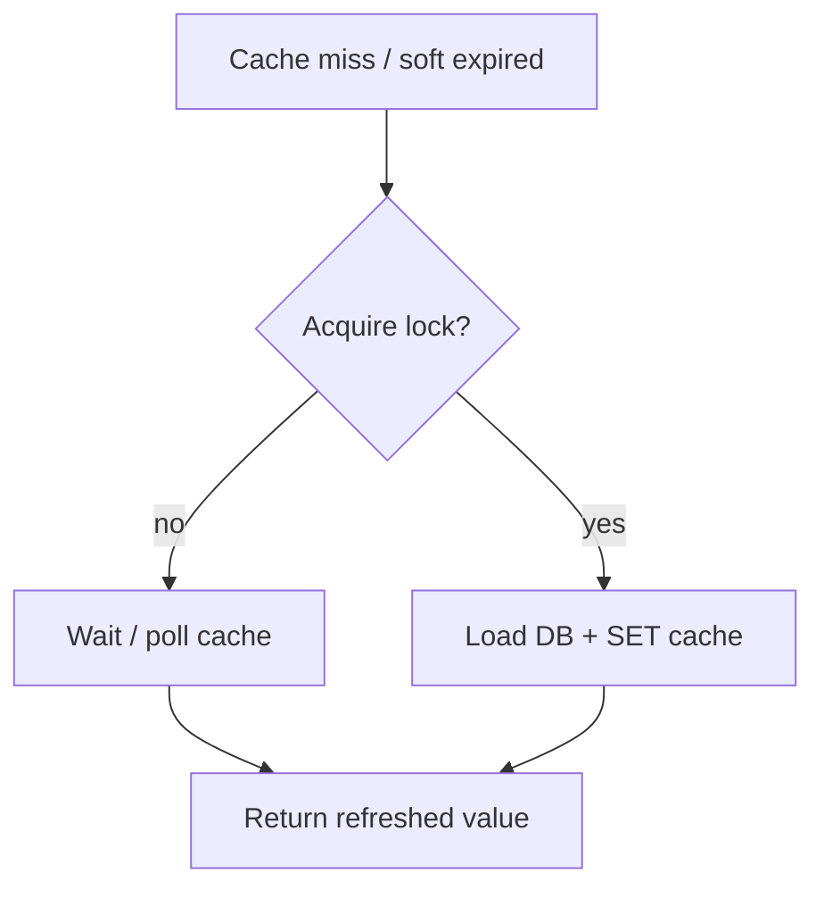
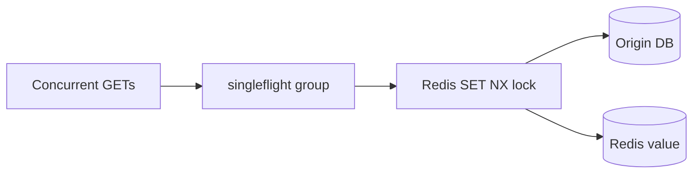
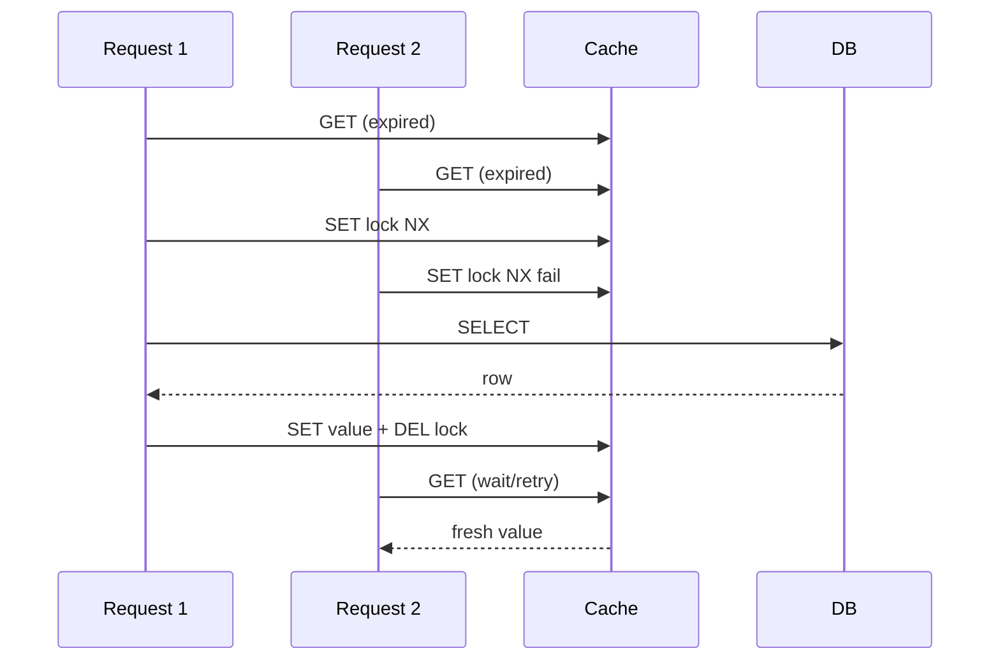

# Cache Stampede and Soft Expiry

## Overview

A **cache stampede** (thundering herd) occurs when many concurrent requests miss the same expiring key and simultaneously hit the origin database to repopulate. **Mitigations**: distributed lock (only one recomputes), **singleflight** (in-process dedupe), **probabilistic early expiration** (refresh before hard TTL), **soft expiry** (serve stale while one worker refreshes). Application-layer concern atop [[07-Backend/07-Caching-Jobs-and-Messaging/Cache-Aside and TTL Strategies|Cache-Aside and TTL Strategies]]; lock engines in [[08-Databases/README|Databases]].

## Learning Objectives

- Reproduce stampede under load when TTL aligns
- Implement mutex / SET NX lock with short lease around recompute
- Apply singleflight for in-process coalescing on hot keys
- Use stale-while-revalidate response semantics where product allows
- Monitor `cache_recompute_wait` and origin QPS spikes

## Prerequisites

- [[07-Backend/07-Caching-Jobs-and-Messaging/Cache-Aside and TTL Strategies|Cache-Aside and TTL Strategies]]
- [[07-Backend/06-Reliability-and-Abuse-Resistance/Circuit Breakers and Bulkheads|Circuit Breakers and Bulkheads]]

## Difficulty

`advanced`

## Estimated Time

- Reading: 2 hours
- Exercises: 4 hours
- Mini project: 5 hours

## History

Memcached era outages from synchronized expiry. Facebook memcache paper described leases and stale values. Go's `singleflight` package popularized in-process dedupe pattern.

## Problem It Solves

- **DB collapse** when popular key expires at once
- **Latency cliff** at TTL boundaries
- **Retry amplification** from slow recompute + client retries
- **Hot key** on viral content

## Internal Implementation



Soft expiry: store `{ value, softExpire, hardExpire }`—after soft, one refresher; others serve stale until hard.

## Mermaid Diagrams

### Structure



### Sequence / Lifecycle



## Examples

### Minimal Example

```typescript
import { singleFlight } from './singleflight';

const sf = singleFlight<string>();

async function getPopularSlug(slug: string): Promise<string> {
  return sf.do(slug, async () => {
    const hit = await cache.get(`slug:${slug}`);
    if (hit) return hit;
    const url = await db.findBySlug(slug);
    await cache.set(`slug:${slug}`, url, 60);
    return url;
  });
}
```

### Production-Shaped Example

```typescript
import express from 'express';

interface CacheEntry<T> {
  value: T;
  softExpireAt: number;
  hardExpireAt: number;
}

async function getWithSoftExpiry<T>(
  key: string,
  loader: () => Promise<T>,
  opts: { softTtlSec: number; hardTtlSec: number; lockTtlSec: number },
): Promise<T> {
  const now = Date.now();
  const raw = await cache.get(key);
  if (raw) {
    const entry = JSON.parse(raw) as CacheEntry<T>;
    if (now < entry.softExpireAt) return entry.value;
    if (now < entry.hardExpireAt) {
      void refreshInBackground(key, loader, opts);
      return entry.value;
    }
  }

  const lockKey = `${key}:lock`;
  const acquired = await cache.setNx(lockKey, '1', opts.lockTtlSec);
  if (!acquired) {
    await sleep(50);
    return getWithSoftExpiry(key, loader, opts);
  }

  try {
    const value = await loader();
    const entry: CacheEntry<T> = {
      value,
      softExpireAt: now + opts.softTtlSec * 1000,
      hardExpireAt: now + opts.hardTtlSec * 1000,
    };
    await cache.set(key, JSON.stringify(entry), opts.hardTtlSec);
    return value;
  } finally {
    await cache.del(lockKey);
  }
}

async function refreshInBackground<T>(key: string, loader: () => Promise<T>, opts: typeof defaultOpts) {
  const lockKey = `${key}:lock`;
  if (!(await cache.setNx(lockKey, '1', opts.lockTtlSec))) return;
  try {
    const value = await loader();
    const now = Date.now();
    await cache.set(key, JSON.stringify({
      value,
      softExpireAt: now + opts.softTtlSec * 1000,
      hardExpireAt: now + opts.hardTtlSec * 1000,
    }), opts.hardTtlSec);
  } finally {
    await cache.del(lockKey);
  }
}

const defaultOpts = { softTtlSec: 240, hardTtlSec: 300, lockTtlSec: 10 };

const app = express();
app.get('/trending', async (_req, res) => {
  const items = await getWithSoftExpiry('trending:v1', () => db.fetchTrending(), defaultOpts);
  res.json(items);
});
```

Add jitter to TTL ([[07-Backend/06-Reliability-and-Abuse-Resistance/Retries Jitter and Idempotent Handlers|Retries Jitter and Idempotent Handlers]]) so keys don't expire simultaneously.

## Trade-offs

| Dimension | Upside | Downside | When it matters |
| --- | --- | --- | --- |
| Serve stale | Smooth latency | Product staleness | News feeds |
| Strict freshness | Accurate | Stampede risk | Inventory |
| Distributed lock | Cross-instance dedupe | Lock complexity | Clustered API |
| singleflight only | Simple | Per-process only | Single instance |

### When to Use

- Hot keys with shared TTL
- Expensive origin queries (aggregates, trending)
- Read-heavy endpoints under viral load

### When Not to Use

- Data requiring hard consistency without stale tolerance
- Low QPS keys (complexity not justified)

## Exercises

1. Load-test 100 concurrent clients at TTL expiry; compare with/without lock.
2. Implement probabilistic early refresh: recompute if `random() < delta`.
3. Measure origin QPS during artificial stampede.

## Mini Project

Stampede-safe cache in [[07-Backend/code/README|Backend code labs]].

## Portfolio Project

[[07-Backend/projects/Backend Service Toolkit/README|Backend Service Toolkit]] cache module with lock + singleflight.

## Interview Questions

1. What causes synchronized expiry?
2. singleflight vs distributed lock?
3. When is serving stale acceptable legally/product-wise?
4. How long should lock lease be vs recompute p99?

### Stretch / Staff-Level

1. Design cross-region cache coherency without global lock bottleneck.

## Common Mistakes

- Lock without lease → deadlocks on crash
- Infinite wait loop on lock holder failure
- Refresh storm from background without rate limit
- Stale served without `Cache-Control` or client documentation
- singleflight across tenants on same key string

## Best Practices

- Jitter TTL per key
- Lock lease > p99 recompute + margin
- Cap background refresh concurrency
- Metric: `cache_lock_wait_ms`, `stale_served_total`
- Document staleness in API ([[07-Backend/01-HTTP-APIs-and-Contracts/Content Negotiation and Payload Design|Content Negotiation and Payload Design]])

## Summary

Cache stampedes happen when **many misses meet one expiry**. Combine **jittered TTL**, **locks or singleflight**, and **soft expiry / stale-while-revalidate** to protect the origin while meeting product freshness bounds.

## Further Reading

- [[08-Databases/README|Databases]] — Redis SET NX patterns
- Facebook memcache lease paper (conceptual)

## Related Notes

- [[07-Backend/07-Caching-Jobs-and-Messaging/Cache-Aside and TTL Strategies|Cache-Aside and TTL Strategies]]
- [[07-Backend/06-Reliability-and-Abuse-Resistance/Rate Limiting and Quotas|Rate Limiting and Quotas]]
- [[08-Databases/README|Databases]]
- [[09-System-Design/README|System Design]]

## Progress Checklist

- [ ] Explained from first principles
- [ ] Drew at least one Mermaid diagram
- [ ] Implemented a minimal version
- [ ] Documented trade-offs and non-goals
- [ ] Completed exercises
- [ ] Practiced interview questions aloud
- [ ] Linked prerequisites and dependents
