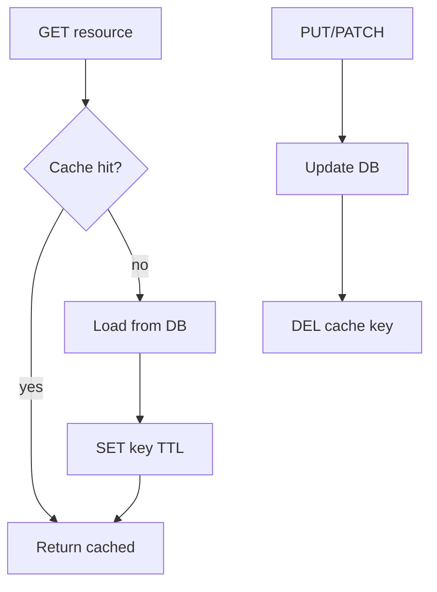
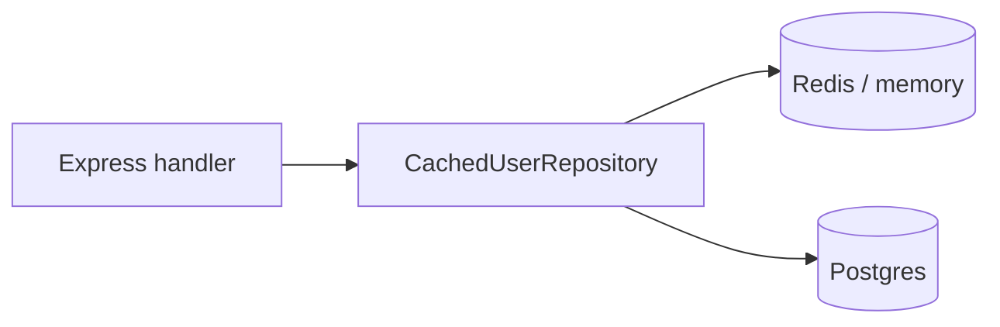
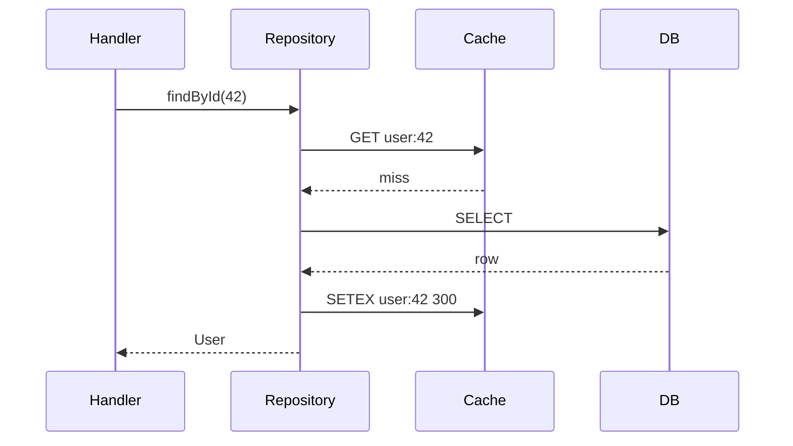

# Cache-Aside and TTL Strategies

## Overview

**Cache-aside** (lazy loading): application reads cache first; on miss, loads from database, populates cache, returns. Writes update database then **invalidate** or update cache. **TTL** (time-to-live) bounds staleness when invalidation is missed. This note covers **application caching patterns**—Redis/memory engine semantics, eviction, and clustering live in [[08-Databases/10-Redis-and-In-Memory-Engines/RDB Snapshots and AOF|RDB Snapshots and AOF]] and [[09-System-Design/05-Caching-at-Product-Scale/Cache Hierarchies CDN Edge Regional App|Cache Hierarchies CDN Edge Regional App]].

## Learning Objectives

- Implement cache-aside get/set/invalidate in a repository decorator
- Choose TTL by data volatility, compliance, and cost of stale reads
- Compare write-through, write-behind, and read-through trade-offs
- Namespace keys by tenant and schema version
- Measure hit ratio and stale-read impact on SLIs

## Prerequisites

- [[07-Backend/08-Data-Access-and-Persistence-Patterns/Repository and Unit of Work|Repository and Unit of Work]]
- [[08-Databases/README|Databases]]

## Difficulty

`intermediate`

## Estimated Time

- Reading: 2 hours
- Exercises: 3 hours
- Mini project: 5 hours

## History

CPU L1 caches inspired application cache-aside in LAMP stacks (memcached). CDN TTL semantics migrated to API layers. Microservices rediscovered invalidation complexity without shared ORM session.

## Problem It Solves

- **Hot read paths** hammering primary database
- **Latency spikes** on repeated aggregate queries
- **Unbounded staleness** without TTL backstop
- **Thundering herd** on expiry ([[07-Backend/07-Caching-Jobs-and-Messaging/Cache Stampede and Soft Expiry|Cache Stampede and Soft Expiry]])

## Internal Implementation



Key design: `{service}:{tenant}:{entity}:{id}:v{schema}`.

## Mermaid Diagrams

### Structure



### Sequence / Lifecycle



## Examples

### Minimal Example

```typescript
interface Cache {
  get(key: string): Promise<string | null>;
  set(key: string, value: string, ttlSec: number): Promise<void>;
  del(key: string): Promise<void>;
}

async function getUserCached(cache: Cache, db: { findUser(id: string): Promise<object | null> }, id: string) {
  const key = `user:${id}`;
  const hit = await cache.get(key);
  if (hit) return JSON.parse(hit);

  const user = await db.findUser(id);
  if (!user) return null;

  await cache.set(key, JSON.stringify(user), 300);
  return user;
}
```

### Production-Shaped Example

```typescript
import express from 'express';

class CachedProductRepository {
  constructor(
    private readonly inner: ProductRepository,
    private readonly cache: Cache,
    private readonly ttlSec: number,
    private readonly tenantId: string,
  ) {}

  private key(id: string): string {
    return `product:${this.tenantId}:${id}:v1`;
  }

  async findById(id: string): Promise<Product | null> {
    const cached = await this.cache.get(this.key(id));
    if (cached) return JSON.parse(cached) as Product;

    const product = await this.inner.findById(id);
    if (!product) return null;

    await this.cache.set(this.key(id), JSON.stringify(product), this.ttlSec);
    return product;
  }

  async update(id: string, patch: Partial<Product>): Promise<Product> {
    const updated = await this.inner.update(id, patch);
    await this.cache.del(this.key(id));
    return updated;
  }
}

const app = express();

app.get('/products/:id', async (req, res, next) => {
  try {
    const repo = new CachedProductRepository(productRepo, redisCache, 120, req.tenantId);
    const product = await repo.findById(req.params.id);
    if (!product) {
      res.status(404).json({ error: 'not_found' });
      return;
    }
    res.json(product);
  } catch (err) {
    next(err);
  }
});
```

Tier TTL: config/metadata long; user session medium; inventory short. Document max staleness in API contract where it affects UX.

## Trade-offs

| Dimension | Upside | Downside | When it matters |
| --- | --- | --- | --- |
| Long TTL | High hit ratio | Stale data | Catalog reads |
| Short TTL | Fresher | More DB load | Inventory counts |
| Invalidate on write | Consistent | Missed invalidation bugs | Financial balances |
| No cache | Simple | DB pressure | Low QPS admin |

### When to Use

- Read-heavy, relatively stable entities
- Expensive joins/aggregations
- Cross-service read models with acceptable lag

### When Not to Use

- Strong consistency requirements without careful invalidation
- Highly personalized payloads (low hit ratio)
- Secrets or PII without encryption at rest in cache engine

## Exercises

1. Implement repository decorator; measure hit ratio under synthetic load.
2. Deliberately skip invalidation on update—quantify stale read window.
3. Design TTL table for e-commerce product vs cart vs session.

## Mini Project

Cache-aside layer in [[07-Backend/projects/URL Shortener API/README|URL Shortener API]].

## Portfolio Project

Caching module in [[07-Backend/projects/Backend Service Toolkit/README|Backend Service Toolkit]].

## Interview Questions

1. Cache-aside vs read-through—who loads on miss?
2. Why TTL even if you invalidate on every write?
3. How do you cache tenant-scoped data safely?
4. What metrics prove cache is worth operating?

### Stretch / Staff-Level

1. Design cache invalidation across multiple services without dual writes.

## Common Mistakes

- Caching error/null responses indefinitely
- Global keys without tenant prefix
- Serializing ORM entities with circular refs
- Same TTL for all entity types
- Ignoring cache failure (fail open vs closed undocumented)

## Best Practices

- Explicit key schema and version suffix
- Log cache hit/miss at debug; metric at info
- Fail open on cache outage for non-critical reads if documented
- Pair with stampede protection ([[07-Backend/07-Caching-Jobs-and-Messaging/Cache Stampede and Soft Expiry|Cache Stampede and Soft Expiry]])
- Engine details → [[08-Databases/10-Redis-and-In-Memory-Engines/RDB Snapshots and AOF|RDB Snapshots and AOF]]

## Summary

Cache-aside puts the application in control: **read cache, fill on miss, invalidate on write**, with **TTL** as staleness backstop. Implement via repository decorators, tenant-aware keys, and measured hit ratio—not as blind `@Cacheable` magic.

## Further Reading

- [[08-Databases/10-Redis-and-In-Memory-Engines/RDB Snapshots and AOF|RDB Snapshots and AOF]] — Redis data structures and persistence
- [[09-System-Design/05-Caching-at-Product-Scale/Cache Hierarchies CDN Edge Regional App|Cache Hierarchies CDN Edge Regional App]] — CDN and multi-tier caching

## Related Notes

- [[07-Backend/07-Caching-Jobs-and-Messaging/Cache Stampede and Soft Expiry|Cache Stampede and Soft Expiry]]
- [[07-Backend/07-Caching-Jobs-and-Messaging/Session and Feature Stores as Products|Session and Feature Stores as Products]]
- [[07-Backend/08-Data-Access-and-Persistence-Patterns/Repository and Unit of Work|Repository and Unit of Work]]
- [[08-Databases/README|Databases]]

## Progress Checklist

- [ ] Explained from first principles
- [ ] Drew at least one Mermaid diagram
- [ ] Implemented a minimal version
- [ ] Documented trade-offs and non-goals
- [ ] Completed exercises
- [ ] Practiced interview questions aloud
- [ ] Linked prerequisites and dependents
