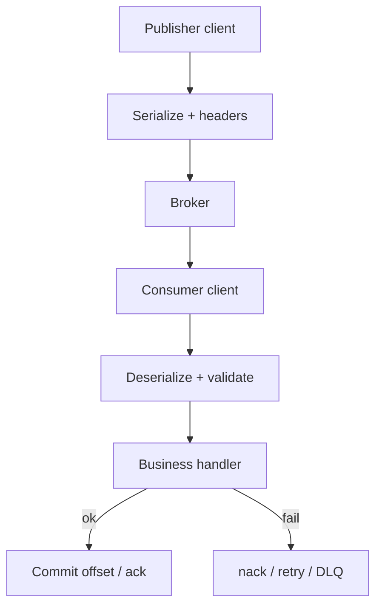
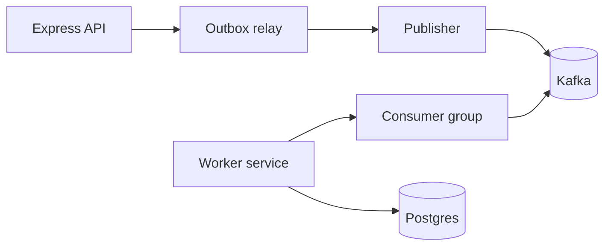
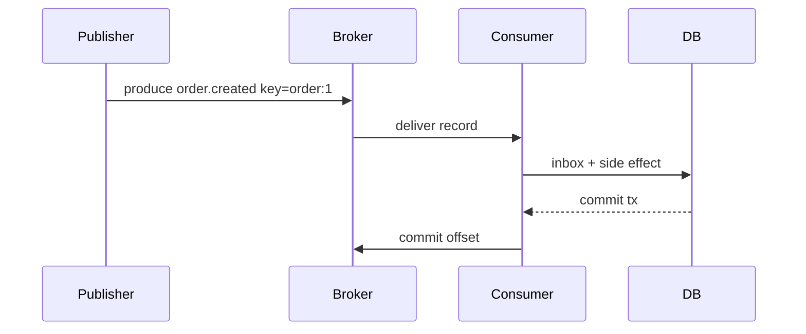

# Message Queue Client Patterns

## Overview

**Message queue clients** connect application code to brokers: publish with keys and headers, subscribe with consumer groups, handle ack/nack, visibility timeouts, and backpressure. This note covers **client-side contracts**—serialization, error handling, reconnect, ordering expectations—not broker cluster design ([[09-System-Design/06-Messaging-Streams-and-Async-Topologies/Queue vs Log vs Pub-Sub Topology Choice|Queue vs Log vs Pub-Sub Topology Choice]]) or Redis/Kafka engine internals ([[08-Databases/README|Databases]]).

## Learning Objectives

- Publish domain events with schema version, correlation ID, and partition key
- Implement consumer with manual ack after successful side effects
- Handle reconnect, offset/commit strategy, and poison messages
- Apply backpressure when handler slower than publish rate
- Choose pub/sub vs work queue semantics for product requirements

## Prerequisites

- [[07-Backend/07-Caching-Jobs-and-Messaging/Background Jobs and Workers|Background Jobs and Workers]]
- [[07-Backend/07-Caching-Jobs-and-Messaging/Transactional Outbox and Inbox Patterns|Transactional Outbox and Inbox Patterns]]

## Difficulty

`intermediate`

## Estimated Time

- Reading: 2 hours
- Exercises: 4 hours
- Mini project: 6 hours

## History

JMS → AMQP (RabbitMQ) → Kafka log model → cloud managed queues (SQS, Pub/Sub). Node clients: kafkajs, amqplib, sqs-consumer.

## Problem It Solves

- **Ad-hoc HTTP callbacks** without retry/DLQ
- **Tight coupling** between services on synchronous chains
- **Unbounded memory** from unbounded internal buffers
- **Mystery duplicates** without inbox/idempotency

## Internal Implementation



Partition key → ordering per aggregate (e.g. `orderId`).

## Mermaid Diagrams

### Structure



### Sequence / Lifecycle



## Examples

### Minimal Example

```typescript
interface EventEnvelope<T> {
  schemaVersion: 1;
  type: string;
  correlationId: string;
  payload: T;
}

async function publish(topic: string, key: string, event: EventEnvelope<unknown>): Promise<void> {
  await producer.send({
    topic,
    messages: [{
      key,
      value: JSON.stringify(event),
      headers: { 'correlation-id': event.correlationId },
    }],
  });
}
```

### Production-Shaped Example

```typescript
import express from 'express';

const app = express();

app.post('/orders', async (req, res, next) => {
  try {
    const order = await orderService.create(req.body);
    res.status(201).json(order);
    // prefer outbox over direct publish — see Transactional Outbox note
  } catch (err) {
    next(err);
  }
});

export function startOrderEventsConsumer(): void {
  const consumer = kafka.consumer({ groupId: 'notification-service' });

  consumer.run({
    eachMessage: async ({ message, heartbeat }) => {
      const correlationId = message.headers?.['correlation-id']?.toString() ?? 'unknown';
      const envelope = JSON.parse(message.value!.toString()) as EventEnvelope<{ orderId: string }>;

      await withLogContext({ correlationId }, async () => {
        try {
          await handleOrderEventIdempotent(envelope);
          await heartbeat();
        } catch (err) {
          if (isPoison(err)) {
            await dlq.send(envelope, err);
            return; // commit past poison with care — document policy
          }
          throw err; // retry via broker
        }
      });
    },
  });
}

async function handleOrderEventIdempotent(envelope: EventEnvelope<{ orderId: string }>): Promise<void> {
  await db.transaction(async (tx) => {
    if (!(await tx.inbox.tryInsert(`${envelope.type}:${envelope.payload.orderId}`))) return;
    await tx.notifications.enqueueOrderConfirmation(envelope.payload.orderId);
  });
}
```

Configure `session.timeout`, `max.poll.interval` (Kafka) or prefetch (AMQP) for handler duration.

## Trade-offs

| Dimension | Upside | Downside | When it matters |
| --- | --- | --- | --- |
| Manual ack | Safe side effects | Stuck unacked msgs | Financial events |
| Auto ack | Simple | Loss on crash | Metrics only |
| Sync publish in HTTP | Immediate | Dual write risk | Avoid—use outbox |
| High prefetch | Throughput | OOM / unfairness | Slow handlers |

### When to Use

- Cross-service domain events
- Work distribution across worker pool
- Decouple peak load from API

### When Not to Use

- Query/response needing immediate answer
- When team lacks broker ops ([[16-DevOps/README|DevOps]])

## Exercises

1. Publish 1000 events; throttle consumer; observe lag metric.
2. Simulate consumer crash before ack—verify redelivery + inbox dedupe.
3. Add schemaVersion mismatch → DLQ path.

## Mini Project

Consumer with inbox in [[07-Backend/projects/Job Worker and Outbox Lab/README|Job Worker and Outbox Lab]].

## Portfolio Project

Messaging client wrapper in [[07-Backend/projects/Backend Service Toolkit/README|Backend Service Toolkit]].

## Interview Questions

1. Work queue vs pub/sub—use cases?
2. Ordering guarantees with multiple partitions?
3. Commit offset before or after DB transaction?
4. How does visibility timeout relate to handler p99?

### Stretch / Staff-Level

1. Compare kafkajs consumer rebalance impact on in-flight handlers.

## Common Mistakes

- Auto-commit before handler finishes
- No correlation ID propagation
- Unbounded `eachMessage` concurrency
- JSON without schema validation
- Subscribing without consumer group (broadcast accidentally)

## Best Practices

- Envelope with type + schemaVersion + correlationId
- Partition by aggregate id
- Inbox or idempotent handlers ([[07-Backend/07-Caching-Jobs-and-Messaging/Transactional Outbox and Inbox Patterns|Transactional Outbox and Inbox Patterns]])
- Metrics: lag, processing time, DLQ rate
- Graceful consumer stop ([[06-NodeJS/10-Production-Node/Graceful Shutdown and Drain|Graceful Shutdown and Drain]])

## Summary

MQ **clients** encode product contracts: envelopes, keys, ack timing, and idempotent handlers. Prefer **outbox publish** from API; consumers **commit after** successful transactions; engine tuning belongs in Databases/System Design tracks.

## Further Reading

- [[08-Databases/README|Databases]] — Kafka/Redis as storage
- [[09-System-Design/06-Messaging-Streams-and-Async-Topologies/Queue vs Log vs Pub-Sub Topology Choice|Queue vs Log vs Pub-Sub Topology Choice]] — event-driven architecture

## Related Notes

- [[07-Backend/07-Caching-Jobs-and-Messaging/Transactional Outbox and Inbox Patterns|Transactional Outbox and Inbox Patterns]]
- [[07-Backend/07-Caching-Jobs-and-Messaging/Background Jobs and Workers|Background Jobs and Workers]]
- [[07-Backend/09-API-Observability-and-Testing/Structured Logs with Request Correlation|Structured Logs with Request Correlation]]
- [[08-Databases/README|Databases]]
- [[09-System-Design/README|System Design]]

## Progress Checklist

- [ ] Explained from first principles
- [ ] Drew at least one Mermaid diagram
- [ ] Implemented a minimal version
- [ ] Documented trade-offs and non-goals
- [ ] Completed exercises
- [ ] Practiced interview questions aloud
- [ ] Linked prerequisites and dependents
