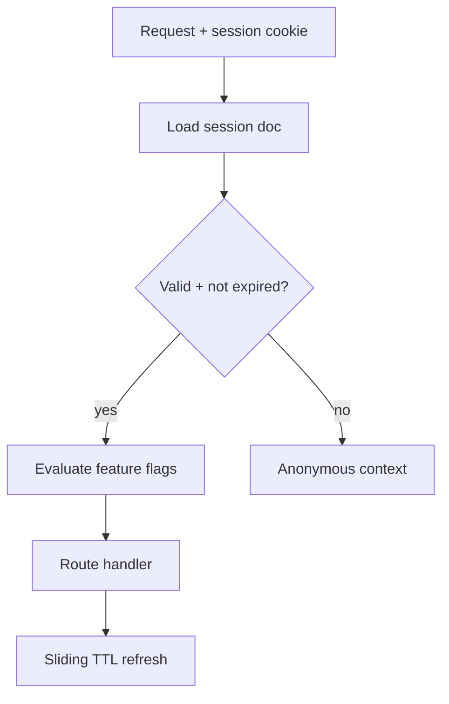
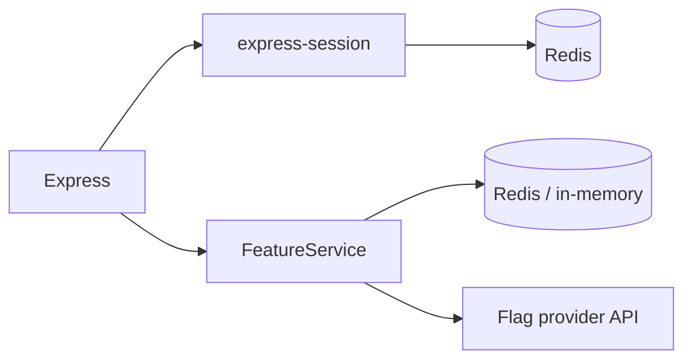
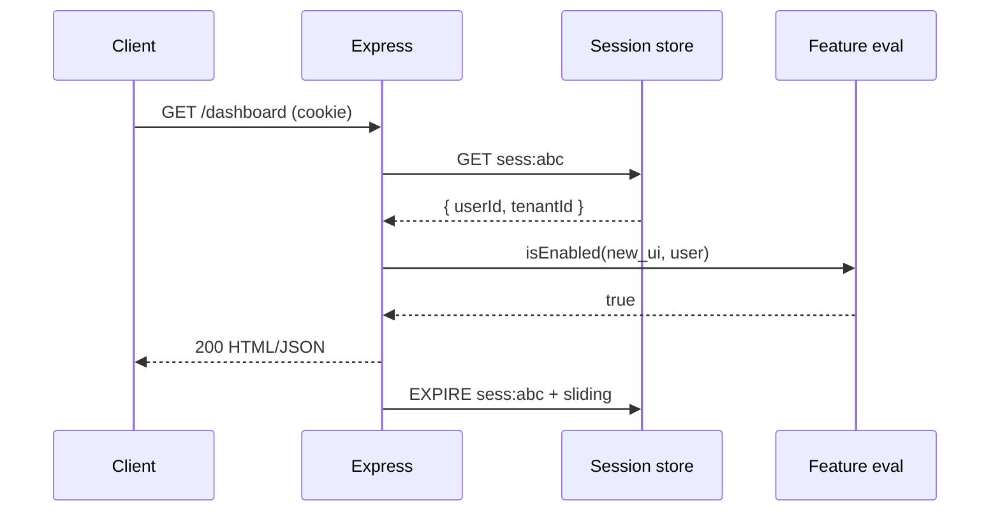

# Session and Feature Stores as Products

## Overview

**Session stores** hold server-side auth state keyed by opaque session ID in HTTP-only cookie. **Feature stores** (or flag/config caches) hold per-user or per-tenant toggles evaluated on each request. Both are **product infrastructure**: schema, TTL, eviction, security, and observability matter—not “just Redis.” Engine operations (persistence, replication) → [[08-Databases/README|Databases]]; auth crypto → [[18-Security/README|Security]].

## Learning Objectives

- Model session documents: userId, tenantId, rotation, idle/expiry
- Implement Express session middleware backed by external store
- Design feature flag evaluation with consistent bucketing and fallbacks
- Define TTL, sliding expiration, and logout invalidation
- Treat stores as contracts with versioning and migration

## Prerequisites

- [[07-Backend/04-Authentication/Sessions Cookies and CSRF Boundaries|Sessions Cookies and CSRF Boundaries]]
- [[07-Backend/07-Caching-Jobs-and-Messaging/Cache-Aside and TTL Strategies|Cache-Aside and TTL Strategies]]
- [[07-Backend/10-Production-Services/Configuration Feature Flags and Secrets for Services|Configuration Feature Flags and Secrets for Services]]

## Difficulty

`intermediate`

## Estimated Time

- Reading: 2 hours
- Exercises: 3 hours
- Mini project: 5 hours

## History

Server sessions in PHP `$_SESSION` files scaled to Redis via connect-redis. LaunchDarkly-style flags moved from if/else deploys to runtime evaluation with audit trails.

## Problem It Solves

- **Stateful auth** without bloating JWT
- **Instant revoke** vs long-lived bearer tokens
- **Gradual rollouts** without redeploy
- **Tenant-specific** behavior without code forks

## Internal Implementation



Session key: `sess:{sessionId}`. Feature cache: `flag:{env}:{flagKey}:{subjectHash}`.

## Mermaid Diagrams

### Structure



### Sequence / Lifecycle



## Examples

### Minimal Example

```typescript
import session from 'express-session';
import RedisStore from 'connect-redis';
import { createClient } from 'redis';

const redis = createClient({ url: process.env.REDIS_URL });
await redis.connect();

app.use(session({
  store: new RedisStore({ client: redis, prefix: 'sess:' }),
  secret: process.env.SESSION_SECRET!,
  resave: false,
  saveUninitialized: false,
  cookie: { httpOnly: true, secure: true, sameSite: 'lax', maxAge: 86_400_000 },
}));
```

### Production-Shaped Example

```typescript
import express from 'express';

interface SessionData {
  userId: string;
  tenantId: string;
  roles: string[];
  createdAt: string;
}

interface FeatureContext {
  userId: string;
  tenantId: string;
  tier: string;
}

class FeatureService {
  constructor(private readonly cache: Cache, private readonly provider: FlagProvider) {}

  async isEnabled(flag: string, ctx: FeatureContext): Promise<boolean> {
    const cacheKey = `flag:prod:${flag}:${ctx.tenantId}:${ctx.userId}`;
    const cached = await this.cache.get(cacheKey);
    if (cached !== null) return cached === '1';

    const enabled = await this.provider.evaluate(flag, ctx);
    await this.cache.set(cacheKey, enabled ? '1' : '0', 30);
    return enabled;
  }
}

const app = express();

app.get('/api/reports', async (req, res) => {
  const sess = req.session as typeof req.session & SessionData;
  if (!sess.userId) {
    res.status(401).json({ error: 'unauthenticated' });
    return;
  }

  const ctx: FeatureContext = {
    userId: sess.userId,
    tenantId: sess.tenantId,
    tier: req.header('X-Tenant-Tier') ?? 'free',
  };

  if (!(await features.isEnabled('advanced_reports', ctx))) {
    res.status(403).json({ error: 'feature_disabled' });
    return;
  }

  res.json(await reportService.list(sess.tenantId));
});
```

Version session payload (`sess:v2`) for migrations. Log flag evaluations for audit sampling—not every request at full volume.

## Trade-offs

| Dimension | Upside | Downside | When it matters |
| --- | --- | --- | --- |
| Server session | Revoke, small cookie | Store dependency | Web apps |
| JWT only | Stateless | Hard revoke | Mobile/API |
| Cached flags | Fast eval | Stale toggles | High QPS |
| Live flag provider | Fresh | Latency + SPOF | Critical killswitches |

### When to Use

- Interactive web sessions with logout/revoke
- Per-tenant feature gating
- A/B experiments with stable bucketing

### When Not to Use

- Session store for large blobs (use object storage)
- Flags for security secrets ([[07-Backend/10-Production-Services/Configuration Feature Flags and Secrets for Services|Configuration Feature Flags and Secrets for Services]])

## Exercises

1. Implement session fixation defense on login (rotate session ID).
2. Feature flag: 10% rollout stable per `userId` hash.
3. Failover test: Redis down—define fail-closed vs fail-open for flags.

## Mini Project

Session + flags in [[07-Backend/projects/Authentication Server/README|Authentication Server]].

## Portfolio Project

Product store ADR in [[07-Backend/projects/Backend Service Toolkit/README|Backend Service Toolkit]].

## Interview Questions

1. Session vs JWT for SPA—trade-offs?
2. How do you migrate session schema without logging everyone out?
3. Stale feature flag serving true when should be false—impact?
4. Where does CSRF fit with session cookies?

### Stretch / Staff-Level

1. Multi-region session without sticky sessions—options?

## Common Mistakes

- Storing PII-heavy objects in session
- No TTL → unbounded Redis growth
- Flag eval without tenant in cache key
- `saveUninitialized: true` creating empty sessions for bots
- Same Redis DB for sessions and cache without memory policy

## Best Practices

- Sliding expiration on activity
- Encrypt sensitive session fields if required
- Namespace keys by environment
- Monitor store latency on critical path
- Document flag ownership and default-off policy

## Summary

Sessions and feature stores are **product-facing state**: design schemas, TTL, security, and failure modes deliberately. Use external store for sessions, cache flag evaluations with bounded staleness, and hand engine tuning to [[08-Databases/README|Databases]].

## Further Reading

- [[07-Backend/04-Authentication/Sessions Cookies and CSRF Boundaries|Sessions Cookies and CSRF Boundaries]]
- [[08-Databases/README|Databases]]

## Related Notes

- [[07-Backend/07-Caching-Jobs-and-Messaging/Cache-Aside and TTL Strategies|Cache-Aside and TTL Strategies]]
- [[07-Backend/10-Production-Services/Configuration Feature Flags and Secrets for Services|Configuration Feature Flags and Secrets for Services]]
- [[07-Backend/04-Authentication/JWT Access Tokens and Claims|JWT Access Tokens and Claims]]
- [[18-Security/README|Security]]

## Progress Checklist

- [ ] Explained from first principles
- [ ] Drew at least one Mermaid diagram
- [ ] Implemented a minimal version
- [ ] Documented trade-offs and non-goals
- [ ] Completed exercises
- [ ] Practiced interview questions aloud
- [ ] Linked prerequisites and dependents
