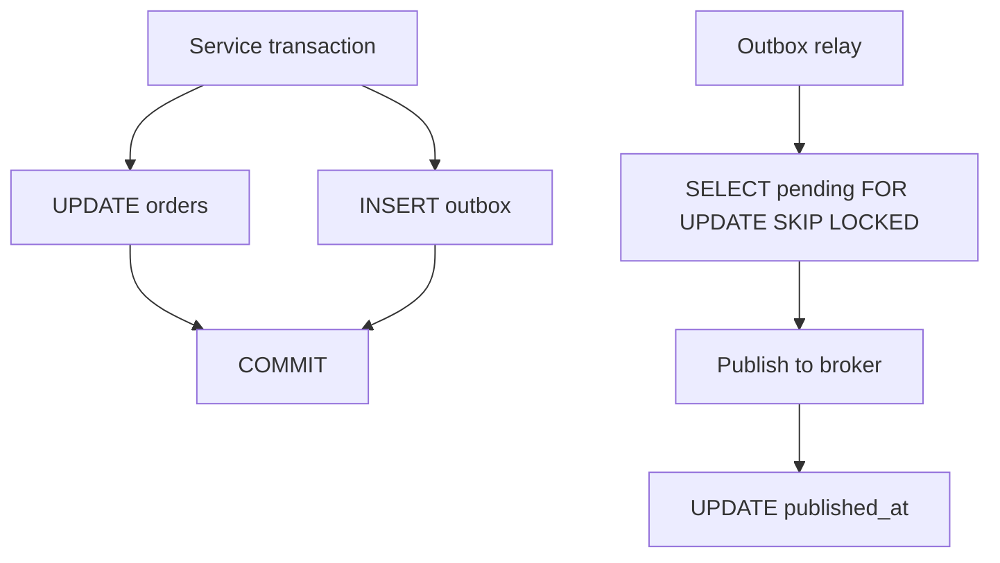
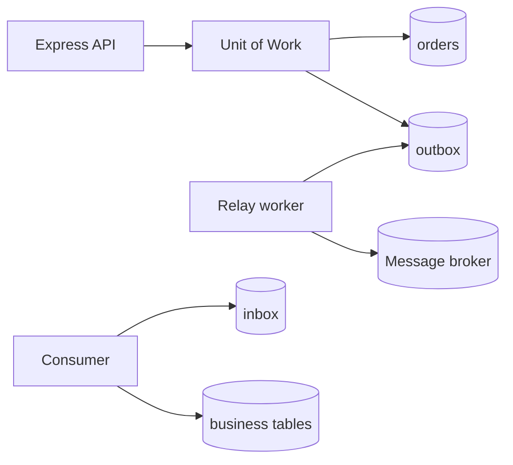
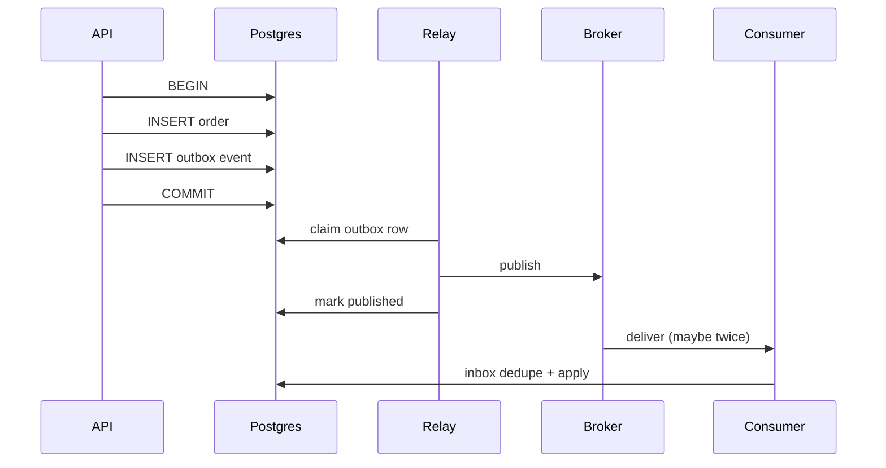

# Transactional Outbox and Inbox Patterns

## Overview

**Dual write problem**: updating database and publishing to message broker in one request—either can succeed alone. **Transactional outbox** writes an event row in the **same DB transaction** as business data; a **relay** publishes to the broker asynchronously. **Inbox pattern** stores incoming message IDs processed in the same transaction as side effects—**deduplicating** at-least-once delivery. Application pattern here; broker topology → [[09-System-Design/README|System Design]]; Kafka/Redis engines → [[08-Databases/README|Databases]].

## Learning Objectives

- Implement outbox table + poller/relay worker
- Guarantee publish-at-least-once without losing events on API crash
- Apply inbox table for idempotent consumers
- Map outbox states: pending, published, failed
- Relate to [[07-Backend/07-Caching-Jobs-and-Messaging/Background Jobs and Workers|Background Jobs and Workers]] and saga limitations

## Prerequisites

- [[07-Backend/08-Data-Access-and-Persistence-Patterns/Transactions as Used by Services|Transactions as Used by Services]]
- [[07-Backend/07-Caching-Jobs-and-Messaging/Background Jobs and Workers|Background Jobs and Workers]]
- [[07-Backend/06-Reliability-and-Abuse-Resistance/Retries Jitter and Idempotent Handlers|Retries Jitter and Idempotent Handlers]]

## Difficulty

`advanced`

## Estimated Time

- Reading: 2.5 hours
- Exercises: 5 hours
- Mini project: 8 hours ([[07-Backend/projects/Job Worker and Outbox Lab/README|Job Worker and Outbox Lab]])

## History

Chris Richardson and microservices.io codified outbox (2018). Debezium CDC offered alternative relay from WAL. Inbox mirrors idempotency keys at consumer boundary.

## Problem It Solves

- **Lost events** when DB commits but publish fails
- **Orphan publishes** when DB rolls back after send
- **Duplicate processing** on consumer retry
- **False confidence** from “try/catch around publish”

## Internal Implementation



Inbox: `INSERT inbox(message_id)` unique → if conflict, skip handler.

## Mermaid Diagrams

### Structure



### Sequence / Lifecycle



## Examples

### Minimal Example

```typescript
async function createOrder(db: Db, order: OrderInput): Promise<void> {
  await db.transaction(async (tx) => {
    const id = await tx.insertOrder(order);
    await tx.insertOutbox({
      aggregateType: 'order',
      aggregateId: id,
      eventType: 'OrderCreated',
      payload: JSON.stringify({ orderId: id, ...order }),
    });
  });
}
```

### Production-Shaped Example

```typescript
import express from 'express';

interface OutboxRow {
  id: string;
  eventType: string;
  payload: string;
  createdAt: Date;
  publishedAt: Date | null;
}

app.post('/orders', async (req, res, next) => {
  try {
    const order = await db.transaction(async (tx) => {
      const created = await tx.orders.create(req.body);
      await tx.outbox.create({
        eventType: 'order.created',
        payload: { orderId: created.id, tenantId: req.tenantId },
      });
      return created;
    });
    res.status(201).json(order);
  } catch (err) {
    next(err);
  }
});

export async function runOutboxRelay(signal: AbortSignal): Promise<void> {
  while (!signal.aborted) {
    const batch = await db.outbox.claimPending(50);
    for (const row of batch) {
      try {
        await messagePublisher.publish(row.eventType, row.payload);
        await db.outbox.markPublished(row.id);
      } catch (err) {
        await db.outbox.markFailed(row.id, String(err));
      }
    }
    await sleep(500);
  }
}

export async function handleOrderCreated(msg: { messageId: string; payload: { orderId: string } }): Promise<void> {
  await db.transaction(async (tx) => {
    const inserted = await tx.inbox.tryInsert(msg.messageId);
    if (!inserted) return; // duplicate delivery
    await tx.notifications.scheduleForOrder(msg.payload.orderId);
  });
}
```

Use `FOR UPDATE SKIP LOCKED` for relay concurrency across workers.

## Trade-offs

| Dimension | Upside | Downside | When it matters |
| --- | --- | --- | --- |
| Outbox in Postgres | Atomic with data | Relay lag | Most CRUD APIs |
| CDC relay | No poller | Infra complexity | Large event volumes |
| Inbox table | Strong dedupe | Extra writes | Payment consumers |
| Idempotent handler only | Simpler | Buggy side effects | Low risk events |

### When to Use

- Any domain event that must not be lost
- Cross-service notifications after commit
- Consumers with non-idempotent side effects

### When Not to Use

- Fire-and-forget analytics where loss acceptable
- Synchronous request/response only systems

## Exercises

1. Kill API after COMMIT, before publish—prove relay still delivers.
2. Deliver same message twice—inbox prevents double notification.
3. Implement claim with SKIP LOCKED; run two relays without duplicate publish.

## Mini Project

[[07-Backend/projects/Job Worker and Outbox Lab/README|Job Worker and Outbox Lab]].

## Portfolio Project

Outbox ADR in [[07-Backend/projects/Backend Service Toolkit/README|Backend Service Toolkit]].

## Interview Questions

1. Why not publish inside transaction?
2. Outbox vs change data capture?
3. How is inbox different from idempotency key on HTTP?
4. What if relay publishes but crash before mark published?

### Stretch / Staff-Level

1. Ordering guarantees per aggregate with partitioned broker.

## Common Mistakes

- Outbox insert outside business transaction
- No relay monitoring on backlog age
- Publishing before commit
- Inbox without unique constraint on message_id
- Assuming exactly-once end-to-end

## Best Practices

- Monotonic outbox `created_at` metrics
- Dead-letter for poison outbox rows
- Schema version in payload
- Test crash points in integration tests
- Document at-least-once consumer contract

## Summary

**Outbox** makes message publish **eventually consistent** with DB commit; **inbox** makes consumption **idempotent**. Both live in application transaction boundaries—brokers remain at-least-once; patterns restore correctness.

## Further Reading

- [microservices.io Outbox pattern](https://microservices.io/patterns/data/transactional-outbox.html)
- [[08-Databases/02-WAL-Durability-and-Recovery/Write-Ahead Logging Protocol|Write-Ahead Logging Protocol]] — WAL and CDC

## Related Notes

- [[07-Backend/08-Data-Access-and-Persistence-Patterns/Transactions as Used by Services|Transactions as Used by Services]]
- [[07-Backend/08-Data-Access-and-Persistence-Patterns/Repository and Unit of Work|Repository and Unit of Work]]
- [[07-Backend/07-Caching-Jobs-and-Messaging/Message Queue Client Patterns|Message Queue Client Patterns]]
- [[09-System-Design/README|System Design]]

## Progress Checklist

- [ ] Explained from first principles
- [ ] Drew at least one Mermaid diagram
- [ ] Implemented a minimal version
- [ ] Documented trade-offs and non-goals
- [ ] Completed exercises
- [ ] Practiced interview questions aloud
- [ ] Linked prerequisites and dependents
