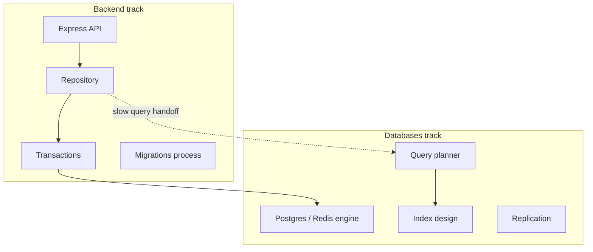
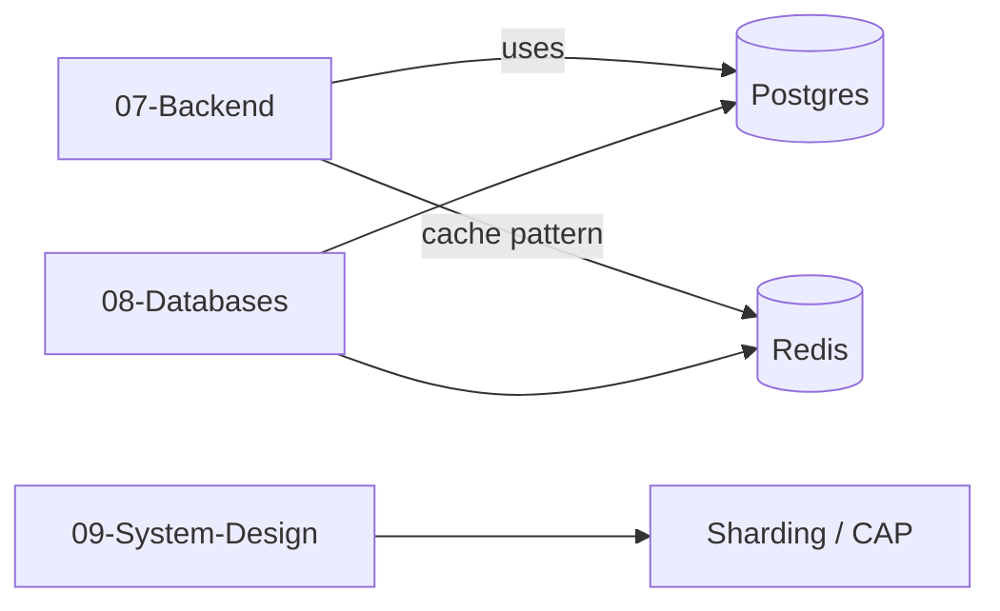
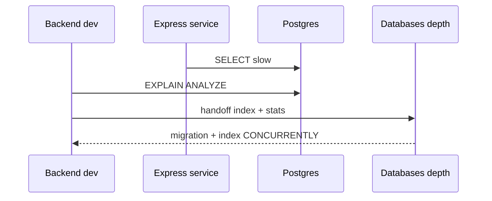

# Handing Off to Database Engines

## Overview

Backend services **use** databases through repositories and transactions; **database engines** own storage formats, [[08-Databases/02-WAL-Durability-and-Recovery/Write-Ahead Logging Protocol|WAL]], replication, [[08-Databases/05-Transactions-and-Isolation/Isolation Levels and Product Defaults|isolation implementation]], [[08-Databases/04-Query-Processing-and-Planning/Parse Bind Plan Execute Pipeline|query planning]], and index structures. This note defines the **handoff boundary**: what backend engineers must know to write correct SQL and operable services vs what to defer to [[08-Databases/README|Databases]] and [[09-System-Design/README|System Design]] (sharding, CAP trade-offs at scale).

## Learning Objectives

- List backend-owned vs engine-owned concerns explicitly
- Know when to escalate slow queries to index/EXPLAIN work
- Choose Postgres vs Redis vs broker using track scope table
- Interface with DBAs/SRE on pool sizing, replicas, failover
- Avoid re-implementing engine features poorly in application code

## Prerequisites

- [[07-Backend/08-Data-Access-and-Persistence-Patterns/Mini ORM Concepts and Query Builders|Mini ORM Concepts and Query Builders]]
- [[08-Databases/README|Databases]]

## Difficulty

`intermediate`

## Estimated Time

- Reading: 1.5 hours
- Exercises: 2 hours
- Mini project: 3 hours

## History

Three-tier apps blurred DB logic into ASP/JSP. Microservices clarified **service-owned schema** with shared-nothing data. Specialized tracks emerged as engines and distributed data grew too deep for one API tutorial.

## Problem It Solves

- **Shallow index fixes** attempted in Node instead of Postgres
- **Redis used as database** without persistence model understanding
- **Duplicate curriculum** on B-trees in Backend track
- **Missing escalation** when p99 is planner-bound

## Internal Implementation



## Mermaid Diagrams

### Structure



### Sequence / Lifecycle



## Examples

### Minimal Example (backend scope)

```typescript
// Backend owns: parameterized query shape, limit, tenant filter
const { rows } = await pool.query(
  `SELECT id, title FROM articles
   WHERE tenant_id = $1 AND published = true
   ORDER BY created_at DESC
   LIMIT $2`,
  [tenantId, 20],
);
```

```sql
-- Hand off to Databases track: index design, partial indexes, statistics
-- CREATE INDEX CONCURRENTLY idx_articles_tenant_published_created
--   ON articles (tenant_id, created_at DESC) WHERE published = true;
```

### Production-Shaped Example

```typescript
import express from 'express';

const app = express();

app.get('/articles', async (req, res, next) => {
  try {
    const started = Date.now();
    const rows = await articleRepo.listPublished(req.tenantId, { limit: 20 });
    const durationMs = Date.now() - started;

    if (durationMs > 200) {
      req.log.warn({
        event: 'slow_query_candidate',
        durationMs,
        repository: 'ArticleRepository.listPublished',
        handoff: '08-Databases index review',
      });
    }

    res.json({ data: rows });
  } catch (err) {
    next(err);
  }
});
```

Scope table from [[07-Backend/README|Backend README]]:

| Backend owns | Hand off |
| --- | --- |
| Repository, query shape, N+1 discipline | B-tree, WAL, vacuum |
| Transaction boundaries | Isolation anomalies deep dive |
| Cache-aside pattern | Redis persistence/replication |
| Outbox table | Kafka partition leadership |
| Migration process | Online DDL internals |
| Connection pool config in app | Failover topology design |

## Trade-offs

| Dimension | Backend fix | Engine fix |
| --- | --- | --- |
| Missing LIMIT | Add in repo | — |
| Seq scan on big table | Temporary cap | Index + stats |
| Hot row updates | App retry/backoff | Engine lock tuning |
| Global scale | Read replica routing in app | Sharding (System Design) |

### When to Use

- Every architectural discussion: "which track owns this?"
- Incident: classify app bug vs missing index vs capacity

### When Not to Use

- Teaching B-tree structure in Backend service note—link instead

## Exercises

1. Take slow endpoint; EXPLAIN; write handoff ticket with query + suggestion.
2. Classify 10 concerns into Backend vs Databases vs System Design.
3. Document Redis use: cache vs session vs queue—link engine notes.

## Mini Project

Handoff checklist in [[07-Backend/projects/Backend Service Toolkit/README|Backend Service Toolkit]] runbook.

## Portfolio Project

Cross-link map in portfolio Architecture.md.

## Interview Questions

1. Backend vs DBA responsibility on a 3s list query?
2. When is Redis **not** a substitute for Postgres?
3. What do you still own if using managed RDS?
4. Connection pool sizing—app or platform?

### Stretch / Staff-Level

1. CQRS read model—Backend pattern vs Databases materialized view.

## Common Mistakes

- Implementing pagination cursor in memory after fetching all rows
- App-side joins across services instead of explicit API or read model
- Ignoring `statement_timeout` because "DBA will fix"
- Learning Kafka internals in API team instead of client patterns note

## Best Practices

- EXPLAIN in staging for new hot queries
- Read replica for read-heavy routes—know replication lag ([[08-Databases/07-Replication-Mechanics/Replica Lag and Read-Your-Writes at Connection Level|Replica Lag and Read-Your-Writes at Connection Level]])
- Pool size = f(instances, max_connections)—coordinate with platform
- Link don't duplicate in Related Notes
- Escalate with reproducible query + volume metrics

## Summary

Backend **uses** engines correctly—SQL shape, transactions, migrations, pools—and **hands off** planner, index, replication, and distributed data design to Databases and System Design tracks. Know the boundary to avoid wrong-layer fixes.

## Further Reading

- [[08-Databases/README|Databases]]
- [[09-System-Design/README|System Design]]
- [[07-Backend/README|Backend README]] — Scope Boundaries table

## Related Notes

- [[07-Backend/08-Data-Access-and-Persistence-Patterns/N-plus-1 and Query Shape Discipline|N-plus-1 and Query Shape Discipline]]
- [[07-Backend/07-Caching-Jobs-and-Messaging/Cache-Aside and TTL Strategies|Cache-Aside and TTL Strategies]]
- [[07-Backend/07-Caching-Jobs-and-Messaging/Message Queue Client Patterns|Message Queue Client Patterns]]
- [[08-Databases/README|Databases]]
- [[09-System-Design/README|System Design]]

## Progress Checklist

- [ ] Explained from first principles
- [ ] Drew at least one Mermaid diagram
- [ ] Implemented a minimal version
- [ ] Documented trade-offs and non-goals
- [ ] Completed exercises
- [ ] Practiced interview questions aloud
- [ ] Linked prerequisites and dependents
