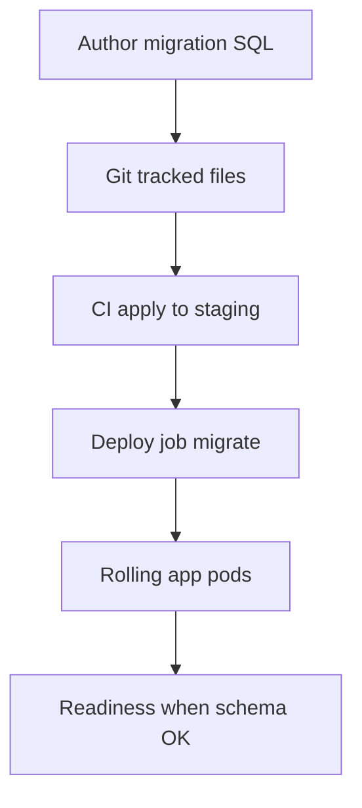
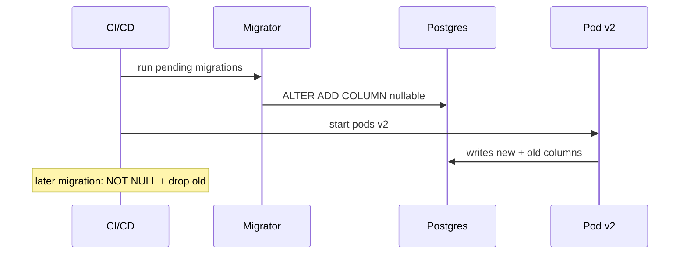

# Migrations as Operational Process

## Overview

**Schema migrations** are versioned, ordered scripts transforming database structure and sometimes data—applied by CI/CD or init job before/at deploy. Backend teams own **migration as operational process**: expand/contract for zero-downtime, backward-compatible rollouts, rollback policy, and coordination with running Express instances. DDL mechanics and locking → [[08-Databases/README|Databases]]; container pipeline → [[16-DevOps/README|DevOps]].

## Learning Objectives

- Author forward-only migrations with idempotent guards where needed
- Apply expand-contract pattern for column/table changes under traffic
- Run migrations in deploy pipeline vs app startup—trade-offs
- Gate readiness until migrations complete ([[07-Backend/10-Production-Services/Health Dependencies and Readiness Semantics|Health Dependencies and Readiness Semantics]])
- Document breaking schema changes with API versioning

## Prerequisites

- [[07-Backend/08-Data-Access-and-Persistence-Patterns/Repository and Unit of Work|Repository and Unit of Work]]
- [[16-DevOps/README|DevOps]]

## Difficulty

`intermediate`

## Estimated Time

- Reading: 2 hours
- Exercises: 4 hours
- Mini project: 6 hours

## History

Rails migrations (2004) set convention. Flyway/Liquibase enterprise patterns. Large shops formalized **expand-contract** when continuous deploy met ALTER TABLE locks.

## Problem It Solves

- **Schema drift** between environments
- **Deploy failure** when old code hits new column NOT NULL without backfill
- **Downtime** from blocking DDL
- **Unrecoverable** manual prod hotfixes without version control

## Internal Implementation



Expand-contract phases: expand (add nullable) → deploy code using both → backfill → contract (drop old).

## Mermaid Diagrams

### Structure

```mermaid
flowchart LR
    Migrations[migrations/] --> Runner[flyway / node-pg-migrate]
    Runner --> PG[(Postgres)]
    Deploy[[16-DevOps/README|DevOps pipeline]] --> Runner
    Express[Express app] --> PG
```

### Sequence / Lifecycle



## Examples

### Minimal Example

```sql
-- migrations/202607221200_add_orders_status.sql
ALTER TABLE orders ADD COLUMN IF NOT EXISTS status TEXT DEFAULT 'pending';
CREATE INDEX CONCURRENTLY IF NOT EXISTS idx_orders_status ON orders(status);
```

### Production-Shaped Example

```typescript
import express from 'express';

// migrations applied by deploy hook — NOT on every pod boot in large fleets
// package.json: "migrate": "node-pg-migrate up"

let schemaReady = false;

async function verifySchema(pool: Pool): Promise<void> {
  const res = await pool.query(
    `SELECT version FROM schema_migrations ORDER BY version DESC LIMIT 1`,
  );
  const latest = res.rows[0]?.version;
  schemaReady = latest === process.env.EXPECTED_SCHEMA_VERSION;
}

const app = express();

app.get('/health/ready', async (_req, res) => {
  if (!schemaReady) {
    res.status(503).json({ ready: false, reason: 'schema_migration_pending' });
    return;
  }
  res.json({ ready: true });
});

// Expand-contract: v1 code reads `email`, v2 reads `email_normalized` after backfill job
```

```typescript
// deploy/run-migrations.ts — invoked once per release
import migrate from 'node-pg-migrate';

export async function runMigrations(): Promise<void> {
  await migrate({ direction: 'up', databaseUrl: process.env.DATABASE_URL! });
}
```

Never `sync()` ORM schema in production.

## Trade-offs

| Dimension | Upside | Downside | When it matters |
| --- | --- | --- | --- |
| Migrate before deploy | Safe for NOT NULL | Requires backward compatible code | Always in prod |
| Migrate on boot | Simple | Race with N pods | Small apps |
| Expand-contract | Zero downtime | Multi-release effort | Large tables |
| Reversible down | Rollback comfort | Often untested | Staging only |

### When to Use

- Every schema change via versioned migration
- CONCURRENTLY indexes in Postgres for production
- Readiness gate on schema version

### When Not to Use

- Manual prod DDL without migration file—never

## Exercises

1. Rename column using expand-contract across two migration files + two deploy steps.
2. Simulate old pod running during ADD COLUMN—verify no crash.
3. Write runbook for failed migration mid-deploy.

## Mini Project

Migration pipeline doc in [[07-Backend/projects/Backend Service Toolkit/README|Backend Service Toolkit]] Deployment section.

## Portfolio Project

[[07-Backend/projects/URL Shortener API/README|URL Shortener API]] migration history.

## Interview Questions

1. Migrate on boot vs job—pros/cons at 50 replicas?
2. What is expand-contract with concrete column example?
3. Why CREATE INDEX CONCURRENTLY?
4. How do migrations interact with long-running transactions?

### Stretch / Staff-Level

1. Online resharding vs migrate-in-place decision.

## Common Mistakes

- NOT NULL without default in one step
- Blocking DDL on billion-row table in peak
- Different migration state across shards
- Down migrations never tested
- App v2 deployed before migration runs

## Best Practices

- One concern per migration file
- Backfill in batch job between expand and contract
- Store migration version in readiness
- Review lock duration in staging
- Cross-link [[08-Databases/README|Databases]] for lock behavior

## Summary

Migrations are **deploy artifacts**, not ad-hoc SQL: versioned, pipeline-applied, backward-compatible across rolling Express instances. Use expand-contract for breaking changes; readiness reflects schema readiness.

## Further Reading

- [[16-DevOps/README|DevOps]] — CI/CD hooks
- [[08-Databases/README|Databases]] — DDL locking

## Related Notes

- [[07-Backend/10-Production-Services/Deployment Topologies for Single Services|Deployment Topologies for Single Services]]
- [[07-Backend/10-Production-Services/Health Dependencies and Readiness Semantics|Health Dependencies and Readiness Semantics]]
- [[07-Backend/03-Validation-Errors-and-Versioning/Breaking Changes and Compatibility Windows|Breaking Changes and Compatibility Windows]]
- [[08-Databases/README|Databases]]
- [[16-DevOps/README|DevOps]]

## Progress Checklist

- [ ] Explained from first principles
- [ ] Drew at least one Mermaid diagram
- [ ] Implemented a minimal version
- [ ] Documented trade-offs and non-goals
- [ ] Completed exercises
- [ ] Practiced interview questions aloud
- [ ] Linked prerequisites and dependents
