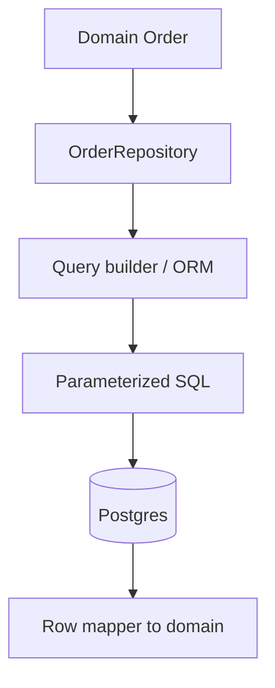
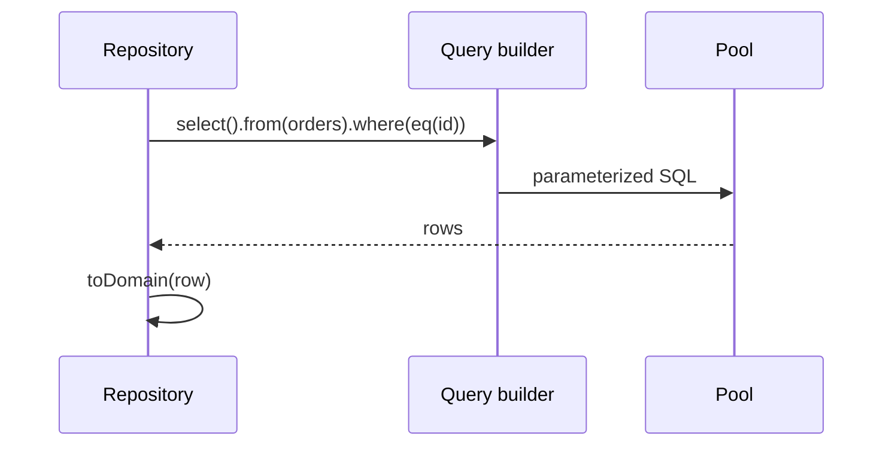

# Mini ORM Concepts and Query Builders

## Overview

**ORMs** map objects to relational rows (Prisma, TypeORM, Sequelize). **Query builders** compose SQL programmatically (Knex, Kysely, Drizzle SQL layer) without full object graph tracking. **Mini ORM concepts** for backend engineers: mapping boundaries, parameterized queries, migration integration, when **not** to abstract SQL. Planner, indexes, execution → [[08-Databases/README|Databases]]; repositories consume builders inside adapters ([[07-Backend/08-Data-Access-and-Persistence-Patterns/Repository and Unit of Work|Repository and Unit of Work]]).

## Learning Objectives

- Compare ORM, query builder, and raw SQL adapter roles
- Write parameterized queries—never string-concat user input
- Map rows to domain types at repository edge
- Understand connection pooling with ORM clients
- Detect when ORM magic causes N+1 ([[07-Backend/08-Data-Access-and-Persistence-Patterns/N-plus-1 and Query Shape Discipline|N-plus-1 and Query Shape Discipline]])

## Prerequisites

- [[07-Backend/08-Data-Access-and-Persistence-Patterns/Repository and Unit of Work|Repository and Unit of Work]]
- [[02-JavaScript/README|JavaScript]]

## Difficulty

`intermediate`

## Estimated Time

- Reading: 2 hours
- Exercises: 4 hours
- Mini project: 5 hours

## History

Active Record (Rails) → Hibernate → JS ORMs mirroring enterprise patterns. Recent shift to **lighter** Drizzle/Kysely for TypeScript inference and SQL transparency.

## Problem It Solves

- **SQL injection** from manual concatenation
- **Boilerplate** mapping for simple CRUD
- **Type drift** between TS types and columns
- **Opaque SQL** from heavy ORM lazy loads

## Internal Implementation



Keep ORM entities out of Express `res.json()`.

## Mermaid Diagrams

### Structure


### Sequence / Lifecycle



## Examples

### Minimal Example (raw parameterized)

```typescript
async function findUserByEmail(db: Pool, email: string): Promise<User | null> {
  const { rows } = await db.query(
    'SELECT id, email, name FROM users WHERE email = $1',
    [email],
  );
  return rows[0] ? { id: rows[0].id, email: rows[0].email, name: rows[0].name } : null;
}
```

### Production-Shaped Example (Drizzle-style)

```typescript
import express from 'express';
import { drizzle } from 'drizzle-orm/node-postgres';
import { eq, and, desc } from 'drizzle-orm';
import { orders, lineItems } from './schema';

const db = drizzle(pool);

class DrizzleOrderRepository implements OrderRepository {
  async findById(id: string): Promise<Order | null> {
    const row = await db.select().from(orders).where(eq(orders.id, id)).limit(1);
    return row[0] ? toOrder(row[0]) : null;
  }

  async listByTenant(tenantId: string, limit: number): Promise<Order[]> {
    const rows = await db
      .select()
      .from(orders)
      .where(eq(orders.tenantId, tenantId))
      .orderBy(desc(orders.createdAt))
      .limit(limit);
    return rows.map(toOrder);
  }

  async save(order: Order): Promise<void> {
    await db.insert(orders).values(fromOrder(order)).onConflictDoUpdate({
      target: orders.id,
      set: { status: order.status, total: order.total },
    });
  }
}

const app = express();
app.get('/orders', async (req, res, next) => {
  try {
    const data = await orderRepo.listByTenant(req.tenantId, 50);
    res.json({ data });
  } catch (err) {
    next(err);
  }
});
```

Prisma: `$transaction`, `$queryRaw` with tagged templates—still repository-wrapped.

## Trade-offs

| Dimension | Upside | Downside | When it matters |
| --- | --- | --- | --- |
| Full ORM | Migrations, relations | N+1, magic SQL | CRUD-heavy apps |
| Query builder | Visible SQL, types | Manual relations | TS services |
| Raw SQL | Max control | Verbose mapping | Hot paths |
| Client in handler | Fast prototype | Untestable | Anti-pattern |

### When to Use

- Query builder/ORM **inside** repository adapters
- Generated types from schema (Drizzle/Prisma)
- Migrations tied to schema definition

### When Not to Use

- ORM active record in Express routes
- ORM for complex analytics—use raw SQL/read replica

## Exercises

1. Implement same `findById` with raw SQL, Knex, and compare generated SQL.
2. Find N+1 in Prisma `include` example; fix with explicit `select`.
3. SQL injection lab: safe vs unsafe string build.

## Mini Project

Repository adapters in [[07-Backend/projects/Backend Service Toolkit/README|Backend Service Toolkit]].

## Portfolio Project

[[07-Backend/projects/URL Shortener API/README|URL Shortener API]] persistence layer.

## Interview Questions

1. ORM vs query builder vs raw—decision tree?
2. Where does domain type mapping happen?
3. How does `$transaction` relate to Unit of Work?
4. Why avoid `synchronize: true` in production?

### Stretch / Staff-Level

1. Dual-write ORM migration from legacy raw SQL incrementally.

## Common Mistakes

- Leaking ORM models to JSON responses
- `$queryRaw` with string interpolation
- One global Prisma client without pool limits
- Migrations out of sync with schema file
- Using ORM for bulk ETL in request path

## Best Practices

- Repository boundary mandatory
- Log slow query threshold
- `EXPLAIN` handoff to DBAs ([[08-Databases/README|Databases]])
- Single pool per process
- Version schema with migrations ([[07-Backend/08-Data-Access-and-Persistence-Patterns/Migrations as Operational Process|Migrations as Operational Process]])

## Summary

**Mini ORM literacy**: use query builders/ORMs **inside repositories**, parameterize everything, map to domain at the edge, and know SQL shape cost. Heavy engine theory belongs in Databases; Express stays persistence-agnostic.

## Further Reading

- [[08-Databases/README|Databases]]
- Drizzle / Kysely documentation (tooling)

## Related Notes

- [[07-Backend/08-Data-Access-and-Persistence-Patterns/Repository and Unit of Work|Repository and Unit of Work]]
- [[07-Backend/08-Data-Access-and-Persistence-Patterns/N-plus-1 and Query Shape Discipline|N-plus-1 and Query Shape Discipline]]
- [[07-Backend/08-Data-Access-and-Persistence-Patterns/Handing Off to Database Engines|Handing Off to Database Engines]]
- [[08-Databases/README|Databases]]

## Progress Checklist

- [ ] Explained from first principles
- [ ] Drew at least one Mermaid diagram
- [ ] Implemented a minimal version
- [ ] Documented trade-offs and non-goals
- [ ] Completed exercises
- [ ] Practiced interview questions aloud
- [ ] Linked prerequisites and dependents
