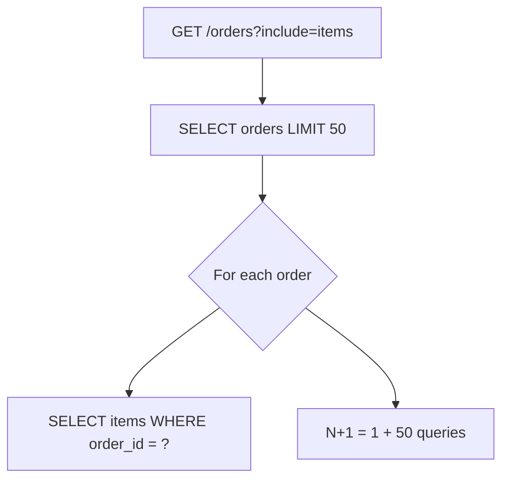
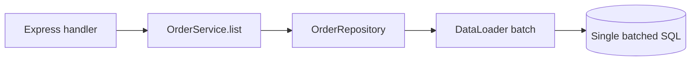
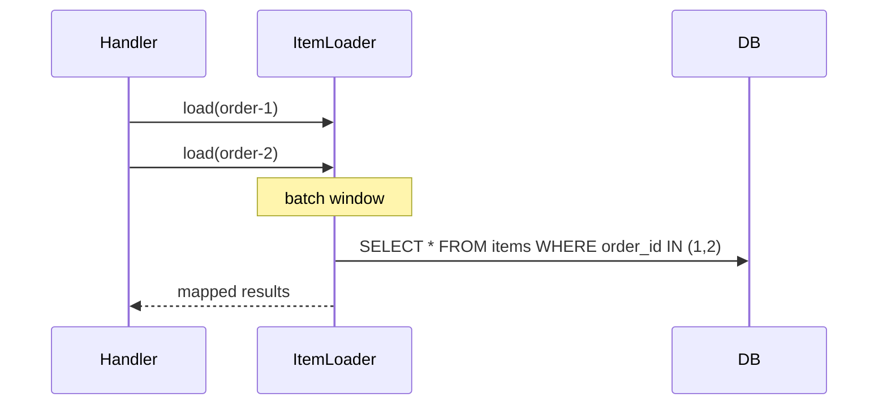

# N-plus-1 and Query Shape Discipline

## Overview

**N+1 query problem**: one query loads N parent rows, then N additional queries load each child—latency and load explode. **Query shape discipline** means designing repository methods and API responses knowing SQL cost: joins, batch `IN` queries, DataLoader batching, pagination limits. Index and planner tuning → [[08-Databases/README|Databases]]; this note is **application access patterns** in Express services.

## Learning Objectives

- Detect N+1 in ORM logs and APM traces
- Fix with join fetch, batched loaders, or denormalized read models
- Align HTTP list endpoints with bounded query count
- Use DataLoader per request for graph resolution
- Document max depth/expansion in API contract ([[07-Backend/01-HTTP-APIs-and-Contracts/Pagination Filtering and Sorting Contracts|Pagination Filtering and Sorting Contracts]])

## Prerequisites

- [[07-Backend/08-Data-Access-and-Persistence-Patterns/Repository and Unit of Work|Repository and Unit of Work]]
- [[07-Backend/08-Data-Access-and-Persistence-Patterns/Mini ORM Concepts and Query Builders|Mini ORM Concepts and Query Builders]]

## Difficulty

`intermediate`

## Estimated Time

- Reading: 2 hours
- Exercises: 3 hours
- Mini project: 4 hours

## History

ORM lazy-loading defaults caused production incidents in Rails Hibernate era. GraphQL DataLoader (2015) formalized per-request batching. API `?include=` parameters recreated N+1 in JSON APIs.

## Problem It Solves

- **p99 latency** spikes on list endpoints
- **DB CPU** from thousands of trivial SELECTs
- **Connection pool** saturation under moderate RPS
- **Hidden queries** in middleware/serializers

## Internal Implementation



Fixed shape: `SELECT orders JOIN items` or `SELECT items WHERE order_id IN (...)`.

## Mermaid Diagrams

### Structure



### Sequence / Lifecycle



## Examples

### Minimal Example (N+1 anti-pattern)

```typescript
// Anti-pattern — do not ship
async function listOrdersBad(db: Db): Promise<OrderDto[]> {
  const orders = await db.query('SELECT * FROM orders LIMIT 100');
  return Promise.all(orders.map(async (o) => ({
    ...o,
    items: await db.query('SELECT * FROM line_items WHERE order_id = $1', [o.id]),
  })));
}
```

### Production-Shaped Example

```typescript
import express from 'express';
import DataLoader from 'dataloader';

function createItemLoader(db: Db) {
  return new DataLoader<string, LineItem[]>(async (orderIds) => {
    const rows = await db.query(
      'SELECT * FROM line_items WHERE order_id = ANY($1)',
      [orderIds],
    );
    const byOrder = new Map<string, LineItem[]>();
    for (const row of rows) {
      const list = byOrder.get(row.order_id) ?? [];
      list.push(row);
      byOrder.set(row.order_id, list);
    }
    return orderIds.map((id) => byOrder.get(id) ?? []);
  });
}

const app = express();

app.get('/orders', async (req, res, next) => {
  try {
    const include = req.query.include === 'items';
    const orders = await orderRepo.list({ limit: 50 });

    if (!include) {
      res.json({ data: orders });
      return;
    }

    const loader = createItemLoader(db);
    const enriched = await Promise.all(
      orders.map(async (o) => ({ ...o, items: await loader.load(o.id) })),
    );
    res.json({ data: enriched });
  } catch (err) {
    next(err);
  }
});
```

Alternative: explicit `listWithItems()` repository method with JOIN + aggregation when shape is fixed.

Log `query_count` per request in dev middleware.

## Trade-offs

| Dimension | Upside | Downside | When it matters |
| --- | --- | --- | --- |
| JOIN fetch | One round trip | Wide rows, cartesian risk | Fixed includes |
| DataLoader | Flexible Graph | Per-request setup | Variable includes |
| Denormalized read | Fast lists | Staleness/sync | High read QPS |
| Lazy load | Simple code | N+1 trap | Never in hot paths |

### When to Use

- List endpoints with related entities
- GraphQL resolvers
- Serializers touching associations

### When Not to Use

- Deep arbitrary nesting without limits—product cap `include` depth

## Exercises

1. Capture query log: list 100 orders with items—count queries before/after fix.
2. Implement repository `listWithItems` JOIN; compare payload size vs batch IN.
3. Add middleware asserting `query_count <= 5` in tests.

## Mini Project

Query budget tests in [[07-Backend/projects/URL Shortener API/README|URL Shortener API]] analytics endpoint.

## Portfolio Project

DataLoader utilities in [[07-Backend/projects/Backend Service Toolkit/README|Backend Service Toolkit]].

## Interview Questions

1. Define N+1 with numbers (1 + N).
2. JOIN vs IN batch—when cartesian product bites?
3. Should DataLoader be singleton or per-request?
4. How do pagination and N+1 interact?

### Stretch / Staff-Level

1. Read model projection vs live join for feed API.

## Common Mistakes

- Lazy loading in JSON serializer loop
- Global DataLoader crossing requests (cache leak)
- Unbounded `include` query param
- COUNT + list as separate unoptimized patterns
- Fixing N+1 without index on FK ([[08-Databases/README|Databases]])

## Best Practices

- Explicit fetch plans per endpoint
- Per-request loader instances
- Pagination caps ([[07-Backend/01-HTTP-APIs-and-Contracts/Pagination Filtering and Sorting Contracts|Pagination Filtering and Sorting Contracts]])
- Trace SQL count in staging
- Code review checklist for loops + await + repo

## Summary

**N+1** is an application shape bug: one list query plus per-row fetches. Fix with **joins**, **batched IN**, or **DataLoader** per request—bounded by API contract. Measure queries per handler; hand index tuning to Databases.

## Further Reading

- [[08-Databases/README|Databases]] — indexes on foreign keys
- [[07-Backend/09-API-Observability-and-Testing/Distributed Tracing Across Handlers|Distributed Tracing Across Handlers]]

## Related Notes

- [[07-Backend/08-Data-Access-and-Persistence-Patterns/Mini ORM Concepts and Query Builders|Mini ORM Concepts and Query Builders]]
- [[07-Backend/08-Data-Access-and-Persistence-Patterns/Handing Off to Database Engines|Handing Off to Database Engines]]
- [[07-Backend/09-API-Observability-and-Testing/RED Metrics and SLIs for APIs|RED Metrics and SLIs for APIs]]
- [[08-Databases/README|Databases]]

## Progress Checklist

- [ ] Explained from first principles
- [ ] Drew at least one Mermaid diagram
- [ ] Implemented a minimal version
- [ ] Documented trade-offs and non-goals
- [ ] Completed exercises
- [ ] Practiced interview questions aloud
- [ ] Linked prerequisites and dependents
