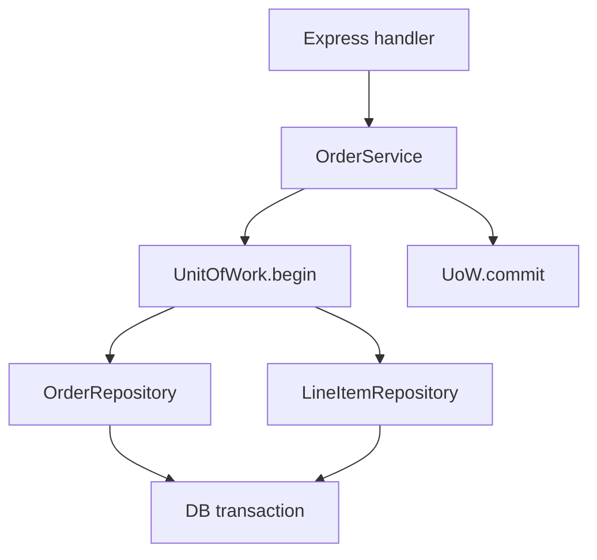
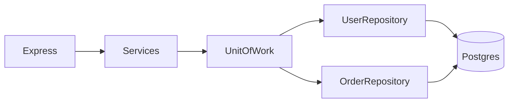
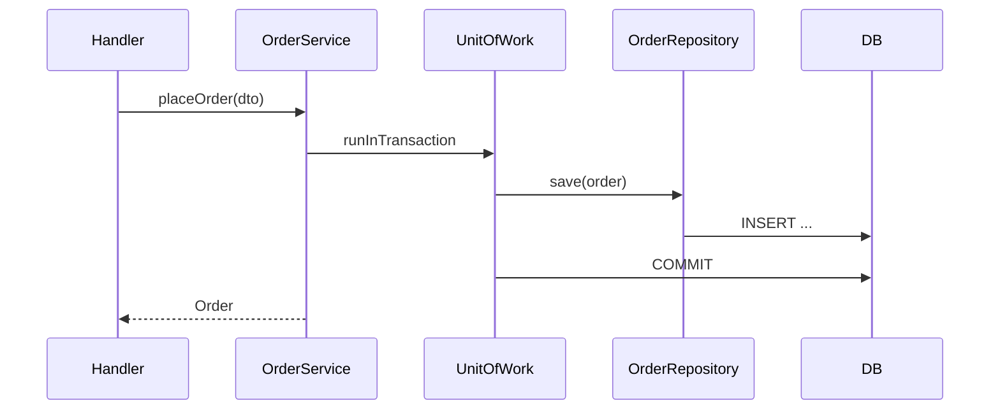

# Repository and Unit of Work

## Overview

A **Repository** mediates between domain/service layer and persistence—collection-like API for aggregates (`findById`, `save`, `delete`) hiding SQL/ORM details. **Unit of Work** (UoW) tracks changes across repositories in one **business transaction**, committing once. Express handlers call **services**; services use repositories—not raw SQL in routes. Query planning and indexes → [[07-Backend/08-Data-Access-and-Persistence-Patterns/Handing Off to Database Engines|Handing Off to Database Engines]] / [[08-Databases/README|Databases]].

## Learning Objectives

- Define repository interfaces per aggregate, not per table
- Implement UoW wrapping DB transaction and repository registry
- Inject repositories via DI ([[07-Backend/02-Frameworks-and-Middleware/Dependency Injection for Services|Dependency Injection for Services]])
- Test services with in-memory/fake repositories
- Avoid anemic domain vs over-engineered generic repos

## Prerequisites

- [[07-Backend/00-Orientation/Service Layering and Hexagonal Intuition|Service Layering and Hexagonal Intuition]]
- [[07-Backend/02-Frameworks-and-Middleware/Dependency Injection for Services|Dependency Injection for Services]]

## Difficulty

`intermediate`

## Estimated Time

- Reading: 2 hours
- Exercises: 4 hours
- Mini project: 6 hours

## History

Eric Evans' DDD (2003) popularized Repository. Fowler's Unit of Work coordinates EF/Hibernate sessions. Node services often skipped patterns until testability and multi-repo transactions forced structure.

## Problem It Solves

- **SQL scattered** in Express routes
- **Partial commits** across multiple tables
- **Untestable** handlers requiring real DB
- **Leaky ORM** types into HTTP layer

## Internal Implementation



Repositories receive `tx` client from UoW for same connection.

## Mermaid Diagrams

### Structure



### Sequence / Lifecycle



## Examples

### Minimal Example

```typescript
interface OrderRepository {
  findById(id: string): Promise<Order | null>;
  save(order: Order): Promise<void>;
}

class PostgresOrderRepository implements OrderRepository {
  constructor(private readonly db: DbClient) {}

  async findById(id: string): Promise<Order | null> {
    const row = await this.db.query('SELECT * FROM orders WHERE id = $1', [id]);
    return row ? mapOrder(row) : null;
  }

  async save(order: Order): Promise<void> {
    await this.db.query(
      'INSERT INTO orders (id, total) VALUES ($1, $2) ON CONFLICT (id) DO UPDATE SET total = $2',
      [order.id, order.total],
    );
  }
}
```

### Production-Shaped Example

```typescript
import express from 'express';

interface UnitOfWork {
  orders: OrderRepository;
  inventory: InventoryRepository;
  commit(): Promise<void>;
  rollback(): Promise<void>;
}

class OrderService {
  constructor(private readonly uowFactory: () => Promise<UnitOfWork>) {}

  async placeOrder(input: PlaceOrderDto): Promise<Order> {
    const uow = await this.uowFactory();
    try {
      const order = Order.create(input);
      await uow.inventory.reserve(order.lines);
      await uow.orders.save(order);
      await uow.commit();
      return order;
    } catch (err) {
      await uow.rollback();
      throw err;
    }
  }
}

const app = express();
app.use(express.json());

app.post('/orders', async (req, res, next) => {
  try {
    const order = await orderService.placeOrder(req.body);
    res.status(201).json(order);
  } catch (err) {
    next(err);
  }
});
```

Fake UoW for tests: in-memory maps, same interface.

## Trade-offs

| Dimension | Upside | Downside | When it matters |
| --- | --- | --- | --- |
| Repository per aggregate | Clear boundaries | Many interfaces | Medium domains |
| Generic repo | Less boilerplate | Query leakage | CRUD admin |
| UoW explicit | Multi-repo atomicity | Ceremony | Order + inventory |
| Active Record ORM | Speed | Layer bleed | Prototypes |

### When to Use

- Services with multiple persistence touches per use case
- Teams needing test doubles
- Hexagonal/ports-adapters layout

### When Not to Use

- Single-table CRUD with no domain rules
- Read models where raw SQL is the point ([[07-Backend/08-Data-Access-and-Persistence-Patterns/N-plus-1 and Query Shape Discipline|N-plus-1 and Query Shape Discipline]])

## Exercises

1. Fake `OrderRepository` proving service tests without Postgres.
2. UoW rollback when second `save` fails—verify first insert undone.
3. Refactor route with inline SQL to service + repository.

## Mini Project

Repository layer in [[07-Backend/projects/URL Shortener API/README|URL Shortener API]].

## Portfolio Project

Persistence ports in [[07-Backend/projects/Backend Service Toolkit/README|Backend Service Toolkit]].

## Interview Questions

1. Repository vs DAO vs active record?
2. Where does transaction boundary live—service or UoW?
3. One repository per table—anti-pattern?
4. How do you repository-ify complex reporting queries?

### Stretch / Staff-Level

1. UoW across DB + outbox in one transaction.

## Common Mistakes

- Repository returning DB rows to HTTP layer
- God repository with 40 methods
- New connection per repository call inside one transaction
- Skipping interface for “only one implementation”
- Caching inside repository without invalidation policy

## Best Practices

- Repository methods express domain language
- UoW factory per request or scoped DI
- Map DB ↔ domain at repository edge
- Integration tests on real Postgres adapter
- Cross-link transactions note

## Summary

**Repositories** hide persistence; **Unit of Work** aligns multiple repository operations with one commit. Keep Express thin, services orchestrate, repositories translate—engine optimization stays downstream.

## Further Reading

- Evans, *Domain-Driven Design* — Repository
- [[07-Backend/08-Data-Access-and-Persistence-Patterns/Transactions as Used by Services|Transactions as Used by Services]]

## Related Notes

- [[07-Backend/08-Data-Access-and-Persistence-Patterns/Transactions as Used by Services|Transactions as Used by Services]]
- [[07-Backend/08-Data-Access-and-Persistence-Patterns/Mini ORM Concepts and Query Builders|Mini ORM Concepts and Query Builders]]
- [[07-Backend/07-Caching-Jobs-and-Messaging/Cache-Aside and TTL Strategies|Cache-Aside and TTL Strategies]]
- [[08-Databases/README|Databases]]

## Progress Checklist

- [ ] Explained from first principles
- [ ] Drew at least one Mermaid diagram
- [ ] Implemented a minimal version
- [ ] Documented trade-offs and non-goals
- [ ] Completed exercises
- [ ] Practiced interview questions aloud
- [ ] Linked prerequisites and dependents
