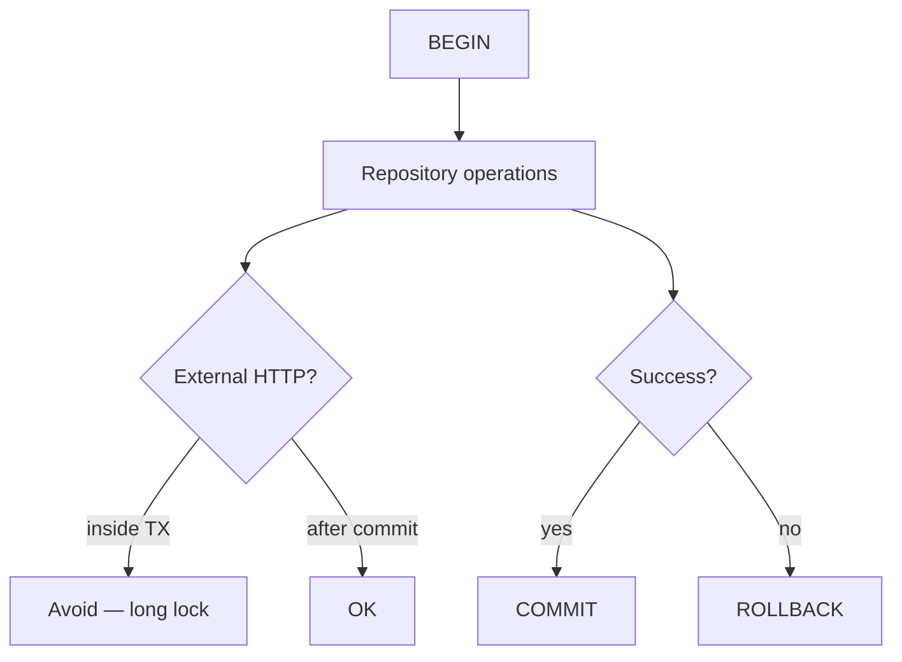
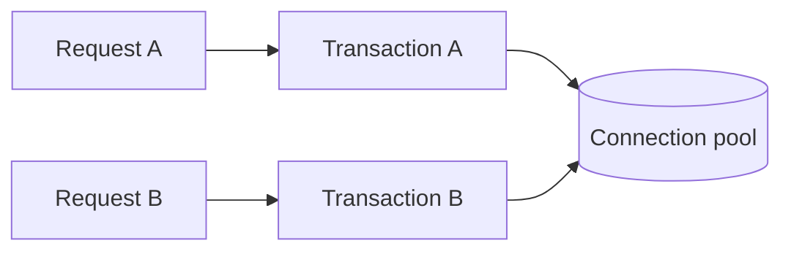
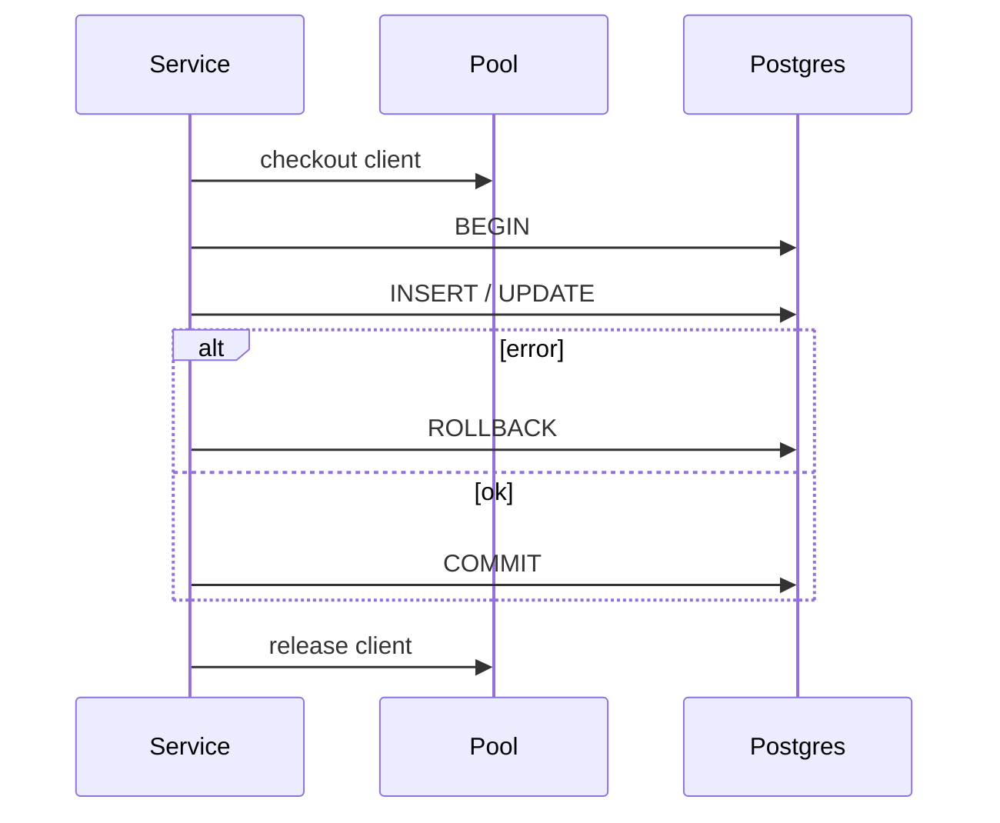

# Transactions as Used by Services

## Overview

A **database transaction** groups reads/writes into one atomic unit: **commit** persists all; **rollback** discards all. Backend **services** define transactional boundaries—typically one use case per transaction—not one transaction per HTTP middleware layer. Isolation levels, locks, and MVCC mechanics → [[08-Databases/05-Transactions-and-Isolation/Locking vs MVCC|Locking vs MVCC]] and [[08-Databases/05-Transactions-and-Isolation/Isolation Levels and Product Defaults|Isolation Levels and Product Defaults]]; here: **when** services begin/commit, how Express concurrency interacts, and pitfalls (long transactions, nested calls).

## Learning Objectives

- Place transaction boundaries at service use-case level
- Use READ COMMITTED default safely; know when SERIALIZABLE needed
- Propagate same `tx` client through repositories in one request
- Avoid holding transactions open across outbound HTTP calls
- Pair transactions with outbox ([[07-Backend/07-Caching-Jobs-and-Messaging/Transactional Outbox and Inbox Patterns|Transactional Outbox and Inbox Patterns]])

## Prerequisites

- [[07-Backend/08-Data-Access-and-Persistence-Patterns/Repository and Unit of Work|Repository and Unit of Work]]
- [[08-Databases/README|Databases]]

## Difficulty

`intermediate`

## Estimated Time

- Reading: 2 hours
- Exercises: 4 hours
- Mini project: 5 hours

## History

ACID in relational systems since System R. ORMs blurred boundaries with session-per-request. Microservices backlash pushed “no distributed transactions”—local TX + sagas/outbox instead.

## Problem It Solves

- **Partial updates** (money debited, inventory not reserved)
- **Dirty reads** from wrong isolation assumptions
- **Connection pool exhaustion** from long TX
- **Lost events** when commit and publish not atomic

## Internal Implementation



Express: many concurrent requests → many independent transactions.

## Mermaid Diagrams

### Structure



### Sequence / Lifecycle



## Examples

### Minimal Example

```typescript
async function transferFunds(db: Pool, from: string, to: string, amount: number): Promise<void> {
  const client = await db.connect();
  try {
    await client.query('BEGIN');
    await client.query('UPDATE accounts SET balance = balance - $1 WHERE id = $2', [amount, from]);
    await client.query('UPDATE accounts SET balance = balance + $1 WHERE id = $2', [amount, to]);
    await client.query('COMMIT');
  } catch (err) {
    await client.query('ROLLBACK');
    throw err;
  } finally {
    client.release();
  }
}
```

### Production-Shaped Example

```typescript
import express from 'express';

export async function runInTransaction<T>(
  pool: Pool,
  fn: (tx: TxClient) => Promise<T>,
): Promise<T> {
  const client = await pool.connect();
  try {
    await client.query('BEGIN');
    const result = await fn(createTxClient(client));
    await client.query('COMMIT');
    return result;
  } catch (err) {
    await client.query('ROLLBACK');
    throw err;
  } finally {
    client.release();
  }
}

class BillingService {
  async chargeInvoice(invoiceId: string): Promise<void> {
    await runInTransaction(pool, async (tx) => {
      const invoice = await tx.invoices.lockForUpdate(invoiceId);
      if (invoice.status === 'paid') return;

      await tx.payments.insert({ invoiceId, amount: invoice.total });
      await tx.invoices.markPaid(invoiceId);
      await tx.outbox.insert({ type: 'invoice.paid', payload: { invoiceId } });
    });
  }
}

const app = express();
app.post('/invoices/:id/charge', async (req, res, next) => {
  try {
    await billingService.chargeInvoice(req.params.id);
    res.status(204).end();
  } catch (err) {
    next(err);
  }
});
```

`SELECT ... FOR UPDATE` for contested rows. Retry **serialization failures** (40001) with backoff at service layer.

## Trade-offs

| Dimension | Upside | Downside | When it matters |
| --- | --- | --- | --- |
| Short TX | Less locking | More round trips | High write QPS |
| Long TX | Fewer commits | Pool starvation | Avoid |
| SERIALIZABLE | Correctness | Retries/latency | Ledger invariants |
| Saga/outbox | Cross-service | Complexity | Microservices |

### When to Use

- Multi-row invariants in one aggregate/use case
- Outbox + business write atomicity
- Financial state transitions

### When Not to Use

- Spanning external payment API inside same DB TX
- Read-only endpoints (use read replica, no TX needed often)

## Exercises

1. Demonstrate lost update without `FOR UPDATE`; fix with row lock.
2. Measure pool usage when TX wraps 5s simulated external call.
3. Implement serialization failure retry (max 3).

## Mini Project

Transactional charge + outbox in [[07-Backend/projects/Job Worker and Outbox Lab/README|Job Worker and Outbox Lab]].

## Portfolio Project

Tx helper in [[07-Backend/projects/Backend Service Toolkit/README|Backend Service Toolkit]].

## Interview Questions

1. Where should transaction start—not in controller?
2. Can you call Stripe inside a DB transaction?
3. READ COMMITTED vs REPEATABLE READ for reporting?
4. How does connection pool relate to concurrent Express requests?

### Stretch / Staff-Level

1. Two-phase commit vs outbox—when still consider 2PC?

## Common Mistakes

- Transaction per repository method (no atomicity across repos)
- Swallowing rollback errors
- Nested transactions without savepoints (driver-dependent)
- ORM lazy load triggering queries after commit
- Global transaction middleware for all routes

## Best Practices

- One transaction per service command
- Lock order consistency to avoid deadlocks
- Timeout statements (`SET statement_timeout`)
- Log tx duration metrics
- Hand isolation depth to [[08-Databases/05-Transactions-and-Isolation/Isolation Levels and Product Defaults|Isolation Levels and Product Defaults]]

## Summary

Services own **transactional boundaries**: begin, work through repositories on one client, commit or rollback—**never** across slow external I/O. Combine with outbox for reliable side effects; defer isolation theory to Databases track.

## Further Reading

- [[08-Databases/05-Transactions-and-Isolation/Locking vs MVCC|Locking vs MVCC]] — isolation and locking
- [[07-Backend/07-Caching-Jobs-and-Messaging/Transactional Outbox and Inbox Patterns|Transactional Outbox and Inbox Patterns]]

## Related Notes

- [[07-Backend/08-Data-Access-and-Persistence-Patterns/Repository and Unit of Work|Repository and Unit of Work]]
- [[07-Backend/08-Data-Access-and-Persistence-Patterns/Migrations as Operational Process|Migrations as Operational Process]]
- [[07-Backend/07-Caching-Jobs-and-Messaging/Transactional Outbox and Inbox Patterns|Transactional Outbox and Inbox Patterns]]
- [[08-Databases/README|Databases]]

## Progress Checklist

- [ ] Explained from first principles
- [ ] Drew at least one Mermaid diagram
- [ ] Implemented a minimal version
- [ ] Documented trade-offs and non-goals
- [ ] Completed exercises
- [ ] Practiced interview questions aloud
- [ ] Linked prerequisites and dependents
