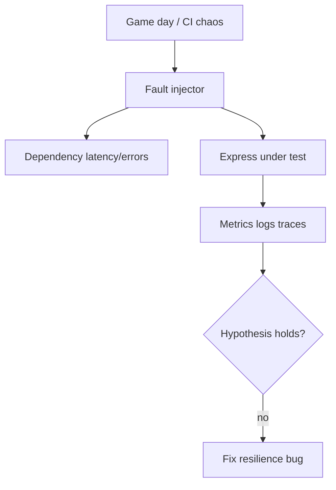
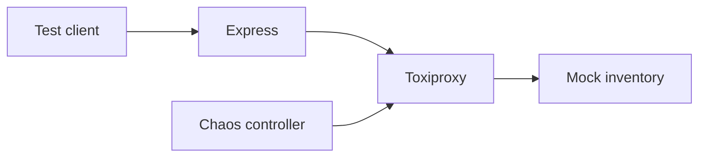
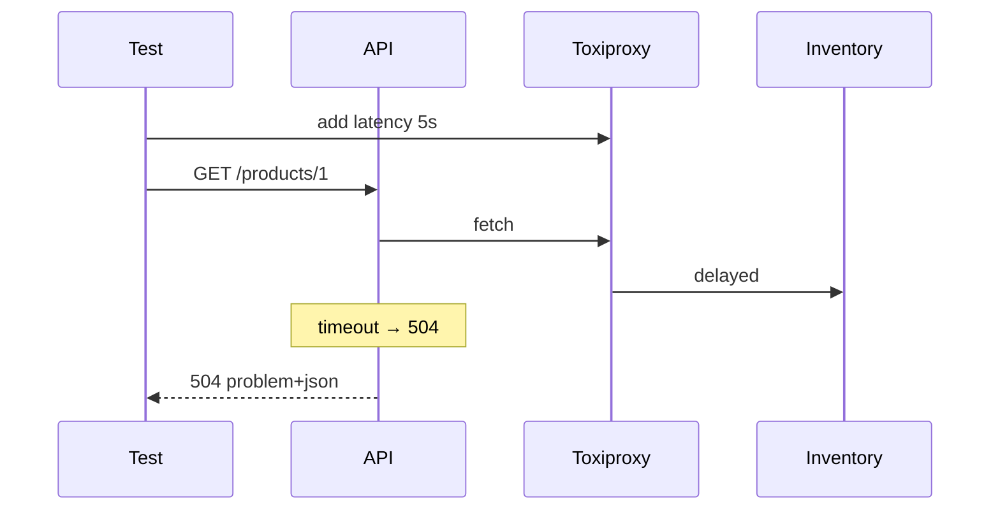

# Chaos and Failure Injection at the Service Edge

## Overview

**Chaos engineering** proactively injects failures—latency, errors, dependency outage—to verify resilience mechanisms work. At the **service edge** (Express layer), inject via middleware flags, Toxiproxy between API and dependencies, or test hooks—not production random kills without blast radius control. Validates breakers, timeouts, retries ([[07-Backend/06-Reliability-and-Abuse-Resistance|Reliability module]]). Large-scale platform chaos → [[09-System-Design/09-Failure-Modes-at-Product-Scale/Chaos Blast Radius and Dependency Failure|Chaos Blast Radius and Dependency Failure]] / [[16-DevOps/README|DevOps]].

## Learning Objectives

- Design safe fault injection for staging (tenant-scoped, header-gated)
- Test circuit breaker open, timeout 504, and retry jitter behavior
- Use Toxiproxy or mock servers for dependency failure modes
- Define steady-state hypotheses before experiments
- Automate game-day scenarios in CI smoke where feasible

## Prerequisites

- [[07-Backend/06-Reliability-and-Abuse-Resistance/Circuit Breakers and Bulkheads|Circuit Breakers and Bulkheads]]
- [[07-Backend/09-API-Observability-and-Testing/Contract Integration and Load Testing|Contract Integration and Load Testing]]

## Difficulty

`advanced`

## Estimated Time

- Reading: 2 hours
- Exercises: 4 hours
- Mini project: 6 hours

## History

Netflix Chaos Monkey (2011) popularized random instance termination. **Application-level** fault injection (Stripe, Amazon fault injection simulator) targets dependencies with controlled blast radius.

## Problem It Solves

- **Resilience code never executed** until real outage
- **False confidence** from unit mocks always succeeding
- **Unknown** behavior when Redis/DB slow—not down
- **Missing metrics** on degraded paths

## Internal Implementation



Hypothesis example: "When inventory 503 > 50%, breaker opens and API returns 503 in <50ms without pool exhaustion."

## Mermaid Diagrams

### Structure



### Sequence / Lifecycle



## Examples

### Minimal Example (test-only middleware)

```typescript
import express from 'express';

const app = express();

if (process.env.NODE_ENV === 'test') {
  app.use((req, _res, next) => {
    if (req.header('X-Chaos-Inventory-503') === '1') {
      (req as express.Request & { chaos?: object }).chaos = { inventory: '503' };
    }
    next();
  });
}

async function callInventory(req: express.Request, path: string) {
  const chaos = (req as express.Request & { chaos?: { inventory?: string } }).chaos;
  if (chaos?.inventory === '503') {
    throw Object.assign(new Error('chaos'), { status: 503 });
  }
  return fetch(`https://inventory.internal${path}`);
}
```

### Production-Shaped Example (staging gate)

```typescript
import express from 'express';

function stagingChaosMiddleware(): express.RequestHandler {
  return (req, res, next) => {
    if (process.env.APP_ENV !== 'staging') return next();

    const fault = req.header('X-Staging-Fault');
    if (!fault || !req.header('X-Chaos-Token')?.startsWith(process.env.CHAOS_TOKEN_PREFIX)) {
      return next();
    }

    req.faultInjection = parseFaultHeader(fault); // e.g. "db_latency_ms=2000"
    next();
  };
}

const app = express();
app.use(stagingChaosMiddleware());

app.get('/orders/:id', async (req, res, next) => {
  try {
    if (req.faultInjection?.dbLatencyMs) {
      await sleep(req.faultInjection.dbLatencyMs);
    }
    const order = await orderService.get(req.params.id);
    res.json(order);
  } catch (err) {
    next(err);
  }
});
```

Never enable unauthenticated chaos in production. Platform-level pod kills → [[16-DevOps/README|DevOps]].

## Trade-offs

| Dimension | Upside | Downside | When it matters |
| --- | --- | --- | --- |
| Staging chaos | Safe learning | Not prod-identical | Weekly game days |
| CI injection | Regression | Slower pipeline | Critical paths |
| Prod chaos | Real | Blast radius | Mature SRE only |
| Mock faults | Deterministic | Unrealistic timing | Unit level |

### When to Use

- Before launching reliability-sensitive features
- After changing breaker/timeout defaults
- Validating [[07-Backend/06-Reliability-and-Abuse-Resistance/Graceful Request Drain Above Process Shutdown|Graceful Request Drain Above Process Shutdown]]

### When Not to Use

- As substitute for code review of error paths
- Uncontrolled prod injection without executive approval

## Exercises

1. Toxiproxy: 100% inventory failure → assert breaker opens within N requests.
2. Document steady-state metric before/after latency injection.
3. Chaos test: Redis down during session read—verify fail-closed policy.

## Mini Project

Chaos suite in [[07-Backend/projects/API Contract and Reliability Harness/README|API Contract and Reliability Harness]].

## Portfolio Project

Game-day runbook in [[07-Backend/projects/Backend Service Toolkit/README|Backend Service Toolkit]].

## Interview Questions

1. Chaos vs integration test with mock 503?
2. Blast radius controls for staging faults?
3. What hypothesis for timeout chaos experiment?
4. Should chaos run in CI on every PR?

### Stretch / Staff-Level

1. Design progressive delivery + automated rollback on SLO burn during fault test.

## Common Mistakes

- Chaos only killing pods, never slow dependencies
- No observability during experiment
- Production chaos without tenant isolation
- Fixing symptoms (raise timeout) not root cause
- Skipping rollback verification

## Best Practices

- Written hypothesis + abort conditions
- Coordinate with [[07-Backend/09-API-Observability-and-Testing/RED Metrics and SLIs for APIs|RED Metrics and SLIs]]
- Record game-day outcomes in postmortem template
- Start with dependency latency before hard down
- Link platform chaos to app expectations

## Summary

**Service-edge chaos** validates that Express resilience patterns actually work under dependency failure and latency. Gate injection to staging/tests, use proxies and headers, measure RED/traces, and keep production blast radius in DevOps/System Design scope.

## Further Reading

- [[09-System-Design/09-Failure-Modes-at-Product-Scale/Chaos Blast Radius and Dependency Failure|Chaos Blast Radius and Dependency Failure]]
- [[16-DevOps/README|DevOps]]
- Principles of Chaos Engineering (principlesofchaos.org)

## Related Notes

- [[07-Backend/06-Reliability-and-Abuse-Resistance/Circuit Breakers and Bulkheads|Circuit Breakers and Bulkheads]]
- [[07-Backend/06-Reliability-and-Abuse-Resistance/Timeouts Cancellation and Deadlines|Timeouts Cancellation and Deadlines]]
- [[07-Backend/09-API-Observability-and-Testing/Contract Integration and Load Testing|Contract Integration and Load Testing]]
- [[09-System-Design/README|System Design]]

## Progress Checklist

- [ ] Explained from first principles
- [ ] Drew at least one Mermaid diagram
- [ ] Implemented a minimal version
- [ ] Documented trade-offs and non-goals
- [ ] Completed exercises
- [ ] Practiced interview questions aloud
- [ ] Linked prerequisites and dependents
