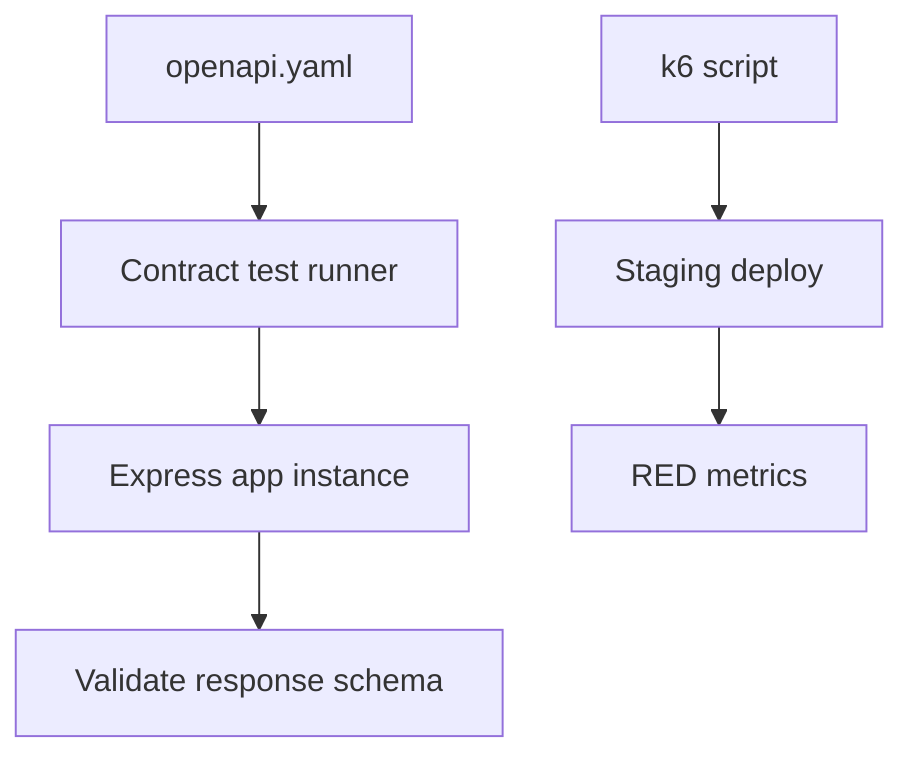
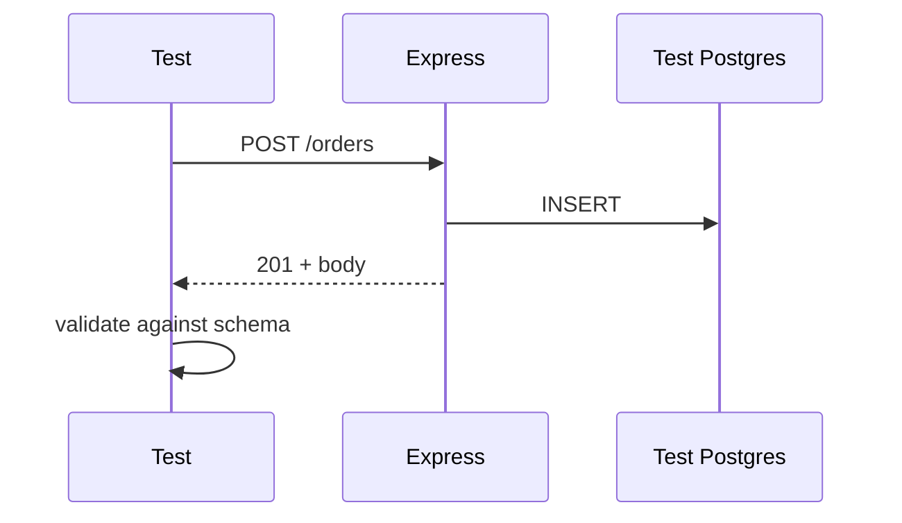

# Contract Integration and Load Testing

## Overview

**Contract tests** verify API responses match OpenAPI/JSON Schema—status, headers, body shape—catching breaking changes before clients do. **Integration tests** exercise Express app against real Postgres/Redis test containers or ephemeral DB. **Load tests** measure RPS, latency, and error rate under sustained traffic (k6, Artillery)—validating SLO headroom ([[07-Backend/09-API-Observability-and-Testing/RED Metrics and SLIs for APIs|RED Metrics and SLIs for APIs]]). CI pipeline wiring → [[16-DevOps/README|DevOps]].

## Learning Objectives

- Generate contract tests from OpenAPI with schemathesis or Dredd
- Structure integration tests: app boot, migrations, seed, supertest
- Run load tests against staging with realistic auth and payload mix
- Separate unit (mock repo) vs integration (real DB) vs contract (HTTP surface)
- Gate releases on contract + critical integration paths

## Prerequisites

- [[07-Backend/01-HTTP-APIs-and-Contracts/OpenAPI as Executable Contract|OpenAPI as Executable Contract]]
- [[07-Backend/03-Validation-Errors-and-Versioning/Schema Validation at the Edge|Schema Validation at the Edge]]

## Difficulty

`intermediate`

## Estimated Time

- Reading: 2 hours
- Exercises: 4 hours
- Mini project: 6 hours ([[07-Backend/projects/API Contract and Reliability Harness/README|API Contract and Reliability Harness]])

## History

Consumer-driven contracts (Pact) for microservices. OpenAPI as single source enabled **response validation** tools. Load testing moved from annual ops fire drills to CI smoke load jobs.

## Problem It Solves

- **Silent breaking** field renames
- **Green unit tests** but broken HTTP wiring
- **Production surprise** at 2× traffic
- **Schema drift** between code and docs

## Internal Implementation



## Mermaid Diagrams

### Structure

```mermaid
flowchart LR
    CI[[16-DevOps/README|DevOps CI]] --> Unit[Unit tests vitest]
    CI --> Int[Integration supertest]
    CI --> Contract[OpenAPI contract]
    CI --> LoadSmoke[k6 smoke load]
```

### Sequence / Lifecycle



## Examples

### Minimal Example (supertest)

```typescript
import request from 'supertest';
import { describe, it, expect, beforeAll, afterAll } from 'vitest';
import { createApp } from '../src/app';

describe('POST /orders', () => {
  let app: Express.Application;

  beforeAll(async () => {
    await migrateTestDb();
    app = createApp({ db: testPool });
  });

  it('returns 201 and order id', async () => {
    const res = await request(app)
      .post('/orders')
      .set('Authorization', 'Bearer test-token')
      .send({ sku: 'ABC', qty: 1 });

    expect(res.status).toBe(201);
    expect(res.body).toMatchObject({ id: expect.any(String), status: 'pending' });
  });
});
```

### Production-Shaped Example

```typescript
import express from 'express';
import Ajv from 'ajv';
import addFormats from 'ajv-formats';
import openApiSpec from './openapi.json';
import request from 'supertest';

const ajv = new Ajv({ strict: true });
addFormats(ajv);

const validateOrderResponse = ajv.compile(
  openApiSpec.components.schemas.OrderResponse,
);

describe('contract: GET /orders/:id', () => {
  it('matches OpenAPI schema', async () => {
    const app = createApp();
    const res = await request(app)
      .get('/orders/00000000-0000-4000-8000-000000000001')
      .set('X-Tenant-Id', 'tenant-test');

    expect(res.status).toBe(200);
    const valid = validateOrderResponse(res.body);
    if (!valid) {
      throw new Error(JSON.stringify(validateOrderResponse.errors));
    }
  });
});
```

k6 load sketch:

```javascript
import http from 'k6/http';
import { check, sleep } from 'k6';

export const options = { vus: 50, duration: '2m', thresholds: {
  http_req_failed: ['rate<0.01'],
  http_req_duration: ['p(99)<500'],
}};

export default function () {
  const res = http.get('https://staging.api.example.com/health/ready');
  check(res, { 'status 200': (r) => r.status === 200 });
  sleep(0.1);
}
```

Run load against staging—not developer laptop—for meaningful network/pool behavior.

## Trade-offs

| Dimension | Upside | Downside | When it matters |
| --- | --- | --- | --- |
| Contract from OpenAPI | Single source | Spec must stay honest | Public APIs |
| Testcontainers | Realistic DB | CI time | Integration |
| In-memory SQLite | Fast | Dialect drift | Unit-adjacent |
| Full load in CI | Regression | Flaky/shared staging | Nightly job |

### When to Use

- Public/partner APIs: contract mandatory
- Before major marketing traffic: load test
- Every PR: integration smoke on critical paths

### When Not to Use

- Load testing production without isolation
- Contract tests without seed data strategy

## Exercises

1. Break API response shape; prove contract test fails.
2. Integration test with rollback transaction per test case.
3. k6 run finding pool exhaustion—document metric.

## Mini Project

[[07-Backend/projects/API Contract and Reliability Harness/README|API Contract and Reliability Harness]].

## Portfolio Project

Testing.md in [[07-Backend/projects/Backend Service Toolkit/README|Backend Service Toolkit]].

## Interview Questions

1. Contract vs integration vs e2e boundaries?
2. How test authenticated routes in CI?
3. Load test pass criteria tied to SLO?
4. Pact vs OpenAPI response validation?

### Stretch / Staff-Level

1. Synthetic canary traffic in prod vs staging load—trade-offs.

## Common Mistakes

- Mocking everything in "integration" tests
- OpenAPI not updated with code
- Shared DB state between parallel tests
- Load test only `/health`
- No auth in load scenario

## Best Practices

- `createApp()` factory injects test deps
- Truncate/transaction per test
- Pin OpenAPI in CI
- Load test writes off or isolated tenant
- Link to [[07-Backend/09-API-Observability-and-Testing/Chaos and Failure Injection at the Service Edge|Chaos and Failure Injection at the Service Edge]]

## Summary

**Contract tests** guard the HTTP promise; **integration tests** guard wiring to real persistence; **load tests** guard capacity. Express apps test via supertest + real DB; validate against OpenAPI; run load in staging with SLO thresholds.

## Further Reading

- [[07-Backend/01-HTTP-APIs-and-Contracts/OpenAPI as Executable Contract|OpenAPI as Executable Contract]]
- [[16-DevOps/README|DevOps]]

## Related Notes

- [[07-Backend/09-API-Observability-and-Testing/RED Metrics and SLIs for APIs|RED Metrics and SLIs for APIs]]
- [[07-Backend/09-API-Observability-and-Testing/Chaos and Failure Injection at the Service Edge|Chaos and Failure Injection at the Service Edge]]
- [[07-Backend/10-Production-Services/Operational Readiness for Backend Services|Operational Readiness for Backend Services]]
- [[16-DevOps/README|DevOps]]

## Progress Checklist

- [ ] Explained from first principles
- [ ] Drew at least one Mermaid diagram
- [ ] Implemented a minimal version
- [ ] Documented trade-offs and non-goals
- [ ] Completed exercises
- [ ] Practiced interview questions aloud
- [ ] Linked prerequisites and dependents
