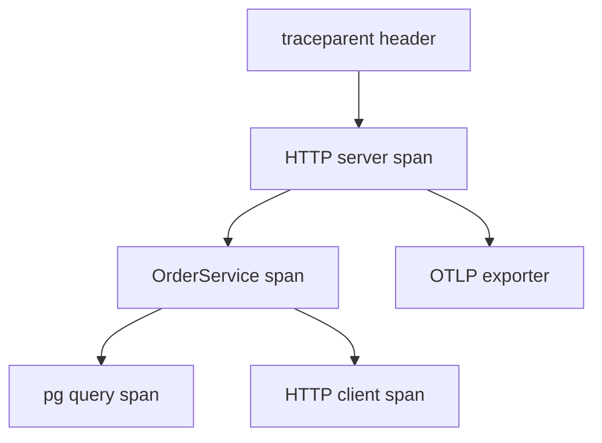
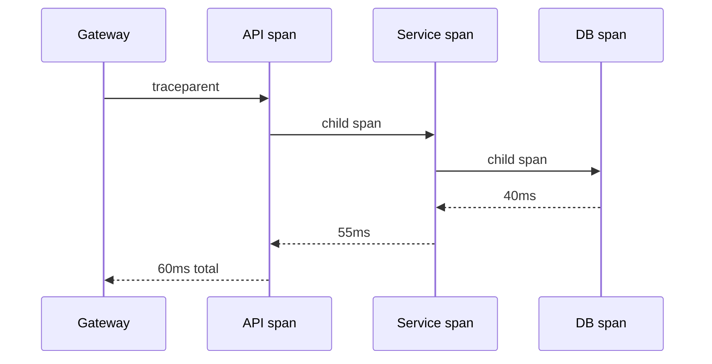

# Distributed Tracing Across Handlers

## Overview

**Distributed tracing** records a **trace** of spans across services: Express middleware, service calls, DB queries, outbound HTTP. **W3C trace context** (`traceparent`, `tracestate`) propagates IDs inbound and outbound. Backend engineers instrument handlers and clients—not operate Jaeger/Tempo clusters ([[16-DevOps/README|DevOps]]). Goal: explain p99 latency by segment, not only aggregate RED ([[07-Backend/09-API-Observability-and-Testing/RED Metrics and SLIs for APIs|RED Metrics and SLIs for APIs]]).

## Learning Objectives

- Auto-instrument Express with OpenTelemetry HTTP middleware
- Create manual spans around service and repository calls
- Propagate context to fetch and message publish
- Link traces to logs via trace_id ([[07-Backend/09-API-Observability-and-Testing/Structured Logs with Request Correlation|Structured Logs with Request Correlation]])
- Sample traces in production without 100% cost

## Prerequisites

- [[07-Backend/02-Frameworks-and-Middleware/Request Context and Async Local Storage|Request Context and Async Local Storage]]
- [[07-Backend/09-API-Observability-and-Testing/RED Metrics and SLIs for APIs|RED Metrics and SLIs for APIs]]

## Difficulty

`intermediate`

## Estimated Time

- Reading: 2 hours
- Exercises: 3 hours
- Mini project: 5 hours

## History

Google Dapper (2010) → OpenTracing → **OpenTelemetry** merger (2019). W3C Trace Context standard unified header formats across languages.

## Problem It Solves

- **"Slow request"** with no breakdown
- **Missing cross-service** correlation pre-log-aggregation
- **Hidden DB time** vs external API in one handler
- **Async continuations** losing parent span without ALS

## Internal Implementation



Sampling: head-based (trace_id hash) or tail-based (platform).

## Mermaid Diagrams

### Structure

```mermaid
flowchart LR
    Express[Express] --> OTel[OTel HTTP instrumentation]
    OTel --> Tracer[TracerProvider]
    Tracer --> Collector[[16-DevOps/README|DevOps OTel Collector]]
    Jobs[Worker] --> Tracer
```

### Sequence / Lifecycle



## Examples

### Minimal Example

```typescript
import { trace } from '@opentelemetry/api';

const tracer = trace.getTracer('order-service');

async function placeOrder(input: PlaceOrderDto): Promise<Order> {
  return tracer.startActiveSpan('placeOrder', async (span) => {
    try {
      span.setAttribute('tenant.id', input.tenantId);
      const order = await orderRepo.save(input);
      span.setStatus({ code: 1 }); // OK
      return order;
    } catch (err) {
      span.recordException(err as Error);
      span.setStatus({ code: 2, message: String(err) });
      throw err;
    } finally {
      span.end();
    }
  });
}
```

### Production-Shaped Example

```typescript
import express from 'express';
import { NodeSDK } from '@opentelemetry/sdk-node';
import { getNodeAutoInstrumentations } from '@opentelemetry/auto-instrumentations-node';
import { propagation, context } from '@opentelemetry/api';

const sdk = new NodeSDK({
  serviceName: 'billing-api',
  instrumentations: [getNodeAutoInstrumentations()],
});
sdk.start();

const app = express();

app.use((req, res, next) => {
  const span = trace.getActiveSpan();
  if (span) {
    req.traceId = span.spanContext().traceId;
    res.setHeader('traceparent', `00-${span.spanContext().traceId}-${span.spanContext().spanId}-01`);
  }
  next();
});

app.get('/invoices/:id', async (req, res, next) => {
  try {
    const invoice = await billingService.getInvoice(req.params.id);
    res.json(invoice);
  } catch (err) {
    next(err);
  }
});

// Outbound fetch inherits context via auto-instrumentation
async function callTaxService(body: object): Promise<Response> {
  return fetch('https://tax.internal/compute', {
    method: 'POST',
    headers: { 'Content-Type': 'application/json' },
    body: JSON.stringify(body),
  });
}
```

Propagate to jobs: inject context into message headers ([[07-Backend/07-Caching-Jobs-and-Messaging/Message Queue Client Patterns|Message Queue Client Patterns]]).

## Trade-offs

| Dimension | Upside | Downside | When it matters |
| --- | --- | --- | --- |
| 100% sampling | Full fidelity | Cost/storage | Debug staging |
| 1% sampling | Cheap | Miss rare bugs | Large prod |
| Auto-instrument | Fast setup | Noisy spans | Bootstrap |
| Manual spans | Precise | Maintenance | Hot paths |

### When to Use

- Multi-hop HTTP APIs
- Services with DB + external calls per request
- Latency SLO debugging

### When Not to Use

- As logging replacement—use both

## Exercises

1. Trace one request through API + mock dependency; identify largest span.
2. Break propagation (omit header); observe orphan span in collector.
3. Add span attribute `cache.hit` in repository decorator.

## Mini Project

Tracing in [[07-Backend/projects/API Contract and Reliability Harness/README|API Contract and Reliability Harness]].

## Portfolio Project

OTel bootstrap in [[07-Backend/projects/Backend Service Toolkit/README|Backend Service Toolkit]].

## Interview Questions

1. trace_id vs span_id vs parent span?
2. How does ALS relate to trace context in Node?
3. Head vs tail sampling?
4. Should health checks be traced?

### Stretch / Staff-Level

1. Trace context through async outbox relay worker.

## Common Mistakes

- Initializing SDK after Express import order wrong
- Manual spans not ended in `finally`
- PII in span attributes
- Custom trace ids incompatible with W3C
- 100% sampling on high RPS

## Best Practices

- Init OTel before other imports (document pattern)
- Standard service.name per deployable
- Link logs with trace_id
- Document sampling policy
- Collector deployment → [[16-DevOps/README|DevOps]]

## Summary

Tracing exposes **per-request structure** across Express handlers and dependencies via **OpenTelemetry** and **W3C propagation**. Auto-instrument HTTP; add manual spans at service boundaries; sample in prod; correlate logs and hand backend to collector ops in DevOps.

## Further Reading

- [OpenTelemetry JavaScript](https://opentelemetry.io/docs/languages/js/)
- [[16-DevOps/README|DevOps]]

## Related Notes

- [[07-Backend/09-API-Observability-and-Testing/Structured Logs with Request Correlation|Structured Logs with Request Correlation]]
- [[07-Backend/09-API-Observability-and-Testing/RED Metrics and SLIs for APIs|RED Metrics and SLIs for APIs]]
- [[06-NodeJS/08-Diagnostics-and-Performance/Diagnostics Channel and Async Context Tracking|Diagnostics Channel and Async Context Tracking]]
- [[16-DevOps/README|DevOps]]

## Progress Checklist

- [ ] Explained from first principles
- [ ] Drew at least one Mermaid diagram
- [ ] Implemented a minimal version
- [ ] Documented trade-offs and non-goals
- [ ] Completed exercises
- [ ] Practiced interview questions aloud
- [ ] Linked prerequisites and dependents
