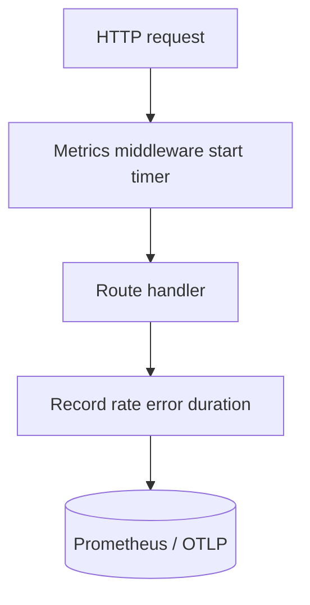
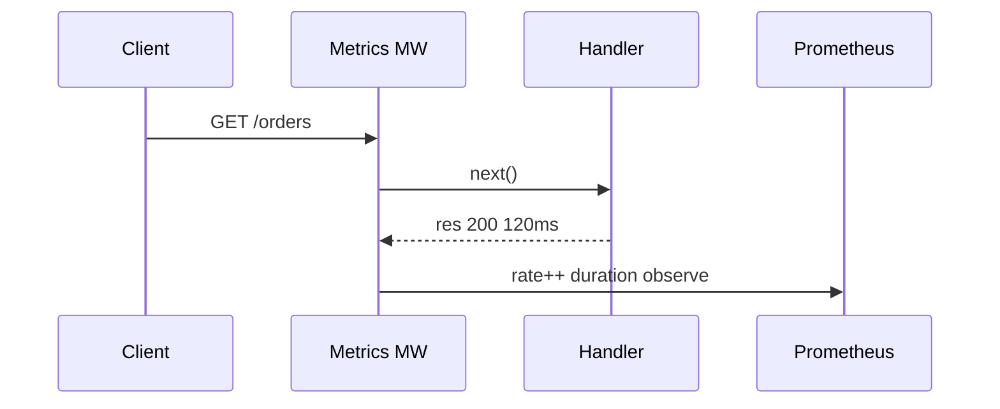

# RED Metrics and SLIs for APIs

## Overview

**RED** (Rate, Errors, Duration) metrics describe request-driven services: **requests per second**, **error ratio**, **latency distribution**. **SLIs** (Service Level Indicators) are measurable proxies for user happiness—e.g. "successful GET /orders p99 < 500ms". Backend APIs instrument at Express middleware: labels for `method`, `route`, `status_class`, `tenant_tier`. Platform alerting and dashboards → [[16-DevOps/README|DevOps]]; this note defines **what to emit** from handlers.

## Learning Objectives

- Implement RED counters/histograms in Express middleware
- Define SLIs aligned with product (availability, latency, correctness)
- Distinguish client 4xx from server 5xx in error budget
- Avoid high-cardinality labels (user id, unbounded paths)
- Connect metrics to SLO burn alerts conceptually

## Prerequisites

- [[07-Backend/02-Frameworks-and-Middleware/Middleware Pipeline and Error Middleware|Middleware Pipeline and Error Middleware]]
- [[06-NodeJS/08-Diagnostics-and-Performance/perf_hooks and Event Loop Delay|perf_hooks and Event Loop Delay]]

## Difficulty

`intermediate`

## Estimated Time

- Reading: 2 hours
- Exercises: 3 hours
- Mini project: 4 hours

## History

Google SRE golden signals → Grafana RED for microservices. Prometheus histogram conventions (`http_request_duration_seconds`) de facto standard.

## Problem It Solves

- **Blind outages**—CPU fine but 40% 500s
- **Wrong aggregates**—mean latency hiding p99 pain
- **Unactionable dashboards**—too many labels
- **SLO debates** without measurable SLI

## Internal Implementation



Normalize route: `/orders/:id` not `/orders/42`.

## Mermaid Diagrams

### Structure

```mermaid
flowchart LR
    Express[Express] --> MetricsMW[httpMetricsMiddleware]
    MetricsMW --> Registry[prom-client Registry]
    Registry --> Scrape[/metrics endpoint]
    Scrape --> DevOps[[16-DevOps/README|DevOps Prometheus]]
```

### Sequence / Lifecycle



## Examples

### Minimal Example

```typescript
import express from 'express';
import client from 'prom-client';

const httpDuration = new client.Histogram({
  name: 'http_request_duration_seconds',
  help: 'Duration of HTTP requests in seconds',
  labelNames: ['method', 'route', 'status_code'],
  buckets: [0.05, 0.1, 0.25, 0.5, 1, 2, 5],
});

const app = express();

app.use((req, res, next) => {
  const end = httpDuration.startTimer();
  res.on('finish', () => {
    end({
      method: req.method,
      route: req.route?.path ?? 'unknown',
      status_code: res.statusCode,
    });
  });
  next();
});
```

### Production-Shaped Example

```typescript
import express from 'express';
import client from 'prom-client';

const requestTotal = new client.Counter({
  name: 'http_requests_total',
  help: 'Total HTTP requests',
  labelNames: ['method', 'route', 'status_class'],
});

const requestErrors = new client.Counter({
  name: 'http_request_errors_total',
  help: 'HTTP 5xx responses',
  labelNames: ['method', 'route'],
});

function statusClass(code: number): string {
  return `${Math.floor(code / 100)}xx`;
}

export function redMetricsMiddleware(): express.RequestHandler {
  return (req, res, next) => {
    const start = process.hrtime.bigint();
    res.on('finish', () => {
      const route = (req as express.Request & { matchedRoute?: string }).matchedRoute ?? 'unmatched';
      const labels = { method: req.method, route, status_class: statusClass(res.statusCode) };
      requestTotal.inc(labels);
      if (res.statusCode >= 500) {
        requestErrors.inc({ method: req.method, route });
      }
      const durationSec = Number(process.hrtime.bigint() - start) / 1e9;
      httpDuration.observe({ method: req.method, route, status_code: String(res.statusCode) }, durationSec);
    });
    next();
  };
}

const app = express();
app.use(redMetricsMiddleware());
app.get('/metrics', async (_req, res) => {
  res.set('Content-Type', client.register.contentType);
  res.end(await client.register.metrics());
});
```

SLI example: `sum(rate(http_requests_total{status_class!~"5xx"}[5m])) / sum(rate(http_requests_total[5m]))` ≥ 99.9%.

Exclude `/health` from SLO or track separately.

## Trade-offs

| Dimension | Upside | Downside | When it matters |
| --- | --- | --- | --- |
| Histogram buckets | Percentiles | Cardinality | Latency SLO |
| Summary type | Quantiles | Client-side cost | Legacy |
| Per-tenant labels | Isolation debug | Cardinality explosion | Avoid in prod |
| 4xx as errors | Strict | Penalizes client bugs | Usually no |

### When to Use

- Every production API route template
- Before launching new endpoint (dashboard ready)

### When Not to Use

- As substitute for tracing single-request debug ([[07-Backend/09-API-Observability-and-Testing/Distributed Tracing Across Handlers|Distributed Tracing Across Handlers]])

## Exercises

1. Define SLI + SLO for login endpoint; write PromQL availability.
2. Add route normalization middleware; verify `/users/1` and `/users/2` same label.
3. Fault inject 503; watch error budget burn.

## Mini Project

Metrics in [[07-Backend/projects/API Contract and Reliability Harness/README|API Contract and Reliability Harness]].

## Portfolio Project

Monitoring section in [[07-Backend/projects/Backend Service Toolkit/README|Backend Service Toolkit]].

## Interview Questions

1. RED vs USE—which for APIs?
2. Why avoid userId label?
3. Include 429 in error budget?
4. p99 vs p999 for SLO?

### Stretch / Staff-Level

1. Multi-window multi-burn-rate alerting outline.

## Common Mistakes

- Unbounded route labels (`req.path`)
- Counting 404 as 5xx
- No `/metrics` auth in prod
- Mean latency only
- Metrics middleware after error handler (missed errors)

## Best Practices

- Register middleware early
- Document SLO in README/runbook
- Separate health metrics series
- Pair with structured logs ([[07-Backend/09-API-Observability-and-Testing/Structured Logs with Request Correlation|Structured Logs with Request Correlation]])
- Platform scrape config in [[16-DevOps/README|DevOps]]

## Summary

**RED** gives minimal viable API observability: **rate**, **errors**, **duration** per route. Define **SLIs** from these series, label safely, exclude noise routes, and hand dashboard/alert wiring to DevOps.

## Further Reading

- [[16-DevOps/README|DevOps]]
- Google SRE Book — SLI/SLO chapter

## Related Notes

- [[07-Backend/09-API-Observability-and-Testing/Structured Logs with Request Correlation|Structured Logs with Request Correlation]]
- [[07-Backend/09-API-Observability-and-Testing/Distributed Tracing Across Handlers|Distributed Tracing Across Handlers]]
- [[07-Backend/10-Production-Services/Operational Readiness for Backend Services|Operational Readiness for Backend Services]]
- [[16-DevOps/README|DevOps]]

## Progress Checklist

- [ ] Explained from first principles
- [ ] Drew at least one Mermaid diagram
- [ ] Implemented a minimal version
- [ ] Documented trade-offs and non-goals
- [ ] Completed exercises
- [ ] Practiced interview questions aloud
- [ ] Linked prerequisites and dependents
