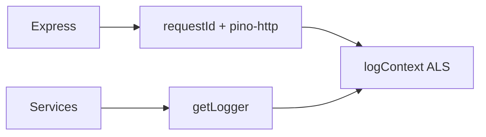
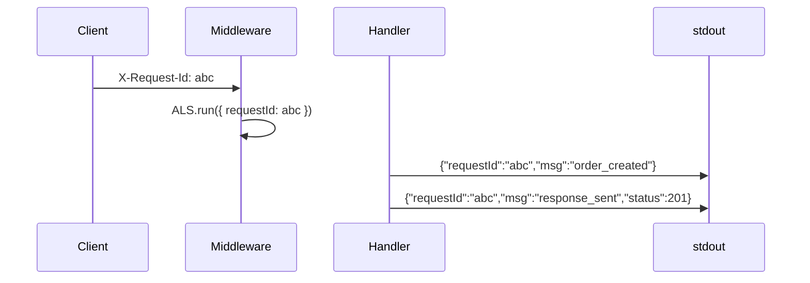

# Structured Logs with Request Correlation

## Overview

**Structured logs** emit JSON (or key-value) events—machine-parseable fields, not printf strings. **Request correlation** ties log lines to one HTTP transaction via `request_id`, `trace_id`, `tenant_id`, `user_id`. Express middleware generates or accepts inbound `X-Request-Id`, stores in **AsyncLocalStorage**, and attaches child loggers per request. Log aggregation platforms → [[16-DevOps/README|DevOps]]; Node host logging patterns → [[06-NodeJS/10-Production-Node/Structured Logging and Correlation IDs|Structured Logging and Correlation IDs]].

## Learning Objectives

- Implement request ID middleware with ALS-backed logger
- Accept/propagate `X-Request-Id` and W3C trace context
- Log at appropriate levels with stable field names
- Avoid logging secrets and full payloads
- Correlate HTTP logs with worker jobs via shared ID

## Prerequisites

- [[07-Backend/02-Frameworks-and-Middleware/Request Context and Async Local Storage|Request Context and Async Local Storage]]
- [[06-NodeJS/10-Production-Node/Structured Logging and Correlation IDs|Structured Logging and Correlation IDs]]

## Difficulty

`intermediate`

## Estimated Time

- Reading: 1.5 hours
- Exercises: 2 hours
- Mini project: 3 hours

## History

grep-era plain logs failed at scale. JSON logging (Logstash 2010s) + **`X-Request-ID`** (Heroku, AWS) became standard. Pino/bunyan optimized Node JSON throughput.

## Problem It Solves

- **Cannot reconstruct** single user request across 50 log lines
- **Regex parsing** brittle in aggregators
- **Missing tenant** context in incident triage
- **Orphan job logs** without enqueue correlation

## Internal Implementation

```mermaid
flowchart TD
    Req[HTTP request] --> MW[requestId middleware]
    MW --> ALS[AsyncLocalStorage context]
    ALS --> Handler[Handlers use req.log]
    Handler --> Out[JSON stdout]
    Out --> Agg[[16-DevOps/README|DevOps log aggregator]]
```

## Mermaid Diagrams

### Structure



### Sequence / Lifecycle



## Examples

### Minimal Example

```typescript
import express from 'express';
import { randomUUID } from 'node:crypto';

const app = express();

app.use((req, res, next) => {
  const requestId = req.header('X-Request-Id') ?? randomUUID();
  req.requestId = requestId;
  res.setHeader('X-Request-Id', requestId);
  console.log(JSON.stringify({ level: 'info', requestId, msg: 'request_start', method: req.method, path: req.path }));
  next();
});
```

### Production-Shaped Example

```typescript
import express from 'express';
import pino from 'pino';
import pinoHttp from 'pino-http';
import { AsyncLocalStorage } from 'node:async_hooks';
import { randomUUID } from 'node:crypto';

const rootLogger = pino({ level: process.env.LOG_LEVEL ?? 'info' });
const logAls = new AsyncLocalStorage<pino.Logger>();

export function getLogger(): pino.Logger {
  return logAls.getStore() ?? rootLogger;
}

const app = express();

app.use((req, res, next) => {
  const requestId = req.header('X-Request-Id') ?? randomUUID();
  const traceId = req.header('traceparent')?.split('-')[1];
  const child = rootLogger.child({
    requestId,
    traceId,
    tenantId: req.header('X-Tenant-Id'),
  });
  logAls.run(child, next);
  res.setHeader('X-Request-Id', requestId);
});

app.use(pinoHttp({
  logger: rootLogger,
  genReqId: (req) => (req as express.Request & { requestId?: string }).requestId!,
  customProps: (req) => ({ tenantId: req.headers['x-tenant-id'] }),
}));

app.post('/orders', async (req, res, next) => {
  const log = getLogger();
  try {
    log.info({ event: 'order_create_start' });
    const order = await orderService.create(req.body);
    log.info({ event: 'order_created', orderId: order.id });
    res.status(201).json(order);
  } catch (err) {
    log.error({ err, event: 'order_create_failed' });
    next(err);
  }
});
```

Pass `requestId` to enqueued jobs ([[07-Backend/07-Caching-Jobs-and-Messaging/Background Jobs and Workers|Background Jobs and Workers]]).

## Trade-offs

| Dimension | Upside | Downside | When it matters |
| --- | --- | --- | --- |
| JSON logs | Queryable | Larger bytes | Centralized logging |
| Verbose debug | Deep debug | Cost/noise | Staging |
| sync Pino | Simple | Rare blocking | Most APIs |
| Text logs | Human read | Unqueryable | Local dev only |

### When to Use

- All production Express services
- Error middleware logging stack + requestId

### When Not to Use

- Logging full request bodies with PII/payment data

## Exercises

1. Trace one requestId through 3 services via header propagation test.
2. Redact `Authorization` header in pino serializers.
3. Worker log includes same requestId as enqueueing HTTP call.

## Mini Project

Logging standard in [[07-Backend/projects/Backend Service Toolkit/README|Backend Service Toolkit]] Monitoring.md.

## Portfolio Project

[[07-Backend/projects/Authentication Server/README|Authentication Server]] audit log fields.

## Interview Questions

1. Generate request ID server-side vs trust client?
2. ALS vs attaching logger on `req`?
3. What not to log in prod?
4. Correlate logs and traces?

### Stretch / Staff-Level

1. Log sampling for high-QPS health endpoints.

## Common Mistakes

- String concatenation logs
- Different field names (`reqId` vs `request_id`)
- No request ID on error middleware path
- Logging passwords on validation failure
- Child loggers not used in async callbacks without ALS

## Best Practices

- Stable schema: `level`, `time`, `requestId`, `msg`, `event`
- Return `X-Request-Id` to clients
- Document correlation for support teams
- Integrate with [[07-Backend/09-API-Observability-and-Testing/Distributed Tracing Across Handlers|Distributed Tracing Across Handlers]]
- Align with Node note on host logging

## Summary

**Structured logs** with **request correlation** make API incidents searchable: one ID links middleware, services, and jobs. Use ALS + Pino, propagate IDs inbound/outbound, redact secrets, defer aggregation to DevOps.

## Further Reading

- [[06-NodeJS/10-Production-Node/Structured Logging and Correlation IDs|Structured Logging and Correlation IDs]]
- [[16-DevOps/README|DevOps]]

## Related Notes

- [[07-Backend/09-API-Observability-and-Testing/Distributed Tracing Across Handlers|Distributed Tracing Across Handlers]]
- [[07-Backend/09-API-Observability-and-Testing/RED Metrics and SLIs for APIs|RED Metrics and SLIs for APIs]]
- [[07-Backend/02-Frameworks-and-Middleware/Request Context and Async Local Storage|Request Context and Async Local Storage]]
- [[16-DevOps/README|DevOps]]

## Progress Checklist

- [ ] Explained from first principles
- [ ] Drew at least one Mermaid diagram
- [ ] Implemented a minimal version
- [ ] Documented trade-offs and non-goals
- [ ] Completed exercises
- [ ] Practiced interview questions aloud
- [ ] Linked prerequisites and dependents
