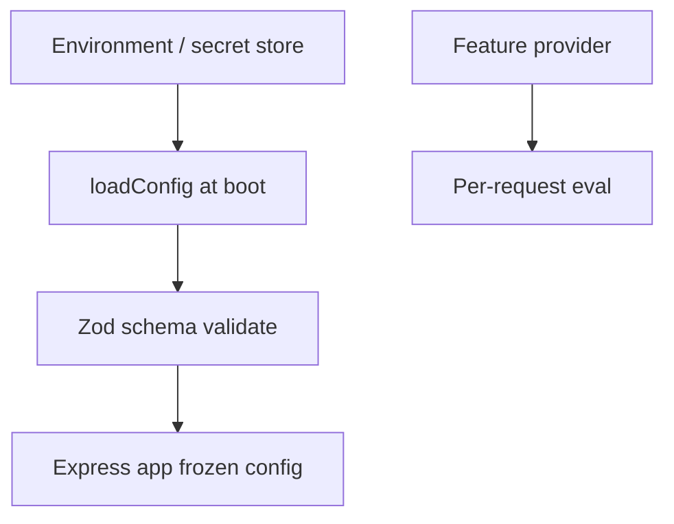
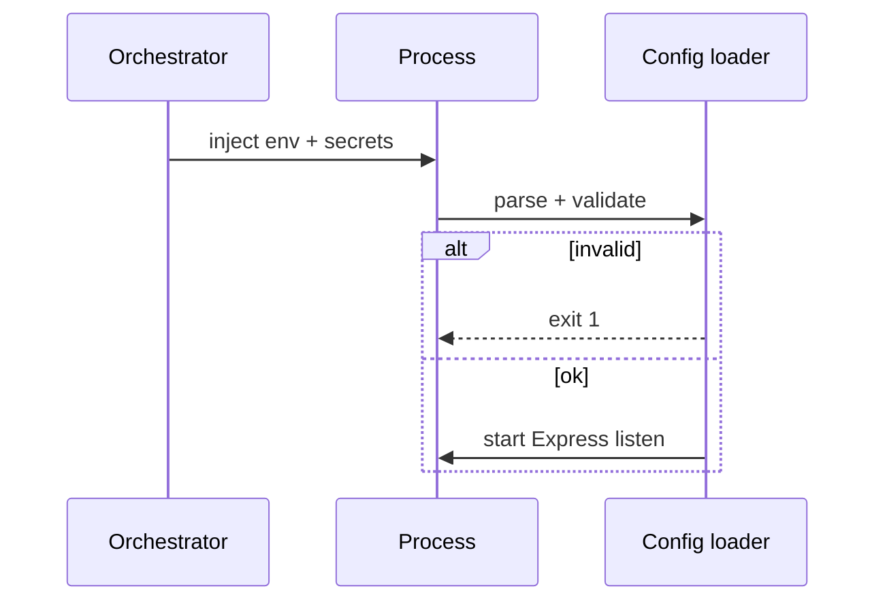

# Configuration Feature Flags and Secrets for Services

## Overview

**Configuration** separates environment-specific values (ports, DB URLs, feature toggles) from code—**twelve-factor** style via environment variables and validated config objects at boot. **Feature flags** enable runtime behavior changes without redeploy ([[07-Backend/07-Caching-Jobs-and-Messaging/Session and Feature Stores as Products|Session and Feature Stores as Products]]). **Secrets** (API keys, session secrets) inject via platform secret stores—not committed files. Node env injection → [[06-NodeJS/09-Security-and-Supply-Chain/Secrets Env Injection and Least Privilege|Secrets Env Injection and Least Privilege]]; vault/K8s secrets ops → [[16-DevOps/README|DevOps]].

## Learning Objectives

- Validate config at startup with schema (zod/env-var)
- Distinguish config, secrets, and feature flags lifecycle
- Fail fast on missing required env in production
- Implement safe defaults per environment (dev/staging/prod)
- Never log secret values; redact in diagnostics

## Prerequisites

- [[07-Backend/00-Orientation/Node Host vs Backend Product Boundary|Node Host vs Backend Product Boundary]]
- [[06-NodeJS/09-Security-and-Supply-Chain/Secrets Env Injection and Least Privilege|Secrets Env Injection and Least Privilege]]

## Difficulty

`intermediate`

## Estimated Time

- Reading: 2 hours
- Exercises: 3 hours
- Mini project: 4 hours

## History

Twelve-Factor App (2011) codified config in env. `.env` files useful locally; production moved to sealed secrets and parameter stores. Feature flags evolved from ifdefs to managed services.

## Problem It Solves

- **Prod boot** with wrong DB host silently connecting to dev
- **Secrets in git** history
- **Redeploy** to toggle non-critical UI feature
- **Untyped** `process.env` scattered in handlers

## Internal Implementation



Config immutable after boot; flags may refresh on interval.

## Mermaid Diagrams

### Structure

```mermaid
flowchart LR
    DevOps[[16-DevOps/README|DevOps K8s secrets]] --> Pod[Express pod env]
    Pod --> ConfigModule[config.ts]
    ConfigModule --> App[createApp]
    FlagSvc[FeatureService] --> App
```

### Sequence / Lifecycle



## Examples

### Minimal Example

```typescript
import { z } from 'zod';

const envSchema = z.object({
  NODE_ENV: z.enum(['development', 'test', 'production']),
  PORT: z.coerce.number().default(3000),
  DATABASE_URL: z.string().url(),
  SESSION_SECRET: z.string().min(32),
});

export const config = envSchema.parse(process.env);
```

### Production-Shaped Example

```typescript
import express from 'express';
import { z } from 'zod';

const envSchema = z.object({
  APP_ENV: z.enum(['development', 'staging', 'production']),
  PORT: z.coerce.number().default(3000),
  DATABASE_URL: z.string().min(1),
  SESSION_SECRET: z.string().min(32),
  FEATURE_PROVIDER_URL: z.string().url().optional(),
  LOG_LEVEL: z.enum(['debug', 'info', 'warn', 'error']).default('info'),
});

export type AppConfig = z.infer<typeof envSchema>;

export function loadConfig(): AppConfig {
  const parsed = envSchema.safeParse(process.env);
  if (!parsed.success) {
    console.error(JSON.stringify({ event: 'config_invalid', issues: parsed.error.issues }));
    process.exit(1);
  }
  return parsed.data;
}

const config = loadConfig();
const app = express();

app.get('/internal/config-check', (_req, res) => {
  res.json({
    appEnv: config.APP_ENV,
    port: config.PORT,
    // never expose secrets
    sessionSecretConfigured: Boolean(config.SESSION_SECRET),
  });
});

app.get('/reports', async (req, res) => {
  if (!(await featureService.isEnabled('advanced_reports', req))) {
    res.status(403).json({ error: 'feature_disabled' });
    return;
  }
  res.json(await reports.list());
});
```

Separate `.env.example` (no secrets) from real env. Feature flags: default-off killswitches in prod.

## Trade-offs

| Dimension | Upside | Downside | When it matters |
| --- | --- | --- | --- |
| Env-only config | Twelve-factor | Large env sets | K8s deployments |
| File config | Structured | Drift from prod | Local dev |
| Remote flags | Dynamic | Dependency | Experiments |
| Compile-time flags | Zero runtime cost | Redeploy to change | Dead code elimination |

### When to Use

- Validated config module imported everywhere
- Secret rotation via platform reload/restart
- Flags for gradual rollout

### When Not to Use

- Storing secrets in feature flag JSON
- Hot-reloading DB URL without drain

## Exercises

1. Boot fails with clear error when `SESSION_SECRET` too short.
2. Document env var matrix for dev/staging/prod.
3. Implement flag refresh every 60s with abort on provider failure policy.

## Mini Project

Config module in [[07-Backend/projects/Backend Service Toolkit/README|Backend Service Toolkit]].

## Portfolio Project

[[07-Backend/10-Production-Services/Operational Readiness for Backend Services|Operational Readiness]] config checklist.

## Interview Questions

1. Config vs secret vs flag—examples of each?
2. Why validate at boot not first request?
3. `.env` in repo—ever?
4. Feature flag provider down—behavior?

### Stretch / Staff-Level

1. Zero-downtime secret rotation for SESSION_SECRET with dual validation window.

## Common Mistakes

- `process.env` in every file
- Logging DATABASE_URL on connection error
- Same SESSION_SECRET all environments
- Feature flag as authorization bypass
- No `.env.example` for onboarding

## Best Practices

- Single `config.ts` export
- `APP_ENV` distinct from `NODE_ENV`
- Least privilege DB credentials per service
- Audit flag changes
- Cross-link [[07-Backend/10-Production-Services/Configuration Feature Flags and Secrets for Services|this note]] in runbooks

## Summary

Backend services **load validated config once**, **inject secrets from platform**, and **evaluate feature flags** with explicit failure policy—never scatter env reads or commit secrets. Node host secret hygiene complements product config design.

## Further Reading

- [[06-NodeJS/09-Security-and-Supply-Chain/Secrets Env Injection and Least Privilege|Secrets Env Injection and Least Privilege]]
- [[16-DevOps/README|DevOps]]
- [Twelve-Factor Config](https://12factor.net/config)

## Related Notes

- [[07-Backend/07-Caching-Jobs-and-Messaging/Session and Feature Stores as Products|Session and Feature Stores as Products]]
- [[07-Backend/10-Production-Services/Operational Readiness for Backend Services|Operational Readiness for Backend Services]]
- [[18-Security/README|Security]]
- [[16-DevOps/README|DevOps]]

## Progress Checklist

- [ ] Explained from first principles
- [ ] Drew at least one Mermaid diagram
- [ ] Implemented a minimal version
- [ ] Documented trade-offs and non-goals
- [ ] Completed exercises
- [ ] Practiced interview questions aloud
- [ ] Linked prerequisites and dependents
