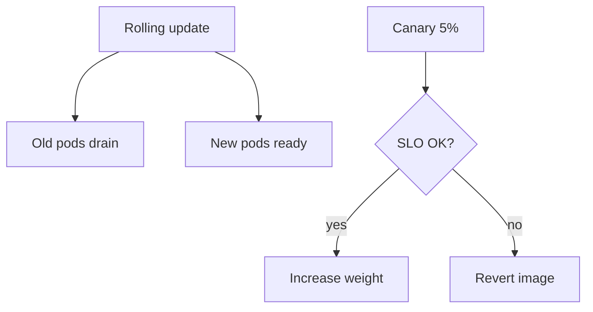
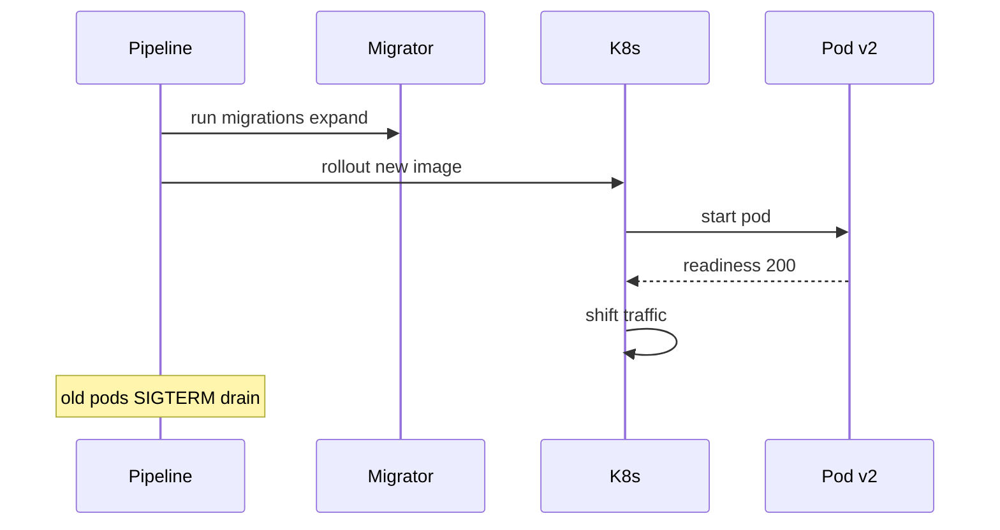

# Deployment Topologies for Single Services

## Overview

A **single backend service** (one Express deployable) still chooses **deployment topology**: rolling update, blue-green, canary—how new versions replace old with traffic shift and rollback path. Backend concerns: backward-compatible migrations ([[07-Backend/08-Data-Access-and-Persistence-Patterns/Migrations as Operational Process|Migrations as Operational Process]]), readiness/drain ([[07-Backend/06-Reliability-and-Abuse-Resistance/Graceful Request Drain Above Process Shutdown|Graceful Request Drain Above Process Shutdown]]), config/secrets ([[07-Backend/10-Production-Services/Configuration Feature Flags and Secrets for Services|Configuration Feature Flags and Secrets for Services]]). Container orchestration mechanics → [[16-DevOps/README|DevOps]]; multi-service system cutovers → [[09-System-Design/README|System Design]].

## Learning Objectives

- Compare rolling, blue-green, and canary for one API service
- Plan deploy order: migrate → roll pods → verify SLO
- Ensure old+new code coexist during rolling deploy (expand-contract)
- Define rollback triggers on error rate/latency
- Scale replicas horizontally vs vertical for Node event loop

## Prerequisites

- [[07-Backend/06-Reliability-and-Abuse-Resistance/Graceful Request Drain Above Process Shutdown|Graceful Request Drain Above Process Shutdown]]
- [[16-DevOps/README|DevOps]]

## Difficulty

`intermediate`

## Estimated Time

- Reading: 2 hours
- Exercises: 3 hours
- Mini project: 4 hours

## History

Bare-metal deploys → capistrano rolling → VM sets → Kubernetes Deployments with maxUnavailable/maxSurge. Canary via service mesh or weighted LB.

## Problem It Solves

- **Big bang** deploy downtime
- **Schema/code mismatch** mid-rollout
- **No rollback** when metrics degrade
- **Under-provisioned** single replica Node service

## Internal Implementation



## Mermaid Diagrams

### Structure

```mermaid
flowchart LR
    LB[Load balancer] --> V1[Pod v1 Express]
    LB --> V2[Pod v2 Express]
    V1 --> DB[(Postgres)]
    V2 --> DB
    CI[[16-DevOps/README|DevOps CI/CD]] --> V2
```

### Sequence / Lifecycle



## Examples

### Minimal Example (conceptual K8s Deployment)

```yaml
# deployment excerpt — full manifest in DevOps track
spec:
  replicas: 3
  strategy:
    type: RollingUpdate
    rollingUpdate:
      maxUnavailable: 1
      maxSurge: 1
  template:
    spec:
      terminationGracePeriodSeconds: 30
      containers:
        - name: api
          image: billing-api:2026.07.22
          readinessProbe:
            httpGet: { path: /health/ready, port: 3000 }
          livenessProbe:
            httpGet: { path: /health/live, port: 3000 }
```

### Production-Shaped Example (app deploy checklist)

```typescript
// deploy/runbook.ts — executed by pipeline, not Express runtime
export const deploySteps = [
  'Run forward migrations (expand phase only if dual-version window)',
  'Deploy new image with maxSurge=1',
  'Wait readiness on new pods',
  'Monitor http_request_errors_total rate 5m vs baseline',
  'If error budget burn > 2x, rollback image',
  'After all old pods drained, schedule contract migration',
] as const;

// Express: support both old and new field during roll
app.get('/users/:id', async (req, res) => {
  const user = await userRepo.findById(req.params.id);
  res.json({
    id: user.id,
    email: user.email,
    emailNormalized: user.emailNormalized ?? user.email, // v2 field optional during roll
  });
});
```

Node **single-threaded** event loop: scale **replicas** for CPU-bound HTTP, not one giant pod ([[06-NodeJS/06-Concurrency-and-Scaling/cluster and Multi-Process Scaling|cluster and Multi-Process Scaling]] for single-host multi-process edge case).

## Trade-offs

| Topology | Upside | Downside | When |
| --- | --- | --- | --- |
| Rolling | Simple default | Mixed versions | Most APIs |
| Blue-green | Fast switch | Double capacity | Critical releases |
| Canary | Limited blast | Complex routing | High risk changes |
| Recreate | Simple | Downtime | Dev only |

### When to Use

- Rolling + expand-contract for routine releases
- Canary when changing auth or payment paths
- Multiple replicas always in prod

### When Not to Use

- Recreate strategy on user-facing API without maintenance window

## Exercises

1. Simulate two-version coexistence: old client ignores new JSON field.
2. Write rollback runbook with metric thresholds.
3. Calculate min replicas for 1000 RPS given p95 handler time.

## Mini Project

Deployment.md in [[07-Backend/projects/Backend Service Toolkit/README|Backend Service Toolkit]].

## Portfolio Project

[[06-NodeJS/projects/Graceful Shutdown Harness/README|Graceful Shutdown Harness]] + K8s manifest notes.

## Interview Questions

1. Rolling deploy with breaking schema—safe sequence?
2. maxUnavailable vs maxSurge effect on capacity?
3. Blue-green vs canary for single service?
4. Why multiple small Node pods vs one large?

### Stretch / Staff-Level

1. Database contract migration timing with 30-min dual-version window.

## Common Mistakes

- Contract migration same release as code requiring new column NOT NULL
- Single replica production
- No grace period alignment
- Deploy Friday without rollback owner
- Ignoring background workers during API roll

## Best Practices

- Automate migrate job before pod update
- Dashboard for deploy window ([[07-Backend/09-API-Observability-and-Testing/RED Metrics and SLIs for APIs|RED Metrics and SLIs for APIs]])
- Worker deploy coordinated or compatible
- Document topology in Architecture.md
- Platform details → [[16-DevOps/README|DevOps]]

## Summary

**Single-service deployment** pairs orchestrator topology (rolling/canary/blue-green) with **backend-safe migrations**, **readiness/drain**, and **SLO-gated rollback**. Scale Express horizontally; plan old/new code coexistence every release.

## Further Reading

- [[16-DevOps/README|DevOps]]
- [[07-Backend/08-Data-Access-and-Persistence-Patterns/Migrations as Operational Process|Migrations as Operational Process]]

## Related Notes

- [[07-Backend/06-Reliability-and-Abuse-Resistance/Graceful Request Drain Above Process Shutdown|Graceful Request Drain Above Process Shutdown]]
- [[07-Backend/10-Production-Services/Health Dependencies and Readiness Semantics|Health Dependencies and Readiness Semantics]]
- [[07-Backend/10-Production-Services/Operational Readiness for Backend Services|Operational Readiness for Backend Services]]
- [[16-DevOps/README|DevOps]]

## Progress Checklist

- [ ] Explained from first principles
- [ ] Drew at least one Mermaid diagram
- [ ] Implemented a minimal version
- [ ] Documented trade-offs and non-goals
- [ ] Completed exercises
- [ ] Practiced interview questions aloud
- [ ] Linked prerequisites and dependents
