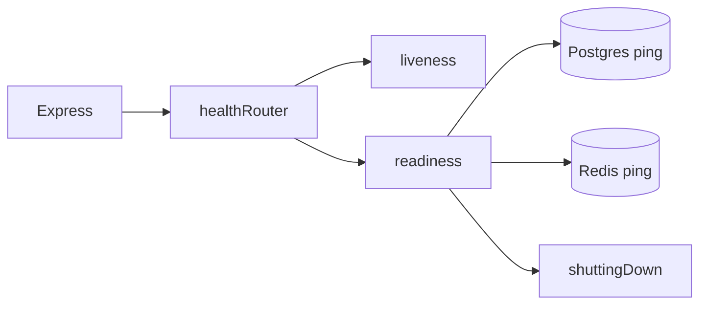
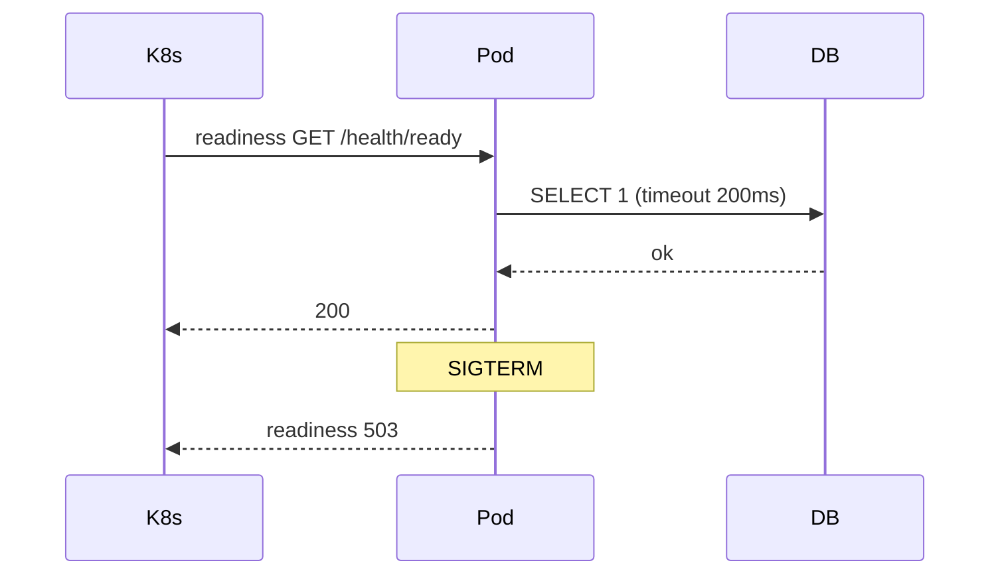

# Health Dependencies and Readiness Semantics

## Overview

**Health endpoints** tell orchestrators whether to send traffic. **Liveness**: process responsive—restart if deadlocked. **Readiness**: can serve product requests—dependencies OK, migrations done, not draining. **Startup**: slow boot tolerance. Node host hooks → [[06-NodeJS/10-Production-Node/Health Readiness and Liveness Hooks|Health Readiness and Liveness Hooks]]; backend layer adds **semantic** checks: DB ping, cache ping, schema version, shutdown flag ([[07-Backend/06-Reliability-and-Abuse-Resistance/Graceful Request Drain Above Process Shutdown|Graceful Request Drain Above Process Shutdown]]). Probe config → [[16-DevOps/README|DevOps]].

## Learning Objectives

- Implement `/health/live`, `/health/ready`, optional `/health/startup`
- Check critical dependencies with timeouts—not full business queries
- Fail readiness on SIGTERM drain before liveness fails
- Avoid health checks that hammer dependencies or lie about capacity
- Separate "process up" from "can accept paid API traffic"

## Prerequisites

- [[06-NodeJS/10-Production-Node/Health Readiness and Liveness Hooks|Health Readiness and Liveness Hooks]]
- [[07-Backend/06-Reliability-and-Abuse-Resistance/Graceful Request Drain Above Process Shutdown|Graceful Request Drain Above Process Shutdown]]

## Difficulty

`intermediate`

## Estimated Time

- Reading: 1.5 hours
- Exercises: 3 hours
- Mini project: 4 hours

## History

Kubernetes split liveness/readiness (2015+) replacing homepage pings. Backend teams learned expensive `SELECT *` readiness causes cascading DB load during incidents.

## Problem It Solves

- **Traffic to broken pods** (DB down, migration pending)
- **Restart loops** when liveness hits failing Redis
- **502 during deploy** when readiness not flipped
- **False green** while event loop stalled

## Internal Implementation

```mermaid
flowchart TD
    Live[/health/live] --> Loop{Event loop OK?}
    Ready[/health/ready] --> Shut{shuttingDown?}
    Ready --> Mig{schema OK?}
    Ready --> Dep{deps OK?}
    Shut -->|yes|503
    Mig -->|no|503
    Dep -->|no|503
    Loop -->|no|503 live only
```

Liveness cheap; readiness may query `SELECT 1` with 200ms timeout.

## Mermaid Diagrams

### Structure



### Sequence / Lifecycle



## Examples

### Minimal Example

```typescript
import express from 'express';

let shuttingDown = false;
const app = express();

app.get('/health/live', (_req, res) => res.json({ live: true }));

app.get('/health/ready', async (_req, res) => {
  if (shuttingDown) {
    res.status(503).json({ ready: false, reason: 'draining' });
    return;
  }
  res.json({ ready: true });
});

process.on('SIGTERM', () => { shuttingDown = true; });
```

### Production-Shaped Example

```typescript
import express from 'express';

interface HealthState {
  shuttingDown: boolean;
  schemaVersionOk: boolean;
}

const state: HealthState = { shuttingDown: false, schemaVersionOk: true };

async function checkPostgres(): Promise<boolean> {
  try {
    await pool.query('SELECT 1', [], { signal: AbortSignal.timeout(200) });
    return true;
  } catch {
    return false;
  }
}

async function checkRedis(): Promise<boolean> {
  try {
    await redis.ping({ signal: AbortSignal.timeout(200) });
    return true;
  } catch {
    return false;
  }
}

const app = express();

app.get('/health/live', (_req, res) => {
  res.json({ live: true, uptimeSec: process.uptime() });
});

app.get('/health/ready', async (_req, res) => {
  if (state.shuttingDown) {
    res.status(503).json({ ready: false, checks: { draining: false } });
    return;
  }
  if (!state.schemaVersionOk) {
    res.status(503).json({ ready: false, checks: { schema: false } });
    return;
  }

  const [postgres, redisOk] = await Promise.all([checkPostgres(), checkRedis()]);
  const ready = postgres && redisOk;

  res.status(ready ? 200 : 503).json({
    ready,
    checks: { postgres, redis: redisOk },
  });
});

// Optional: deep check for ops only (auth required), not for K8s probe
app.get('/health/deep', requireAdmin, async (_req, res) => {
  res.json({ poolWaiting: pool.waitingCount, eventLoopDelay: await sampleEventLoopDelay() });
});
```

Non-critical dependency down: product decision—degrade vs fail readiness ([[07-Backend/06-Reliability-and-Abuse-Resistance/Circuit Breakers and Bulkheads|Circuit Breakers and Bulkheads]]).

## Trade-offs

| Dimension | Upside | Downside | When it matters |
| --- | --- | --- | --- |
| Strict readiness | No bad traffic | Flap on blip | Payments |
| Lenient readiness | Availability | Errors to users | Best-effort reads |
| Deps in liveness | — | Restart storm | Never |
| Deep health public | Debuggable | Info leak | Protect endpoint |

### When to Use

- Separate live/ready routes always in production
- Readiness includes migration gate ([[07-Backend/08-Data-Access-and-Persistence-Patterns/Migrations as Operational Process|Migrations as Operational Process]])

### When Not to Use

- Business logic validation in probe (use metrics)

## Exercises

1. Kill Postgres container; observe readiness 503 without liveness restart.
2. SIGTERM; readiness 503 while in-flight request completes.
3. Write runbook: readiness flapping during Redis failover.

## Mini Project

Health module in [[07-Backend/projects/Backend Service Toolkit/README|Backend Service Toolkit]].

## Portfolio Project

Align with [[06-NodeJS/projects/Graceful Shutdown Harness/README|Graceful Shutdown Harness]].

## Interview Questions

1. Liveness vs readiness with DB down?
2. Should Redis session store fail readiness?
3. Startup probe purpose?
4. How avoid health check DDoS on DB?

### Stretch / Staff-Level

1. Synthetic canary transaction vs SELECT 1 readiness.

## Common Mistakes

- Single `/health` doing everything
- Liveness checks database
- No readiness fail on drain
- Unauthenticated `/metrics` and `/health/deep` exposing internals
- Probe timeout > kubelet timeout

## Best Practices

- Fast probes (<300ms budget)
- Document check list per service
- Flip readiness first on shutdown ([[06-NodeJS/10-Production-Node/Graceful Shutdown and Drain|Graceful Shutdown and Drain]])
- Metric readiness state
- K8s manifest in [[16-DevOps/README|DevOps]]

## Summary

Backend **readiness semantics** encode product ability to serve: dependencies, schema, drain state—not just Node alive. Keep liveness narrow; readiness honest; align with graceful drain and migration process.

## Further Reading

- [[06-NodeJS/10-Production-Node/Health Readiness and Liveness Hooks|Health Readiness and Liveness Hooks]]
- [[16-DevOps/README|DevOps]]

## Related Notes

- [[07-Backend/06-Reliability-and-Abuse-Resistance/Graceful Request Drain Above Process Shutdown|Graceful Request Drain Above Process Shutdown]]
- [[07-Backend/10-Production-Services/Deployment Topologies for Single Services|Deployment Topologies for Single Services]]
- [[07-Backend/10-Production-Services/Operational Readiness for Backend Services|Operational Readiness for Backend Services]]
- [[16-DevOps/README|DevOps]]

## Progress Checklist

- [ ] Explained from first principles
- [ ] Drew at least one Mermaid diagram
- [ ] Implemented a minimal version
- [ ] Documented trade-offs and non-goals
- [ ] Completed exercises
- [ ] Practiced interview questions aloud
- [ ] Linked prerequisites and dependents
