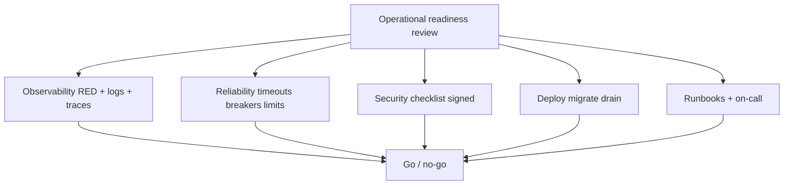
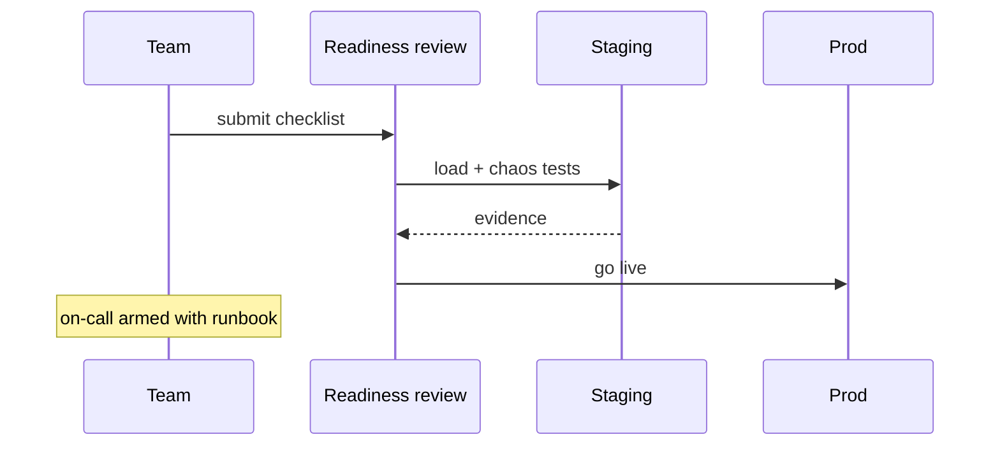

# Operational Readiness for Backend Services

## Overview

**Operational readiness** asks: can this Express service run in production with known SLOs, observability, rollback, on-call runbooks, and security signoff? Synthesizes Backend track modules—reliability, observability, health, deploy, config, security—without duplicating [[16-DevOps/README|DevOps]] platform provisioning or [[09-System-Design/01-Capacity-Latency-and-Bottlenecks/Back-of-Envelope Capacity Estimation|Back-of-Envelope Capacity Estimation]] multi-service capacity planning.

## Learning Objectives

- Complete a production readiness review (PRR) checklist for a new API
- Define SLOs, dashboards, alerts, and runbooks before launch
- Document dependencies, failure modes, and escalation paths
- Verify graceful shutdown, migrations, and backup/restore ownership
- Train on-call with game-day scenario

## Prerequisites

- [[07-Backend/09-API-Observability-and-Testing/RED Metrics and SLIs for APIs|RED Metrics and SLIs for APIs]]
- [[07-Backend/10-Production-Services/Health Dependencies and Readiness Semantics|Health Dependencies and Readiness Semantics]]
- [[07-Backend/10-Production-Services/Security Review Checklist for APIs|Security Review Checklist for APIs]]

## Difficulty

`advanced`

## Estimated Time

- Reading: 2 hours
- Exercises: 4 hours (fill PRR for sample service)
- Mini project: 8 hours

## History

Google Production Readiness Review (PRR) influenced industry launch gates. "You build it, you run it" shifted checklist ownership to service teams, not separate ops silo.

## Problem It Solves

- **Launch without metrics**—blind incidents
- **No rollback** owner or procedure
- **Unknown dependencies** during outage
- **On-call** seeing service first time in pager storm

## Internal Implementation



## Mermaid Diagrams

### Structure

```mermaid
flowchart LR
    Service[Express API] --> Pillars[Readiness pillars]
    Pillars --> M1[06 Reliability]
    Pillars --> M2[09 Observability]
    Pillars --> M3[10 Production]
    Pillars --> Platform[[16-DevOps/README|DevOps]]
```

### Sequence / Lifecycle



## Examples

### Minimal Example (readiness table)

| Area | Requirement | Status |
| --- | --- | --- |
| SLO | 99.9% availability, p99 < 500ms | Defined in README |
| Metrics | RED per route | `/metrics` live |
| Logs | JSON + requestId | Pino configured |
| Traces | OTel export | Staging verified |
| Health | /live /ready | K8s probes set |
| Shutdown | SIGTERM drain 30s | Test in CI |
| Migrations | Pipeline job | Documented |
| Secrets | K8s secrets | No .env in image |
| Security | API checklist | Signed |
| Runbook | Dependency outage | Wiki link |
| Rollback | Previous image tag | One-click doc |

### Production-Shaped Example (runbook excerpt)

```markdown
## Billing API — Redis session store down

**Impact:** New logins fail; existing JWT may work until expiry.

**Detect:** `readiness checks.redis=false`, error rate on POST /auth/login.

**Mitigate:**
1. Confirm Redis incident channel (#platform).
2. If extended: enable flag `auth_jwt_only_fallback` ([[07-Backend/10-Production-Services/Configuration Feature Flags and Secrets for Services|Feature Flags]]).
3. Scale API replicas only if CPU-bound—not for Redis outage.

**Escalate:** Platform on-call → Backend lead if >30m.

**Post-incident:** Review fail-open vs fail-closed policy.
```

```typescript
// Express: operational metadata endpoint (internal)
app.get('/internal/about', requireAdmin, (_req, res) => {
  res.json({
    service: 'billing-api',
    version: process.env.GIT_SHA,
    slo: { availability: 0.999, latencyP99Ms: 500 },
    dependencies: ['postgres', 'redis', 'inventory-api'],
    runbook: 'https://wiki.example.com/runbooks/billing-api',
  });
});
```

## Trade-offs

| Dimension | Upside | Downside | When it matters |
| --- | --- | --- | --- |
| Full PRR | Fewer incidents | Launch delay | Customer-facing |
| Lightweight checklist | Speed | Gaps | Internal alpha |
| Staging parity | Confidence | Cost | Pre-launch |
| Continuous readiness | Always shippable | Ongoing effort | Mature teams |

### When to Use

- Every production launch or major refactor
- Annual re-certification for tier-1 services

### When Not to Use

- Throwaway prototypes—document non-prod explicitly

## Exercises

1. Fill complete PRR for [[07-Backend/projects/URL Shortener API/README|URL Shortener API]].
2. Tabletop: Postgres failover—who does what in first 15 minutes?
3. Verify staging load test meets SLO with evidence screenshot/metrics link.

## Mini Project

Operational Readiness doc in [[07-Backend/projects/Backend Service Toolkit/README|Backend Service Toolkit]].

## Portfolio Project

Synthesize all mini projects into launch gate.

## Interview Questions

1. Difference between operational readiness and DevOps platform setup?
2. Minimum metrics before launching public API?
3. What goes in a runbook vs postmortem?
4. How prove graceful shutdown readiness?

### Stretch / Staff-Level

1. Error budget policy linking deploy freeze to readiness gaps.

## Common Mistakes

- Checklist tick without evidence
- No owner for dependencies outside team
- SLO defined but no alert routes
- Runbook only in one engineer's head
- Skipping worker/outbox in readiness scope

## Best Practices

- Link checklist items to code/config paths
- Game-day before launch ([[07-Backend/09-API-Observability-and-Testing/Chaos and Failure Injection at the Service Edge|Chaos and Failure Injection]])
- On-call shadow week
- Post-launch review at 7/30 days
- Keep [[07-Backend/README|Backend README]] stage gate aligned

## Summary

**Operational readiness** is the launch gate proving an Express service is **observable, secure, reliable, deployable, and operable**—with SLOs, runbooks, and tested failure behavior. Synthesize Backend track work; partner with DevOps for platform; do not go live on hope.

## Further Reading

- [[16-DevOps/README|DevOps]]
- Google SRE — launch checklist concepts
- [[07-Backend/README|Backend README]] — Stage Gate Checklist

## Related Notes

- [[07-Backend/09-API-Observability-and-Testing/RED Metrics and SLIs for APIs|RED Metrics and SLIs for APIs]]
- [[07-Backend/10-Production-Services/Deployment Topologies for Single Services|Deployment Topologies for Single Services]]
- [[07-Backend/10-Production-Services/Security Review Checklist for APIs|Security Review Checklist for APIs]]
- [[07-Backend/06-Reliability-and-Abuse-Resistance/Graceful Request Drain Above Process Shutdown|Graceful Request Drain Above Process Shutdown]]
- [[16-DevOps/README|DevOps]]

## Progress Checklist

- [ ] Explained from first principles
- [ ] Drew at least one Mermaid diagram
- [ ] Implemented a minimal version
- [ ] Documented trade-offs and non-goals
- [ ] Completed exercises
- [ ] Practiced interview questions aloud
- [ ] Linked prerequisites and dependents
