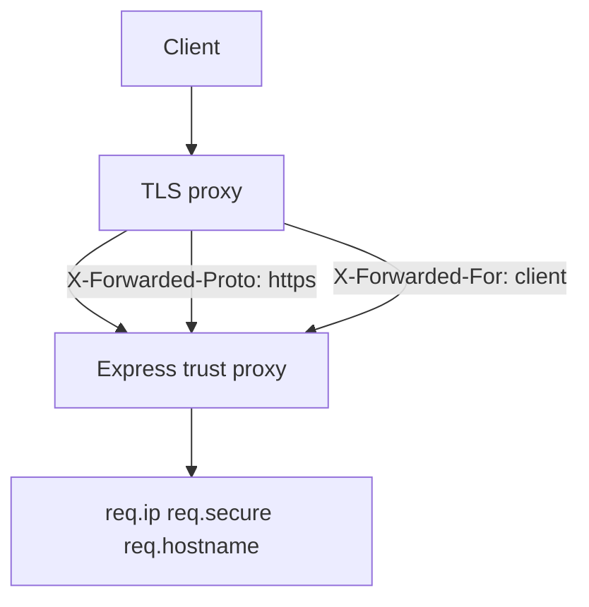
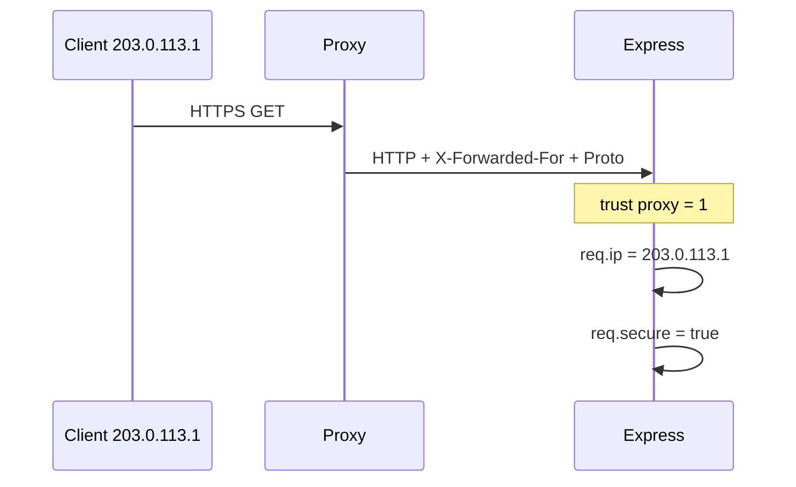

# Reverse Proxy Expectations and Trusted Headers

## Overview

Production Express apps sit behind **reverse proxies** (nginx, Envoy, AWS ALB, Kubernetes Ingress)—TLS termination, load balancing, buffering. Proxies add **forwarded headers**: `X-Forwarded-For`, `X-Forwarded-Proto`, `X-Forwarded-Host`, `X-Request-Id`. Express must **`trust proxy`** hop count to interpret `req.ip`, `req.secure`, and host correctly—misconfiguration enables IP spoofing for rate limits ([[07-Backend/06-Reliability-and-Abuse-Resistance/Rate Limiting and Quotas|Rate Limiting and Quotas]]) or insecure cookie policies. Container/proxy deployment → [[16-DevOps/README|DevOps]].

## Learning Objectives

- Configure `app.set('trust proxy', n)` appropriately for your topology
- Derive client IP safely for rate limiting and audit logs
- Build redirect URLs with correct scheme/host behind TLS terminator
- Validate which headers are trusted vs stripped at edge
- Avoid trusting client-supplied `X-Forwarded-For` on direct exposure

## Prerequisites

- [[06-NodeJS/05-Networking/http and https Platform Servers|http and https Platform Servers]]
- [[07-Backend/06-Reliability-and-Abuse-Resistance/Rate Limiting and Quotas|Rate Limiting and Quotas]]

## Difficulty

`intermediate`

## Estimated Time

- Reading: 1.5 hours
- Exercises: 2 hours
- Mini project: 3 hours

## History

RFC 7239 `Forwarded` standardized alternatives to de-facto `X-Forwarded-*`. Express `trust proxy` predates widespread Kubernetes ingress; mis-set trust remains common audit finding.

## Problem It Solves

- **Rate limit bypass** via forged X-Forwarded-For
- **HTTP links** generated on HTTPS sites
- **Wrong host** in password reset emails
- **Secure cookie** not set because app thinks HTTP

## Internal Implementation



Trust only proxies you control; strip incoming forwarded headers at edge from untrusted clients.

## Mermaid Diagrams

### Structure

```mermaid
flowchart LR
    Internet --> Ingress[[16-DevOps/README|DevOps Ingress]]
    Ingress --> Pod[Express app]
    Ingress -->|sets forwarded headers| Pod
```

### Sequence / Lifecycle



## Examples

### Minimal Example

```typescript
import express from 'express';

const app = express();
app.set('trust proxy', 1); // one hop: ingress → pod

app.get('/whoami', (req, res) => {
  res.json({
    ip: req.ip,
    secure: req.secure,
    hostname: req.hostname,
    protocol: req.protocol,
  });
});
```

### Production-Shaped Example

```typescript
import express from 'express';

const TRUSTED_PROXY_HOPS = Number(process.env.TRUSTED_PROXY_HOPS ?? '1');

const app = express();
app.set('trust proxy', TRUSTED_PROXY_HOPS);

function clientIp(req: express.Request): string {
  return req.ip ?? req.socket.remoteAddress ?? 'unknown';
}

app.use((req, res, next) => {
  req.clientMeta = {
    ip: clientIp(req),
    secure: req.secure,
    host: req.get('host') ?? req.hostname,
  };
  next();
});

app.use(rateLimitByKey((req) => req.clientMeta!.ip));

app.post('/auth/password-reset', async (req, res) => {
  const baseUrl = `${req.secure ? 'https' : 'http'}://${req.get('host')}`;
  await mailer.sendResetLink(req.body.email, `${baseUrl}/reset?token=...`);
  res.status(204).end();
});

// Middleware: reject direct access without expected edge header in prod
if (process.env.APP_ENV === 'production') {
  app.use((req, res, next) => {
    if (!req.get('X-From-Ingress')) {
      res.status(403).json({ error: 'direct_access_forbidden' });
      return;
    }
    next();
  });
}
```

Coordinate header names with [[16-DevOps/README|DevOps]] ingress annotations.

## Trade-offs

| Dimension | Upside | Downside | When it matters |
| --- | --- | --- | --- |
| trust proxy = 1 | Correct IP | Wrong if multi-hop | Single ingress |
| trust proxy false | Safe if exposed | Broken behind LB | Never behind LB |
| trust proxy true (all) | Easy | Spoofing | Dangerous |
| RFC Forwarded | Standard | Less supported | Greenfield edge |

### When to Use

- Any Express behind load balancer
- Secure cookies and HSTS assumptions
- IP-based rate limits

### When Not to Use

- Blind trust on public internet without edge strip

## Exercises

1. Curl with fake X-Forwarded-For direct to app—verify not trusted without proxy.
2. Behind nginx docker-compose, verify req.secure with terminated TLS.
3. Document header contract with platform team.

## Mini Project

Proxy topology doc in [[07-Backend/projects/Backend Service Toolkit/README|Backend Service Toolkit]] Deployment.md.

## Portfolio Project

[[07-Backend/projects/Authentication Server/README|Authentication Server]] reset link URL tests.

## Interview Questions

1. What does `trust proxy` change in Express?
2. How forge X-Forwarded-For attack works?
3. X-Forwarded-For vs Forwarded header?
4. req.protocol vs TLS at socket?

### Stretch / Staff-Level

1. Multi-region anycast + correct client geo without trusting raw headers.

## Common Mistakes

- `trust proxy: true` in production
- Rate limit on socket IP behind LB (always ingress IP)
- OAuth redirect_uri built with http://
- Not setting trust before middleware using req.ip
- Double-counting hops with service mesh sidecar

## Best Practices

- Explicit hop count from infra diagram
- Strip untrusted forwarded headers at edge
- Integration test behind docker nginx
- Log both req.ip and remoteAddress in staging
- Link [[07-Backend/06-Reliability-and-Abuse-Resistance/CORS Security Headers and Browser Boundaries|CORS Security Headers]]

## Summary

Behind reverse proxies, Express must **trust the correct hop count** to interpret **client IP, HTTPS, and host**. Coordinate with DevOps on header injection; never trust forwarded headers from the open internet.

## Further Reading

- [[16-DevOps/README|DevOps]]
- [Express behind proxies](https://expressjs.com/en/guide/behind-proxies.html)

## Related Notes

- [[07-Backend/06-Reliability-and-Abuse-Resistance/Rate Limiting and Quotas|Rate Limiting and Quotas]]
- [[07-Backend/10-Production-Services/Deployment Topologies for Single Services|Deployment Topologies for Single Services]]
- [[06-NodeJS/05-Networking/http and https Platform Servers|http and https Platform Servers]]
- [[16-DevOps/README|DevOps]]

## Progress Checklist

- [ ] Explained from first principles
- [ ] Drew at least one Mermaid diagram
- [ ] Implemented a minimal version
- [ ] Documented trade-offs and non-goals
- [ ] Completed exercises
- [ ] Practiced interview questions aloud
- [ ] Linked prerequisites and dependents
