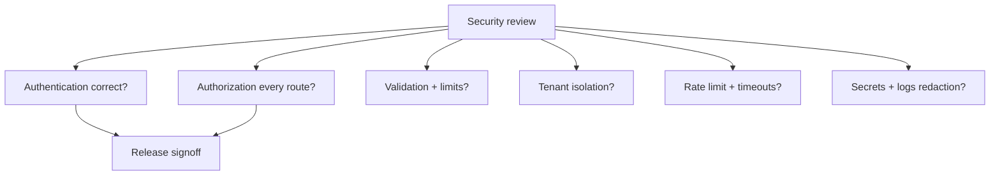
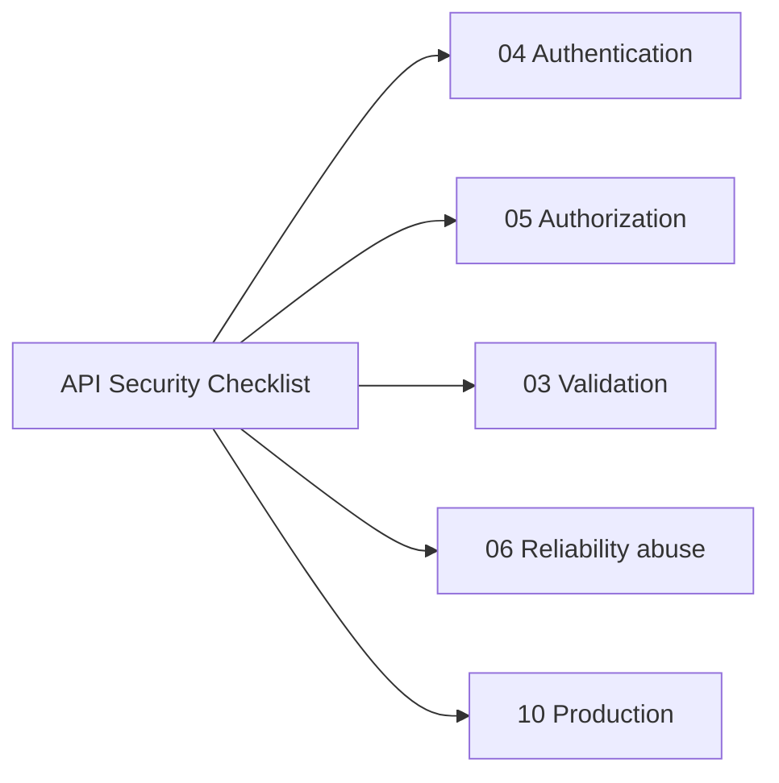
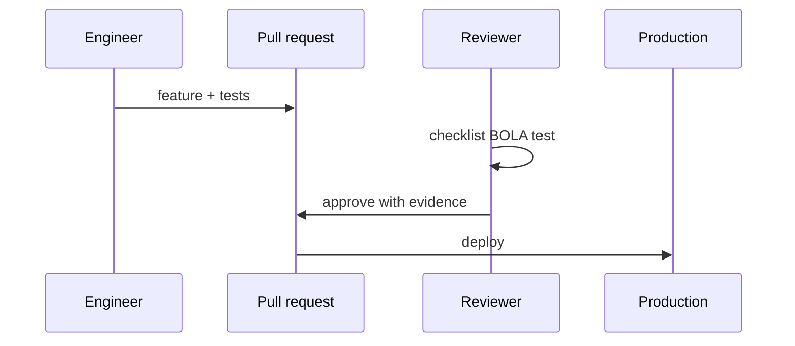

# Security Review Checklist for APIs

## Overview

A **security review checklist** for backend APIs systematically covers authN/authZ, input validation, tenancy isolation, secrets, transport, browser boundaries, and abuse resistance before production. Express-specific: middleware order, error leakage, mass assignment. Deep crypto and org-wide threat modeling → [[18-Security/README|Security]]; this note is **shipping gate** for product HTTP services.

## Learning Objectives

- Walk OWASP API Security Top 10 mapped to Express controls
- Verify authZ on every mutating route—not only authN middleware
- Check tenant scoping in repositories and query filters
- Review logging/redaction and error envelope safety
- Sign off checklist with evidence links (tests, scans)

## Prerequisites

- [[07-Backend/04-Authentication/Authentication Server Threat Model|Authentication Server Threat Model]]
- [[07-Backend/05-Authorization-and-Tenancy/Multi-Tenant Isolation at the App Boundary|Multi-Tenant Isolation at the App Boundary]]
- [[18-Security/README|Security]]

## Difficulty

`advanced`

## Estimated Time

- Reading: 2 hours
- Exercises: 3 hours (checklist audit lab)
- Mini project: 4 hours

## History

OWASP API Security Top 10 (2019, 2023) replaced generic web focus with BOLA, broken auth, unrestricted resource consumption. Checklists formalized release gates at mature product orgs.

## Problem It Solves

- **BOLA/IDOR**—change `:id` access other user's data
- **Missing authZ** on admin routes
- **Credential stuffing** on unprotected login
- **Security theater**—CORS mistaken for auth

## Internal Implementation



## Mermaid Diagrams

### Structure



### Sequence / Lifecycle



## Examples

### Minimal Example (checklist excerpt)

| # | Control | Pass? | Evidence |
| --- | --- | --- | --- |
| 1 | HTTPS only in prod | ☐ | Ingress TLS config |
| 2 | Passwords hashed (argon2/bcrypt) | ☐ | [[07-Backend/04-Authentication/Password Hashing and Credential Storage\|Password Hashing]] |
| 3 | RBAC on admin routes | ☐ | Integration test `403` |
| 4 | Tenant filter on all queries | ☐ | Code search `tenantId` |
| 5 | Rate limit login | ☐ | Middleware config |
| 6 | No stack traces to clients | ☐ | Error middleware |
| 7 | CORS allowlist | ☐ | [[07-Backend/06-Reliability-and-Abuse-Resistance/CORS Security Headers and Browser Boundaries\|CORS note]] |
| 8 | Input schema validation | ☐ | Zod at edge |
| 9 | Idempotency on POST pay | ☐ | Idempotency-Key tests |
| 10 | Dependencies audited | ☐ | npm audit CI |

### Production-Shaped Example (BOLA test)

```typescript
import request from 'supertest';
import { describe, it, expect } from 'vitest';
import { createApp } from '../src/app';

describe('security: BOLA /orders/:id', () => {
  const app = createApp();

  it('tenant A cannot read tenant B order', async () => {
    const tokenA = await loginAs('tenant-a-user');
    const orderB = await seedOrder({ tenantId: 'tenant-b' });

    const res = await request(app)
      .get(`/orders/${orderB.id}`)
      .set('Authorization', `Bearer ${tokenA}`);

    expect(res.status).toBe(404); // or 403 — policy documented
  });
});

// Express handler pattern — always scope by auth context
app.get('/orders/:id', requireAuth, async (req, res, next) => {
  try {
    const order = await orderRepo.findByIdForTenant(req.params.id, req.auth.tenantId);
    if (!order) {
      res.status(404).json({ error: 'not_found' });
      return;
    }
    res.json(order);
  } catch (err) {
    next(err);
  }
});
```

Run SAST/dependency scan in CI ([[16-DevOps/README|DevOps]]); checklist verifies controls exist, not replaces pen test.

## Trade-offs

| Dimension | Upside | Downside | When it matters |
| --- | --- | --- | --- |
| Full checklist each PR | Safety | Slow | Payments |
| Risk-tiered checklist | Pragmatic | Miss low-tier bugs | Internal tools |
| 404 vs 403 on BOLA | Hide existence | Ambiguous for clients | Document policy |
| Automated DAST | Coverage | False positives | Staging |

### When to Use

- Every new public endpoint
- Before SOC2/ISO audit periods
- After auth model changes

### When Not to Use

- As only security activity—pair with [[18-Security/README|Security]] depth

## Exercises

1. Audit sample Express app; fill checklist with gaps ranked by severity.
2. Write BOLA test for nested resource `/teams/:teamId/members/:id`.
3. Find mass assignment bug; fix with explicit DTO allowlist.

## Mini Project

Security.md template in [[07-Backend/projects/Authentication Server/README|Authentication Server]].

## Portfolio Project

Checklist in [[07-Backend/projects/Backend Service Toolkit/README|Backend Service Toolkit]] Security.md.

## Interview Questions

1. BOLA vs broken authentication?
2. Why 404 sometimes preferred over 403?
3. Where validate—middleware vs service?
4. CSRF needed for Bearer JWT API?

### Stretch / Staff-Level

1. Threat model STRIDE for multi-tenant export endpoint.

## Common Mistakes

- Auth middleware without per-route permission checks
- `findById(id)` without tenant filter
- Reflecting internal errors in problem+json
- Logging Authorization headers
- Trusting client `X-Tenant-Id` without auth binding

## Best Practices

- Deny by default; explicit `@requirePermission`
- Automated security tests in CI
- Checklist attached to release ticket
- Periodic dependency updates
- Cross-link [[07-Backend/06-Reliability-and-Abuse-Resistance/Rate Limiting and Quotas|Rate Limiting and Quotas]]

## Summary

**API security review** is a repeatable gate: authN+authZ, tenancy, validation, abuse controls, safe errors/logs—evidenced by tests and config. Use OWASP API framing; defer deep Security track topics but never ship without BOLA and authZ coverage.

## Further Reading

- [[18-Security/README|Security]]
- [OWASP API Security Top 10](https://owasp.org/www-project-api-security/)

## Related Notes

- [[07-Backend/04-Authentication/Authentication Server Threat Model|Authentication Server Threat Model]]
- [[07-Backend/05-Authorization-and-Tenancy/Resource Ownership Checks|Resource Ownership Checks]]
- [[07-Backend/06-Reliability-and-Abuse-Resistance/CORS Security Headers and Browser Boundaries|CORS Security Headers and Browser Boundaries]]
- [[07-Backend/10-Production-Services/Operational Readiness for Backend Services|Operational Readiness for Backend Services]]
- [[18-Security/README|Security]]

## Progress Checklist

- [ ] Explained from first principles
- [ ] Drew at least one Mermaid diagram
- [ ] Implemented a minimal version
- [ ] Documented trade-offs and non-goals
- [ ] Completed exercises
- [ ] Practiced interview questions aloud
- [ ] Linked prerequisites and dependents
