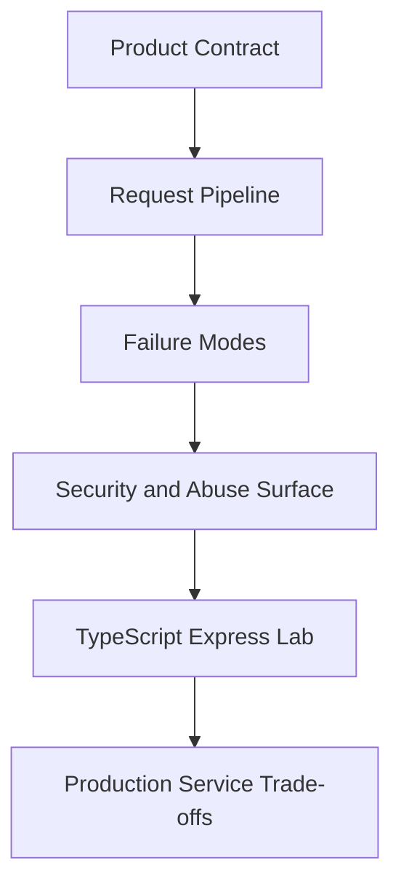
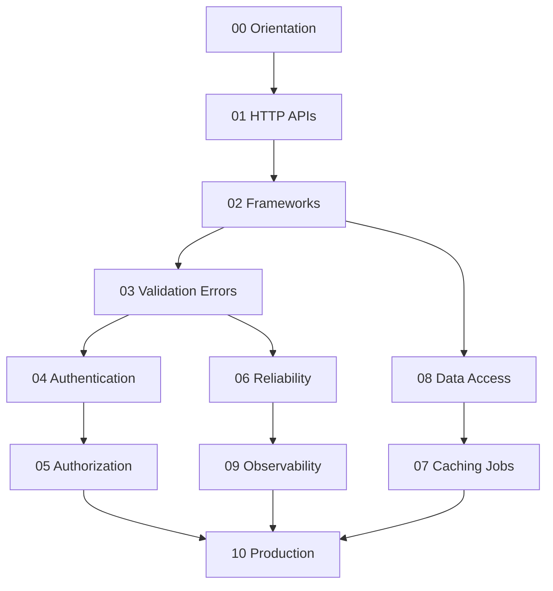

# 07 Backend

A first-principles track for **product HTTP services**: API contracts, Express middleware pipelines, authentication and authorization, validation and versioning, reliability and abuse resistance, app-level caching and jobs, data-access patterns, observability, and production service readiness—implemented in TypeScript with Express on Node.

## Objectives

- Design REST-style resource contracts with explicit status and error policy
- Build and reason about middleware pipelines, DI, and request context
- Implement authentication and authorization without confusing them
- Apply timeouts, retries, idempotency, rate limits, and circuit breakers correctly
- Integrate caches, jobs, and queues as *application patterns* (not broker internals)
- Use repositories/transactions as service concerns; hand engines to Databases
- Ship observable, testable, operable APIs above the Node host

## Why This Track Matters

Node gives you sockets and an event loop; Backend failures are product failures: broken auth, leaked tenancy, dual-writes without outbox, retries that amplify outages, cache stampedes, and APIs that cannot evolve. Framework tutorials hide the contracts; this track teaches them.

## Teaching Contract

Every topic note follows:

## Scope Boundaries

| This track owns | Handoff |
| --- | --- |
| Express/Fastify product APIs, routing, middleware | Thin `http`/`net`, libuv, streams → [[06-NodeJS/README\|Node.js]] |
| REST/OpenAPI contracts, versioning, error envelopes | HTTP-as-protocol framing → [[01-Computer-Science/README\|Computer Science]] |
| Sessions, JWT, OAuth/OIDC *application* flows | Crypto/threat curriculum depth → [[18-Security/README\|Security]] |
| RBAC/ABAC, resource ownership, app tenancy | Cross-org IdP federation at scale → [[09-System-Design/README\|System Design]] |
| Timeouts, retries, rate limits, circuit breakers | Multi-region capacity and consistency → System Design |
| Cache-aside, jobs, outbox *patterns* | Redis/Kafka *engines* → [[08-Databases/README\|Databases]] / System Design |
| Repository, UoW, migrations *as process*, Mini ORM | Indexes, WAL, isolation, planners → Databases |
| API SLIs, tracing, contract/load tests | Container/CI platforms → [[16-DevOps/README\|DevOps]] |

## Prerequisites

- [[06-NodeJS/05-Networking/http and https Platform Servers|http and https Platform Servers]]
- [[06-NodeJS/10-Production-Node/Graceful Shutdown and Drain|Graceful Shutdown and Drain]]
- [[06-NodeJS/01-Process-and-Runtime/unhandledRejection uncaughtException and Fatal Errors|unhandledRejection uncaughtException and Fatal Errors]]
- [[02-JavaScript/07-Production-JavaScript/Error Design and Exception Safety|Error Design and Exception Safety]]
- [[01-Computer-Science/07-Networking-Fundamentals/HTTP as a Protocol|HTTP as a Protocol]]

## Roadmap

## Topics

### 00 — Orientation

- [[07-Backend/00-Orientation/Why Backend Services Exist|Why Backend Services Exist]]
- [[07-Backend/00-Orientation/Node Host vs Backend Product Boundary|Node Host vs Backend Product Boundary]]
- [[07-Backend/00-Orientation/Service Layering and Hexagonal Intuition|Service Layering and Hexagonal Intuition]]
- [[07-Backend/00-Orientation/Backend Failure Modes in Production|Backend Failure Modes in Production]]
- [[07-Backend/00-Orientation/WinterCG and Multi-Runtime API Portability|WinterCG and Multi-Runtime API Portability]]

### 01 — HTTP APIs and Contracts

- [[07-Backend/01-HTTP-APIs-and-Contracts/Resource Modeling and REST Semantics|Resource Modeling and REST Semantics]]
- [[07-Backend/01-HTTP-APIs-and-Contracts/Status Codes as Product Policy|Status Codes as Product Policy]]
- [[07-Backend/01-HTTP-APIs-and-Contracts/Content Negotiation and Payload Design|Content Negotiation and Payload Design]]
- [[07-Backend/01-HTTP-APIs-and-Contracts/Pagination Filtering and Sorting Contracts|Pagination Filtering and Sorting Contracts]]
- [[07-Backend/01-HTTP-APIs-and-Contracts/Idempotency Keys and Safe Retries|Idempotency Keys and Safe Retries]]
- [[07-Backend/01-HTTP-APIs-and-Contracts/OpenAPI as Executable Contract|OpenAPI as Executable Contract]]

### 02 — Frameworks and Middleware

- [[07-Backend/02-Frameworks-and-Middleware/Express Application and Router Internals|Express Application and Router Internals]]
- [[07-Backend/02-Frameworks-and-Middleware/Middleware Pipeline and Error Middleware|Middleware Pipeline and Error Middleware]]
- [[07-Backend/02-Frameworks-and-Middleware/Request Context and Async Local Storage|Request Context and Async Local Storage]]
- [[07-Backend/02-Frameworks-and-Middleware/Dependency Injection for Services|Dependency Injection for Services]]
- [[07-Backend/02-Frameworks-and-Middleware/Fastify Contrast and Plugin Model Concepts|Fastify Contrast and Plugin Model Concepts]]
- [[07-Backend/02-Frameworks-and-Middleware/Express Clone Design|Express Clone Design]]

### 03 — Validation Errors and Versioning

- [[07-Backend/03-Validation-Errors-and-Versioning/Schema Validation at the Edge|Schema Validation at the Edge]]
- [[07-Backend/03-Validation-Errors-and-Versioning/Problem Details and Error Envelopes|Problem Details and Error Envelopes]]
- [[07-Backend/03-Validation-Errors-and-Versioning/API Versioning Strategies|API Versioning Strategies]]
- [[07-Backend/03-Validation-Errors-and-Versioning/Breaking Changes and Compatibility Windows|Breaking Changes and Compatibility Windows]]
- [[07-Backend/03-Validation-Errors-and-Versioning/Input Limits Uploads and Content-Type Enforcement|Input Limits Uploads and Content-Type Enforcement]]

### 04 — Authentication

- [[07-Backend/04-Authentication/Sessions Cookies and CSRF Boundaries|Sessions Cookies and CSRF Boundaries]]
- [[07-Backend/04-Authentication/Password Hashing and Credential Storage|Password Hashing and Credential Storage]]
- [[07-Backend/04-Authentication/JWT Access Tokens and Claims|JWT Access Tokens and Claims]]
- [[07-Backend/04-Authentication/Refresh Token Rotation|Refresh Token Rotation]]
- [[07-Backend/04-Authentication/OAuth2 and OIDC Application Flows|OAuth2 and OIDC Application Flows]]
- [[07-Backend/04-Authentication/Authentication Server Threat Model|Authentication Server Threat Model]]

### 05 — Authorization and Tenancy

- [[07-Backend/05-Authorization-and-Tenancy/RBAC and Permission Modeling|RBAC and Permission Modeling]]
- [[07-Backend/05-Authorization-and-Tenancy/ABAC and Policy Decision Points Concepts|ABAC and Policy Decision Points Concepts]]
- [[07-Backend/05-Authorization-and-Tenancy/Resource Ownership Checks|Resource Ownership Checks]]
- [[07-Backend/05-Authorization-and-Tenancy/Multi-Tenant Isolation at the App Boundary|Multi-Tenant Isolation at the App Boundary]]
- [[07-Backend/05-Authorization-and-Tenancy/Least Privilege for Service Identities|Least Privilege for Service Identities]]

### 06 — Reliability and Abuse Resistance

- [[07-Backend/06-Reliability-and-Abuse-Resistance/Timeouts Cancellation and Deadlines|Timeouts Cancellation and Deadlines]]
- [[07-Backend/06-Reliability-and-Abuse-Resistance/Retries Jitter and Idempotent Handlers|Retries Jitter and Idempotent Handlers]]
- [[07-Backend/06-Reliability-and-Abuse-Resistance/Circuit Breakers and Bulkheads|Circuit Breakers and Bulkheads]]
- [[07-Backend/06-Reliability-and-Abuse-Resistance/Rate Limiting and Quotas|Rate Limiting and Quotas]]
- [[07-Backend/06-Reliability-and-Abuse-Resistance/CORS Security Headers and Browser Boundaries|CORS Security Headers and Browser Boundaries]]
- [[07-Backend/06-Reliability-and-Abuse-Resistance/Graceful Request Drain Above Process Shutdown|Graceful Request Drain Above Process Shutdown]]

### 07 — Caching Jobs and Messaging

- [[07-Backend/07-Caching-Jobs-and-Messaging/Cache-Aside and TTL Strategies|Cache-Aside and TTL Strategies]]
- [[07-Backend/07-Caching-Jobs-and-Messaging/Cache Stampede and Soft Expiry|Cache Stampede and Soft Expiry]]
- [[07-Backend/07-Caching-Jobs-and-Messaging/Session and Feature Stores as Products|Session and Feature Stores as Products]]
- [[07-Backend/07-Caching-Jobs-and-Messaging/Background Jobs and Workers|Background Jobs and Workers]]
- [[07-Backend/07-Caching-Jobs-and-Messaging/Transactional Outbox and Inbox Patterns|Transactional Outbox and Inbox Patterns]]
- [[07-Backend/07-Caching-Jobs-and-Messaging/Message Queue Client Patterns|Message Queue Client Patterns]]

### 08 — Data Access and Persistence Patterns

- [[07-Backend/08-Data-Access-and-Persistence-Patterns/Repository and Unit of Work|Repository and Unit of Work]]
- [[07-Backend/08-Data-Access-and-Persistence-Patterns/Transactions as Used by Services|Transactions as Used by Services]]
- [[07-Backend/08-Data-Access-and-Persistence-Patterns/N-plus-1 and Query Shape Discipline|N-plus-1 and Query Shape Discipline]]
- [[07-Backend/08-Data-Access-and-Persistence-Patterns/Migrations as Operational Process|Migrations as Operational Process]]
- [[07-Backend/08-Data-Access-and-Persistence-Patterns/Mini ORM Concepts and Query Builders|Mini ORM Concepts and Query Builders]]
- [[07-Backend/08-Data-Access-and-Persistence-Patterns/Handing Off to Database Engines|Handing Off to Database Engines]]

### 09 — API Observability and Testing

- [[07-Backend/09-API-Observability-and-Testing/RED Metrics and SLIs for APIs|RED Metrics and SLIs for APIs]]
- [[07-Backend/09-API-Observability-and-Testing/Distributed Tracing Across Handlers|Distributed Tracing Across Handlers]]
- [[07-Backend/09-API-Observability-and-Testing/Structured Logs with Request Correlation|Structured Logs with Request Correlation]]
- [[07-Backend/09-API-Observability-and-Testing/Contract Integration and Load Testing|Contract Integration and Load Testing]]
- [[07-Backend/09-API-Observability-and-Testing/Chaos and Failure Injection at the Service Edge|Chaos and Failure Injection at the Service Edge]]

### 10 — Production Services

- [[07-Backend/10-Production-Services/Configuration Feature Flags and Secrets for Services|Configuration Feature Flags and Secrets for Services]]
- [[07-Backend/10-Production-Services/Reverse Proxy Expectations and Trusted Headers|Reverse Proxy Expectations and Trusted Headers]]
- [[07-Backend/10-Production-Services/Health Dependencies and Readiness Semantics|Health Dependencies and Readiness Semantics]]
- [[07-Backend/10-Production-Services/Deployment Topologies for Single Services|Deployment Topologies for Single Services]]
- [[07-Backend/10-Production-Services/Security Review Checklist for APIs|Security Review Checklist for APIs]]
- [[07-Backend/10-Production-Services/Operational Readiness for Backend Services|Operational Readiness for Backend Services]]

## Suggested Study Order

1. Orientation (00) and HTTP APIs (01) before frameworks
2. Frameworks (02) and Validation (03) before auth
3. Authentication (04) before Authorization (05)
4. Reliability (06) in parallel with early service work
5. Data Access (08) before Caching/Jobs (07) for outbox clarity
6. Observability (09) and Production (10) as synthesis

## Mini Projects

- [[07-Backend/projects/Express Clone/README|Express Clone]]
- [[07-Backend/projects/Authentication Server/README|Authentication Server]]
- [[07-Backend/projects/URL Shortener API/README|URL Shortener API]]
- [[07-Backend/projects/Job Worker and Outbox Lab/README|Job Worker and Outbox Lab]]
- [[07-Backend/projects/API Contract and Reliability Harness/README|API Contract and Reliability Harness]]

## Portfolio Project

- [[07-Backend/projects/Backend Service Toolkit/README|Backend Service Toolkit]]

## Exercises

Module sets live under [[07-Backend/_exercises/README|Backend Exercises]].

## Interview Questions

Module sets live under [[07-Backend/_interview/README|Backend Interview Questions]].

## Implementation Checklist

- [x] Express-lite router / middleware / error pipeline
- [x] Validation + problem+json errors
- [x] Session vs JWT auth helpers + RBAC guard
- [x] Timeout / retry / idempotency utilities
- [x] Token-bucket rate limiter
- [x] Cache-aside with stampede lock
- [x] In-process job queue + outbox sketch
- [x] Repository + fake DB adapter
- [x] OpenAPI contract smoke checks
- [x] Five mini projects + Backend Service Toolkit

## Code Labs

See [[07-Backend/code/README|Backend code labs]].

## References

- [[00-References/Backend/README|Backend References]]

## Related Tracks

- [[06-NodeJS/README|Node.js]]
- [[02-JavaScript/README|JavaScript]]
- [[01-Computer-Science/README|Computer Science]]
- [[08-Databases/README|Databases]]
- [[09-System-Design/README|System Design]]
- [[16-DevOps/README|DevOps]]
- [[18-Security/README|Security]]
- [[Career/README|Career]]

## Stage Gate Checklist

- [ ] Can design an API contract with status/error/versioning policy
- [ ] Can implement middleware, validation, and authN/authZ correctly
- [ ] Can apply reliability patterns without amplifying failures
- [ ] Can use cache/job/outbox patterns without claiming broker expertise
- [ ] Labs green; at least three mini projects and portfolio docs completed
- [ ] Interview sets practiced with diagrams and production failure modes
