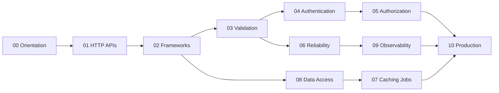

# Backend Exercises

Eleven module sets move from product boundaries through HTTP contracts, Express middleware, validation and versioning, authentication and authorization, reliability, caching and jobs, data access, observability, and production service readiness.

## Learning Path

## Exercise Sets

1. [[07-Backend/_exercises/Orientation Exercises.md|Orientation Exercises]] — separate backend product concerns from the Node host, map service layering, failure modes, and multi-runtime portability before building APIs
2. [[07-Backend/_exercises/HTTP APIs and Contracts Exercises.md|HTTP APIs and Contracts Exercises]] — practice REST resource modeling, status policy, pagination, idempotency keys, and OpenAPI as executable contract
3. [[07-Backend/_exercises/Frameworks and Middleware Exercises.md|Frameworks and Middleware Exercises]] — build middleware pipelines, error middleware, request context, DI, and Express internals without framework magic
4. [[07-Backend/_exercises/Validation Errors and Versioning Exercises.md|Validation Errors and Versioning Exercises]] — enforce schema validation at the edge, problem+json envelopes, versioning strategies, and breaking-change windows
5. [[07-Backend/_exercises/Authentication Exercises.md|Authentication Exercises]] — implement sessions, JWT access tokens, refresh rotation, OAuth/OIDC flows, and auth-server threat modeling
6. [[07-Backend/_exercises/Authorization and Tenancy Exercises.md|Authorization and Tenancy Exercises]] — model RBAC/ABAC, resource ownership, multi-tenant isolation, and least-privilege service identities
7. [[07-Backend/_exercises/Reliability and Abuse Resistance Exercises.md|Reliability and Abuse Resistance Exercises]] — apply timeouts, retries with jitter, circuit breakers, rate limits, CORS, and graceful request drain
8. [[07-Backend/_exercises/Caching Jobs and Messaging Exercises.md|Caching Jobs and Messaging Exercises]] — implement cache-aside, stampede protection, background jobs, outbox/inbox, and queue client patterns
9. [[07-Backend/_exercises/Data Access and Persistence Patterns Exercises.md|Data Access and Persistence Patterns Exercises]] — use repository/UoW, transactions, query shape discipline, migrations as process, and hand off to database engines
10. [[07-Backend/_exercises/API Observability and Testing Exercises.md|API Observability and Testing Exercises]] — instrument RED metrics, distributed tracing, structured logs, contract/load tests, and chaos at the service edge
11. [[07-Backend/_exercises/Production Services Exercises.md|Production Services Exercises]] — synthesize config, feature flags, reverse-proxy trust, health/readiness, deployment topologies, and operational readiness

## Completion Standard

- State product contracts, auth boundaries, and failure modes before coding.
- Implement against shared lab vectors in [[07-Backend/code/README|code labs]] with observable behavior.
- Measure latency and error budgets before optimizing; preserve correctness oracles.
- Debug drills must formalize reproduction, request pipeline ordering, and regression vectors.
- Production scenarios include telemetry, rollout, rollback, and operational failure modes.

## Related Notes

- [[07-Backend/README|Backend]]
- [[07-Backend/code/README|code labs]]
- [[07-Backend/_interview/README|Backend Interview Questions]]
- [[Career/README|Career]]
