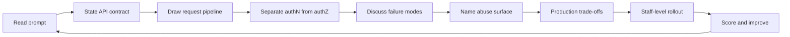

# Backend Interview Questions

Eleven interview sets assess product contracts, middleware pipelines, authN/authZ separation, reliability patterns, data access discipline, observability, and staff-level production judgment for HTTP services.

## Practice Loop

## Interview Sets

1. [[07-Backend/_interview/Orientation Interview.md|Orientation Interview]]
2. [[07-Backend/_interview/HTTP APIs and Contracts Interview.md|HTTP APIs and Contracts Interview]]
3. [[07-Backend/_interview/Frameworks and Middleware Interview.md|Frameworks and Middleware Interview]]
4. [[07-Backend/_interview/Validation Errors and Versioning Interview.md|Validation Errors and Versioning Interview]]
5. [[07-Backend/_interview/Authentication Interview.md|Authentication Interview]]
6. [[07-Backend/_interview/Authorization and Tenancy Interview.md|Authorization and Tenancy Interview]]
7. [[07-Backend/_interview/Reliability and Abuse Resistance Interview.md|Reliability and Abuse Resistance Interview]]
8. [[07-Backend/_interview/Caching Jobs and Messaging Interview.md|Caching Jobs and Messaging Interview]]
9. [[07-Backend/_interview/Data Access and Persistence Patterns Interview.md|Data Access and Persistence Patterns Interview]]
10. [[07-Backend/_interview/API Observability and Testing Interview.md|API Observability and Testing Interview]]
11. [[07-Backend/_interview/Production Services Interview.md|Production Services Interview]]

## Evaluation Standard

- Contract answers define resource semantics, status/error policy, and versioning rules.
- Pipeline answers explain middleware order, context propagation, and error middleware behavior.
- Auth answers separate authentication from authorization and name tenancy boundaries.
- Reliability answers cover timeouts, idempotency, rate limits, and failure amplification.
- Data answers describe transaction scope, query shape, and migration operational process.
- Production answers include misuse telemetry, graceful degradation, and rollout playbooks.

## Related Notes

- [[Career/README|Career]]
- [[07-Backend/_exercises/README|Backend Exercises]]
- [[07-Backend/code/README|code labs]]
- [[07-Backend/README|Backend]]
