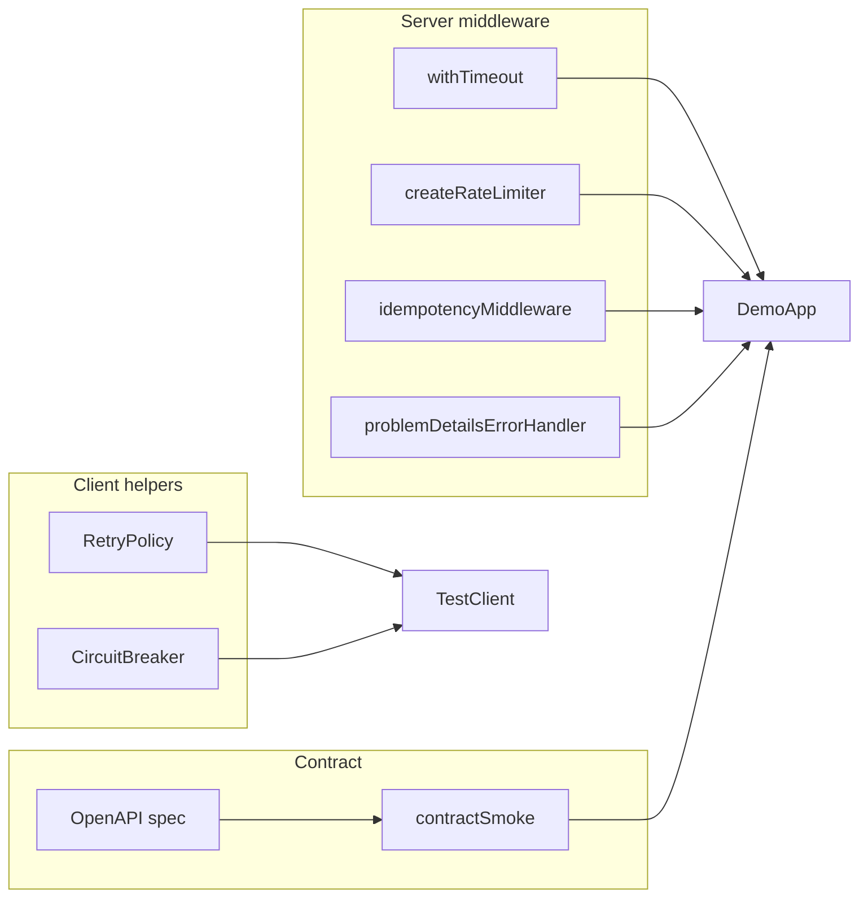

# Architecture — API Contract and Reliability Harness

## Summary

Reliability primitives as composable modules plus contract smoke runner. Source: [[07-Backend/code/src/reliability-harness.ts|reliability-harness.ts]] and [[07-Backend/code/openapi/demo-api.yaml|demo-api.yaml]].

## Module Map

## Public Surface

| Symbol | Responsibility |
| --- | --- |
| `withTimeout(ms)` | AbortSignal + `504` on breach |
| `createRateLimiter(opts)` | Token bucket per key fn |
| `idempotencyMiddleware(store)` | Safe replay for mutating routes |
| `RetryPolicy` | Idempotent-aware retries + jitter |
| `CircuitBreaker` | Closed/open/half-open state machine |
| `contractSmoke(app, spec)` | Assert routes/responses vs OpenAPI |

## Error Integration

All middleware errors funnel to problem+json envelope per ADR-003—stable `type`, `title`, `status`, optional `errors[]` for validation.

## Failure Injection

Test-only `FaultSwitch` toggles handler failure rate for breaker and retry tests—isolated per test instance.

## Related Documents

- [[07-Backend/projects/API Contract and Reliability Harness/README|README]]
- [[07-Backend/projects/Backend Service Toolkit/ADR/ADR-003 Error Envelope Format|ADR-003]]
- [[07-Backend/projects/Backend Service Toolkit/ADR/ADR-004 Idempotency and Retry Policy|ADR-004]]
