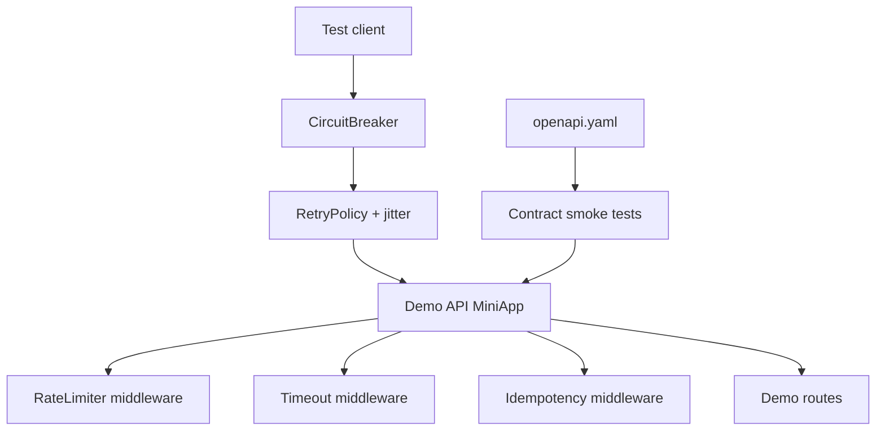

# API Contract and Reliability Harness

## One-Line Purpose

Build a reliability and contract test harness: OpenAPI smoke validation, timeout/deadline middleware, retry with jitter client, idempotency key middleware, token-bucket rate limiter, and circuit breaker wrapper—exercised against a demo API surface.

## Status

**Active.** The learning surface targets [[07-Backend/code/src/reliability-harness.ts|reliability-harness.ts]] and executable checks in [[07-Backend/code/tests/labs.test.ts|labs.test.ts]].

## Prerequisites

- [[07-Backend/01-HTTP-APIs-and-Contracts/OpenAPI as Executable Contract|OpenAPI as Executable Contract]]
- [[07-Backend/01-HTTP-APIs-and-Contracts/Idempotency Keys and Safe Retries|Idempotency Keys and Safe Retries]]
- [[07-Backend/06-Reliability-and-Abuse-Resistance/Timeouts Cancellation and Deadlines|Timeouts Cancellation and Deadlines]]
- [[07-Backend/06-Reliability-and-Abuse-Resistance/Retries Jitter and Idempotent Handlers|Retries Jitter and Idempotent Handlers]]
- [[07-Backend/06-Reliability-and-Abuse-Resistance/Rate Limiting and Quotas|Rate Limiting and Quotas]]
- [[07-Backend/06-Reliability-and-Abuse-Resistance/Circuit Breakers and Bulkheads|Circuit Breakers and Bulkheads]]
- [[07-Backend/09-API-Observability-and-Testing/Contract Integration and Load Testing|Contract Integration and Load Testing]]
- [[07-Backend/projects/Express Clone/README|Express Clone]]

## Architecture



See [[07-Backend/projects/API Contract and Reliability Harness/Architecture|Architecture]] for error envelope integration per [[07-Backend/projects/Backend Service Toolkit/ADR/ADR-003 Error Envelope Format|ADR-003]].

## Acceptance Criteria

- [ ] OpenAPI spec validates demo routes: methods, status codes, and response schemas smoke-tested.
- [ ] Timeout middleware aborts slow handler with `504` and problem+json envelope.
- [ ] Retry client retries only idempotent methods or when idempotency key present—never unsafe POST retry by default.
- [ ] Rate limiter returns `429` with `Retry-After` when bucket exhausted.
- [ ] Circuit breaker opens after failure threshold; half-open probe succeeds before close.
- [ ] Chaos fixture: downstream failure injection toggled in tests without flakiness.
- [ ] All reliability primitives exportable for [[07-Backend/projects/Backend Service Toolkit/README|Backend Service Toolkit]].

## Run and Test

```bash
cd 07-Backend/code
npm install
npm test -- tests/labs.test.ts -t "ReliabilityHarness"
```

Contract smoke:

```bash
npm test -- tests/labs.test.ts -t "OpenApiContract"
```

## Benchmarks

| Workload | Variants | Primary metrics |
| --- | --- | --- |
| Rate limit 1k req/s fixture | burst vs steady | 429 rate, false positives |
| Circuit breaker flip | failure threshold 5 | open latency, recovery time |
| Retry storm | jitter on vs off | downstream amplification factor |

Benchmark entry point (when added): `07-Backend/code/bench/reliability-harness.bench.ts`.

## Security and Failure Constraints

- Retry policy must not amplify outages—cap max attempts and honor `429 Retry-After`.
- Rate limit keys must not trust spoofed `X-Forwarded-For` without proxy config.
- OpenAPI spec must not document admin endpoints absent from implementation.
- Circuit breaker state must not leak cross-tenant when keyed incorrectly—document key selection.

## Exercises and Reflection

1. Add bulkhead limiting concurrent handler executions.
2. Wire harness metrics to RED counters in demo `/metrics` route.
3. Fail contract test when response schema drifts from OpenAPI.

**Reflection prompts**

- Why is jitter required on retries?
- When does a circuit breaker hurt more than help?
- What makes OpenAPI "executable" vs documentation-only?

## Interview Questions

- Design idempotency for payment POST.
- Explain circuit breaker states and half-open behavior.
- How do you load test without invalidating production SLOs?

## Related Notes

- [[07-Backend/projects/API Contract and Reliability Harness/Architecture|Architecture]]
- [[07-Backend/projects/API Contract and Reliability Harness/Testing|Testing]]
- [[07-Backend/projects/API Contract and Reliability Harness/Security|Security]]
- [[07-Backend/README|Backend MOC]]
- [[07-Backend/code/README|Backend Code Labs]]
- [[07-Backend/projects/Backend Service Toolkit/README|Backend Service Toolkit]]
- [[Career/README|Career]]
