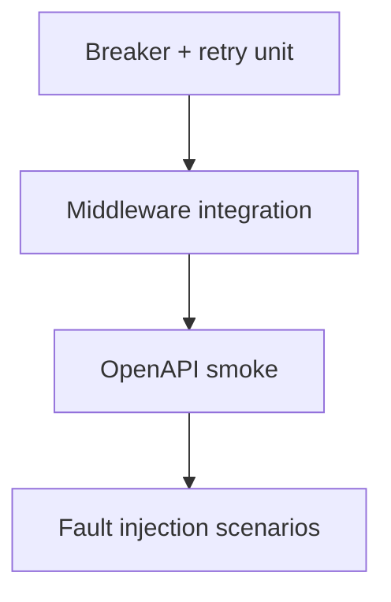

# Testing — API Contract and Reliability Harness

## Strategy

Unit tests for breaker state machine and retry policy; middleware integration on demo app; OpenAPI smoke as contract gate.



## Critical Paths

1. Slow handler → timeout → `504` problem+json
2. Exceed rate limit → `429` + `Retry-After`
3. Idempotency replay → same response body; single backend mutation
4. Breaker opens after N failures; half-open success closes
5. Retry does not retry unsafe POST without key
6. OpenAPI smoke passes on green demo app; fails when schema drift injected

## Commands

```bash
cd 07-Backend/code
npm test -- tests/labs.test.ts -t "ReliabilityHarness|OpenApiContract"
```

## Definition of Done

- [ ] Breaker tests cover open/half-open/closed transitions deterministically
- [ ] Jitter tested via seeded RNG for stable CI
- [ ] Contract smoke reads spec from repo path—not network
- [ ] Fault injection disabled by default outside test instances

## Related Documents

- [[07-Backend/projects/API Contract and Reliability Harness/README|README]]
- [[07-Backend/09-API-Observability-and-Testing/Chaos and Failure Injection at the Service Edge|Chaos and Failure Injection at the Service Edge]]
- [[07-Backend/projects/Backend Service Toolkit/Testing|Backend Service Toolkit Testing]]
