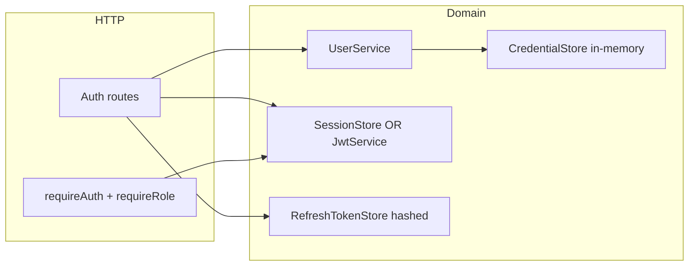
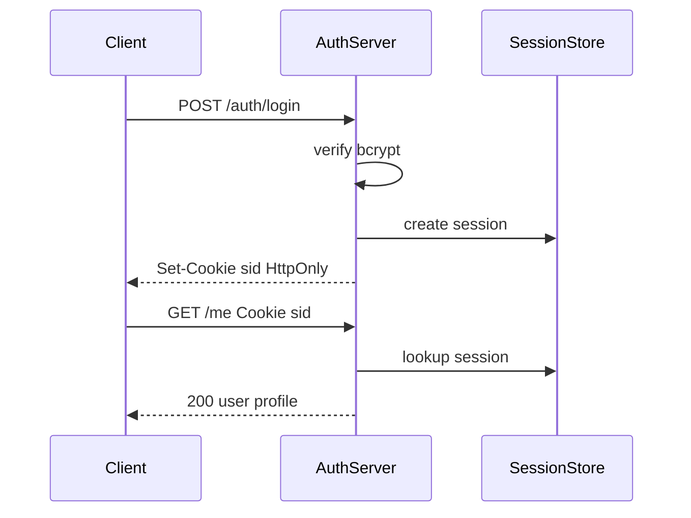

# Architecture — Authentication Server

## Summary

A composable auth module mounted on [[07-Backend/projects/Express Clone/README|Express Clone]] stack. Source: [[07-Backend/code/src/auth-server.ts|auth-server.ts]]. Supports two explicit modes per [[07-Backend/projects/Backend Service Toolkit/ADR/ADR-002 Auth Default Sessions vs JWT|ADR-002]].

## Component Diagram

## Public Surface

| Symbol | Responsibility |
| --- | --- |
| `createAuthRouter` | Register/login/refresh/logout routes |
| `requireAuth` | Middleware: attach `req.user` or `401` |
| `requireRole(role)` | Middleware: `403` if claim missing |
| `AuthMode` | `'session' \| 'jwt'` configuration |
| `hashPassword` / `verifyPassword` | bcrypt wrappers with cost from env |

## Session Mode Flow

## JWT Mode Flow

Access token short TTL; refresh token long TTL with rotation. Refresh store keeps hash of current valid refresh only per device/session family.

## Invariants

- Password never logged, serialized, or returned in API responses.
- Refresh reuse revokes entire token family (detect theft).
- `req.user` contains id and roles only—no credential material.
- Logout invalidates session or refresh record server-side.

## Trade-offs

| Choice | Benefit | Cost |
| --- | --- | --- |
| In-memory stores | Simple lab, fast tests | No durability—document handoff to [[08-Databases/README\|Databases]] |
| Configurable AUTH_MODE | Teaches both patterns | Two test matrices |
| bcrypt default cost 10 | CI-friendly | Not production cost recommendation |

## Related Documents

- [[07-Backend/projects/Authentication Server/README|README]]
- [[07-Backend/projects/Backend Service Toolkit/ADR/ADR-002 Auth Default Sessions vs JWT|ADR-002]]
- [[07-Backend/04-Authentication/Authentication Server Threat Model|Authentication Server Threat Model]]
