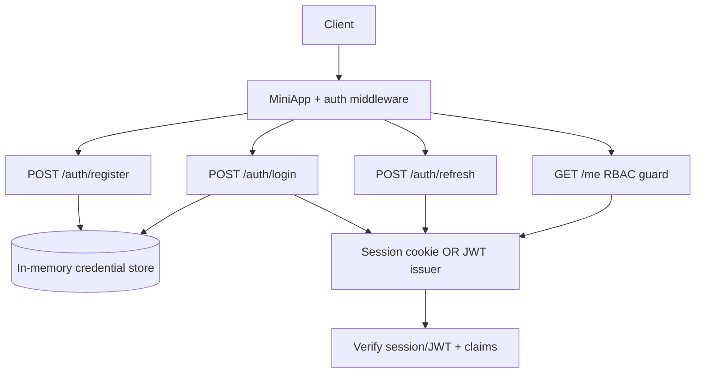

# Authentication Server

## One-Line Purpose

Implement a small credential and token service: password registration/login with bcrypt, httpOnly session cookies **or** JWT access tokens (configurable mode), refresh token rotation, and RBAC guard middleware—without building a full IdP or OAuth broker.

## Status

**Active.** The learning surface targets [[07-Backend/code/src/auth-server.ts|auth-server.ts]] and executable checks in [[07-Backend/code/tests/labs.test.ts|labs.test.ts]]. This folder defines threat boundaries, token lifetimes, and acceptance against auth integration vectors.

## Prerequisites

- [[07-Backend/04-Authentication/Password Hashing and Credential Storage|Password Hashing and Credential Storage]]
- [[07-Backend/04-Authentication/Sessions Cookies and CSRF Boundaries|Sessions Cookies and CSRF Boundaries]]
- [[07-Backend/04-Authentication/JWT Access Tokens and Claims|JWT Access Tokens and Claims]]
- [[07-Backend/04-Authentication/Refresh Token Rotation|Refresh Token Rotation]]
- [[07-Backend/04-Authentication/Authentication Server Threat Model|Authentication Server Threat Model]]
- [[07-Backend/05-Authorization-and-Tenancy/RBAC and Permission Modeling|RBAC and Permission Modeling]]
- [[07-Backend/projects/Express Clone/README|Express Clone]]

## Architecture



See [[07-Backend/projects/Authentication Server/Architecture|Architecture]] for mode switching and rotation invariants.

## Acceptance Criteria

- [ ] Registration stores bcrypt hash only—never plaintext password in store or logs.
- [ ] Login returns session cookie (httpOnly, SameSite=Lax) **or** JWT pair per configured `AUTH_MODE`.
- [ ] Refresh endpoint rotates refresh token; reuse of revoked refresh fails closed.
- [ ] `GET /me` requires valid session/JWT; returns user id and roles without password fields.
- [ ] RBAC guard rejects missing role with `403` problem+json—not `401` when authenticated but unauthorized.
- [ ] Constant-time comparison path for session lookup where applicable; no user enumeration via timing in tests.
- [ ] Negative tests: wrong password, expired token, tampered JWT signature, CSRF on cookie mode without token.

## Run and Test

```bash
cd 07-Backend/code
npm install
npm test -- tests/labs.test.ts -t "AuthServer"
```

## Benchmarks

| Workload | Variants | Primary metrics |
| --- | --- | --- |
| 1k login attempts | bcrypt cost 10 vs 12 | p99 latency, CPU |
| Token verify per request | JWT vs session lookup | verify μs, req/s on /me |
| Refresh storm | valid vs reused token | rotation correctness, lock contention |

Benchmark entry point (when added): `07-Backend/code/bench/auth-server.bench.ts`.

## Security and Failure Constraints

- Password minimum length and complexity enforced at validation edge.
- JWT signing keys from env; never hard-coded in repo.
- Refresh tokens stored hashed server-side; raw token shown once at issuance.
- Cookie mode requires CSRF token on state-changing routes when browser clients are in scope.
- Rate limit login endpoint (integrates with Reliability Harness patterns).
- No OAuth/OIDC broker in v1—handoff to [[07-Backend/04-Authentication/OAuth2 and OIDC Application Flows|OAuth2 and OIDC Application Flows]].

## Exercises and Reflection

1. Add account lockout after N failed logins with exponential backoff.
2. Implement step-up auth for sensitive `/admin` routes.
3. Compare session fixation defenses for cookie mode.

**Reflection prompts**

- When is session mode safer than JWT for a first-party web app?
- What breaks if refresh tokens are not rotated on every use?
- Why must authN (`401`) be distinct from authZ (`403`)?

## Interview Questions

- Design refresh token rotation with reuse detection.
- Where do you store JWT signing keys in production?
- How do SameSite cookies interact with cross-site API calls?

## Related Notes

- [[07-Backend/projects/Authentication Server/Architecture|Architecture]]
- [[07-Backend/projects/Authentication Server/Testing|Testing]]
- [[07-Backend/projects/Authentication Server/Security|Security]]
- [[07-Backend/README|Backend MOC]]
- [[07-Backend/code/README|Backend Code Labs]]
- [[07-Backend/projects/Backend Service Toolkit/README|Backend Service Toolkit]]
- [[Career/README|Career]]
