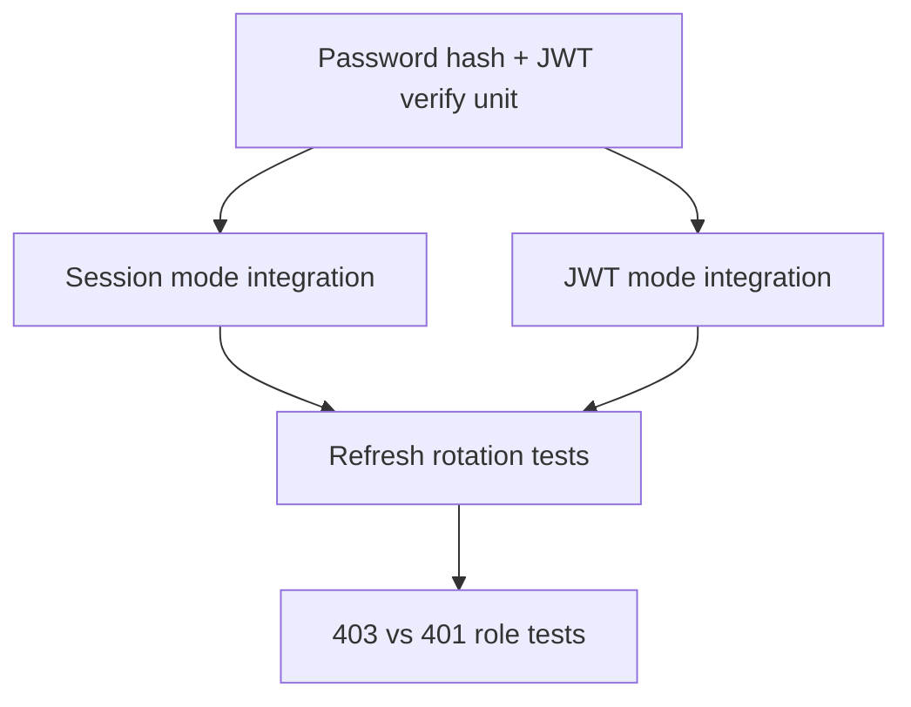

# Testing — Authentication Server

## Strategy

Dual matrix: run critical paths in both `session` and `jwt` modes. Integration tests use real HTTP with cookie jar or `Authorization: Bearer` headers.



## Critical Paths

1. Register → login → `/me` returns same user id
2. Wrong password → `401` generic message (no user enumeration string)
3. Expired access JWT → `401`; refresh → new pair works
4. Reused refresh after rotation → `401` and family revoked
5. Authenticated user missing `admin` role → `403` on protected route
6. Logout → subsequent `/me` → `401`
7. Tampered JWT signature → `401`

## Commands

```bash
cd 07-Backend/code
npm test -- tests/labs.test.ts -t "AuthServer"
```

Use env `AUTH_MODE=session` and `AUTH_MODE=jwt` in CI matrix jobs.

## Definition of Done

- [ ] Both auth modes pass full critical path suite
- [ ] No password or refresh token appears in test stdout logs
- [ ] Cookie tests assert `HttpOnly` and `SameSite` attributes
- [ ] Refresh rotation race simulated with sequential reuse attempt

## Related Documents

- [[07-Backend/projects/Authentication Server/README|README]]
- [[07-Backend/projects/Authentication Server/Security|Security]]
- [[07-Backend/projects/Backend Service Toolkit/Testing|Backend Service Toolkit Testing]]
