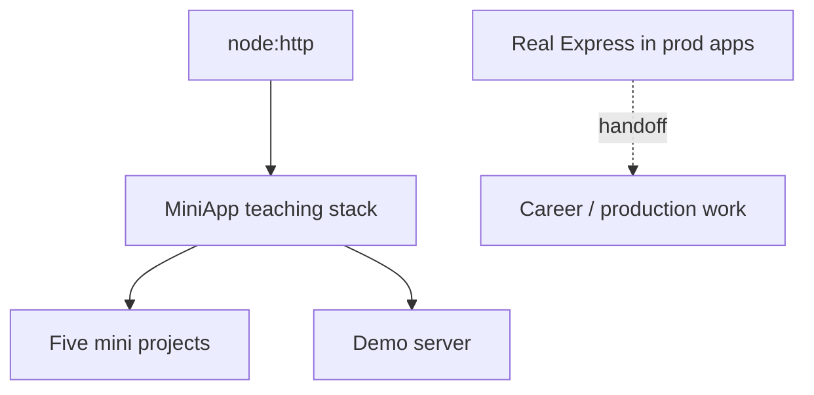

# ADR-001: Express as Teaching Default

## Status

Accepted on 2026-07-22.

## Context

Backend track teaches middleware pipelines, routing, and error middleware. Learners may use real Express in production, but importing Express hides dispatch mechanics. A **mini Express** on `node:http` makes layer stacks inspectable while staying aligned with [[07-Backend/02-Frameworks-and-Middleware/Express Clone Design|Express Clone Design]].

Fastify offers performance and plugin ergonomics ([[07-Backend/02-Frameworks-and-Middleware/Fastify Contrast and Plugin Model Concepts|Fastify Contrast]]), but dual-framework scope splits learning focus.

## Decision

Default toolkit HTTP stack is **mini-express** (`MiniApp` + `Router` + error middleware). Demo server and labs compose on this stack. Document deliberate simplifications vs Express 4. Optional future Fastify contrast module is not default.

## Options Considered

| Option | Pros | Cons |
| --- | --- | --- |
| Mini Express on `node:http` | Visible dispatch; links Node HTTP lab | Not drop-in Express |
| Real Express dependency | Production familiarity | Hides teaching model |
| Fastify default | Performance story | Different plugin model; splits curriculum |

## Consequences

Tests lock mini-express ordering and error middleware arity behavior. Documentation links real Express for edge cases. Portfolio does not claim Express compatibility—only conceptual alignment.

## Follow-ups

- Document Express 5 async error default differences in mini-express module header.
- Optional I-001 Fastify contrast module in [[07-Backend/projects/Backend Service Toolkit/Ideas|Ideas]].

## Related Documents

- [[07-Backend/projects/Express Clone/README|Express Clone]]
- [[07-Backend/projects/Backend Service Toolkit/Architecture|Architecture]]
