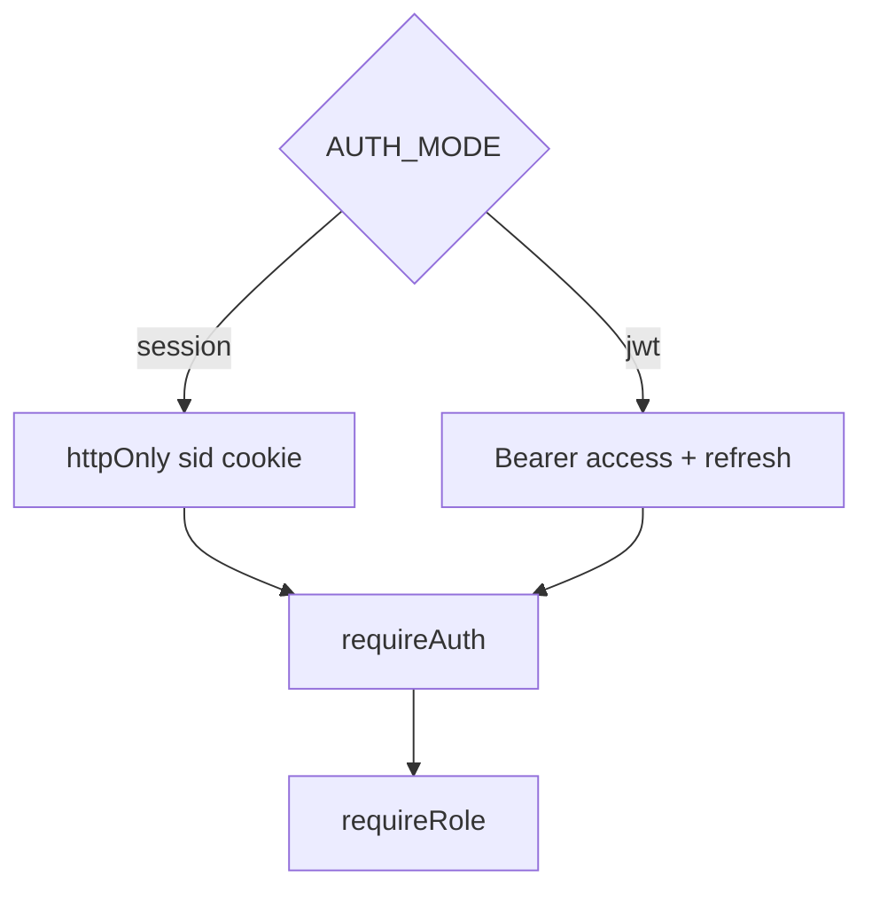

# ADR-002: Auth Default Sessions vs JWT

## Status

Accepted on 2026-07-22.

## Context

First-party web apps often fit **httpOnly session cookies** ([[07-Backend/04-Authentication/Sessions Cookies and CSRF Boundaries|Sessions Cookies and CSRF Boundaries]]). Mobile and SPA-heavy APIs often use **JWT access tokens** ([[07-Backend/04-Authentication/JWT Access Tokens and Claims|JWT Access Tokens and Claims]]). Teaching only one pattern misleads learners about trade-offs.

## Decision

Auth module supports **configurable `AUTH_MODE`**: `'session' | 'jwt'`. Lab defaults:

- **Local demo / browser-first:** `session` with SameSite=Lax, httpOnly cookie, CSRF token on mutating routes when cookie mode documented.
- **API-first fixtures:** `jwt` with short access TTL and rotating refresh tokens per [[07-Backend/04-Authentication/Refresh Token Rotation|Refresh Token Rotation]].

CI runs critical paths in **both** modes.

## Options Considered

| Option | Pros | Cons |
| --- | --- | --- |
| Session only | Simpler CSRF story for web | Skips SPA/mobile narrative |
| JWT only | Popular in tutorials | Misses cookie security details |
| Dual mode (chosen) | Teaches trade-offs | Double test matrix |

## Consequences

Documentation must never imply JWT belongs in localStorage. Refresh tokens stored hashed server-side. RBAC via `requireRole` separate from `requireAuth`—401 vs 403 policy enforced in tests.

## Follow-ups

- OAuth/OIDC flows documented as handoff only—no broker in toolkit v1.
- Account lockout stretch exercise in Authentication Server README.

## Related Documents

- [[07-Backend/projects/Authentication Server/README|Authentication Server]]
- [[07-Backend/projects/Backend Service Toolkit/Security|Security]]
