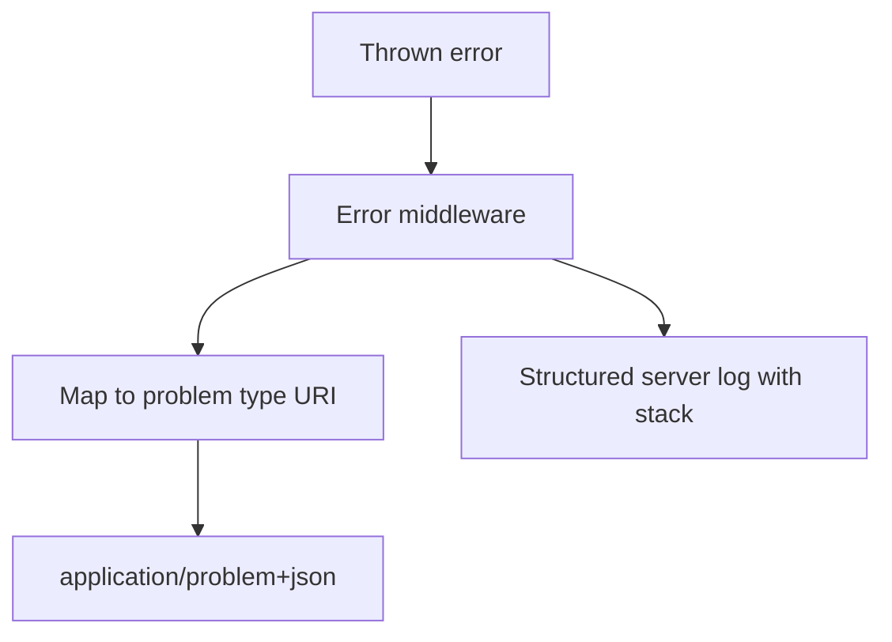

# ADR-003: Error Envelope Format

## Status

Accepted on 2026-07-22.

## Context

APIs need stable client parsing across validation, auth, and server faults ([[07-Backend/03-Validation-Errors-and-Versioning/Problem Details and Error Envelopes|Problem Details and Error Envelopes]]). Ad-hoc `{ error: string }` shapes break SDKs and contract tests.

## Decision

All toolkit HTTP errors use **RFC 7807-inspired problem+json** with required fields:

| Field | Requirement |
| --- | --- |
| `type` | Stable URI string identifying error class |
| `title` | Human-readable summary |
| `status` | HTTP status code |
| `detail` | Optional safe detail (no stack) |
| `instance` | Optional request correlation id |
| `errors` | Optional field-level validation array |

`Content-Type: application/problem+json`. Production mode strips stack traces; logs retain detail server-side.

## Options Considered

| Option | Pros | Cons |
| --- | --- | --- |
| problem+json (chosen) | Standard-ish; contract friendly | Verbose for tiny labs |
| Custom `{ code, message }` | Compact | Another bespoke standard |
| GraphQL-style errors array | Flexible | Not REST default for this track |

## Consequences

OpenAPI demo spec documents error responses per route. Contract smoke asserts shape. CLI domain errors map to exit code 3 with JSON body separate from HTTP envelope.

## Stable Type URIs (Examples)

- `https://seb.dev/problems/validation`
- `https://seb.dev/problems/unauthorized`
- `https://seb.dev/problems/forbidden`
- `https://seb.dev/problems/not-found`
- `https://seb.dev/problems/rate-limited`
- `https://seb.dev/problems/timeout`
- `https://seb.dev/problems/internal`

## Related Documents

- [[07-Backend/projects/API Contract and Reliability Harness/Architecture|Reliability Harness Architecture]]
- [[07-Backend/projects/Backend Service Toolkit/API|API]]
